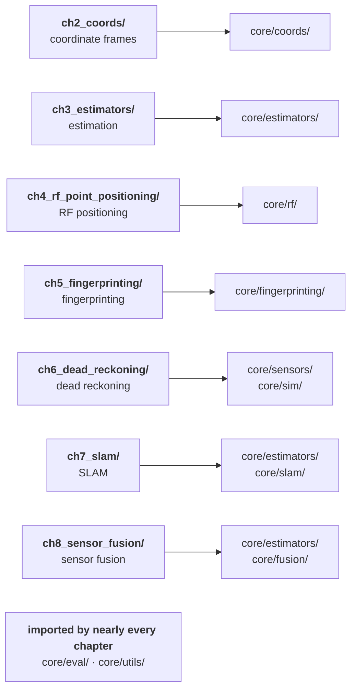

# Principle of IPIN Open-Sourced Code and Data

## Book

This repository is the companion code + datasets for the book:

**Principles of Indoor Positioning and Indoor Navigation** — Li-Ta Hsu, Guohao Zhang, Weisong Wen.

Publisher page (Artech House):
https://us.artechhouse.com/Principles-of-Indoor-Positioning-and-Indoor-Navigation-P2459.aspx

## Project Structure

```
IPIN-Examples/
├── core/                        # Reusable math & models
│   ├── coords/                  # Coordinate systems (ENU/NED/LLH, rotations)
│   ├── estimators/              # LS, robust LS, KF/EKF/UKF, PF
│   ├── rf/                      # RF models (RSS, TOA/TDOA/AOA, DOP)
│   ├── sensors/                 # IMU, wheel odom, PDR, mag, barometer
│   ├── fingerprinting/          # Wi-Fi/magnetic fingerprinting algorithms
│   ├── slam/                    # SLAM geometry, scan matching, factors
│   ├── fusion/                  # Multi-sensor fusion utilities
│   ├── models/                  # Common motion & measurement models
│   ├── sim/                     # Synthetic sensor data from a trajectory
│   ├── utils/                   # Angles, geometry, observability
│   └── eval/                    # Metrics, error stats, plots
├── ch2_coords/                  # Chapter 2: Coordinate Systems
├── ch3_estimators/              # Chapter 3: State Estimation
├── ch4_rf_point_positioning/    # Chapter 4: RF Point Positioning
├── ch5_fingerprinting/          # Chapter 5: Fingerprinting
├── ch6_dead_reckoning/          # Chapter 6: Dead Reckoning & PDR
├── ch7_slam/                    # Chapter 7: SLAM Technologies
├── ch8_sensor_fusion/           # Chapter 8: Sensor Fusion
├── data/sim/                    # Simulated datasets
├── docs/                        # Documentation & equation mappings
├── notebooks/                   # Jupyter notebooks for interactive learning
├── scripts/                     # Dataset generation scripts
├── tools/                       # CI/maintenance scripts
├── references/                  # Design specifications
└── tests/                       # Unit tests, plus the guards over docs and figures
```

## Architecture

Each chapter is a folder of runnable examples over one package of the shared
`core/` library. Both the diagram and the table are generated from the imports
themselves by `tools/chapter_dependencies.py`, so neither can drift from the code.

<!-- BEGIN GENERATED: repo-architecture (tools/chapter_dependencies.py) -->



| Chapter | Core packages it imports |
| --- | --- |
| [`ch2_coords/`](ch2_coords/) | `core.coords`, `core.eval`, `core.utils` |
| [`ch3_estimators/`](ch3_estimators/) | `core.estimators`, `core.eval`, `core.utils` |
| [`ch4_rf_point_positioning/`](ch4_rf_point_positioning/) | `core.eval`, `core.rf`, `core.utils` |
| [`ch5_fingerprinting/`](ch5_fingerprinting/) | `core.eval`, `core.fingerprinting` |
| [`ch6_dead_reckoning/`](ch6_dead_reckoning/) | `core.eval`, `core.sensors`, `core.sim`, `core.utils` |
| [`ch7_slam/`](ch7_slam/) | `core.estimators`, `core.eval`, `core.slam`, `core.utils` |
| [`ch8_sensor_fusion/`](ch8_sensor_fusion/) | `core.estimators`, `core.eval`, `core.fusion` |

<!-- END GENERATED: repo-architecture -->

## Chapter Overview

Each chapter folder contains example scripts and a README with equation-to-code mappings:

| Chapter | Topic | Key Algorithms | Equations |
|---------|-------|----------------|-----------|
| **Ch2** | Coordinate Systems | LLH↔ECEF↔ENU, Euler/Quaternion/Matrix rotations | Eqs. 2.1-2.23 |
| **Ch3** | State Estimation | LS, WLS, KF, EKF, IEKF, UKF, PF, FGO | Eqs. 3.1-3.56 |
| **Ch4** | RF Positioning | TOA, TDOA, AOA, RSS, DOP | Eqs. 4.1-4.108 |
| **Ch5** | Fingerprinting | NN, k-NN, MAP, Posterior Mean, Classification | Eqs. 5.1-5.6 |
| **Ch6** | Dead Reckoning | IMU Strapdown, PDR, ZUPT, Wheel Odometry, Allan Variance | Eqs. 6.2-6.61 |
| **Ch7** | SLAM | ICP, NDT, Pose Graph, Bundle Adjustment | Eqs. 7.10-7.70 |
| **Ch8** | Sensor Fusion | LC/TC EKF, Observability, Gating, Calibration | Eqs. 8.1-8.9 |

The **Equations** column is the span of book equations that
[`docs/equation_index.yml`](docs/equation_index.yml) maps to code for that
chapter. It is a span, not a complete list — the index has deliberate gaps
where the book states an equation this repository does not implement.

See [Quick Start](#quick-start) below to run the examples.

## Notebooks

Each chapter also has an interactive Jupyter notebook in [`notebooks/`](notebooks/) — open it directly in Google Colab, no local install required:

| Notebook | Chapter | Open in Colab |
|----------|---------|----------------|
| `ch2_coordinate_systems.ipynb` | 2 | [](https://colab.research.google.com/github/IPNL-POLYU/IPIN-Examples/blob/main/notebooks/ch2_coordinate_systems.ipynb) |
| `ch3_state_estimation.ipynb` | 3 | [](https://colab.research.google.com/github/IPNL-POLYU/IPIN-Examples/blob/main/notebooks/ch3_state_estimation.ipynb) |
| `ch4_rf_positioning.ipynb` | 4 | [](https://colab.research.google.com/github/IPNL-POLYU/IPIN-Examples/blob/main/notebooks/ch4_rf_positioning.ipynb) |
| `ch5_fingerprinting.ipynb` | 5 | [](https://colab.research.google.com/github/IPNL-POLYU/IPIN-Examples/blob/main/notebooks/ch5_fingerprinting.ipynb) |
| `ch6_dead_reckoning.ipynb` | 6 | [](https://colab.research.google.com/github/IPNL-POLYU/IPIN-Examples/blob/main/notebooks/ch6_dead_reckoning.ipynb) |
| `ch7_slam.ipynb` | 7 | [](https://colab.research.google.com/github/IPNL-POLYU/IPIN-Examples/blob/main/notebooks/ch7_slam.ipynb) |
| `ch8_sensor_fusion.ipynb` | 8 | [](https://colab.research.google.com/github/IPNL-POLYU/IPIN-Examples/blob/main/notebooks/ch8_sensor_fusion.ipynb) |

See [`notebooks/README.md`](notebooks/README.md) for details.

## Setup

### Prerequisites

- Python 3.10 or higher
- pip

### Installation

1. Clone the repository:
```bash
git clone <repository-url>
cd IPIN-Examples
```

2. Create a virtual environment:
```bash
python -m venv .venv
```

3. Activate the virtual environment:
```bash
# On Windows
.venv\Scripts\activate

# On macOS/Linux
source .venv/bin/activate
```

4. Install the package and development dependencies:
```bash
pip install -e ".[dev]"
```

## Quick Start

Run any chapter's example as a module:

```bash
python -m ch3_estimators.example_least_squares
python -m ch5_fingerprinting.example_comparison
python -m ch6_dead_reckoning.example_comparison
```

`python -m` puts the repository root on `sys.path`, so these run straight from
a fresh clone even before step 4 above. The script form —
`python <chapter>/<example>.py` — puts the *script's* directory there instead,
so `core` is only importable once the package is installed. That is why every
command in this repository is written as `python -m`.

Examples find their datasets from any working directory, so `cd`-ing into a
chapter folder first is fine. Each one prints its results and writes its
figures to `ch*_*/figs/`; set `IPIN_FIGS_DIR` to send them somewhere else.

## Code Style

This project follows **PEP 8** and the **Google Python Style Guide**. All code should:

- Use type hints for all functions
- Include Google-style docstrings
- Follow naming conventions (PascalCase for classes, snake_case for functions)
- Be formatted with Black (88 character line length)
- Pass linting checks (flake8/ruff, mypy, pylint)

### Formatting and Linting

Format code:
```bash
black .
```

Check code style:
```bash
ruff check .
flake8 .
```

Type checking:
```bash
mypy .
```

Linting:
```bash
pylint core/ ch*_*/
```

## Testing

Run tests:
```bash
pytest
```

Run tests with coverage:
```bash
pytest --cov=core --cov=ch*_* --cov-report=html
```

A test run leaves the working tree clean. Some tests run a chapter example end
to end to check its figures are still produced, so figure output is diverted to
a temporary directory for the duration of the run rather than overwriting the
committed figures in `ch*_*/figs/`. Set `IPIN_FIGS_DIR` yourself to send an
example's figures somewhere other than its chapter:

```bash
IPIN_FIGS_DIR=/tmp/figs python -m ch5_fingerprinting.example_probabilistic
```

## Development Workflow

For each chapter/topic, follow this 5-step process:

1. **Spec extraction**: Define function signatures and APIs
2. **Core module skeleton**: Implement with type hints and docstrings
3. **Unit tests**: Write tests for core functionality
4. **Example/notebook**: Create demonstration notebooks
5. **Documentation**: Update docs with usage examples

## How to cite

If you use this repository in academic work, please cite the book:

APA (7th) - Hsu, L.-T., Zhang, G., & Wen, W. (2025). Principles of indoor positioning and indoor navigation. Artech House.

IEEE - L.-T. Hsu, G. Zhang, and W. Wen, Principles of Indoor Positioning and Indoor Navigation. Norwood, MA, USA: Artech House, 2025. ISBN: 978-1-63081-977-4.

### BibTeX
```bibtex
@book{Hsu2025IPIN,
  title     = {Principles of Indoor Positioning and Indoor Navigation},
  author    = {Hsu, Li-Ta and Zhang, Guohao and Wen, Weisong},
  publisher = {Artech House},
  address   = {Norwood, MA},
  year      = {2025},
  isbn      = {978-1-63081-977-4}
}
```

## Acknowledgements

This repository is supported by **The Hong Kong Polytechnic University (PolyU)** under the **Financial Support for Book Writing** scheme. This support enables the development, testing, documentation, and release of the companion code and datasets for the book *Principles of Indoor Positioning and Indoor Navigation*.

## License

This repository is intended to be **academic-friendly** (research/teaching) while requiring **prior permission for commercial use**.

- **Code** (e.g., `core/`, `ch*_*/`, `scripts/`, `tools/`, `tests/`) is licensed under the **PolyForm Noncommercial License 1.0.0** — full text in [`LICENSE`](LICENSE).
- **Data** (e.g., `data/`) is licensed under **Creative Commons Attribution–NonCommercial 4.0 International (CC BY-NC 4.0)** unless otherwise noted in the corresponding folder — full text in [`LICENSE-DATA`](LICENSE-DATA).

### Commercial use

Commercial use is **not permitted** under the licenses above. If you want to use this repository for product development, commercial services, internal commercial evaluation, or other for-profit purposes, please contact the maintainers to discuss a separate commercial license.

### Book content notice

This GitHub repository does **not** distribute the book PDF or other publisher-copyrighted book content. It provides original companion implementations and datasets intended to support learning and reproducible experiments.

