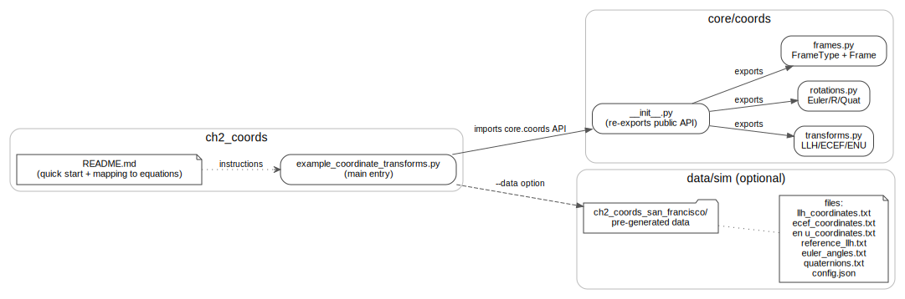
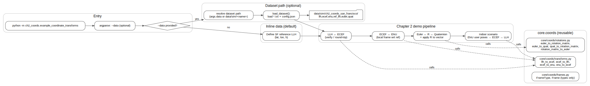

# Chapter 2: Coordinate Systems and Transformations

## Overview

This module implements the coordinate systems and transformation functions described in **Chapter 2** of *Principles of Indoor Positioning and Indoor Navigation*. It provides the foundational mathematical tools for converting between different coordinate frames and rotation representations commonly used in indoor navigation systems.

## Quick Start

```bash
# Run with inline data (default)
python -m ch2_coords.example_coordinate_transforms

# Run with pre-generated dataset
python -m ch2_coords.example_coordinate_transforms --data ch2_coords_san_francisco
```

## 📂 Dataset Connection

| Example Script | Dataset | Description |
|----------------|---------|-------------|
| `example_coordinate_transforms.py` | `data/sim/ch2_coords_san_francisco/` | San Francisco coordinates with LLH, ECEF, ENU, and rotation data |

**Load dataset manually:**
```python
import numpy as np
import json
from pathlib import Path

path = Path("data/sim/ch2_coords_san_francisco")
llh = np.loadtxt(path / "llh_coordinates.txt")
ecef = np.loadtxt(path / "ecef_coordinates.txt")
enu = np.loadtxt(path / "enu_coordinates.txt")
config = json.load(open(path / "config.json"))
```

## Equation Reference

### Coordinate Transformations

| Function | Location | Equation | Description |
|----------|----------|----------|-------------|
| `llh_to_ecef()` | `core/coords/transforms.py` | Eq. (2.9) | Geodetic (LLH) to ECEF Cartesian coordinates |
| `ecef_to_llh()` | `core/coords/transforms.py` | Iterative (see [2]) | ECEF to Geodetic (LLH) - iterative solution |
| `ecef_to_enu()` | `core/coords/transforms.py` | Eq. (2.10) | ECEF to local East-North-Up frame |
| `enu_to_ecef()` | `core/coords/transforms.py` | Eq. (2.10) inverse | Local ENU to ECEF coordinates |

### Rotation Representations

| Function | Location | Equation | Description |
|----------|----------|----------|-------------|
| `euler_to_rotation_matrix()` | `core/coords/rotations.py` | Eq. (2.17) | Euler angles (ZYX) to 3×3 rotation matrix |
| `rotation_matrix_to_euler()` | `core/coords/rotations.py` | Eq. (2.17) inverse | Rotation matrix to Euler angles |
| `euler_to_quat()` | `core/coords/rotations.py` | Eq. (2.23) | Euler angles to unit quaternion |
| `quat_to_euler()` | `core/coords/rotations.py` | Eq. (2.22) | Quaternion to Euler angles |
| `quat_to_rotation_matrix()` | `core/coords/rotations.py` | Eq. (2.21) | Quaternion to rotation matrix |
| `rotation_matrix_to_quat()` | `core/coords/rotations.py` | Eq. (2.21) inverse | Rotation matrix to quaternion |

### WGS84 Constants

| Constant | Value | Description |
|----------|-------|-------------|
| `WGS84_A` | 6378137.0 m | Semi-major axis |
| `WGS84_F` | 1/298.257223563 | Flattening |
| `WGS84_B` | 6356752.314245 m | Semi-minor axis |

## Examples

### Example 1: LLH to ECEF Transformation

```python
import numpy as np
from core.coords import llh_to_ecef, ecef_to_llh

# San Francisco: 37.7749°N, 122.4194°W
lat = np.deg2rad(37.7749)
lon = np.deg2rad(-122.4194)
height = 0.0  # meters above WGS84 ellipsoid

# Convert to ECEF
xyz = llh_to_ecef(lat, lon, height)
print(f"ECEF: {xyz}")  # [x, y, z] in meters

# Round-trip conversion
llh_recovered = ecef_to_llh(*xyz)
print(f"LLH: {np.rad2deg(llh_recovered[:2])}, {llh_recovered[2]:.2f}m")
```

**Implements:** Eq. (2.9), iterative ECEF→LLH (see [2] in Ch. 2)

### Example 2: Local ENU Frame

```python
from core.coords import ecef_to_enu, llh_to_ecef

# Reference point (building entrance)
lat_ref = np.deg2rad(37.7749)
lon_ref = np.deg2rad(-122.4194)
height_ref = 0.0

# Target point (100m north of reference)
lat_target = lat_ref + np.deg2rad(100.0 / 111000.0)
xyz_target = llh_to_ecef(lat_target, lon_ref, height_ref)

# Convert to local ENU coordinates
enu = ecef_to_enu(*xyz_target, lat_ref, lon_ref, height_ref)
print(f"ENU: East={enu[0]:.2f}m, North={enu[1]:.2f}m, Up={enu[2]:.2f}m")
# Expected: East≈0m, North≈100m, Up≈0m
```

**Implements:** Eq. (2.10)

### Example 3: Rotation Representations

```python
from core.coords import (
    euler_to_rotation_matrix,
    euler_to_quat,
    quat_to_rotation_matrix,
)

# Define attitude: 10° roll, 20° pitch, 30° yaw
roll = np.deg2rad(10.0)
pitch = np.deg2rad(20.0)
yaw = np.deg2rad(30.0)

# Convert to rotation matrix
R = euler_to_rotation_matrix(roll, pitch, yaw)
print(f"Rotation matrix:\n{R}")
print(f"det(R) = {np.linalg.det(R):.6f}")  # Should be 1.0

# Convert to quaternion
q = euler_to_quat(roll, pitch, yaw)
print(f"Quaternion: {q}")
print(f"||q|| = {np.linalg.norm(q):.6f}")  # Should be 1.0
```

**Implements:** Eq. (2.17), Eq. (2.23), Eq. (2.21)

## Expected Output

When you run the demonstration script, you should see output similar to:

```
======================================================================
Chapter 2: Coordinate Transformation Examples
======================================================================

1. LLH to ECEF Transformation
----------------------------------------------------------------------
Location: San Francisco
  Latitude:  37.7749°
  Longitude: -122.4194°
  Height:    0.0 m

ECEF Coordinates:
  X: -2,706,174.85 m
  Y: -4,261,059.49 m
  Z: 3,885,725.49 m

2. ECEF to LLH (Round-trip)
----------------------------------------------------------------------
Recovered LLH:
  Latitude:  37.7749°
  Longitude: -122.4194°
  Height:    0.00 m

3. Local ENU Frame Transformation
----------------------------------------------------------------------
Target: 50m Up
  ENU: [0.00, -0.00, 50.00] m

4. Rotation Representations
----------------------------------------------------------------------
Euler Angles:
  Roll:  10.0°
  Pitch: 20.0°
  Yaw:   30.0°

Rotation Matrix:
[[ 0.81379768 -0.44096961  0.37852231]
 [ 0.46984631  0.88256412  0.01802831]
 [-0.34202014  0.16317591  0.92541658]]
  Determinant: 1.000000 (should be 1.0)

Quaternion [qw, qx, qy, qz]:
  [0.95154852 0.03813458 0.18930786 0.23929834]
  Norm: 1.000000 (should be 1.0)

5. Applying Rotation to Vector
----------------------------------------------------------------------
Vector in body frame: [1. 0. 0.]
Vector in navigation frame: [ 0.81379768  0.46984631 -0.34202014]

6. Round-trip Rotation Conversions
----------------------------------------------------------------------
Original Euler: [10.0°, 20.0°, 30.0°]
Recovered Euler: [10.0°, 20.0°, 30.0°]

7. Practical Indoor Positioning Scenario
----------------------------------------------------------------------
Building entrance (reference): 37.7749°N, 122.4194°W

Lobby:
  ENU:  [0.0, 0.0, 0.0] m
  LLH:  [37.774900°, -122.419400°, 0.00 m]

Room 101:
  ENU:  [15.0, 10.0, 0.0] m
  LLH:  [37.774990°, -122.419230°, 0.00 m]

Room 201:
  ENU:  [15.0, 10.0, 3.5] m
  LLH:  [37.774990°, -122.419230°, 3.50 m]

Parking:
  ENU:  [-5.0, -20.0, -2.5] m
  LLH:  [37.774720°, -122.419457°, -2.50 m]

======================================================================
Examples completed successfully!
======================================================================
```

## Architecture Diagrams

To help you understand the code structure and execution flow, we provide visual diagrams:

### Component Architecture



This diagram shows:
- **Entry points**: `README.md` → `example_coordinate_transforms.py`
- **Core library**: `core/coords/__init__.py` re-exports `transforms.py`, `rotations.py`, `frames.py`
- **Dataset**: Optional `data/sim/ch2_coords_san_francisco/` with pre-generated test data
- **Dependencies**: How the example script imports the core API

### Execution Flow



This diagram illustrates the complete execution pipeline:
1. **Entry**: Run `python -m ch2_coords.example_coordinate_transforms`
2. **Data source**: Choose between `--data` option (loads dataset) or inline demo values
3. **Demo pipeline**:
   - LLH ↔ ECEF conversions (Eq. 2.9)
   - ECEF ↔ ENU local frame (Eq. 2.10)
   - Rotation representations: Euler ↔ R ↔ Quaternion (Eqs. 2.17, 2.21-2.23)
   - Indoor positioning scenario (practical example)
4. **Core functions**: All demos call `core/coords/transforms.py` and `rotations.py`

**Source diagrams:** PlantUML source files are available in `docs/architecture/`:
- `ipin_ch2_component_overview.puml` - Component relationships
- `ipin_ch2_activity_flow.puml` - High-level activity flow

---

## File Structure

```
ch2_coords/
├── README.md                          # This file
└── example_coordinate_transforms.py   # Demonstration script

core/coords/
├── __init__.py                        # Package exports
├── frames.py                          # Frame type definitions
├── transforms.py                      # LLH/ECEF/ENU transformations
└── rotations.py                       # Rotation representations

docs/architecture/
├── ipin_ch2_component_clean.svg       # Component architecture diagram
├── ipin_ch2_component_overview.puml   # Component diagram source
├── ipin_ch2_flow_clean.svg            # Execution flow diagram
└── ipin_ch2_activity_flow.puml        # Activity flow source

data/sim/ch2_coords_san_francisco/     # Optional pre-generated dataset
├── llh_coordinates.txt
├── ecef_coordinates.txt
├── enu_coordinates.txt
├── reference_llh.txt
├── euler_angles.txt
├── quaternions.txt
└── config.json
```

## Book References

- **Section 2.1**: Coordinate Systems and Transformations (LLH, ECEF, ENU, NED, Body, Map frames; Eqs. 2.1–2.10)
- **Section 2.2**: Attitude Definition and Representation (Euler angles, Rotation matrices, Quaternions; Eqs. 2.11–2.23)

