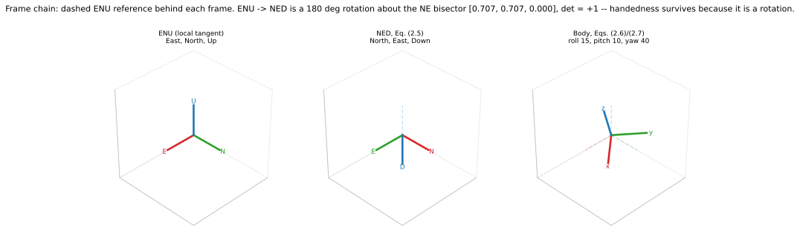
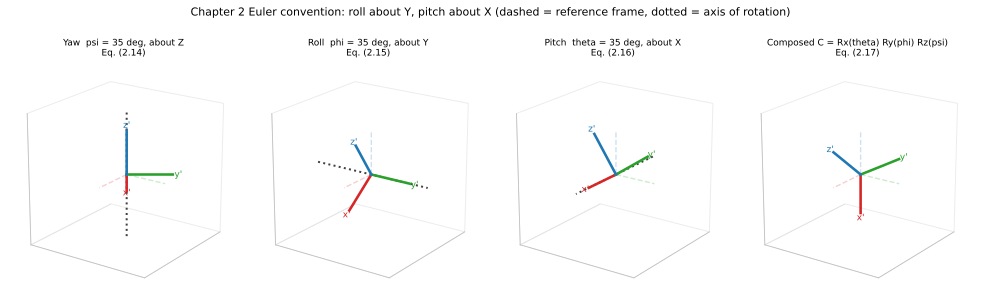
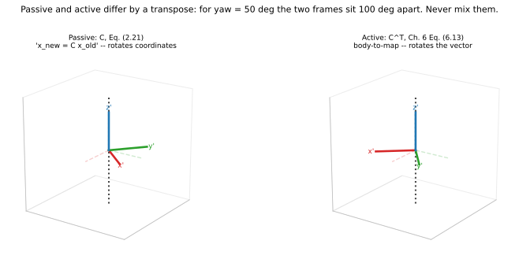
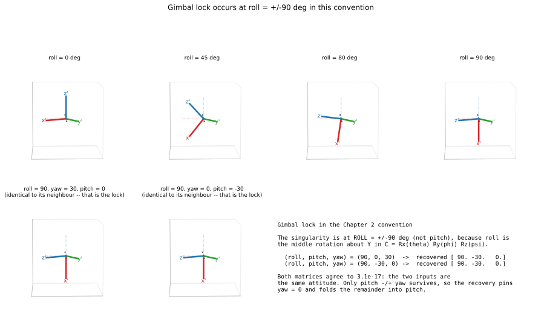
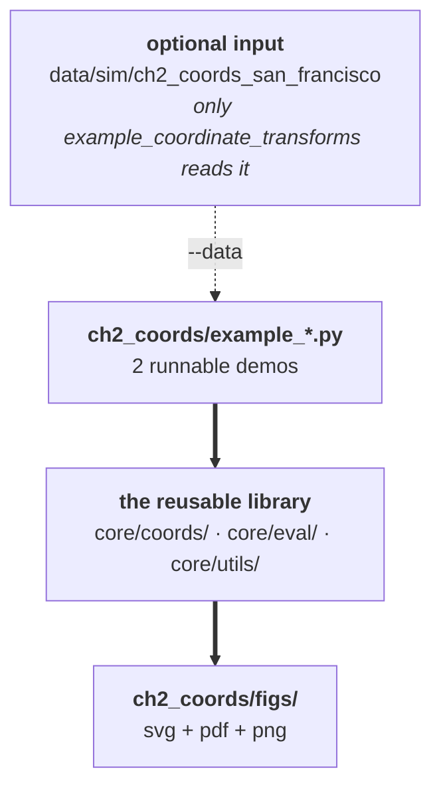

# Chapter 2: Coordinate Systems and Transformations

[](https://colab.research.google.com/github/IPNL-POLYU/IPIN-Examples/blob/main/notebooks/ch2_coordinate_systems.ipynb)

Run this chapter in your browser — every figure below is one you can
regenerate and change. No install: [`notebooks/ch2_coordinate_systems.ipynb`](../notebooks/ch2_coordinate_systems.ipynb)

## Overview

This module implements the coordinate systems and transformation functions described in **Chapter 2** of *Principles of Indoor Positioning and Indoor Navigation*. It provides the foundational mathematical tools for converting between different coordinate frames and rotation representations commonly used in indoor navigation systems.

## Quick Start

```bash
# Run with inline data (default)
python -m ch2_coords.example_coordinate_transforms

# Run with pre-generated dataset
python -m ch2_coords.example_coordinate_transforms --data ch2_coords_san_francisco

# Draw the frames and the attitude convention (writes to figs/)
python -m ch2_coords.example_attitude_visualization
```

## Four pictures worth more than the algebra

This chapter's attitude convention is **not** the aerospace default — roll turns
about **Y** (2.15) and pitch about **X** (2.16) — and that is far easier to see
than to read. All four are written by
`python -m ch2_coords.example_attitude_visualization`.

### The frames, and how they relate



NED is a swap-and-flip of ENU that preserves handedness — **not** a rotation.
The dashed axes behind each frame are the same ENU reference, so you can read
each frame against it. Eqs. (2.5)–(2.7).

### What "roll" and "pitch" turn about here



Yaw about Z, then roll about **Y**, then pitch about **X**, composed as
`C = Rx(pitch) Ry(roll) Rz(yaw)`. The dotted line in each panel is that panel's
axis of rotation. Eqs. (2.14)–(2.17).

### The transpose trap



Chapter 2's `C` rotates *coordinates* (passive, 2.21); Chapter 6's body-to-map
rotates the *vector* (active, 6.13). They differ by a transpose, so at yaw = 50°
the two answers sit **100° apart**. This is the single easiest mistake to make
in the whole chapter.

### Where the convention breaks



The singularity is at **roll = ±90°**, not pitch, because roll is the middle
rotation. The bottom row is the proof: `(roll, pitch, yaw) = (90, 0, 30)` and
`(90, -30, 0)` are two different inputs that produce matrices agreeing to
3.1e-17 — the same attitude. Recovery can only report one of them.

## 📂 Dataset Connection

| Example Script | Dataset | Description |
|----------------|---------|-------------|
| `example_coordinate_transforms.py` | `data/sim/ch2_coords_san_francisco/` | San Francisco coordinates with LLH, ECEF, ENU, and rotation data |
| `example_attitude_visualization.py` | *(none — analytic)* | Draws frames and rotations directly from `core.coords` |

**Load dataset manually:**
```python
import numpy as np
import json
from pathlib import Path

path = Path("data/sim/ch2_coords_san_francisco")
llh = np.loadtxt(path / "llh_coordinates.txt")
ecef = np.loadtxt(path / "ecef_coordinates.txt")
enu = np.loadtxt(path / "enu_coordinates.txt")
config = json.load(open(path / "config.json"))
```

## Examples

### Example 1: LLH to ECEF Transformation

```python
import numpy as np
from core.coords import llh_to_ecef, ecef_to_llh

# San Francisco: 37.7749°N, 122.4194°W
lat = np.deg2rad(37.7749)
lon = np.deg2rad(-122.4194)
height = 0.0  # meters above WGS84 ellipsoid

# Convert to ECEF
xyz = llh_to_ecef(lat, lon, height)
print(f"ECEF: {xyz}")  # [x, y, z] in meters

# Round-trip conversion
llh_recovered = ecef_to_llh(*xyz)
print(f"LLH: {np.rad2deg(llh_recovered[:2])}, {llh_recovered[2]:.2f}m")
```

**Implements:** Eq. (2.9), iterative ECEF→LLH (see [2] in Ch. 2)

### Example 2: Local ENU Frame

```python
from core.coords import ecef_to_enu, llh_to_ecef

# Reference point (building entrance)
lat_ref = np.deg2rad(37.7749)
lon_ref = np.deg2rad(-122.4194)
height_ref = 0.0

# Target point (100m north of reference)
lat_target = lat_ref + np.deg2rad(100.0 / 111000.0)
xyz_target = llh_to_ecef(lat_target, lon_ref, height_ref)

# Convert to local ENU coordinates
enu = ecef_to_enu(*xyz_target, lat_ref, lon_ref, height_ref)
print(f"ENU: East={enu[0]:.2f}m, North={enu[1]:.2f}m, Up={enu[2]:.2f}m")
# Expected: East≈0m, North≈100m, Up≈0m
```

**Implements:** Eq. (2.10)

### Example 3: Rotation Representations

```python
from core.coords import (
    euler_to_rotation_matrix,
    euler_to_quat,
    quat_to_rotation_matrix,
)

# Define attitude: 10° roll, 20° pitch, 30° yaw
roll = np.deg2rad(10.0)
pitch = np.deg2rad(20.0)
yaw = np.deg2rad(30.0)

# Convert to rotation matrix
R = euler_to_rotation_matrix(roll, pitch, yaw)
print(f"Rotation matrix:\n{R}")
print(f"det(R) = {np.linalg.det(R):.6f}")  # Should be 1.0

# Convert to quaternion
q = euler_to_quat(roll, pitch, yaw)
print(f"Quaternion: {q}")
print(f"||q|| = {np.linalg.norm(q):.6f}")  # Should be 1.0
```

**Implements:** Eq. (2.17), Eq. (2.23), Eq. (2.21)

## Expected Output

When you run the demonstration script, you should see:

<!-- example-output: ch2_coords.example_coordinate_transforms -->
```
======================================================================
Chapter 2: Coordinate Transformation Examples
(Using inline generated data)
======================================================================

1. LLH to ECEF Transformation
----------------------------------------------------------------------
Location: San Francisco
  Latitude:  37.7749°
  Longitude: -122.4194°
  Height:    0.0 m

ECEF Coordinates:
  X: -2,706,174.85 m
  Y: -4,261,059.49 m
  Z: 3,885,725.49 m

2. ECEF to LLH (Round-trip)
----------------------------------------------------------------------
Recovered LLH:
  Latitude:  37.7749°
  Longitude: -122.4194°
  Height:    0.00 m

3. Local ENU Frame Transformation
----------------------------------------------------------------------
Offsets are built from the local radii of curvature, so each target
should come back as the ENU it is named for. The residual below is
the second-order curvature term the linear conversion drops; it grows
as the square of the offset, and is exactly zero for a pure height.

Target: 100m East
  ENU: [100.00, 0.00, -0.00] m
  Error vs. the named offset: 0.99 mm

Target: 100m North
  ENU: [-0.00, 100.00, -0.00] m
  Error vs. the named offset: 0.79 mm

Target: 50m Up
  ENU: [0.00, -0.00, 50.00] m
  Error vs. the named offset: 0.00 mm

4. Rotation Representations
----------------------------------------------------------------------
Euler Angles:
  Roll:  10.0°
  Pitch: 20.0°
  Yaw:   30.0°

Rotation Matrix:
[[ 0.85286853  0.49240388 -0.17364818]
 [-0.41841204  0.84349327  0.33682409]
 [ 0.31232456 -0.21461018  0.92541658]]
  Determinant: 1.000000 (should be 1.0)

Quaternion [qw, qx, qy, qz]:
  [0.95154852 0.14487813 0.12767944 0.23929834]
  Norm: 1.000000 (should be 1.0)

5. Applying the Coordinate Transform (x_new = C @ x_old)
----------------------------------------------------------------------
Point in old frame: [1. 0. 0.]
Coordinates in new frame: [ 0.85286853 -0.41841204  0.31232456]

6. Quaternion -> Euler (Eqs. 2.22-2.23)
----------------------------------------------------------------------
Quaternion: [0.95154852 0.14487813 0.12767944 0.23929834]
Euler from quat_to_euler: [10.0°, 20.0°, 30.0°]
Original Euler:           [10.0°, 20.0°, 30.0°]

Round-trip Euler->Quat->Euler error: 1.11e-16 rad (PASS)

7. Round-trip Rotation Conversions (Matrix Path)
----------------------------------------------------------------------
Original Euler: [10.0°, 20.0°, 30.0°]
Recovered Euler: [10.0°, 20.0°, 30.0°]

8. Practical Indoor Positioning Scenario
----------------------------------------------------------------------
Building entrance (reference): 37.7749°N, 122.4194°W

Lobby:
  ENU:  [0.0, 0.0, 0.0] m
  LLH:  [37.774900°, -122.419400°, 0.00 m]

Room 101:
  ENU:  [15.0, 10.0, 0.0] m
  LLH:  [37.774990°, -122.419230°, 0.00 m]

Room 201:
  ENU:  [15.0, 10.0, 3.5] m
  LLH:  [37.774990°, -122.419230°, 3.50 m]

Parking:
  ENU:  [-5.0, -20.0, -2.5] m
  LLH:  [37.774720°, -122.419457°, -2.50 m]

======================================================================
Examples completed successfully!
======================================================================

Tip: Run with --data ch2_coords_san_francisco to use pre-generated dataset
```

## Equation Reference

### Coordinate Transformations

| Function | Location | Equation | Description |
|----------|----------|----------|-------------|
| `llh_to_ecef()` | `core/coords/transforms.py` | Eq. (2.9) | Geodetic (LLH) to ECEF Cartesian coordinates |
| `ecef_to_llh()` | `core/coords/transforms.py` | Iterative (see [2]) | ECEF to Geodetic (LLH) - iterative solution |
| `ecef_to_enu()` | `core/coords/transforms.py` | Eq. (2.10) | ECEF to local East-North-Up frame |
| `enu_to_ecef()` | `core/coords/transforms.py` | Eq. (2.10) inverse | Local ENU to ECEF coordinates |

### Rotation Representations

| Function | Location | Equation | Description |
|----------|----------|----------|-------------|
| `euler_to_rotation_matrix()` | `core/coords/rotations.py` | Eq. (2.17) | Euler angles (ZYX) to 3×3 rotation matrix |
| `rotation_matrix_to_euler()` | `core/coords/rotations.py` | Eq. (2.17) inverse | Rotation matrix to Euler angles |
| `euler_to_quat()` | `core/coords/rotations.py` | Eq. (2.23) | Euler angles to unit quaternion |
| `quat_to_euler()` | `core/coords/rotations.py` | Eq. (2.22) | Quaternion to Euler angles |
| `quat_to_rotation_matrix()` | `core/coords/rotations.py` | Eq. (2.21) | Quaternion to rotation matrix |
| `rotation_matrix_to_quat()` | `core/coords/rotations.py` | Eq. (2.21) inverse | Rotation matrix to quaternion |

### WGS84 Constants

| Constant | Value | Description |
|----------|-------|-------------|
| `WGS84_A` | 6378137.0 m | Semi-major axis |
| `WGS84_F` | 1/298.257223563 | Flattening |
| `WGS84_B` | 6356752.314245 m | Semi-minor axis |

## Architecture

Every chapter has the same shape: pick an example, it calls into `core/`,
figures land in `figs/`. The diagram and the table below are generated from
the imports themselves by `tools/chapter_dependencies.py`, so they cannot
drift from the code.

<!-- BEGIN GENERATED: architecture (tools/chapter_dependencies.py) -->


```mermaid
flowchart TB
    D["<b>optional input</b><br/>data/sim/ch2_coords_san_francisco<br/><i>only example_coordinate_transforms reads it</i>"]
    E["<b>ch2_coords/example_*.py</b><br/>2 runnable demos"]
    C["<b>the reusable library</b><br/>core/coords/ · core/eval/ · core/utils/"]
    F["<b>ch2_coords/figs/</b><br/>svg + pdf + png"]
    D -. "--data" .-> E
    E ==> C
    C ==> F
```

| Example | Core modules | Optional dataset |
| --- | --- | --- |
| `example_attitude_visualization` | `core.coords`, `core.eval` | — |
| `example_coordinate_transforms` | `core.coords`, `core.utils` | `ch2_coords_san_francisco` |

<!-- END GENERATED: architecture -->

## File Structure

```
ch2_coords/
├── README.md                          # This file
├── example_coordinate_transforms.py   # LLH/ECEF/ENU transforms and rotations
└── example_attitude_visualization.py  # Frames and the book's attitude convention

core/coords/
├── __init__.py                        # Package exports
├── frames.py                          # Frame type definitions
├── transforms.py                      # LLH/ECEF/ENU transformations
└── rotations.py                       # Rotation representations

data/sim/ch2_coords_san_francisco/     # Optional pre-generated dataset
├── llh_coordinates.txt
├── ecef_coordinates.txt
├── enu_coordinates.txt
├── reference_llh.txt
├── euler_angles.txt
├── quaternions.txt
└── config.json
```

## Book References

- **Section 2.1**: Coordinate Systems and Transformations (LLH, ECEF, ENU, NED, Body, Map frames; Eqs. 2.1–2.10)
- **Section 2.2**: Attitude Definition and Representation (Euler angles, Rotation matrices, Quaternions; Eqs. 2.11–2.23)

