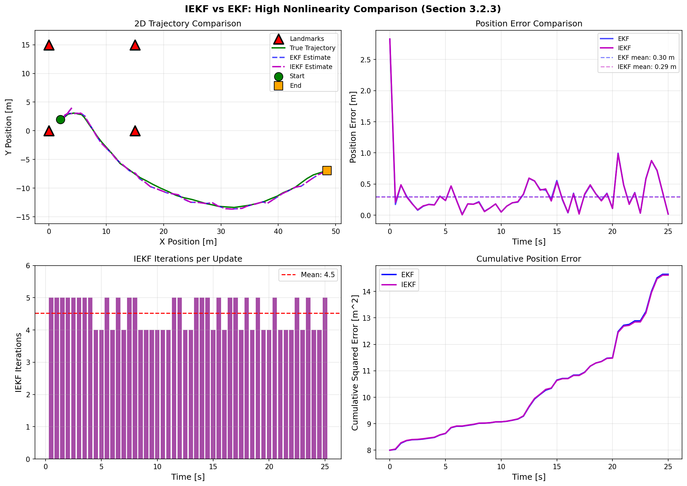
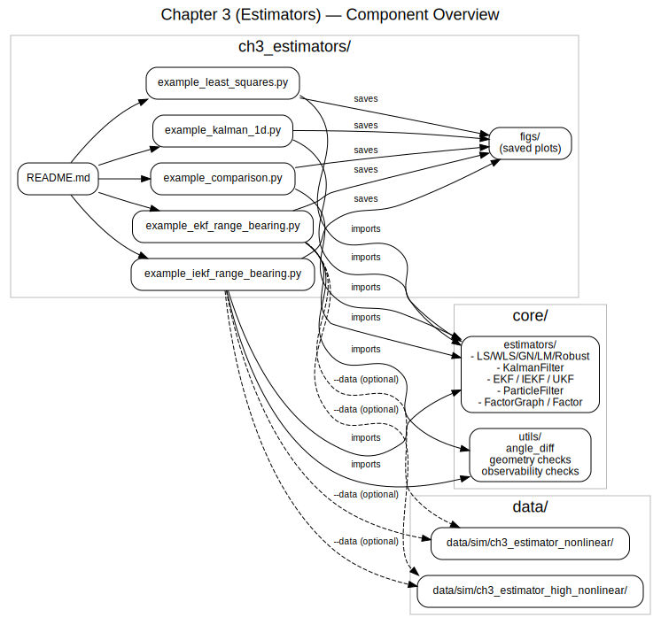
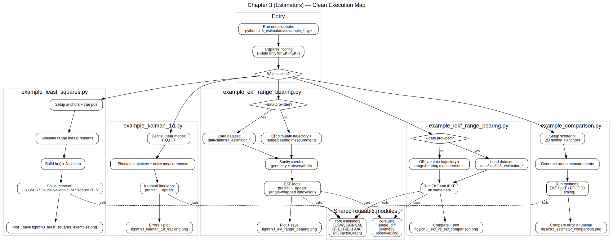

# Chapter 3: Estimators and Filters for Indoor Positioning

## Overview

This module implements the state estimation algorithms described in **Chapter 3** of *Principles of Indoor Positioning and Indoor Navigation*. It provides the mathematical foundations for estimating position, velocity, and other states from noisy measurements using various filtering and optimization techniques.

**Chapter Structure (Book Reference):**
- **Section 3.1**: Least Squares Estimation
- **Section 3.2**: Kalman Filters and Extensions (KF, EKF, IEKF, UKF)
- **Section 3.3**: Particle Filters (PF)
- **Section 3.4**: Factor Graph Optimization (FGO)
- **Section 3.5**: Comparison of Estimation Methods
- **Section 3.6**: Conclusions

---

## Quick Start

```bash
# Run from repository root
python ch3_estimators/example_least_squares.py
python ch3_estimators/example_kalman_1d.py
python ch3_estimators/example_ekf_range_bearing.py
python ch3_estimators/example_iekf_range_bearing.py

# Run with pre-generated dataset
python ch3_estimators/example_ekf_range_bearing.py --data ch3_estimator_nonlinear

# Run comprehensive comparison of all estimators (EKF, UKF, PF, FGO)
python ch3_estimators/example_comparison.py
```

---

## 📂 Dataset Connection

| Example Script | Dataset | Description |
|----------------|---------|-------------|
| `example_ekf_range_bearing.py` | `data/sim/ch3_estimator_nonlinear/` | Moderate nonlinearity (circular trajectory) |
| `example_ekf_range_bearing.py` | `data/sim/ch3_estimator_high_nonlinear/` | High nonlinearity (figure-8 trajectory) |

**Load dataset manually:**
```python
import numpy as np
import json
from pathlib import Path

path = Path("data/sim/ch3_estimator_nonlinear")
t = np.loadtxt(path / "time.txt")
beacons = np.loadtxt(path / "beacons.txt")
true_states = np.loadtxt(path / "ground_truth_states.txt")
range_meas = np.loadtxt(path / "range_measurements.txt")
bearing_meas = np.loadtxt(path / "bearing_measurements.txt")
config = json.load(open(path / "config.json"))
```

---

## Implementation Status

| Estimator | Book Section | Core Implementation | Status |
|-----------|--------------|---------------------|--------|
| Linear Least Squares | 3.1 | `core/estimators/least_squares.py` | ✅ Implemented |
| Weighted Least Squares | 3.1 | `core/estimators/least_squares.py` | ✅ Implemented |
| Gauss-Newton Nonlinear LS | 3.1, 3.4.1.2 | `core/estimators/nonlinear_least_squares.py` | ✅ Implemented |
| Robust Least Squares (IRLS) | 3.1.1 | `core/estimators/nonlinear_least_squares.py` | ✅ Implemented |
| Linear Kalman Filter (KF) | 3.2.1 | `core/estimators/kalman_filter.py` | ✅ Implemented |
| Extended Kalman Filter (EKF) | 3.2.2 | `core/estimators/extended_kalman_filter.py` | ✅ Implemented |
| Iterated EKF (IEKF) | 3.2.3 | `core/estimators/iterated_extended_kalman_filter.py` | ✅ Implemented |
| Unscented Kalman Filter (UKF) | 3.2.4 | `core/estimators/unscented_kalman_filter.py` | ✅ Implemented |
| Particle Filter (PF) | 3.3 | `core/estimators/particle_filter.py` | ✅ Implemented |
| Factor Graph Optimization (FGO) | 3.4 | `core/estimators/factor_graph.py` | ✅ Implemented |
| Gradient Descent Optimizer | 3.4.1.1 | `core/estimators/factor_graph.py` | ✅ `method="gd"` (+ optional `line_search=True`) |
| Gauss-Newton + Line Search | 3.4.1.1 | `core/estimators/factor_graph.py` | ✅ `method="line_search"` |
| Levenberg-Marquardt Optimizer | 3.4.1.3 | `core/estimators/factor_graph.py` | ✅ `method="levenberg_marquardt"` |

---

## Equation Reference

### Section 3.1: Least Squares Estimation

Least squares minimizes the sum of squared residuals between observations and model predictions.

**Key Equations:**
- **Eq. (3.1)**: Cost function J(x) = Σᵢ (yᵢ - hᵢ(x))²
- **Eq. (3.2)–(3.3)**: Linear LS normal equations and closed-form solution
- **Eq. (3.4)**: First-order optimality (stationarity) condition ∂J/∂x = 0

| Function | Location | Equation | Description |
|----------|----------|----------|-------------|
| `linear_least_squares()` | `core/estimators/least_squares.py` | Eq. (3.2)–(3.3) | Normal equations: H'Hx̂ = H'y → x̂ = (H'H)⁻¹H'y |
| `weighted_least_squares()` | `core/estimators/least_squares.py` | Text (§3.1.1) | WLS with wᵢ = 1/σᵢ² weighting |
| `gauss_newton()` | `core/estimators/nonlinear_least_squares.py` | Eq. (3.51)–(3.52) | Gauss-Newton update: (J'J)dx = J'r |
| `levenberg_marquardt()` | `core/estimators/nonlinear_least_squares.py` | Eq. (3.53)–(3.56) | LM with adaptive damping (Algorithm 3.2) |
| `robust_gauss_newton()` | `core/estimators/nonlinear_least_squares.py` | Table 3.1 | IRLS with robust loss functions |

#### Section 3.1.1: Robust Estimators (Table 3.1)

Implements **Table 3.1** robust estimators (L2, Cauchy, Huber, G-M). Also includes Tukey as an optional extra **not in Table 3.1**.

| Robust Estimator | Error Function e(x) | Implementation | Source |
|------------------|---------------------|----------------|--------|
| **L2** (Standard) | e(x) = ½‖r(x)‖² | `robust_least_squares(..., loss='l2')` | Table 3.1 |
| **Cauchy** | e(x) = ½ ln(1 + ‖r(x)‖²) | `robust_least_squares(..., loss='cauchy')` | Table 3.1 |
| **Huber** | e(x) = { ½‖r‖² if \|r\|≤δ; δ(\|r\|-½δ) otherwise } | `robust_least_squares(..., loss='huber')` | Table 3.1 |
| **Geman-McClure (G-M)** | e(x) = ½ ‖r(x)‖² / (1 + ‖r(x)‖²) | `robust_least_squares(..., loss='gm')` | Table 3.1 |
| **Tukey** (biweight) | e(x) = { (c²/6)[1-(1-r²/c²)³] if \|r\|≤c; c²/6 otherwise } | `robust_least_squares(..., loss='tukey')` | Extra |

---

### Section 3.2: Kalman Filters and Extensions

#### Section 3.2.1: Linear Kalman Filter (KF)

The Kalman filter achieves MAP estimation for linear-Gaussian systems. The five fundamental equations (Eq. 3.20):

| Function | Location | Equation | Description |
|----------|----------|----------|-------------|
| `KalmanFilter.predict()` | `core/estimators/kalman_filter.py` | Eq. (3.11) | State prediction: x̂ₖ₍ₖ₋₁₎ = Fₖx̂ₖ₋₁ + uₖ |
| — | — | Eq. (3.12) | Covariance prediction: Pₖ₍ₖ₋₁₎ = FₖΣₓₖ₋₁Fₖ' + Σwᵤₖ |
| `KalmanFilter.update()` | `core/estimators/kalman_filter.py` | Eq. (3.17)–(3.18) | Kalman gain: Kₖ = Pₖ₍ₖ₋₁₎Hₖ'(HₖPₖ₍ₖ₋₁₎Hₖ' + Σwzₖ)⁻¹ |
| — | — | Eq. (3.17) | State update: x̂ₖ₍MAP₎ = x̂ₖ₍ₖ₋₁₎ + Kₖ(zₖ - Hₖx̂ₖ₍ₖ₋₁₎) |
| — | — | Eq. (3.19) | Covariance update: Σₓₖ = Pₖ₍ₖ₋₁₎ - FₖKₖHₖPₖ₍ₖ₋₁₎ |

**Three Key Assumptions** (§3.2.1):
1. **Linearity**: System dynamics and measurement model are linear
2. **Gaussian Noise**: Process and measurement noise are Gaussian
3. **Stationarity**: Statistical properties remain constant over time

#### Section 3.2.2: Extended Kalman Filter (EKF)

The EKF handles nonlinear systems by linearizing around the current estimate:

| Function | Location | Equation | Description |
|----------|----------|----------|-------------|
| — | — | Eq. (3.21) | Nonlinear models: xₖ = f(xₖ₋₁, uₖ) + wₖ, zₖ = h(xₖ) + vₖ |
| `ExtendedKalmanFilter.predict()` | `core/estimators/extended_kalman_filter.py` | Eq. (3.22) | Prediction: x̂ₖ⁻ = f(x̂ₖ₋₁, uₖ), Pₖ⁻ = Fₖ₋₁Pₖ₋₁Fₖ₋₁' + Q |
| `ExtendedKalmanFilter.update()` | `core/estimators/extended_kalman_filter.py` | Eq. (3.23) | Update with Jacobian Hₖ = ∂h/∂x |

Where Fₖ₋₁ = ∂f/∂x is the Jacobian of the process model evaluated at x̂ₖ₋₁.

**Note:** EKF supports an optional `innovation_func(z, z_pred)` callback for custom residual computation (e.g., angle wrapping for bearing measurements).

#### Section 3.2.3: Iterated Extended Kalman Filter (IEKF)

The IEKF improves EKF accuracy by iterating the measurement update when nonlinearities are severe:

| Function | Location | Description |
|----------|----------|-------------|
| `IteratedExtendedKalmanFilter.update()` | `core/estimators/iterated_extended_kalman_filter.py` | Iterative measurement update |

**IEKF Algorithm:**
1. Initialize: x⁽⁰⁾ₖ = x̂ₖ⁻
2. For j = 0, 1, ..., N iterations:
   - Compute Jacobian: Hₖ⁽ʲ⁾ = ∂h/∂x|ₓ⁽ʲ⁾
   - Compute modified innovation: yₖ⁽ʲ⁾ = zₖ - h(xₖ⁽ʲ⁾) + Hₖ⁽ʲ⁾(xₖ⁽ʲ⁾ - x̂ₖ⁻)
   - Compute gain: Kₖ⁽ʲ⁾ = Pₖ⁻[Hₖ⁽ʲ⁾]'(Hₖ⁽ʲ⁾Pₖ⁻[Hₖ⁽ʲ⁾]' + R)⁻¹
   - Update state: xₖ⁽ʲ⁺¹⁾ = x̂ₖ⁻ + Kₖ⁽ʲ⁾yₖ⁽ʲ⁾
3. Set x̂ₖ = xₖ⁽ᴺ⁺¹⁾ and Pₖ = (I - Kₖ⁽ᴺ⁾Hₖ⁽ᴺ⁾)Pₖ⁻

This is equivalent to Gauss-Newton iterations on the measurement residual. Typically 2-5 iterations suffice.

#### Section 3.2.4: Unscented Kalman Filter (UKF)

The UKF uses sigma points to propagate distributions through nonlinear functions without linearization:

| Function | Location | Equation | Description |
|----------|----------|----------|-------------|
| `UnscentedKalmanFilter._generate_sigma_points()` | `core/estimators/unscented_kalman_filter.py` | Eq. (3.24) | Sigma points: χ₀ = x̂ₖ₋₁, χᵢ = x̂ₖ₋₁ ± δᵢ |
| `UnscentedKalmanFilter.predict()` | `core/estimators/unscented_kalman_filter.py` | Eq. (3.25)–(3.26) | Propagate χᵢ⁻ = f(χᵢ, uₖ), reconstruct mean/covariance |
| `UnscentedKalmanFilter.update()` | `core/estimators/unscented_kalman_filter.py` | Eq. (3.27)–(3.30) | Transform to measurement space, compute cross-covariance, update |

**Key UKF Equations:**
- Predicted measurement mean (Eq. 3.28): ẑₖ = Σᵢ Wᵢ⁽ᵐ⁾Zᵢ
- Cross-covariance (Eq. 3.29): Pₓz = Σᵢ Wᵢ⁽ᶜ⁾(χᵢ⁻ - x̂ₖ⁻)(Zᵢ - ẑₖ)'
- Kalman gain & update (Eq. 3.30): Kₖ = PₓzPzz⁻¹, x̂ₖ = x̂ₖ⁻ + Kₖ(zₖ - ẑₖ)

#### Section 3.2.5: Comparison (Table 3.2)

See the book's Table 3.2 for a detailed comparison of KF, EKF, IEKF, and UKF across:
- Accuracy and applicability
- Computational complexity
- Ease of implementation
- Robustness to noise and model errors
- Best use cases for IPIN applications

---

### Section 3.3: Particle Filters (PF)

Particle filters represent probability distributions using weighted samples, enabling handling of non-Gaussian, multi-modal distributions.

| Function | Location | Equation | Description |
|----------|----------|----------|-------------|
| — | — | Eq. (3.32) | Bayes filter: prediction integral + likelihood update |
| `ParticleFilter.predict()` | `core/estimators/particle_filter.py` | Eq. (3.33) | Sampling: xₖ⁽ⁱ⁾ ~ p(xₖ\|xₖ₋₁⁽ⁱ⁾) |
| `ParticleFilter.update()` | `core/estimators/particle_filter.py` | Eq. (3.34) | Importance weighting: w̃ₖ⁽ⁱ⁾ = wₖ₋₁⁽ⁱ⁾ p(zₖ\|xₖ⁽ⁱ⁾) |
| `ParticleFilter.resample()` | `core/estimators/particle_filter.py` | Text (§3.3) | Resampling to prevent degeneracy |

**Sequential Importance Resampling (SIR) Steps** (Figure 3.6):
1. **Initialization**: Draw N samples from p(x₀), set wᵢ = 1/N
2. **Sampling (Prediction)**: Propagate particles through motion model
3. **Importance Weighting**: Weight by measurement likelihood
4. **Normalization**: Normalize weights to sum to 1
5. **Resampling**: Resample to maintain particle diversity

---

### Section 3.4: Factor Graph Optimization (FGO)

Factor graphs formulate estimation as batch optimization over a trajectory of states.

| Function | Location | Equation | Description |
|----------|----------|----------|-------------|
| `FactorGraph.optimize()` | `core/estimators/factor_graph.py` | Eq. (3.35)–(3.41) | MAP estimation: X̂ₘₐₚ = argmax p(X\|Z) |
| `FactorGraph._gauss_newton()` | `core/estimators/factor_graph.py` | Eq. (3.47)–(3.52) | Gauss-Newton optimization |

**MAP Derivation** (Eq. 3.35–3.41):
- Start: X̂ₘₐₚ = argmax p(X|Z) = argmax l(X;Z)p(X)
- Under Gaussian assumptions, becomes quadratic minimization (Eq. 3.41):
  ```
  X̂ = argmin { ½‖x₀-μ‖²_Q + Σₖ ½‖f(xₖ₋₁,uₖ₋₁)-xₖ‖²_R + Σₖ ½‖h(xₖ)-zₖ‖²_P }
  ```

#### Section 3.4.1: Numerical Optimization Methods

| Method | Equations | Algorithm | Implementation |
|--------|-----------|-----------|----------------|
| **Gradient Descent** | Eq. (3.42), (3.46) | — | ✅ `FactorGraph.optimize(method="gd")` |
| **GD + Line Search** | Eq. (3.42)–(3.46) | Algorithm 3.1 | ✅ `FactorGraph.optimize(method="gd", line_search=True)` |
| **Gauss-Newton** | Eq. (3.47)–(3.52) | — | ✅ `FactorGraph.optimize(method="gauss_newton")` |
| **GN + Line Search** | Eq. (3.42)–(3.46) | Algorithm 3.1 | ✅ `FactorGraph.optimize(method="line_search")` |
| **Levenberg-Marquardt** | Eq. (3.53)–(3.56) | Algorithm 3.2 | ✅ `FactorGraph.optimize(method="levenberg_marquardt")` |

**Gradient Descent Options:**
- `line_search=False` (default): Fixed step size α (Eq. 3.42)
- `line_search=True`: Armijo backtracking line search (Algorithm 3.1, Eq. 3.43)

**Comparison (Table 3.3):**
| Algorithm | Benefits | Drawbacks |
|-----------|----------|-----------|
| Gradient Descent | Simple, only needs 1st derivative | Linear convergence, slow near optimum |
| Newton | Quadratic convergence | Hessian may not be available/positive definite |
| Gauss-Newton | Approximates Hessian via Jacobian | Poor with rank-deficient Jacobian or large residuals |
| Levenberg-Marquardt | Combines GD (global) + GN (local) | Linear convergence with large residuals |

---

### Section 3.5: Comparison of Estimation Methods

See the book's **Table 3.4** for a qualitative comparison:

| Method | Accuracy | Computational Complexity | Convergence/Stability |
|--------|----------|--------------------------|----------------------|
| **LS** | Optimal for linear; local minima risk for nonlinear | O(n³) batch solve | Global for linear; local for nonlinear |
| **EKF** | Good for moderate nonlinearity; may bias | O(n³) + Jacobians, real-time capable | Locally stable; may diverge if poorly initialized |
| **PF** | Arbitrary accuracy with N→∞; handles multi-modal | O(N·n) per step; high for large N | Converges in probability; degeneracy issues |
| **FGO** | Highest accuracy; global LS optimality | O(T³) naive; sparse solvers improve | Global minimum if convex; robust with good init |

**Section 3.5.2: EKF vs FGO Comparison:**
- **Computational Accuracy**: FGO eliminates first-order Markov assumption, handles time-correlated errors
- **Computational Efficiency**: EKF faster for sequential updates; FGO needs sliding window/incremental methods
- **Estimator Flexibility**: FGO offers plug-and-play sensor integration; EKF requires model redesign

---

### Section 3.6: Conclusions

Key takeaways from Chapter 3:
- **LS**: Foundation for static problems; sensitive to outliers
- **KF Family**: Efficient real-time fusion under linear-Gaussian assumptions
- **PF**: Handles non-Gaussian, multi-modal uncertainties
- **FGO**: Maximum accuracy via batch optimization; enables loop closures

No single method dominates universally—hybrid approaches combining multiple techniques represent the state of the art.

---

## Examples

### Example 1: Least Squares Methods (Section 3.1)

```bash
python -m ch3_estimators.example_least_squares
```

Demonstrates Linear LS, Weighted LS, Iterative LS (Gauss-Newton), and Robust LS for 2D positioning from range measurements.

**Key Insight:** The Robust LS example uses **8 anchors** (not 4) to demonstrate proper outlier rejection—robust estimation requires sufficient measurement redundancy.

### Example 2: 1D Kalman Filter Tracking (Section 3.2.1)

```bash
python -m ch3_estimators.example_kalman_1d
```

Demonstrates constant-velocity Kalman Filter for 1D position and velocity estimation.

### Example 3: EKF Range-Bearing Tracking (Section 3.2.2)

```bash
python ch3_estimators/example_ekf_range_bearing.py
```

Demonstrates Extended Kalman Filter for 2D trajectory estimation with nonlinear range-bearing measurements. Includes proper angle wrapping for bearing innovations.

### Example 4: IEKF vs EKF Comparison (Section 3.2.3)

```bash
python ch3_estimators/example_iekf_range_bearing.py
```

Demonstrates the Iterated Extended Kalman Filter and compares it with standard EKF in high-nonlinearity scenarios. Shows IEKF's improved stability when measurements are highly nonlinear.

### Example 5: Estimator Comparison (Section 3.5)

```bash
python ch3_estimators/example_comparison.py
```

Compares EKF, UKF, Particle Filter, and Factor Graph Optimization on the same 2D tracking problem. Demonstrates accuracy vs. computational cost trade-offs.

---

## Expected Output

### Example 1: Least Squares Methods

**Console output:**
```
======================================================================
CHAPTER 3: LEAST SQUARES EXAMPLES
======================================================================

Example 1: Linear Least Squares (2D Positioning)
  True position: [3.0, 4.0] m
  LS estimate:   [3.02, 3.92] m
  Error: 0.080 m

Example 4: Robust Least Squares (8 anchors, 5.0m outlier)
  Standard LS error: 1.29 m (corrupted by outlier)
  Huber LS error:    0.08 m (93.5% improvement)
  Cauchy LS error:   0.03 m (97.4% improvement)
  
Note: Uses 8 anchors (not 4) to provide sufficient redundancy for robust estimation
```

**Generated figure:** `figs/ch3_least_squares_examples.png`


### Example 2: 1D Kalman Filter

**Generated figure:** `figs/ch3_kalman_1d_tracking.png`


### Example 3: EKF Range-Bearing

**Generated figure:** `figs/ch3_ekf_range_bearing.png`


### Example 4: IEKF vs EKF

**Generated figure:** `figs/ch3_iekf_vs_ekf_comparison.png`



### Example 5: Estimator Comparison

**Generated figure:** `figs/ch3_estimator_comparison.png`


---

## Architecture Diagrams

To help you understand the code structure and execution flow, we provide visual diagrams:

### Component Architecture



This diagram shows:
- **Entry points**: `README.md` → Five example scripts
- **Core library**: `core/estimators/` (LS/WLS/GN/LM/Robust, KF/EKF/IEKF/UKF, PF, FactorGraph) and `core/utils/` (angle_diff, geometry, observability)
- **Datasets**: Optional `data/sim/ch3_estimator_*` for EKF/IEKF examples with pre-generated trajectories
- **Output**: All examples save results to `ch3_estimators/figs/`
- **Dependencies**: How each example imports from core modules

### Execution Flow



This diagram illustrates the complete execution pipeline for all five examples:

1. **example_least_squares.py**: 
   - Setup anchors → Simulate ranges → Build Jacobian → Solve with multiple methods (LS/WLS/GN/LM/Robust IRLS)
   - Calls `core.estimators` (LS/WLS/GN/LM algorithms)

2. **example_kalman_1d.py**: 
   - Define linear model (F,Q,H,R) → Simulate trajectory → KF loop (predict→update)
   - Calls `core.estimators.KalmanFilter`

3. **example_ekf_range_bearing.py**: 
   - Load dataset OR simulate → Check geometry/observability → EKF loop with angle-wrapped innovation
   - Calls `core.estimators.ExtendedKalmanFilter` and `core.utils` (angle_diff, geometry checks)
   - Supports `--data` option to load pre-generated nonlinear scenarios

4. **example_iekf_range_bearing.py**: 
   - Load dataset OR simulate → Run both EKF and IEKF → Compare results
   - Demonstrates IEKF's improved accuracy in high-nonlinearity cases
   - Supports `--data` option

5. **example_comparison.py**: 
   - Setup scenario → Generate ranges → Run all methods (EKF/UKF/PF/FGO) with timing
   - Compares accuracy vs. computational cost trade-offs

**Source diagrams:** PlantUML source files are available in `docs/architecture/`:
- `ipin_ch3_component_overview.puml` - Component relationships
- `ipin_ch3_activity_flow.puml` - High-level activity flow

---

## File Structure

```
ch3_estimators/
├── README.md                        # This file
├── example_least_squares.py         # Section 3.1: LS/WLS/Gauss-Newton/Robust LS
├── example_kalman_1d.py             # Section 3.2.1: Linear KF tracking
├── example_ekf_range_bearing.py     # Section 3.2.2: EKF 2D positioning
├── example_iekf_range_bearing.py    # Section 3.2.3: IEKF vs EKF comparison
├── example_comparison.py            # Section 3.5: Compare all estimators
└── figs/                            # Generated figures
    ├── ch3_least_squares_examples.png
    ├── ch3_kalman_1d_tracking.png
    ├── ch3_ekf_range_bearing.png
    ├── ch3_iekf_vs_ekf_comparison.png
    └── ch3_estimator_comparison.png

core/estimators/
├── base.py                          # Base estimator class
├── least_squares.py                 # Section 3.1: Linear LS, WLS
├── nonlinear_least_squares.py       # Section 3.1, 3.4.1: Gauss-Newton, LM, Robust LS
├── kalman_filter.py                 # Section 3.2.1: Linear Kalman Filter
├── extended_kalman_filter.py        # Section 3.2.2: EKF (with innovation_func)
├── iterated_extended_kalman_filter.py  # Section 3.2.3: IEKF
├── unscented_kalman_filter.py       # Section 3.2.4: UKF (with innovation_func)
├── particle_filter.py               # Section 3.3: Particle Filter (SIR)
└── factor_graph.py                  # Section 3.4: FGO (GN, LM, line search)

core/utils/
├── angle_diff.py                    # Angle wrapping utilities
├── geometry.py                      # Geometry checks
└── observability.py                 # Observability analysis

docs/architecture/
├── ipin_ch3_component_clean.svg     # Component architecture diagram
├── ipin_ch3_component_overview.puml # Component diagram source
├── ipin_ch3_flow_clean.svg          # Execution flow diagram
└── ipin_ch3_activity_flow.puml      # Activity flow source

data/sim/
├── ch3_estimator_nonlinear/         # Moderate nonlinearity scenario
│   ├── time.txt
│   ├── beacons.txt
│   ├── ground_truth_states.txt
│   ├── range_measurements.txt
│   ├── bearing_measurements.txt
│   └── config.json
└── ch3_estimator_high_nonlinear/    # High nonlinearity scenario
    ├── time.txt
    ├── beacons.txt
    ├── ground_truth_states.txt
    ├── range_measurements.txt
    ├── bearing_measurements.txt
    └── config.json
```

---

## Important Notes on Robust Estimation (Section 3.1.1)

### Minimum Anchor Requirements for Robust Methods

Robust least squares requires **sufficient measurement redundancy** to isolate and downweight outliers effectively. This is a critical requirement often overlooked in textbook examples.

**Recommended Minimum Anchors:**
- **2D positioning**: 6-8 anchors (2 unknowns + 4-6 DOF redundancy)
- **3D positioning**: 8-10 anchors (3 unknowns + 5-7 DOF redundancy)

**Why Standard Minimum Is Insufficient:**

With only the theoretical minimum (4 anchors for 2D), there is insufficient overdetermination:
- Only 2 degrees of freedom for redundancy
- All residuals appear similar in magnitude
- Robust loss functions cannot distinguish the outlier
- Result: Robust LS performs identically to standard LS

**Solution with 8 anchors:** The majority of measurements constrain the solution accurately, the outlier produces a clearly distinguishable large residual, and robust loss functions successfully downweight it (93-97% error reduction).

---

## Additional Documentation

### User Guides
- **[Estimator Selection Guide](../docs/guides/ch3_estimator_selection.md)** — When to use LS/KF/EKF/UKF/PF/FGO

### Engineering/Technical Documentation
- **[Complete Implementation Summary](../docs/engineering/complete_implementation_summary.md)**
- **[Production Fixes](../docs/engineering/ch3_production_fixes.md)**
- **[Robustness Improvements](../docs/engineering/ch3_robustness_improvements.md)**
- **[Bugfix Summary](../docs/engineering/ch3_bugfix_summary.md)**

---

## Book References

| Section | Title | Key Content |
|---------|-------|-------------|
| **3.1** | Least Squares Estimation | Eq. (3.1)–(3.4), Table 3.1 (robust estimators) |
| **3.2** | Kalman Filters and Extensions | Eq. (3.5)–(3.30), Table 3.2 (KF comparison) |
| **3.2.1** | Linear Kalman Filter | Eq. (3.8)–(3.20), three assumptions |
| **3.2.2** | Extended Kalman Filter | Eq. (3.21)–(3.23), Jacobian linearization |
| **3.2.3** | Iterated EKF | Iterative update steps, Gauss-Newton equivalence |
| **3.2.4** | Unscented Kalman Filter | Eq. (3.24)–(3.30), sigma points |
| **3.3** | Particle Filters | Eq. (3.32)–(3.34), SIR algorithm |
| **3.4** | Factor Graph Optimization | Eq. (3.35)–(3.56), Algorithms 3.1–3.2, Table 3.3 |
| **3.5** | Comparison | Table 3.4, EKF vs FGO |
| **3.6** | Conclusions | Summary and future directions |
