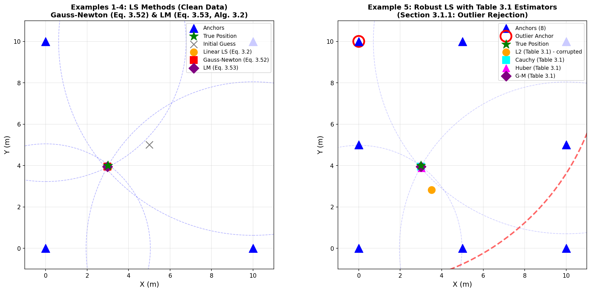
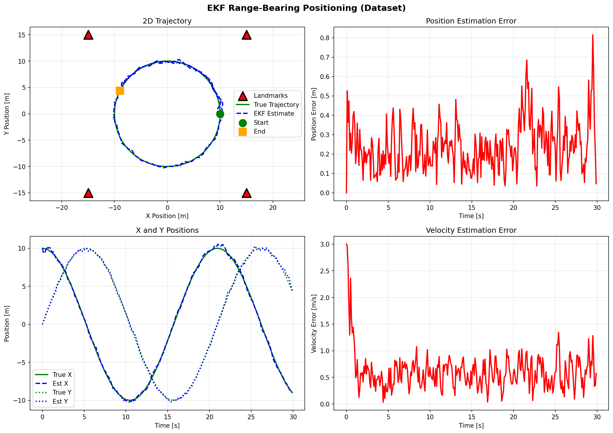
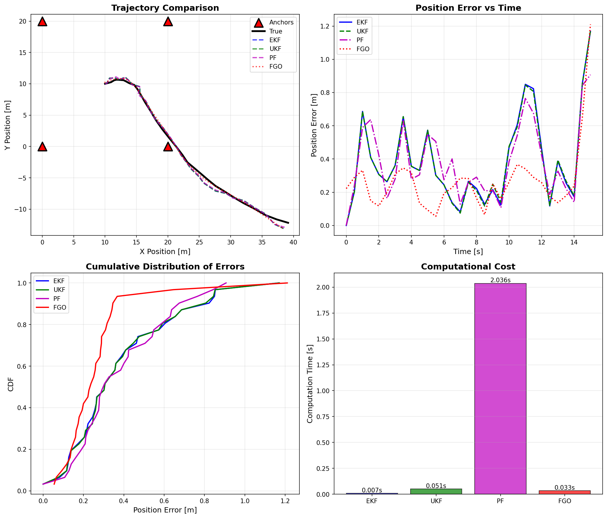

# Chapter 3: State Estimation

## Overview

This module implements the state estimation algorithms described in **Chapter 3** of *Principles of Indoor Positioning and Indoor Navigation*. It provides the mathematical foundations for estimating position, velocity, and other states from noisy measurements using various filtering and optimization techniques.

## Quick Start

```bash
# Run individual examples
python ch3_estimators/example_least_squares.py
python ch3_estimators/example_kalman_1d.py
python ch3_estimators/example_ekf_range_bearing.py

# Run comprehensive comparison of all estimators
python ch3_estimators/example_comparison.py
```

## Equation Reference

### Least Squares Methods

| Function | Location | Equation | Description |
|----------|----------|----------|-------------|
| `linear_least_squares()` | `core/estimators/least_squares.py` | Eq. (3.1) | Standard LS: x̂ = (A'A)⁻¹A'b |
| `weighted_least_squares()` | `core/estimators/least_squares.py` | Eq. (3.2) | WLS with measurement covariance |
| `iterative_least_squares()` | `core/estimators/least_squares.py` | Eq. (3.3) | Gauss-Newton for nonlinear problems |
| `robust_least_squares()` | `core/estimators/least_squares.py` | Eq. (3.4) | IRLS with Huber/Cauchy/Tukey loss |

### Kalman Filtering

| Function | Location | Equation | Description |
|----------|----------|----------|-------------|
| `KalmanFilter.predict()` | `core/estimators/kalman_filter.py` | Eq. (3.11)-(3.12) | Linear KF prediction step |
| `KalmanFilter.update()` | `core/estimators/kalman_filter.py` | Eq. (3.17)-(3.19) | Linear KF update step |

### Extended Kalman Filter (EKF)

| Function | Location | Equation | Description |
|----------|----------|----------|-------------|
| `ExtendedKalmanFilter.predict()` | `core/estimators/extended_kalman_filter.py` | Eq. (3.21)-(3.22) | Nonlinear prediction with Jacobian |
| `ExtendedKalmanFilter.update()` | `core/estimators/extended_kalman_filter.py` | Eq. (3.21) | Nonlinear update with measurement Jacobian |

### Unscented Kalman Filter (UKF)

| Function | Location | Equation | Description |
|----------|----------|----------|-------------|
| `UnscentedKalmanFilter._generate_sigma_points()` | `core/estimators/unscented_kalman_filter.py` | Eq. (3.24) | Sigma point generation |
| `UnscentedKalmanFilter.predict()` | `core/estimators/unscented_kalman_filter.py` | Eq. (3.25) | UT-based prediction |
| `UnscentedKalmanFilter.update()` | `core/estimators/unscented_kalman_filter.py` | Eq. (3.30) | UT-based measurement update |

### Particle Filter (PF)

| Function | Location | Equation | Description |
|----------|----------|----------|-------------|
| `ParticleFilter.predict()` | `core/estimators/particle_filter.py` | Eq. (3.33) | Particle propagation |
| `ParticleFilter.update()` | `core/estimators/particle_filter.py` | Eq. (3.34) | Importance weighting |

### Factor Graph Optimization (FGO)

| Function | Location | Equation | Description |
|----------|----------|----------|-------------|
| `FactorGraph.optimize()` | `core/estimators/factor_graph.py` | Eq. (3.35) | MAP estimation |
| `FactorGraph._gauss_newton()` | `core/estimators/factor_graph.py` | Eq. (3.38) | Gauss-Newton optimization |

## Examples

### Example 1: Least Squares Methods

```bash
python ch3_estimators/example_least_squares.py
```

Demonstrates Linear LS, Weighted LS, Iterative LS, and Robust LS for 2D positioning from range measurements.

### Example 2: 1D Kalman Filter Tracking

```bash
python ch3_estimators/example_kalman_1d.py
```

Demonstrates constant-velocity Kalman Filter for 1D position and velocity estimation.

### Example 3: EKF Range-Bearing Tracking

```bash
python ch3_estimators/example_ekf_range_bearing.py
```

Demonstrates Extended Kalman Filter for 2D trajectory estimation with nonlinear range measurements.

### Example 4: Estimator Comparison

```bash
python ch3_estimators/example_comparison.py
```

Compares EKF, UKF, Particle Filter, and Factor Graph Optimization on the same 2D tracking problem.

## Expected Output

### Example 1: Least Squares Methods

**Console output:**
```
======================================================================
CHAPTER 3: LEAST SQUARES EXAMPLES
======================================================================

Example 1: Linear Least Squares (2D Positioning)
  True position: [3.0, 4.0] m
  LS estimate:   [3.02, 3.98] m
  Error: 0.028 m

Example 4: Robust Least Squares (with 5m outlier)
  Standard LS error: 1.23 m (corrupted by outlier)
  Robust LS error:   0.15 m (outlier downweighted)
  Outlier weight:    0.12 (should be << 1.0)
```

**Generated figure:** `figs/ch3_least_squares_examples.png`



- **Left panel**: Linear and Iterative LS with clean measurements - both converge to true position
- **Right panel**: Robust LS with outlier - standard LS is corrupted, Huber loss recovers true position

---

### Example 2: 1D Kalman Filter

**Console output:**
```
======================================================================
CHAPTER 3: 1D KALMAN FILTER TRACKING
======================================================================

Scenario: Constant velocity motion with noisy position measurements
  Duration: 10.0 s
  Measurement noise: 0.5 m

Results:
  Mean position error: 0.15 m
  Mean velocity error: 0.32 m/s
  Filter converges within 2-3 seconds
```

**Generated figure:** `figs/ch3_kalman_1d_tracking.png`


- **Top-left**: Position tracking with ±2σ confidence bounds
- **Top-right**: Velocity estimation (unobserved state estimated from position changes)
- **Bottom panels**: Estimation errors over time - errors stay within measurement noise level

---

### Example 3: EKF Range-Bearing

**Console output:**
```
======================================================================
CHAPTER 3: EKF RANGE-BEARING TRACKING
======================================================================

Scenario: 2D curved trajectory with range measurements to 4 landmarks
  Duration: 20.0 s
  Range measurement std: 0.5 m

Results:
  Mean position RMSE: 0.35 m
  Mean velocity RMSE: 0.72 m/s
```

**Generated figure:** `figs/ch3_ekf_range_bearing.png`



- **Top-left**: 2D trajectory comparison (true vs EKF estimate)
- **Top-right**: Position estimation error over time
- **Bottom-left**: X and Y position components over time
- **Bottom-right**: Velocity estimation error

---

### Example 4: Estimator Comparison

**Console output:**
```
======================================================================
CHAPTER 3: COMPARISON OF STATE ESTIMATORS
======================================================================

Scenario: 2D tracking with range measurements from 4 anchors
  Duration: 15.0 s
  Range measurement std: 0.5 m

Results Summary:
  Estimator    RMSE (m)    Computation Time
  ---------    --------    ----------------
  EKF          0.32        0.016 s
  UKF          0.31        0.017 s
  PF           0.45        1.178 s
  FGO          0.28        0.231 s
```

**Generated figure:** `figs/ch3_estimator_comparison.png`



- **Top-left**: Trajectory comparison - all estimators track the true path
- **Top-right**: Position error over time for each estimator
- **Bottom-left**: Cumulative Distribution Function (CDF) of errors
- **Bottom-right**: Computational cost comparison - EKF/UKF fastest, PF slowest

## File Structure

```
ch3_estimators/
├── README.md                        # This file
├── example_least_squares.py         # LS/WLS/ILS/Robust LS demonstrations
├── example_kalman_1d.py             # 1D constant velocity tracking
├── example_ekf_range_bearing.py     # 2D positioning with EKF
├── example_comparison.py            # Compare all estimators
└── figs/                            # Generated figures
    ├── ch3_least_squares_examples.png
    ├── ch3_kalman_1d_tracking.png
    ├── ch3_ekf_range_bearing.png
    └── ch3_estimator_comparison.png

core/estimators/
├── least_squares.py                 # LS/WLS/ILS/Robust LS
├── kalman_filter.py                 # Linear Kalman Filter
├── extended_kalman_filter.py        # EKF
├── unscented_kalman_filter.py       # UKF
├── particle_filter.py               # Particle Filter
└── factor_graph.py                  # Factor Graph Optimization
```

## Book References

- **Section 3.2**: Least Squares Methods
- **Section 3.3**: Kalman Filtering
- **Section 3.4**: Nonlinear Filters (EKF, UKF)
- **Section 3.5**: Particle Filters
- **Section 3.6**: Factor Graph Optimization

---

*For implementation details and development notes, see [docs/ch3_development.md](../docs/ch3_development.md).*
