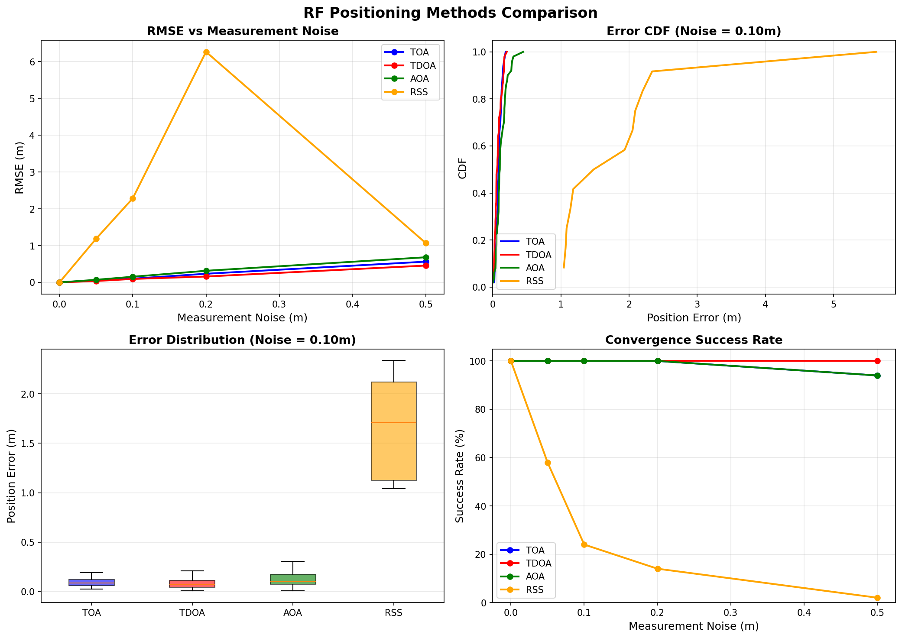

# Chapter 4: RF Point Positioning

## Overview

This module implements RF (Radio Frequency) positioning algorithms described in **Chapter 4** of *Principles of Indoor Positioning and Indoor Navigation*. It provides simulation-based examples of various RF positioning techniques including TOA, TDOA, AOA, and RSS-based positioning.

## Quick Start

```bash
# Run individual examples
python -m ch4_rf_point_positioning.example_toa_positioning
python -m ch4_rf_point_positioning.example_tdoa_positioning
python -m ch4_rf_point_positioning.example_aoa_positioning

# Run with pre-generated datasets
python -m ch4_rf_point_positioning.example_comparison --data ch4_rf_2d_square
python -m ch4_rf_point_positioning.example_comparison --data ch4_rf_2d_nlos

# Compare different beacon geometries
python -m ch4_rf_point_positioning.example_comparison --compare-geometry

# Run comprehensive comparison of all RF methods (inline data)
python -m ch4_rf_point_positioning.example_comparison
```

## 📂 Dataset Connection

| Example Script | Dataset | Description |
|----------------|---------|-------------|
| `example_comparison.py` | `data/sim/ch4_rf_2d_square/` | Square geometry (4 corners) - good baseline |
| `example_comparison.py` | `data/sim/ch4_rf_2d_optimal/` | Circular geometry - best GDOP |
| `example_comparison.py` | `data/sim/ch4_rf_2d_linear/` | Linear array - worst GDOP (10x degradation!) |
| `example_comparison.py` | `data/sim/ch4_rf_2d_nlos/` | Square + NLOS bias - robustness testing |

**Load dataset manually:**
```python
import numpy as np
import json
from pathlib import Path

path = Path("data/sim/ch4_rf_2d_square")
beacons = np.loadtxt(path / "beacons.txt")
positions = np.loadtxt(path / "ground_truth_positions.txt")
toa_ranges = np.loadtxt(path / "toa_ranges.txt")
tdoa_diffs = np.loadtxt(path / "tdoa_diffs.txt")
aoa_angles = np.loadtxt(path / "aoa_angles.txt")
gdop_toa = np.loadtxt(path / "gdop_toa.txt")
config = json.load(open(path / "config.json"))
```

## Equation Reference

### TOA (Time of Arrival) Positioning

| Function | Location | Equation | Description |
|----------|----------|----------|-------------|
| `toa_range()` | `core/rf/measurement_models.py` | Eq. (4.1)-(4.3) | Basic TOA range measurement with clock bias |
| `two_way_toa_range()` | `core/rf/measurement_models.py` | Eq. (4.6)-(4.7) | Two-way TOA (RTT) eliminates clock bias |
| `TOAPositioner.solve()` | `core/rf/positioning.py` | Eq. (4.14)-(4.23) | Nonlinear TOA positioning via I-WLS |
| `toa_solve_with_clock_bias()` | `core/rf/positioning.py` | Eq. (4.24)-(4.26) | Joint position + clock bias estimation |

### RSS (Received Signal Strength) Positioning

| Function | Location | Equation | Description |
|----------|----------|----------|-------------|
| `rss_pathloss()` | `core/rf/measurement_models.py` | Eq. (4.11)-(4.13) | Log-distance path-loss model |
| `rss_to_distance()` | `core/rf/measurement_models.py` | Eq. (4.11)-(4.13) | Invert RSS to estimate distance |

### TDOA (Time Difference of Arrival) Positioning

| Function | Location | Equation | Description |
|----------|----------|----------|-------------|
| `tdoa_range_difference()` | `core/rf/measurement_models.py` | Eq. (4.27)-(4.33) | TDOA range difference between anchor pairs |
| `tdoa_measurement_vector()` | `core/rf/measurement_models.py` | Eq. (4.27)-(4.33) | Stacked TDOA measurements |
| `TDOAPositioner.solve()` | `core/rf/positioning.py` | Eq. (4.34)-(4.42) | Linearized TDOA LS/WLS positioning |

### AOA (Angle of Arrival) Positioning

| Function | Location | Equation | Description |
|----------|----------|----------|-------------|
| `aoa_azimuth()` | `core/rf/measurement_models.py` | Eq. (4.63) | Azimuth angle from anchor to agent |
| `aoa_elevation()` | `core/rf/measurement_models.py` | Eq. (4.64) | Elevation angle from anchor to agent |
| `aoa_measurement_vector()` | `core/rf/measurement_models.py` | Eq. (4.65)-(4.66) | Stacked AOA measurements |
| `AOAPositioner.solve()` | `core/rf/positioning.py` | Eq. (4.63)-(4.67) | Linearized AOA LS/I-WLS positioning |

### DOP (Dilution of Precision)

| Function | Location | Equation | Description |
|----------|----------|----------|-------------|
| `compute_geometry_matrix()` | `core/rf/dop.py` | Section 4.5 | Geometry matrix for DOP calculation |
| `compute_dop()` | `core/rf/dop.py` | Section 4.5 | GDOP/PDOP/HDOP/VDOP computation |
| `compute_dop_map()` | `core/rf/dop.py` | Section 4.5 | DOP map over spatial grid |

## Usage Examples

### TOA Positioning

```python
import numpy as np
from core.rf import TOAPositioner

# Define anchor layout (square)
anchors = np.array([[0, 0], [10, 0], [10, 10], [0, 10]], dtype=float)

# True position and compute ranges
true_pos = np.array([5.0, 5.0])
ranges = np.linalg.norm(anchors - true_pos, axis=1)

# Solve using I-WLS
positioner = TOAPositioner(anchors, method='iwls')
estimated_pos, info = positioner.solve(ranges, initial_guess=np.array([6.0, 6.0]))

print(f"True position: {true_pos}")
print(f"Estimated: {estimated_pos}")
print(f"Error: {np.linalg.norm(estimated_pos - true_pos):.3f} m")
```

**Implements:** Eq. (4.14)-(4.23)

### RSS-Based Ranging

```python
from core.rf import rss_pathloss, rss_to_distance

# Compute RSS at 10m distance
rss = rss_pathloss(tx_power_dbm=0.0, distance=10.0, path_loss_exp=2.5)
print(f"RSS at 10m: {rss:.2f} dBm")

# Invert to estimate distance
distance_est = rss_to_distance(rss, tx_power_dbm=0.0, path_loss_exp=2.5)
print(f"Estimated distance: {distance_est:.2f} m")
```

**Implements:** Eq. (4.11)-(4.13)

### TDOA Positioning

```python
from core.rf import TDOAPositioner

anchors = np.array([[0, 0], [10, 0], [10, 10], [0, 10]], dtype=float)
true_pos = np.array([5.0, 5.0])

# Compute TDOA measurements (relative to anchor 0)
dist_ref = np.linalg.norm(true_pos - anchors[0])
tdoa = [np.linalg.norm(true_pos - anchors[i]) - dist_ref for i in range(1, len(anchors))]
tdoa = np.array(tdoa)

# Solve
positioner = TDOAPositioner(anchors, reference_idx=0)
estimated_pos, info = positioner.solve(tdoa, initial_guess=np.array([6.0, 6.0]))
```

**Implements:** Eq. (4.27)-(4.42)

## Expected Output

### TOA Positioning Example

Running `python ch4_rf_point_positioning/example_toa_positioning.py` produces:

```
======================================================================
Chapter 4: TOA Positioning Example
======================================================================

--- Setting up test scenario ---
  Anchors: 4 anchors in square configuration (10m x 10m)
  True position: [5.0, 5.0] m

--- TOA Positioning (Perfect Measurements) ---
  Estimated position: [5.00, 5.00] m
  Position error: 0.000 m
  Converged in 3 iterations

--- TOA Positioning (With 10cm Noise) ---
  Estimated position: [4.92, 5.08] m
  Position error: 0.116 m
  HDOP: 1.41
```

**Visual Output:**


*This figure shows the TOA positioning geometry with anchors (red triangles), true position (green circle), estimated position (blue X), and range circles (dashed red). The convergence path shows the iterative solver approaching the true position.*

### RF Methods Comparison

Running `python ch4_rf_point_positioning/example_comparison.py` generates a comprehensive comparison:

```
======================================================================
RF Positioning Methods Comparison
======================================================================

--- Performance Summary (Noise = 0.10m) ---
  TOA:  RMSE = 0.12m, Success Rate = 100%
  TDOA: RMSE = 0.10m, Success Rate = 100%
  AOA:  RMSE = 0.15m, Success Rate = 100%
  RSS:  RMSE = 1.73m, Success Rate = 58%

--- Key Observations ---
  - TOA and TDOA provide similar accuracy with good geometry
  - AOA accuracy depends on distance to anchors
  - RSS is most sensitive to noise (path-loss model uncertainty)
```

**Visual Output:**



*This figure shows four subplots comparing RF positioning methods:*
- **Top-Left:** RMSE vs measurement noise - TOA/TDOA/AOA maintain accuracy while RSS degrades rapidly
- **Top-Right:** Error CDF at 10cm noise - TOA/TDOA/AOA achieve sub-meter accuracy, RSS shows larger spread
- **Bottom-Left:** Error distribution box plots - RSS has significantly higher variance
- **Bottom-Right:** Convergence success rate - TOA/TDOA/AOA maintain high success, RSS drops with noise

## File Structure

```
ch4_rf_point_positioning/
├── README.md                     # This file (student documentation)
├── example_toa_positioning.py    # TOA/RSS positioning demo
├── example_tdoa_positioning.py   # TDOA positioning demo
├── example_aoa_positioning.py    # AOA positioning demo
├── example_comparison.py         # Compare all RF methods
└── figs/                         # Generated figures
    ├── toa_positioning_example.png
    └── ch4_rf_comparison.png

core/rf/
├── measurement_models.py         # TOA/TDOA/AOA/RSS models
├── positioning.py                # Positioning algorithms
└── dop.py                        # DOP utilities
```

## References

- **Chapter 4**: Point Positioning by Radio Signals
  - Section 4.2: TOA and RSS Positioning
  - Section 4.3: TDOA Positioning
  - Section 4.4: AOA Positioning
  - Section 4.5: DOP and Geometry Analysis

