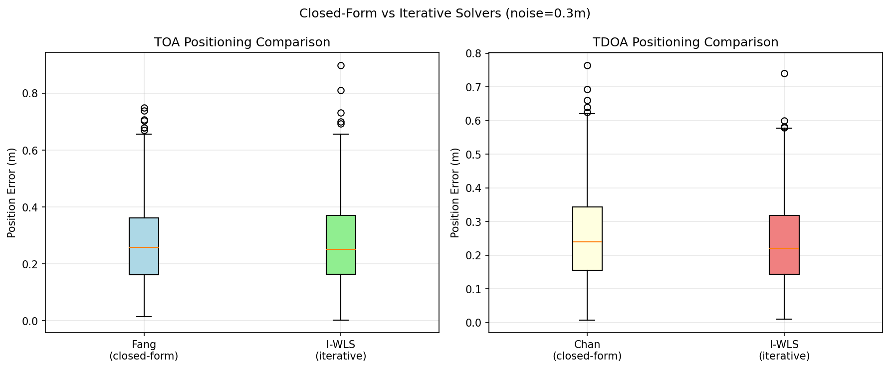
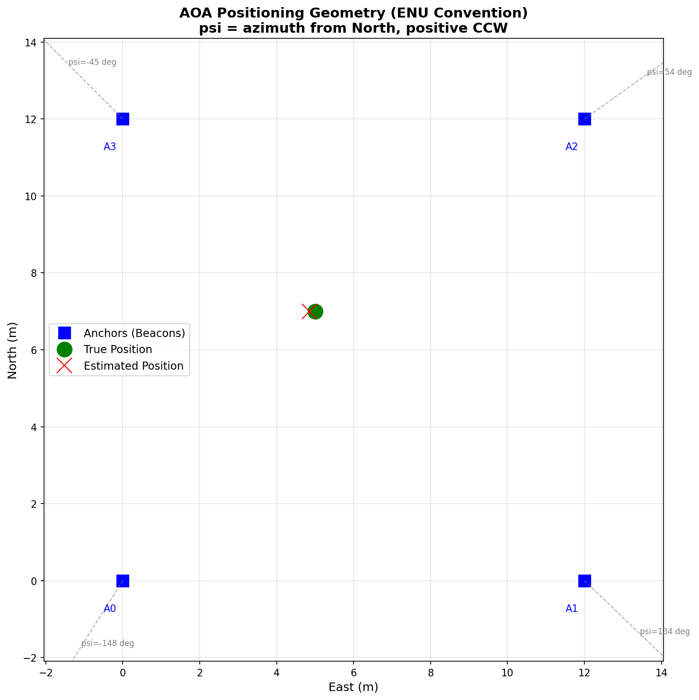
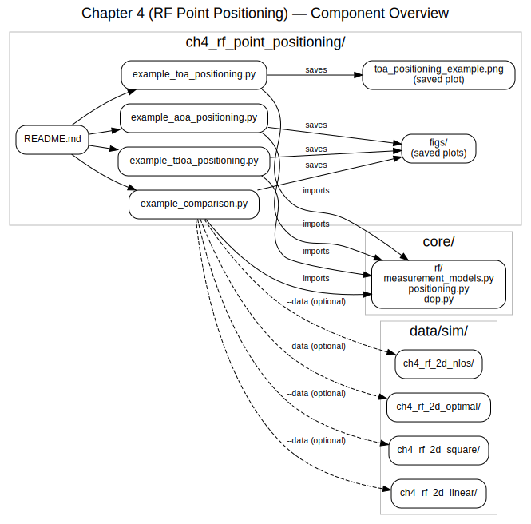
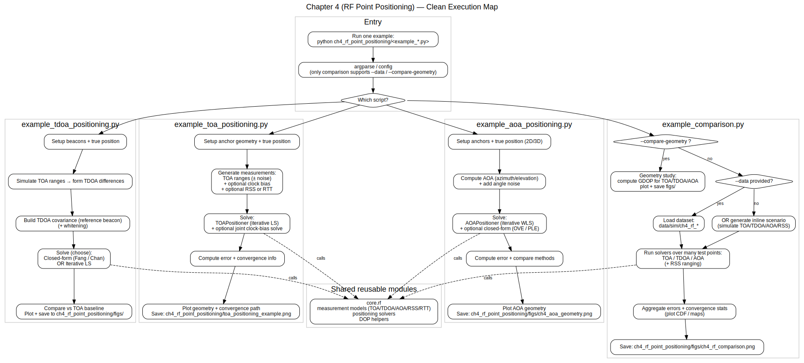

# Chapter 4: RF Point Positioning

## Overview

This module implements RF (Radio Frequency) positioning algorithms described in **Chapter 4** of *Principles of Indoor Positioning and Indoor Navigation*. It provides simulation-based examples of various RF positioning techniques including TOA, TDOA, AOA, and RSS-based positioning.

## Quick Start

```bash
# Run individual examples
python -m ch4_rf_point_positioning.example_toa_positioning
python -m ch4_rf_point_positioning.example_tdoa_positioning
python -m ch4_rf_point_positioning.example_aoa_positioning

# Run with pre-generated datasets
python -m ch4_rf_point_positioning.example_comparison --data ch4_rf_2d_square
python -m ch4_rf_point_positioning.example_comparison --data ch4_rf_2d_nlos

# Compare different beacon geometries
python -m ch4_rf_point_positioning.example_comparison --compare-geometry

# Run comprehensive comparison of all RF methods (inline data)
python -m ch4_rf_point_positioning.example_comparison
```

## 📂 Dataset Connection

| Example Script | Dataset | Description |
|----------------|---------|-------------|
| `example_comparison.py` | `data/sim/ch4_rf_2d_square/` | Square geometry (4 corners) - good baseline |
| `example_comparison.py` | `data/sim/ch4_rf_2d_optimal/` | Circular geometry - best GDOP |
| `example_comparison.py` | `data/sim/ch4_rf_2d_linear/` | Linear array - worst GDOP (10x degradation!) |
| `example_comparison.py` | `data/sim/ch4_rf_2d_nlos/` | Square + NLOS bias - robustness testing |

**Load dataset manually:**
```python
import numpy as np
import json
from pathlib import Path

path = Path("data/sim/ch4_rf_2d_square")
beacons = np.loadtxt(path / "beacons.txt")
positions = np.loadtxt(path / "ground_truth_positions.txt")
toa_ranges = np.loadtxt(path / "toa_ranges.txt")
tdoa_diffs = np.loadtxt(path / "tdoa_diffs.txt")
aoa_angles = np.loadtxt(path / "aoa_angles.txt")
gdop_toa = np.loadtxt(path / "gdop_toa.txt")
config = json.load(open(path / "config.json"))
```

## Equation Reference

### TOA (Time of Arrival) Positioning

| Function | Location | Equation | Description |
|----------|----------|----------|-------------|
| `toa_range()` | `core/rf/measurement_models.py` | Eq. (4.1)-(4.3) | TOA range with clock bias (input: seconds) |
| `clock_bias_seconds_to_meters()` | `core/rf/measurement_models.py` | Eq. (4.24) | Convert Δt (s) to c*Δt (m) |
| `clock_bias_meters_to_seconds()` | `core/rf/measurement_models.py` | Eq. (4.24) | Convert c*Δt (m) to Δt (s) |
| `two_way_toa_range()` | `core/rf/measurement_models.py` | - | Geometric distance for RTT positioning |
| `rtt_to_range()` | `core/rf/measurement_models.py` | Eq. (4.7)-(4.8) | Convert RTT timing to range estimate |
| `simulate_rtt_measurement()` | `core/rf/measurement_models.py` | Eq. (4.9) | Simulate RTT with processing time and drift noise |
| `range_to_rtt()` | `core/rf/measurement_models.py` | - | Convert range to ideal RTT (inverse of rtt_to_range) |
| `TOAPositioner.solve()` | `core/rf/positioning.py` | Eq. (4.14)-(4.23) | Nonlinear TOA positioning via iterative LS/WLS |
| `toa_solve_with_clock_bias()` | `core/rf/positioning.py` | Eq. (4.24)-(4.26) | Joint position + clock bias (output: meters) |
| `toa_fang_solver()` | `core/rf/positioning.py` | Eq. (4.43)-(4.49) | Fang's closed-form TOA positioning (2D) |

**Clock Bias Unit Convention:**

| Context | Unit | Variable Name | Reason |
|---------|------|---------------|--------|
| Measurement model (`toa_range`) | **seconds** (Δt) | `clock_bias_s` | Physical timing domain |
| Positioning solver | **meters** (c*Δt) | `clock_bias_m`, `bias_m` | Book Eq. 4.24: Jacobian ∂h/∂(c*Δt) = 1 |

**Conversion:**
- 1 nanosecond ≈ 0.3 meters (one-way)
- `bias_m = c * bias_s` and `bias_s = bias_m / c`
- Use `clock_bias_seconds_to_meters()` and `clock_bias_meters_to_seconds()` for explicit conversions

```python
from core.rf import (
    toa_range, toa_solve_with_clock_bias,
    clock_bias_seconds_to_meters, clock_bias_meters_to_seconds,
    SPEED_OF_LIGHT
)

# Measurement model: clock bias in SECONDS
clock_bias_s = 10e-9  # 10 nanoseconds
range_biased = toa_range(anchor, agent, clock_bias_s=clock_bias_s)

# Convert to meters for solver
clock_bias_m = clock_bias_seconds_to_meters(clock_bias_s)
print(f"10 ns = {clock_bias_m:.3f} m")  # ~3.0 m

# Solve: returns clock bias in METERS
pos, bias_m, info = toa_solve_with_clock_bias(anchors, ranges, initial)

# Convert back to seconds for interpretation
bias_s = clock_bias_meters_to_seconds(bias_m)
print(f"Estimated bias: {bias_s*1e9:.2f} ns")
```

**Two-Way TOA / RTT Model (Eqs. 4.6-4.9):**

The book's RTT model includes processing time and clock drift:
- Eq. 4.6: Basic RTT: `d = c * (Δt_to + Δt_back) / 2`
- Eq. 4.7: With processing: `d = c * (t_arrive - t_depart - Δt_proc) / 2`
- Eq. 4.8: With drift: `d = c * (t_arrive - t_depart - Δt_proc - Δt_drift) / 2`
- Eq. 4.9: With noise: `d̃ = ... + ω_proc + ω_drift`

```python
from core.rf import rtt_to_range, simulate_rtt_measurement, range_to_rtt

# Convert RTT measurement to range (Eq. 4.7-4.8)
rtt = 100e-9  # 100 nanoseconds measured RTT
processing_time = 20e-9  # 20ns beacon processing time
range_m = rtt_to_range(rtt, processing_time=processing_time)
print(f"Range: {range_m:.2f} m")  # ~12 m

# Simulate realistic RTT measurement with noise (Eq. 4.9)
anchor = np.array([0.0, 0.0, 0.0])
agent = np.array([15.0, 0.0, 0.0])
rtt, info = simulate_rtt_measurement(
    anchor, agent,
    processing_time=50e-9,       # 50ns nominal processing
    processing_time_std=5e-9,    # 5ns std dev
    clock_drift_std=1e-9,        # 1ns drift std
)
print(f"True range: {info['true_range']:.2f} m")
print(f"Estimated:  {info['range_estimate']:.2f} m")

# Convert known range to ideal RTT
rtt_ideal = range_to_rtt(15.0, processing_time=50e-9)
print(f"Ideal RTT: {rtt_ideal*1e9:.1f} ns")
```

**Key timing error effects:**
- 1 nanosecond timing error ≈ 0.15 meter range error (one-way)
- Processing time calibration is critical for accuracy
- TCXO clock drift typically ±1-2 ppm

**TOAPositioner Methods (Eqs. 4.14-4.23):**

The TOA equations are nonlinear, so positioning requires iterative linearization
(Taylor series expansion at current estimate, then update, repeat until convergence).

| Method | Weighting | Book Equation | Description |
|--------|-----------|---------------|-------------|
| `"iterative_ls"` (default) | W = I | Eq. (4.20) | Iterative LS with uniform weights |
| `"iterative_wls"` | W = Σ^{-1} | Eq. (4.23) | Iterative WLS with user-provided covariance |
| `"range_weighted"` | W_ii = 1/d_i² | - | Heuristic (not in book): down-weight far anchors |

```python
from core.rf import TOAPositioner

# Method 1: Iterative LS (book default, Eq. 4.20)
positioner = TOAPositioner(anchors, method="iterative_ls")
pos, info = positioner.solve(ranges, initial_guess=np.array([5.0, 5.0]))

# Method 2: Iterative WLS with known measurement covariance (Eq. 4.23)
sigmas = np.array([0.1, 0.2, 0.15, 0.1])  # range measurement stds
covariance = np.diag(sigmas**2)
positioner = TOAPositioner(anchors, method="iterative_wls")
pos, info = positioner.solve(ranges, np.array([5.0, 5.0]), covariance=covariance)
```

**Fang's Closed-Form TOA Solver (Eqs. 4.43-4.49):**

Fang's algorithm provides a non-iterative solution by linearizing the squared range equations:
- Forms linear system using squared range differences: d_i² - d_ref²
- Rearranges to: H_a * x_a = y_a (Eq. 4.48)
- Solves via least squares: x_a = (H_a^T H_a)^{-1} H_a^T y_a

```python
from core.rf import toa_fang_solver

# Perfect measurements
anchors = np.array([[0, 0], [20, 0], [20, 20], [0, 20]], dtype=float)
true_pos = np.array([8.0, 12.0])
ranges = np.linalg.norm(anchors - true_pos, axis=1)

# Fang's closed-form (no initial guess needed!)
position, info = toa_fang_solver(anchors, ranges, ref_idx=0)
print(f"Position: {position}")  # [8.0, 12.0]
```

**Properties:**
- Requires at least 3 anchors for 2D positioning
- Non-iterative: no initial guess required
- Sensitive to noise; no built-in filtering
- Well-suited for real-time applications

**Closed-Form vs Iterative Solvers Comparison:**



*This figure compares Fang's closed-form TOA solver with iterative WLS (left) and Chan's closed-form TDOA solver with iterative WLS (right) under 0.3m measurement noise. Both closed-form methods achieve comparable median accuracy to iterative solvers, but show slightly higher variance due to the lack of iterative refinement. Closed-form solvers excel when no initial guess is available or when computational speed is critical.*

### RSS (Received Signal Strength) Positioning

| Function | Location | Equation | Description |
|----------|----------|----------|-------------|
| `rss_pathloss()` | `core/rf/measurement_models.py` | Eq. (4.10) | Log-distance path-loss forward model |
| `rss_to_distance()` | `core/rf/measurement_models.py` | Eq. (4.11) | Invert RSS to estimate distance |
| `simulate_rss_measurement()` | `core/rf/measurement_models.py` | Eq. (4.10), (4.12) | Simulate RSS with Rayleigh/Gaussian fading |
| `rss_fading_to_distance_error()` | `core/rf/measurement_models.py` | Eq. (4.13) | Convert fading (dB) to distance error factor |

### TDOA (Time Difference of Arrival) Positioning

| Function | Location | Equation | Description |
|----------|----------|----------|-------------|
| `tdoa_range_difference()` | `core/rf/measurement_models.py` | Eq. (4.27)-(4.33) | TDOA range difference between anchor pairs |
| `tdoa_measurement_vector()` | `core/rf/measurement_models.py` | Eq. (4.27)-(4.33) | Stacked TDOA measurements |
| `TDOAPositioner.solve()` | `core/rf/positioning.py` | Eq. (4.34)-(4.42) | Linearized TDOA LS/WLS positioning |
| `build_tdoa_covariance()` | `core/rf/positioning.py` | Eq. (4.42) | Build correlated covariance matrix |
| `tdoa_chan_solver()` | `core/rf/positioning.py` | Eq. (4.50)-(4.62) | Chan's closed-form TDOA positioning (2D) |

**Chan's Closed-Form TDOA Solver (Eqs. 4.50-4.62):**

Chan's algorithm provides a two-step WLS solution using an auxiliary variable:
- State vector: x_a = [x_e, x_n, d_ref]^T (includes reference distance)
- Step 1: Initial LS solution using linearized system (Eq. 4.58-4.60)
- Step 2: WLS refinement with correlated covariance (Eq. 4.61-4.62)

```python
from core.rf import tdoa_chan_solver, build_tdoa_covariance

# Compute TDOA measurements
anchors = np.array([[0, 0], [20, 0], [20, 20], [0, 20], [10, 10]], dtype=float)
true_pos = np.array([8.0, 12.0])
ranges = np.linalg.norm(anchors - true_pos, axis=1)
d_ref = ranges[0]
tdoa = np.array([ranges[i] - d_ref for i in range(1, len(anchors))])

# Chan's closed-form (no initial guess needed!)
position, info = tdoa_chan_solver(anchors, tdoa, ref_idx=0)
print(f"Position: {position}")  # [8.0, 12.0]
print(f"Reference distance: {info['reference_distance']:.2f} m")

# With WLS using correlated covariance
sigmas = np.array([0.3, 0.1, 0.1, 0.1, 0.1])  # ref has higher noise
cov = build_tdoa_covariance(sigmas, ref_idx=0)
position_wls, info = tdoa_chan_solver(anchors, tdoa, ref_idx=0, covariance=cov)
```

**Properties:**
- Requires at least 4 anchors for 2D positioning
- Non-iterative: no initial guess required
- WLS refinement handles correlated TDOA noise (Eq. 4.62)
- Also estimates reference distance (d_ref)

**TDOA Covariance Structure (Eq. 4.42):**

For TDOA measurements z = [d^{1,ref}, d^{2,ref}, ..., d^{I-1,ref}]^T relative to reference anchor:
- **Diagonal terms:** var(d^{k,ref}) = σ_k² + σ_ref² (anchor k variance + reference variance)
- **Off-diagonal terms:** cov(d^{k,ref}, d^{m,ref}) = σ_ref² (shared reference anchor noise)

The off-diagonal correlation arises because all TDOA measurements share the same reference anchor.
Using identity weighting (ignoring correlation) leads to suboptimal estimates, especially when σ_ref is large.


*This heatmap visualizes the TDOA covariance matrix structure (Eq. 4.42). The diagonal elements (darker blue) represent var(d^{k,ref}) = σ_k² + σ_ref², combining each anchor's noise with the reference anchor's noise. The off-diagonal elements (lighter blue, all equal to σ_ref² ≈ 0.09) represent the correlation introduced by sharing the same reference anchor. This correlation structure is crucial for optimal WLS weighting—ignoring it leads to suboptimal position estimates.*

```python
from core.rf import build_tdoa_covariance, TDOAPositioner

# Per-anchor range noise (meters)
sigmas = np.array([0.5, 0.1, 0.1, 0.1])  # ref=0 has higher noise

# Build correlated covariance matrix
cov = build_tdoa_covariance(sigmas, ref_idx=0)
# Result: 3x3 matrix with diagonal = [0.26, 0.26, 0.26], off-diag = 0.25

# Use in TDOA positioning
positioner = TDOAPositioner(anchors, reference_idx=0)
estimated_pos, info = positioner.solve(
    tdoa_measurements, initial_guess=np.array([5.0, 5.0]),
    covariance=cov  # Pass correlated covariance
)
```

### AOA (Angle of Arrival) Positioning

| Function | Location | Equation | Description |
|----------|----------|----------|-------------|
| `aoa_sin_elevation()` | `core/rf/measurement_models.py` | Eq. (4.63) | sin(θ) = (x_u^i - x_u,a) / d |
| `aoa_tan_azimuth()` | `core/rf/measurement_models.py` | Eq. (4.64) | tan(ψ) = (x_e^i - x_e,a) / (x_n^i - x_n,a) |
| `aoa_azimuth()` | `core/rf/measurement_models.py` | Eq. (4.64) | Azimuth ψ = atan2(ΔE, ΔN) from North |
| `aoa_elevation()` | `core/rf/measurement_models.py` | Eq. (4.63) | Elevation θ = arcsin(ΔU / d) |
| `aoa_measurement_vector()` | `core/rf/measurement_models.py` | Eq. (4.65) | Stacked [sin(θ_i), tan(ψ_i)] measurements |
| `aoa_angle_vector()` | `core/rf/measurement_models.py` | - | Stacked raw angles [θ_i, ψ_i] |
| `AOAPositioner.solve()` | `core/rf/positioning.py` | Eq. (4.63)-(4.78) | I-WLS positioning with book Jacobians |
| `aoa_ove_solve()` | `core/rf/positioning.py` | Eq. (4.79)-(4.85) | OVE: 3D closed-form estimator |
| `aoa_ple_solve_2d()` | `core/rf/positioning.py` | Eq. (4.86)-(4.91) | PLE: 2D closed-form estimator |
| `aoa_ple_solve_3d()` | `core/rf/positioning.py` | Eq. (4.92)-(4.95) | PLE: 3D closed-form estimator |

**AOAPositioner I-WLS Jacobians (Eqs. 4.68-4.74):**

The `AOAPositioner` implements the book's I-WLS linearization using analytical Jacobians:

- **Elevation f_i = sin(θ_i) partial derivatives (Eqs. 4.68-4.70):**
  - ∂f/∂x_e,a = Δu·Δe / d³
  - ∂f/∂x_n,a = Δu·Δn / d³
  - ∂f/∂x_u,a = -(Δe² + Δn²) / d³

- **Azimuth g_i = tan(ψ_i) partial derivatives (Eqs. 4.72-4.74):**
  - ∂g/∂x_e,a = -1 / Δn
  - ∂g/∂x_n,a = Δe / Δn²
  - ∂g/∂x_u,a = 0

Where Δe = x_e^i - x_e,a, Δn = x_n^i - x_n,a, Δu = x_u^i - x_u,a, and d = ||x_a - x^i||.

**Book-Default AOA Weighting (W_a = Σ_a^{-1}):**

The `AOAPositioner.solve()` method supports book-default weighted least squares using
measurement noise parameters. When `sigma_psi` (and optionally `sigma_theta` for 3D)
are provided, the weight matrix W_a = Σ_a^{-1} is computed via first-order error propagation:

| Measurement | Error Propagation | Formula |
|-------------|-------------------|---------|
| sin(θ) | var(sin θ) ≈ cos²(θ) × var(θ) | Weight inversely proportional to variance |
| tan(ψ) | var(tan ψ) ≈ sec⁴(ψ) × var(ψ) | High variance near ψ = ±90° (down-weighted) |

This properly accounts for:
- **Heterogeneous noise**: Different measurement quality per anchor
- **Angle-dependent amplification**: tan(ψ) variance grows near ±90°

```python
from core.rf import AOAPositioner, aoa_angle_vector
import numpy as np

anchors = np.array([[0, 0], [10, 0], [10, 10], [0, 10]], dtype=float)
aoa = aoa_angle_vector(anchors, np.array([4.0, 6.0]))

positioner = AOAPositioner(anchors)

# Method 1: Identity weights (default when no sigma provided)
pos_unweighted, info1 = positioner.solve(aoa, initial_guess=np.array([5.0, 5.0]))

# Method 2: Book-default weighting with uniform azimuth noise (2°)
pos_weighted, info2 = positioner.solve(
    aoa, initial_guess=np.array([5.0, 5.0]),
    sigma_psi=np.deg2rad(2.0)
)

# Method 3: Heterogeneous noise per anchor
sigma_per_anchor = np.deg2rad([1.0, 2.0, 5.0, 10.0])
pos_hetero, info3 = positioner.solve(
    aoa, initial_guess=np.array([5.0, 5.0]),
    sigma_psi=sigma_per_anchor
)

# For 3D, also provide sigma_theta
# pos_3d, info = positioner.solve(aoa_3d, guess_3d,
#     sigma_theta=np.deg2rad(1.0), sigma_psi=np.deg2rad(2.0))
```

**Weight recomputation:** By default (`recompute_weights=True`), W_a is updated each
iteration using predicted angles at the current estimate. Set `recompute_weights=False`
to compute W_a once using the initial measurements.

**Closed-Form AOA Solvers:**

- **OVE (Orthogonal Vector Estimator)** - Eqs. 4.79-4.85:
  - 3D closed-form solution using orthogonal projection
  - Constructs unit direction vectors and solves via least squares
  - Biased estimator; error increases with distance and noise

- **PLE (Pseudolinear Estimator)** - Eqs. 4.86-4.95:
  - 2D: Line-of-bearing intersection via least squares (Eq. 4.89-4.91)
  - 3D: Two-step estimation (2D + elevation averaging, Eq. 4.92-4.95)
  - Biased; sensitive to poor geometry (aligned beacons) and high noise
  - Often used as initial guess for iterative methods

**ENU Convention Notes:**
- Azimuth ψ is measured from North (+N), positive counterclockwise
- ψ = atan2(ΔE, ΔN) where ΔE = anchor_E - agent_E, ΔN = anchor_N - agent_N
- Elevation θ is positive when anchor is above agent
- Measurement vector uses sin(θ) and tan(ψ) for I-WLS linearization (Eq. 4.65)
- 2D mode: Uses tan(ψ) only (azimuth measurements)
- 3D mode: Uses [sin(θ_i), tan(ψ_i)] stacked (elevation + azimuth)



*This figure illustrates the AOA positioning geometry using the ENU (East-North-Up) coordinate convention. Four anchors (A0-A3, blue squares) are arranged in a rectangular grid. The dashed gray lines show bearing vectors from each anchor to the agent (green circle). Azimuth angles (ψ) are labeled in degrees, measured from North (+N direction), positive counterclockwise. For example, A0 at (0,0) has ψ=-148° (pointing northeast toward the agent at ~(5,7)), while A2 at (12,12) has ψ=54° (pointing southwest). The estimated position (red X) closely matches the true position, demonstrating successful AOA triangulation.*

### DOP (Dilution of Precision)

| Function | Location | Equation | Description |
|----------|----------|----------|-------------|
| `compute_geometry_matrix()` | `core/rf/dop.py` | Eq. (4.18) | Geometry (LOS) matrix H for DOP |
| `compute_dop()` | `core/rf/dop.py` | Eq. (4.103)-(4.108) | GDOP/PDOP/HDOP/VDOP computation |
| `compute_dop_map()` | `core/rf/dop.py` | Eq. (4.108) | DOP values over spatial grid |
| `position_error_from_dop()` | `core/rf/dop.py` | Eq. (4.107) | σ_position = DOP × σ_measurement |

**Book DOP Definitions (Eqs. 4.103-4.108):**

The position error covariance relates to measurement noise via the DOP matrix:
```
C(x_a) = (H_a^T H_a)^{-1} × σ_z²    (Eq. 4.103)
```

Defining Q = (H_a^T H_a)^{-1} with diagonal elements κ_ee, κ_nn, κ_uu:

| DOP Metric | Formula | Book Equation | Description |
|------------|---------|---------------|-------------|
| **GDOP** | √(κ_ee + κ_nn + κ_uu) = √(trace(Q)) | Eq. 4.107 | Overall 3D position |
| **HDOP** | √(κ_ee + κ_nn) | Eq. 4.108 | Horizontal position |
| **VDOP** | √(κ_uu) | Eq. 4.108 | Vertical position |
| **PDOP** | = GDOP (for pure positioning) | - | Position-only DOP |

**Fundamental DOP Relationship (Eq. 4.107):**
```
σ_position = DOP × σ_measurement
```

Where σ symbols are **standard deviations** (not variances):
- σ_z: measurement noise std (meters for TOA/TDOA)
- σ_position: position error std (meters)

**Example:** If HDOP = 1.5 and σ_range = 0.3m, then σ_horizontal = 0.45m

```python
from core.rf import compute_geometry_matrix, compute_dop, position_error_from_dop

# Square anchor layout
anchors = np.array([[0, 0], [10, 0], [10, 10], [0, 10]], dtype=float)
position = np.array([5.0, 5.0])

# Compute geometry matrix and DOP
H = compute_geometry_matrix(anchors, position, 'toa')
dop = compute_dop(H)

print(f"HDOP: {dop['HDOP']:.2f}")  # 1.41
print(f"VDOP: {dop['VDOP']}")      # None (2D case)

# Map measurement noise to position error
sigma_range = 0.3  # meters
sigma_horizontal = position_error_from_dop(dop['HDOP'], sigma_range)
print(f"Expected horizontal error: {sigma_horizontal:.2f} m")  # 0.42 m
```

**DOP Interpretation:**
- DOP ≈ 1.0: Excellent geometry (position error ≈ measurement error)
- DOP = 1-2: Good geometry
- DOP = 2-4: Acceptable geometry
- DOP > 6: Poor geometry (avoid if possible)

## Usage Examples

### TOA Positioning

```python
import numpy as np
from core.rf import TOAPositioner

# Define anchor layout (square)
anchors = np.array([[0, 0], [10, 0], [10, 10], [0, 10]], dtype=float)

# True position and compute ranges
true_pos = np.array([5.0, 5.0])
ranges = np.linalg.norm(anchors - true_pos, axis=1)

# Solve using iterative LS (book default: Eq. 4.20)
positioner = TOAPositioner(anchors, method='iterative_ls')
estimated_pos, info = positioner.solve(ranges, initial_guess=np.array([6.0, 6.0]))

print(f"True position: {true_pos}")
print(f"Estimated: {estimated_pos}")
print(f"Error: {np.linalg.norm(estimated_pos - true_pos):.3f} m")
```

**Implements:** Eq. (4.14)-(4.23)

### RSS-Based Ranging

The RSS path-loss model follows book Eqs. (4.10)-(4.13):
- **Eq. 4.10**: Forward model: `p_R = p_ref - 10*η*log10(d/d_ref)`
- **Eq. 4.11**: Inverse model: `d = d_ref * 10^((p_ref - p_R) / (10*η))`
- **Eq. 4.12**: Fading: `p̃_R = p_R + ω_long(x) + ω_short(t)`
- **Eq. 4.13**: Distance error (general form):
  ```
  d̃ = d * 10^(-(ω_long + ω_short) / (10*η))
    = d * 10^(-ω_long / (10*η)) * 10^(-ω_short / (10*η))
  ```

**Note on Eq. 4.13:** The book's derivation shows only `ω_long` in the final formula because
it assumes `ω_short(t)` is mitigated by time-averaging multiple RSS samples. After sufficient
averaging, ω_short → 0 in expectation, leaving only the location-dependent `ω_long` term.
**Our implementation uses the full formula** (both terms) to accurately model the residual
short-term fading when averaging is limited or disabled.

**Fading Model Details (Eq. 4.12):**

| Fading Type | Distribution | Domain | Reducible by Averaging? |
|-------------|--------------|--------|-------------------------|
| **ω_long(x)** Long-term | Gaussian `N(0, σ_long²)` | dB (log power) | No (location-dependent) |
| **ω_short(t)** Short-term | Rayleigh amplitude | Linear amplitude | Yes (time-varying) |

**Short-term Fading Models:**
- `"rayleigh"` (default, book-faithful): Amplitude A ~ Rayleigh(σ), power P = A²
- `"gaussian_db"`: Gaussian noise directly in dB domain (legacy)
- `"none"`: Disable short-term fading

**Physical Interpretation:**
- Rayleigh fading models multipath propagation when no dominant LOS path exists
- The amplitude A follows Rayleigh distribution, power P = A² follows exponential
- In dB: the fading has asymmetric distribution with negative mean (~-2.5 dB below mean power)
- Averaging multiple samples reduces variance by combining independent fading realizations

```python
from core.rf import (
    rss_pathloss,
    rss_to_distance,
    simulate_rss_measurement,
    rss_fading_to_distance_error,
)

# RSS at 10m with p_ref=-40dBm @ 1m, path-loss exponent eta=2.5
p_ref_dbm = -40.0  # Reference RSS at d_ref=1m
rss = rss_pathloss(p_ref_dbm=p_ref_dbm, distance=10.0, path_loss_exp=2.5)
print(f"RSS at 10m: {rss:.2f} dBm")  # -65.00 dBm

# Invert to estimate distance (Eq. 4.11)
distance_est = rss_to_distance(rss_dbm=rss, p_ref_dbm=p_ref_dbm, path_loss_exp=2.5)
print(f"Estimated distance: {distance_est:.2f} m")  # 10.00 m

# Simulate RSS with Rayleigh short-term fading (Eq. 4.12)
anchor = np.array([0.0, 0.0])
agent = np.array([10.0, 0.0])
rss_meas, info = simulate_rss_measurement(
    anchor, agent,
    p_ref_dbm=-40.0,
    path_loss_exp=2.5,
    sigma_long_db=6.0,         # Long-term fading std (typical: 4-8 dB)
    sigma_short_linear=0.707,  # Rayleigh scale σ (normalized: 1/sqrt(2))
    n_samples_avg=5,           # Average 5 samples to reduce short-term fading
    short_fading_model="rayleigh",  # Book-faithful Rayleigh fading
)
print(f"True RSS: {info['rss_true']:.1f} dBm, Measured: {rss_meas:.1f} dBm")
print(f"Long-term fading: {info['omega_long_db']:.2f} dB")
print(f"Short-term fading (after avg): {info['omega_short_db']:.2f} dB")
print(f"Distance error factor: {info['distance_error_factor']:.2f}x")

# Direct fading-to-distance-error conversion (Eq. 4.13)
# Takes TOTAL fading (ω_long + ω_short) as input
# +6 dB total fading -> underestimate distance, -6 dB -> overestimate
total_fading = info['omega_long_db'] + info['omega_short_db']
factor = rss_fading_to_distance_error(omega_db=total_fading, path_loss_exp=2.5)
print(f"Total fading {total_fading:.1f} dB -> {factor:.2f}x distance")
```

**Distance Error Factor:**
- `distance_error_factor` in `info` dict uses **total fading** (ω_long + ω_short)
- `rss_fading_to_distance_error()` converts any fading value (dB) to multiplicative error
- After averaging many samples, ω_short → 0, so error is dominated by ω_long

**Averaging Effect on Short-term Fading:**
- n=1: Full Rayleigh variance (~5-6 dB std in power)
- n=5: Variance reduced by ~sqrt(5), improved stability
- n=10+: Further reduction, approaching long-term fading limit (ω_short ≈ 0)

**Implements:** Eqs. (4.10)-(4.13)

### TDOA Positioning

```python
from core.rf import TDOAPositioner

anchors = np.array([[0, 0], [10, 0], [10, 10], [0, 10]], dtype=float)
true_pos = np.array([5.0, 5.0])

# Compute TDOA measurements (relative to anchor 0)
dist_ref = np.linalg.norm(true_pos - anchors[0])
tdoa = [np.linalg.norm(true_pos - anchors[i]) - dist_ref for i in range(1, len(anchors))]
tdoa = np.array(tdoa)

# Solve
positioner = TDOAPositioner(anchors, reference_idx=0)
estimated_pos, info = positioner.solve(tdoa, initial_guess=np.array([6.0, 6.0]))
```

**Implements:** Eq. (4.27)-(4.42)

## Expected Output

### TOA Positioning Example

Running `python ch4_rf_point_positioning/example_toa_positioning.py` produces:

```
======================================================================
Chapter 4: TOA Positioning Example
======================================================================

--- Setting up test scenario ---
  Anchors: 4 anchors in square configuration (10m x 10m)
  True position: [5.0, 5.0] m

--- TOA Positioning (Perfect Measurements) ---
  Estimated position: [5.00, 5.00] m
  Position error: 0.000 m
  Converged in 3 iterations

--- TOA Positioning (With 10cm Noise) ---
  Estimated position: [4.92, 5.08] m
  Position error: 0.116 m
  HDOP: 1.41
```

**Visual Output:**


*This figure shows the TOA positioning geometry with anchors (red triangles), true position (green circle), estimated position (blue X), and range circles (dashed red). The convergence path shows the iterative solver approaching the true position.*

### RF Methods Comparison

Running `python ch4_rf_point_positioning/example_comparison.py` generates a comprehensive comparison:

```
======================================================================
RF Positioning Methods Comparison
======================================================================

--- Performance Summary (Noise = 0.10m) ---
  TOA:  RMSE = 0.12m, Success Rate = 100%
  TDOA: RMSE = 0.10m, Success Rate = 100%
  AOA:  RMSE = 0.15m, Success Rate = 100%
  RSS:  RMSE = 1.73m, Success Rate = 58%

--- Key Observations ---
  - TOA and TDOA provide similar accuracy with good geometry
  - AOA accuracy depends on distance to anchors
  - RSS is most sensitive to noise (path-loss model uncertainty)
```

**Visual Output:**


*This figure shows four subplots comparing RF positioning methods:*
- **Top-Left:** RMSE vs measurement noise - TOA/TDOA/AOA maintain accuracy while RSS degrades rapidly
- **Top-Right:** Error CDF at 10cm noise - TOA/TDOA/AOA achieve sub-meter accuracy, RSS shows larger spread
- **Bottom-Left:** Error distribution box plots - RSS has significantly higher variance
- **Bottom-Right:** Convergence success rate - TOA/TDOA/AOA maintain high success, RSS drops with noise

## Architecture Diagrams

To help you understand the code structure and execution flow, we provide visual diagrams:

### Component Architecture



This diagram shows:
- **Entry points**: `README.md` → Four example scripts
- **Core library**: `core/rf/` containing measurement models (TOA/TDOA/AOA/RSS/RTT), positioning solvers, and DOP helpers
- **Datasets**: Optional `data/sim/ch4_rf_*` with different beacon geometries (square, linear, optimal, NLOS)
- **Output**: All examples save results to `ch4_rf_point_positioning/figs/`
- **Dependencies**: How each example imports from `core.rf` modules

### Execution Flow



This diagram illustrates the complete execution pipeline for all four examples:

1. **example_toa_positioning.py**: 
   - Setup anchor geometry → Generate TOA measurements (with optional clock bias, RSS, RTT) → Solve with TOAPositioner (iterative LS) → Plot geometry and convergence
   - Demonstrates basic TOA positioning with various measurement types

2. **example_tdoa_positioning.py**: 
   - Setup beacons → Simulate TOA ranges and form TDOA differences → Build TDOA covariance matrix → Solve with closed-form (Fang/Chan) OR iterative LS → Compare vs TOA baseline
   - Shows TDOA covariance structure (Eq. 4.42) and closed-form vs iterative comparison

3. **example_aoa_positioning.py**: 
   - Setup anchors (2D/3D) → Compute AOA (azimuth/elevation) with angle noise → Solve with AOAPositioner (iterative WLS) + optional closed-form (OVE/PLE) → Compare methods
   - Demonstrates ENU coordinate convention and angle-based positioning

4. **example_comparison.py**: 
   - Two modes:
     - **Geometry study** (`--compare-geometry`): Compute GDOP for TOA/TDOA/AOA across different beacon layouts
     - **Method comparison** (default): Load dataset OR generate inline scenario → Run all solvers (TOA/TDOA/AOA + RSS ranging) → Aggregate errors and convergence stats → Plot comparison
   - Comprehensive performance evaluation across all RF methods

**All examples call `core.rf`** modules for measurement models, positioning solvers, and DOP computation.

**Source diagrams:** PlantUML source files are available in `docs/architecture/`:
- `ipin_ch4_component_overview.puml` - Component relationships
- `ipin_ch4_activity_flow.puml` - High-level activity flow

---

## File Structure

```
ch4_rf_point_positioning/
├── README.md                     # This file (student documentation)
├── example_toa_positioning.py    # TOA/RSS positioning demo
├── example_tdoa_positioning.py   # TDOA positioning demo
├── example_aoa_positioning.py    # AOA positioning demo
├── example_comparison.py         # Compare all RF methods
└── figs/                         # Generated figures
    ├── toa_positioning_example.png   # TOA positioning geometry and convergence
    ├── ch4_rf_comparison.png         # Comprehensive RF methods comparison
    ├── ch4_aoa_geometry.png          # AOA positioning geometry (ENU convention)
    ├── tdoa_covariance_matrix.png    # TDOA covariance structure (Eq. 4.42)
    └── closed_form_comparison.png    # Fang/Chan vs iterative solvers

core/rf/
├── measurement_models.py         # TOA/TDOA/AOA/RSS models + clock bias utilities
├── positioning.py                # Positioning algorithms (iterative + closed-form)
└── dop.py                        # DOP utilities

docs/architecture/
├── ipin_ch4_component_clean.svg     # Component architecture diagram
├── ipin_ch4_component_overview.puml # Component diagram source
├── ipin_ch4_flow_clean.svg          # Execution flow diagram
└── ipin_ch4_activity_flow.puml      # Activity flow source

data/sim/
├── ch4_rf_2d_square/             # Square geometry (good baseline)
│   ├── beacons.txt
│   ├── ground_truth_positions.txt
│   ├── toa_ranges.txt
│   ├── tdoa_diffs.txt
│   ├── aoa_angles.txt
│   ├── gdop_toa.txt
│   └── config.json
├── ch4_rf_2d_linear/             # Linear array (worst GDOP)
├── ch4_rf_2d_nlos/               # Square + NLOS bias (robustness test)
└── ch4_rf_2d_optimal/            # Circular geometry (best GDOP)
```

## Figure Gallery

All figures are generated by the example scripts and stored in the `figs/` directory.

| Figure | Source Script | Description |
|--------|--------------|-------------|
| `toa_positioning_example.png` | `example_toa_positioning.py` | TOA positioning geometry showing anchors, range circles, true/estimated positions, and iterative solver convergence path |
| `ch4_rf_comparison.png` | `example_comparison.py` | Comprehensive comparison of TOA, TDOA, AOA, and RSS methods: RMSE vs noise, error CDF, box plots, and success rates |
| `ch4_aoa_geometry.png` | `example_aoa_positioning.py` | AOA positioning geometry demonstrating ENU coordinate convention with azimuth angles measured from North |
| `tdoa_covariance_matrix.png` | `example_tdoa_positioning.py` | Heatmap visualization of TDOA covariance matrix (Eq. 4.42) showing diagonal variances and off-diagonal correlations |
| `closed_form_comparison.png` | `example_tdoa_positioning.py` | Box plot comparison of closed-form solvers (Fang TOA, Chan TDOA) vs iterative WLS under measurement noise |

**Regenerating Figures:**

```bash
# Generate all figures
python -m ch4_rf_point_positioning.example_toa_positioning
python -m ch4_rf_point_positioning.example_tdoa_positioning
python -m ch4_rf_point_positioning.example_aoa_positioning
python -m ch4_rf_point_positioning.example_comparison
```

## References

- **Chapter 4**: Point Positioning by Radio Signals
  - Section 4.2: TOA and RSS Positioning
  - Section 4.3: TDOA Positioning
  - Section 4.4: AOA Positioning
  - Section 4.5: DOP and Geometry Analysis
