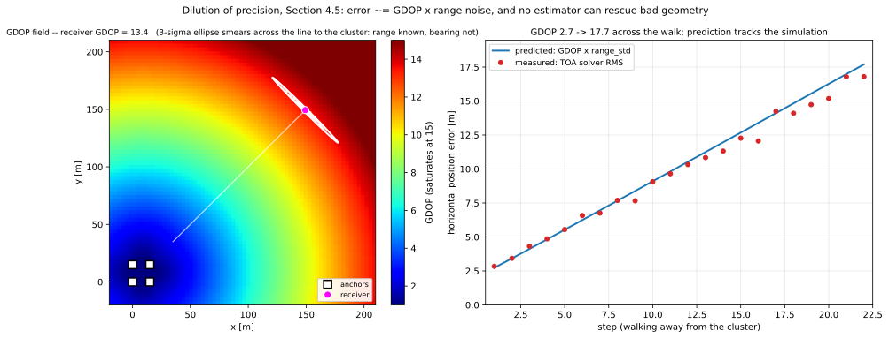
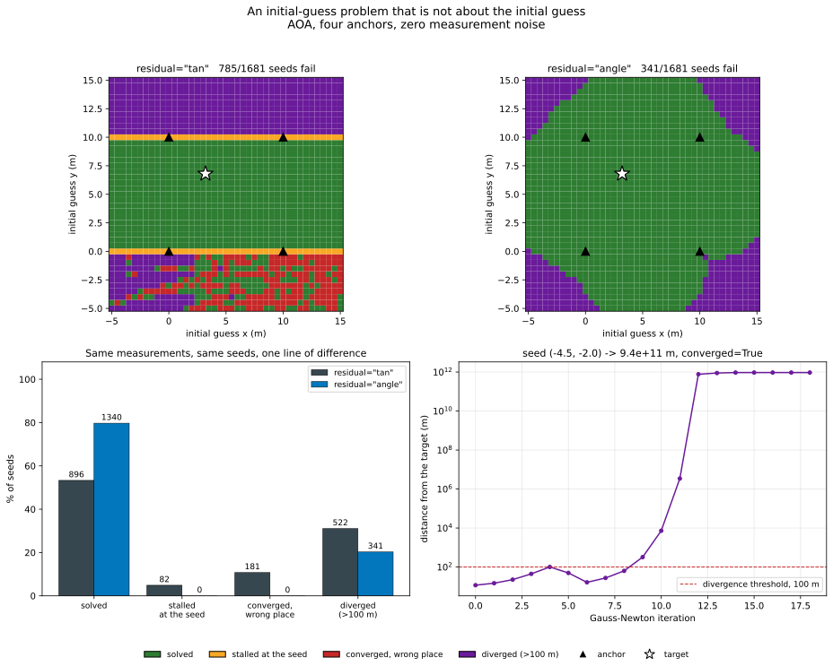
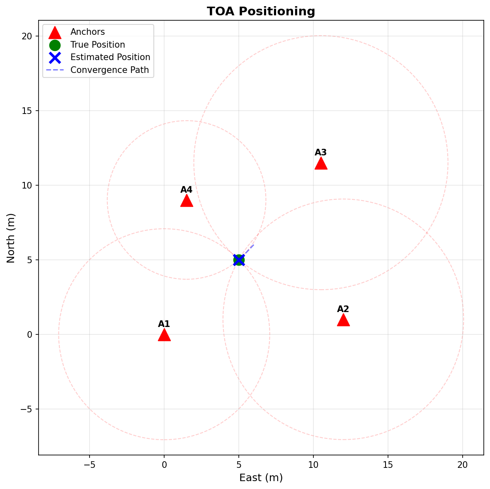
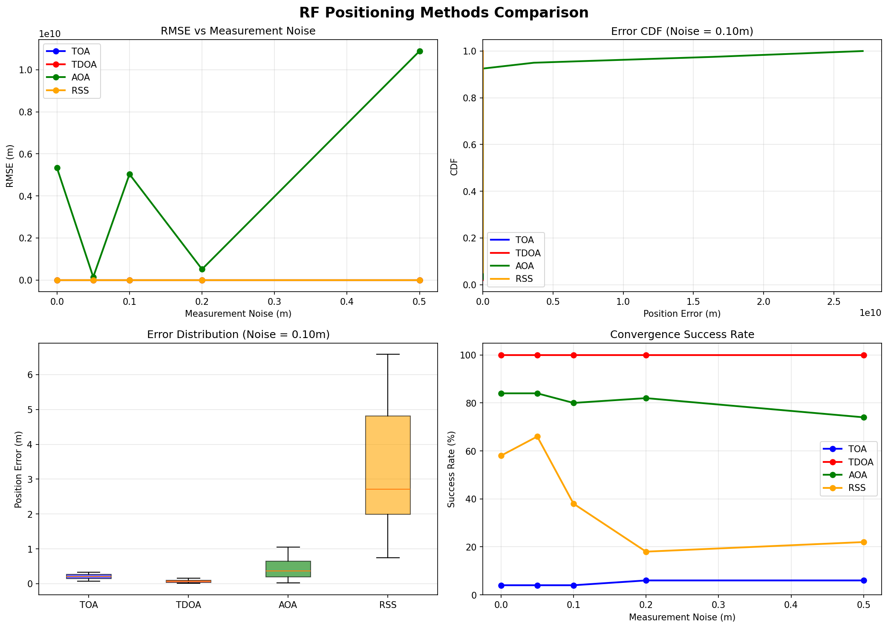
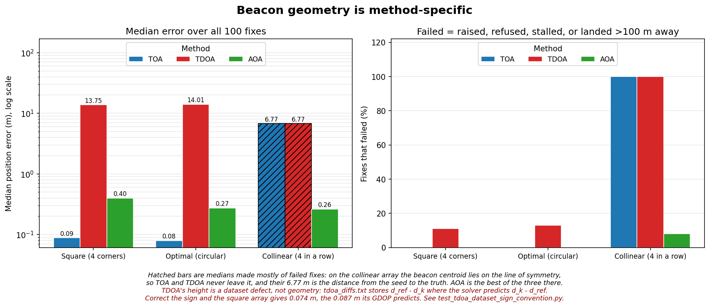
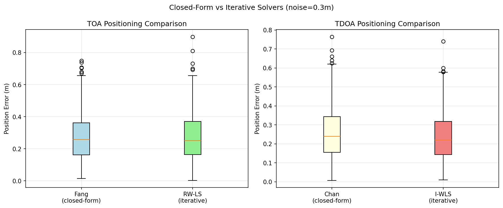
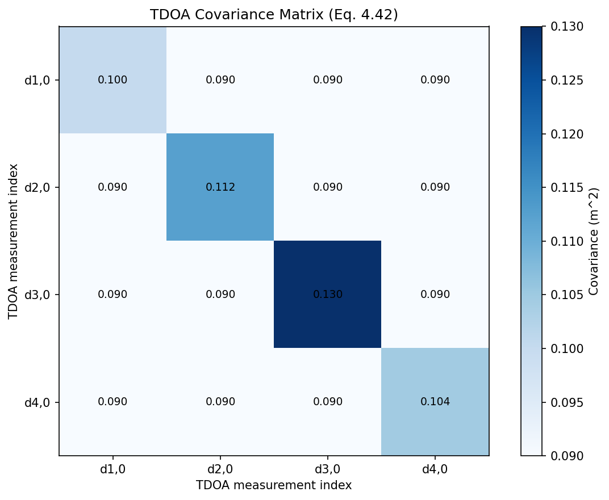
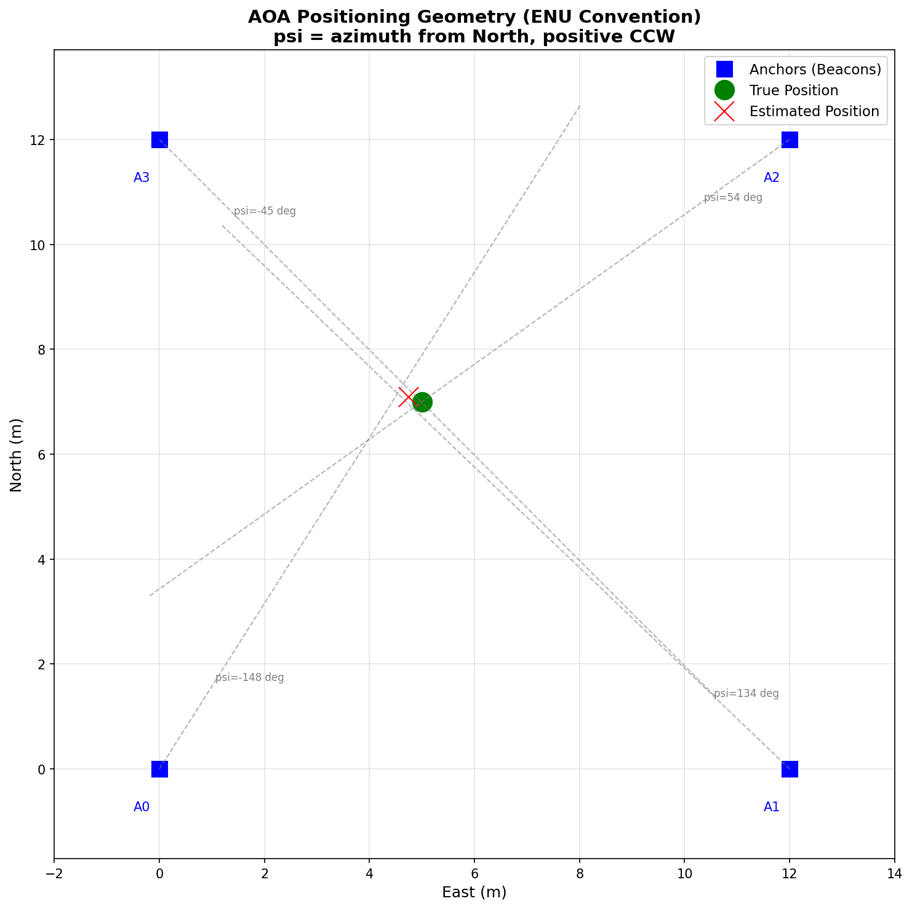
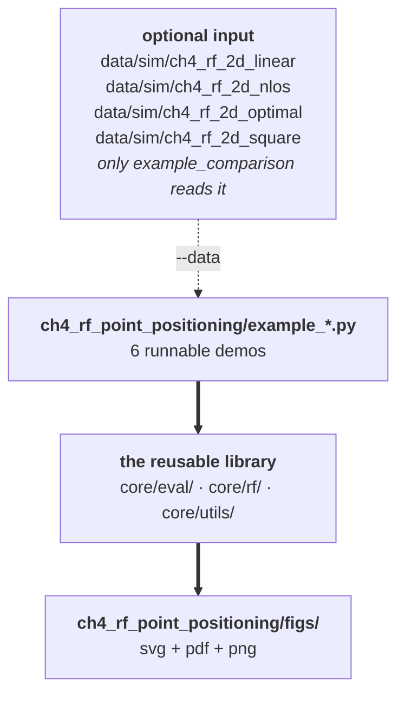

# Chapter 4: RF Point Positioning

[](https://colab.research.google.com/github/IPNL-POLYU/IPIN-Examples/blob/main/notebooks/ch4_rf_positioning.ipynb)

Run this chapter in your browser — every figure below is one you can
regenerate and change. No install: [`notebooks/ch4_rf_positioning.ipynb`](../notebooks/ch4_rf_positioning.ipynb)

## Overview

This module implements RF (Radio Frequency) positioning algorithms described in **Chapter 4** of *Principles of Indoor Positioning and Indoor Navigation*. It provides simulation-based examples of various RF positioning techniques including TOA, TDOA, AOA, and RSS-based positioning.

## Quick Start

```bash
# Run individual examples
python -m ch4_rf_point_positioning.example_toa_positioning
python -m ch4_rf_point_positioning.example_tdoa_positioning
python -m ch4_rf_point_positioning.example_aoa_positioning

# Dilution of precision: walk away from the anchors (add --animate)
python -m ch4_rf_point_positioning.example_dop_geometry

# Sweep the initial guess over the floor, under two residual parameterisations
python -m ch4_rf_point_positioning.example_initial_guess_basin

# Run with pre-generated datasets
python -m ch4_rf_point_positioning.example_comparison --data ch4_rf_2d_square
python -m ch4_rf_point_positioning.example_comparison --data ch4_rf_2d_nlos

# Compare different beacon geometries
python -m ch4_rf_point_positioning.example_comparison --compare-geometry

# Run comprehensive comparison of all RF methods (inline data)
python -m ch4_rf_point_positioning.example_comparison
```

## Dilution of precision: geometry sets the error floor (Section 4.5)

| Figure | Built by | Size |
|--------|----------|------|
| `ch4_dop_geometry.{svg,pdf,png}` | `example_dop_geometry.py` | — |
| `ch4_dop_geometry.gif` | `example_dop_geometry.py --animate` | 1.06 MB |



DOP is the factor by which anchor geometry amplifies range noise into position
error: **position error ≈ DOP × range noise**. It is a property of where the
anchors are relative to you, and it is what a single number cannot convey.

The example clusters four anchors in one corner — all the beacons in one room —
and walks a receiver away down a corridor. As it recedes, every anchor lies in
nearly the same direction, angular diversity collapses, and GDOP at the
receiver climbs from **2.7 beside the cluster to 17.7 far away**. The left panel
shows the GDOP field (fixed by the anchor positions) with the receiver's
3σ error ellipse; the ellipse is elongated *perpendicular* to the line back to
the cluster. Each range pins the distance to an anchor, and with every anchor
in nearly the same direction the geometry resolves distance-to-the-cluster well
but bearing poorly — so the fix smears sideways along an arc, not along the line
of sight.

Two things are measured, not asserted:

- **DOP predicts real error.** At each step a Monte-Carlo cloud of actual
  iterative-least-squares TOA fixes is compared with GDOP × range_std. The two
  agree to a mean of **3.5%** across the walk (e.g. GDOP 5.03 predicts 5.03 m,
  the solver gives 5.13 m; GDOP 14.87 predicts 14.87 m, gives 14.59 m).
- **No estimator can rescue bad geometry.** The solver is optimal and the noise
  is fixed, yet the position error grows **6×** across the walk — purely
  because the anchors are in the wrong place.

## The initial guess, and why it is usually the wrong thing to blame (Section 4.4)

| Figure | Built by | Size |
|--------|----------|------|
| `ch4_initial_guess_basin.{svg,pdf,png}` | `example_initial_guess_basin.py` | — |



When an iterative solve fails, the reflex is to blame the starting point. This example holds
the geometry at the well-behaved square, fixes one target, sets the measurement noise to
**zero**, and sweeps the initial guess over 1681 seeds — twice, changing nothing but the
space the residual is formed in.

| | |
|---|---|
| `residual="tan"` | `z = tan(ψ)`, Eq. (4.64) written literally |
| `residual="angle"` | `wrap(ψ − atan2(ΔE, ΔN))` — the default |

The tan form carries two defects no starting point repairs. `tan` has period π, so an anchor
ahead and an anchor behind give the same measurement; and as the estimate runs to infinity
every bearing converges, so the tan residuals *shrink* on the way out. Infinity is an
attractor, and the iteration arrives there reporting success — the worst silent failure of
the sweep, the seed at (12.0, 12.0), walked to **4.43 × 10¹² m in 14 iterations with
`converged=True`**. The example traces it and prints the seed, so this line is checkable
against the run rather than remembered from one.

Measured over the sweep:

| | `tan(ψ)` | `wrap(angle)` |
|---|---:|---:|
| seeds that fail | 785 / 1681 | 341 / 1681 |
| **quiet:** stalled at the seed, or stopped somewhere plausible | **263** | **0** |
| loud: walked off past 100 m | 522 | 341 |
| failures that still reported `converged=True` | 308 | 182 |

So the honest headline is 2.3× fewer failures, and a sharper claim underneath it: the
wrapped-angle form removes the **quiet** class completely — the failures that look like
answers — while a seed far outside the room still walks off under either parameterisation.

**Fixing the residual makes the solver honest, not safe.** The convergence flag is not a
check either way, which is why `core.rf.solve_batch`'s four conditions are not optional. Two
questions catch both defects, and they are worth asking of any residual: *is it bounded?* and
*does the cost stay large when the estimate is far wrong?*

## 📂 Dataset Connection

| Example Script | Dataset | Description |
|----------------|---------|-------------|
| `example_comparison.py` | `data/sim/ch4_rf_2d_square/` | Square geometry (4 corners) - good baseline |
| `example_comparison.py` | `data/sim/ch4_rf_2d_optimal/` | Circular geometry - lowest AOA sensitivity of the two enclosing layouts (11.54 against 15.04 m/rad) |
| `example_comparison.py` | `data/sim/ch4_rf_2d_linear/` | Collinear array - worst for TDOA (GDOP 11.95); lowest AOA sensitivity (9.25 m/rad) but the *worst* dimensionless AOA DOP (1.13) |
| `example_comparison.py` | `data/sim/ch4_rf_2d_nlos/` | Square + NLOS bias on 2 of 4 beacons - degrades range *and* bearing |

**Load dataset manually:**
```python
import numpy as np
import json
from pathlib import Path

path = Path("data/sim/ch4_rf_2d_square")
beacons = np.loadtxt(path / "beacons.txt")
positions = np.loadtxt(path / "ground_truth_positions.txt")
toa_ranges = np.loadtxt(path / "toa_ranges.txt")
tdoa_diffs = np.loadtxt(path / "tdoa_diffs.txt")
aoa_angles = np.loadtxt(path / "aoa_angles.txt")
gdop_toa = np.loadtxt(path / "gdop_toa.txt")
config = json.load(open(path / "config.json"))
```

## Usage Examples

### TOA Positioning

**One-way TOA assumes the clocks are already synchronised**, and this is the
assumption to state before any number below it. Turning a measured time of
flight into a range means treating the transmit epoch as known, so at c every
nanosecond of unmodelled offset is 0.30 m of range error — and a free-running
consumer oscillator at a few ppm reaches tens of nanoseconds in well under a
second. A demonstration that reports 0.1 m of *measurement* noise has said
nothing about the clock, which is the larger term in practice.

The table below sets one-way TOA beside the three answers Chapter 4 gives to
it. They are different kinds of answer — one buys infrastructure, one spends a
degree of freedom, one changes the protocol — and the clock column is the one
to read first:

| Approach | Clock requirement | Cost | Where |
|----------|-------------------|------|-------|
| One-way TOA | transmitter and receiver **synchronised** | a synchronisation protocol in the infrastructure | Eq. (4.1)-(4.3) |
| One-way TOA + clock bias | none, but needs one extra measurement | one degree of freedom (position DOP rises) | Eq. (4.24)-(4.26) |
| **Two-way TOA (RTT)** | **none** — both timestamps are on one clock | the responder's turnaround time must be calibrated | Eq. (4.6)-(4.9) |
| TDOA | transmitters synchronised with each other, not with the receiver | no accuracy gain over TOA-with-an-estimated-clock — the same information | Eq. (4.27)-(4.42) |

`example_toa_positioning`'s Example 7 runs the first three on one anchor array
with one timing budget, so the comparison is between protocols rather than
between one protocol's assumptions and another's physics.

```python
import numpy as np
from core.rf import TOAPositioner

# Define anchor layout (square)
anchors = np.array([[0, 0], [10, 0], [10, 10], [0, 10]], dtype=float)

# True position and compute ranges
# These are ranges, not pseudoranges: writing them this way is itself the
# synchronisation assumption. With an unknown receiver clock they would each
# carry a common c*dt, and the solver below could not see it.
true_pos = np.array([5.0, 5.0])
ranges = np.linalg.norm(anchors - true_pos, axis=1)

# Solve using iterative LS (book default: Eq. 4.20)
positioner = TOAPositioner(anchors, method='iterative_ls')
estimated_pos, info = positioner.solve(ranges, initial_guess=np.array([6.0, 6.0]))

print(f"True position: {true_pos}")
print(f"Estimated: {estimated_pos}")
print(f"Error: {np.linalg.norm(estimated_pos - true_pos):.3f} m")
```

**Implements:** Eq. (4.14)-(4.23)

### RSS-Based Ranging

The RSS path-loss model follows book Eqs. (4.10)-(4.13):
- **Eq. 4.10**: Forward model: `p_R = p_ref - 10*η*log10(d/d_ref)`
- **Eq. 4.11**: Inverse model: `d = d_ref * 10^((p_ref - p_R) / (10*η))`
- **Eq. 4.12**: Fading: `p̃_R = p_R + ω_long(x) + ω_short(t)`
- **Eq. 4.13**: Distance error (general form):
  ```
  d̃ = d * 10^(-(ω_long + ω_short) / (10*η))
    = d * 10^(-ω_long / (10*η)) * 10^(-ω_short / (10*η))
  ```

**Note on Eq. 4.13:** The book's derivation shows only `ω_long` in the final formula because
it assumes `ω_short(t)` is mitigated by time-averaging multiple RSS samples. After sufficient
averaging, ω_short → 0 in expectation, leaving only the location-dependent `ω_long` term.
**Our implementation uses the full formula** (both terms) to accurately model the residual
short-term fading when averaging is limited or disabled.

**Fading Model Details (Eq. 4.12):**

| Fading Type | Distribution | Domain | Reducible by Averaging? |
|-------------|--------------|--------|-------------------------|
| **ω_long(x)** Long-term | Gaussian `N(0, σ_long²)` | dB (log power) | No (location-dependent) |
| **ω_short(t)** Short-term | Rayleigh amplitude | Linear amplitude | Yes (time-varying) |

**Short-term Fading Models:**
- `"rayleigh"` (default, book-faithful): Amplitude A ~ Rayleigh(σ), power P = A²
- `"gaussian_db"`: Gaussian noise directly in dB domain (legacy)
- `"none"`: Disable short-term fading

**Physical Interpretation:**
- Rayleigh fading models multipath propagation when no dominant LOS path exists
- The amplitude A follows Rayleigh distribution, power P = A² follows exponential
- In dB: the fading has asymmetric distribution with negative mean (~-2.5 dB below mean power)
- Averaging multiple samples reduces variance by combining independent fading realizations

```python
from core.rf import (
    rss_pathloss,
    rss_to_distance,
    simulate_rss_measurement,
    rss_fading_to_distance_error,
)

# RSS at 10m with p_ref=-40dBm @ 1m, path-loss exponent eta=2.5
p_ref_dbm = -40.0  # Reference RSS at d_ref=1m
rss = rss_pathloss(p_ref_dbm=p_ref_dbm, distance=10.0, path_loss_exp=2.5)
print(f"RSS at 10m: {rss:.2f} dBm")  # -65.00 dBm

# Invert to estimate distance (Eq. 4.11)
distance_est = rss_to_distance(rss_dbm=rss, p_ref_dbm=p_ref_dbm, path_loss_exp=2.5)
print(f"Estimated distance: {distance_est:.2f} m")  # 10.00 m

# Simulate RSS with Rayleigh short-term fading (Eq. 4.12)
anchor = np.array([0.0, 0.0])
agent = np.array([10.0, 0.0])
rss_meas, info = simulate_rss_measurement(
    anchor, agent,
    p_ref_dbm=-40.0,
    path_loss_exp=2.5,
    sigma_long_db=6.0,         # Long-term fading std (typical: 4-8 dB)
    sigma_short_linear=0.707,  # Rayleigh scale σ (normalized: 1/sqrt(2))
    n_samples_avg=5,           # Average 5 samples to reduce short-term fading
    short_fading_model="rayleigh",  # Book-faithful Rayleigh fading
)
print(f"True RSS: {info['rss_true']:.1f} dBm, Measured: {rss_meas:.1f} dBm")
print(f"Long-term fading: {info['omega_long_db']:.2f} dB")
print(f"Short-term fading (after avg): {info['omega_short_db']:.2f} dB")
print(f"Distance error factor: {info['distance_error_factor']:.2f}x")

# Direct fading-to-distance-error conversion (Eq. 4.13)
# Takes TOTAL fading (ω_long + ω_short) as input
# +6 dB total fading -> underestimate distance, -6 dB -> overestimate
total_fading = info['omega_long_db'] + info['omega_short_db']
factor = rss_fading_to_distance_error(omega_db=total_fading, path_loss_exp=2.5)
print(f"Total fading {total_fading:.1f} dB -> {factor:.2f}x distance")
```

**Distance Error Factor:**
- `distance_error_factor` in `info` dict uses **total fading** (ω_long + ω_short)
- `rss_fading_to_distance_error()` converts any fading value (dB) to multiplicative error
- After averaging many samples, ω_short → 0, so error is dominated by ω_long

**Averaging Effect on Short-term Fading:**
- n=1: Full Rayleigh variance (~5-6 dB std in power)
- n=5: Variance reduced by ~sqrt(5), improved stability
- n=10+: Further reduction, approaching long-term fading limit (ω_short ≈ 0)

**Implements:** Eqs. (4.10)-(4.13)

### TDOA Positioning

```python
from core.rf import TDOAPositioner

anchors = np.array([[0, 0], [10, 0], [10, 10], [0, 10]], dtype=float)
true_pos = np.array([5.0, 5.0])

# Compute TDOA measurements (relative to anchor 0)
dist_ref = np.linalg.norm(true_pos - anchors[0])
tdoa = [np.linalg.norm(true_pos - anchors[i]) - dist_ref for i in range(1, len(anchors))]
tdoa = np.array(tdoa)

# Solve
positioner = TDOAPositioner(anchors, reference_idx=0)
estimated_pos, info = positioner.solve(tdoa, initial_guess=np.array([6.0, 6.0]))
```

**Implements:** Eq. (4.27)-(4.42)

## Expected Output

### TOA Positioning Example

Running `python -m ch4_rf_point_positioning.example_toa_positioning` produces:

<!-- example-output: ch4_rf_point_positioning.example_toa_positioning -->
```
Example 1: TOA Positioning with Perfect Measurements
======================================================================
...
True position: [5. 5.]

Assumption: one-way TOA as solved here needs the beacon and agent
  clocks already synchronised -- that is what turns a measured time
  of flight into a range. At c, 1 ns of unmodelled offset is 0.300 m
  of range error. Example 3 estimates the offset; Example 7 prices
  the assumption against two-way TOA, which does not need it.
...
Estimated position: [5.00000012 5.00000012]
Position error: 0.000000 m
Converged: True
Iterations: 3
...
Example 2: TOA Positioning with Measurement Noise
======================================================================
True position: [3. 7.]
Range noise std: 0.1 m  (0.33 ns; clocks still assumed synchronised)
...
Position error: 0.055 m   <- ONE noise draw, not an accuracy
...
Over 2000 noise draws, against Eq. (4.107):
  HDOP for this geometry : 1.010
  predicted HDOP x sigma : 0.1010 m
  measured RMS error     : 0.1012 m  (1.00x predicted)
  a single draw lands anywhere in [0.032, 0.154] m (10th-90th percentile)
...
Example 7: One-Way vs Two-Way TOA Under One Timing Budget
======================================================================

Anchors: 20 m square, agent at [ 8. 12.], all solves seeded at [10. 10.]

One timing budget, three protocols:
  per-timestamp jitter sigma_t     : 1.000 ns
  receiver clock offset b (case B) : 20.0 ns = 5.996 m
  turnaround residual (case C)     : 1.000 ns

Range noise, derived from sigma_t rather than chosen per case:
  one-way : sigma_range = c*sigma_t                  = 0.2998 m
  two-way : sigma_RTT = sqrt(2*st^2 + sp^2)          = 1.7321 ns
            sigma_range = c*sigma_RTT/2              = 0.2596 m   (0.866x one-way)
...
Zero-noise sanity (sigma_t = 0, b = 0, turnaround residual = 0):
  A and B(i) 0.000000 m   B(ii) 0.000000 m (bias 0.000000 m)   C 0.000000 m

Case B(i): what 20 ns of unmodelled offset does:
  linearised prediction b*||(H'H)^-1 sum(u_i)|| : 1.1323 m
  measured, noiseless                           : 1.6976 m
...
  case                                     median     RMSE  failed  predicted
  A     one-way, clocks synchronised       0.2518   0.3018       0     0.3000
  B(i)  one-way, offset, position only     1.7978   1.8416       1     1.7239
  B(ii) one-way, offset, clock solved      0.2545   0.3039       0     0.3014
  C     two-way RTT, no sync needed        0.2148   0.2613       0     0.2598
```

Note what the example does with that single draw: it prints it, labels it as
one draw rather than an accuracy, and then reports the Monte-Carlo RMS beside
the DOP prediction it should match. 0.1012 m measured against 0.1010 m
predicted is the actual claim; the 0.055 m above it is a sample that happens to
land low, and the percentile range says how little that means.

**Example 7 is the one to read against Example 2.** Examples 1 and 2 solve
one-way ranges at 0.1 m of measurement noise with the clocks assumed already
synchronised; drop that assumption and keep everything else, and the same
protocol on the same array lands 1.80 m out. Two-way TOA, on the same
per-timestamp jitter, lands at 0.21 m without needing the assumption at all.
One-way can recover by estimating the offset instead (Eqs. 4.24-4.26), which
costs one degree of freedom — 1.0053 of position DOP against 1.0007, and the
0.2545 m column above. That is the whole case for two-way TOA, and it is a
case about clocks rather than about accuracy: the sqrt(2) by which C also
out-ranges A is bookkeeping the example derives and prices, not a claim that a
round trip measures distance better.

**Visual Output:**



*This figure shows the TOA positioning geometry with anchors (red triangles), true position (green circle), estimated position (blue X), and range circles (dashed red). The convergence path shows the iterative solver approaching the true position.*

### RF Methods Comparison

Running `python -m ch4_rf_point_positioning.example_comparison` generates a comprehensive comparison:

The left four columns are the noise injected at each level; the middle columns
are the resulting median position error over all 50 fixes; the right two count
the fixes that failed. One draw is not a measurement, so this table reports
medians rather than the single realisation it used to — see
`.cursor/rules/030-figures-and-claims.mdc`.

<!-- example-output: ch4_rf_point_positioning.example_comparison -->
```
Results Summary (median error in metres)
======================================================================
  Clock bias: 1.5 m (TOA only; cancels in TDOA)
  RSS config: Rayleigh short-term (sigma=0.5), 5 samples averaged
  AOA anchor 3 is 10x noisier than the others; 'AOA unw' solves the same bearings unweighted
Level  TOA(m)    TDOA(m)   AOA(deg)  RSS(dB)   TOA       TDOA      AOA       AOA unw   RSS       AOA fail  RSS fail
--------------------------------------------------------------------------------------------------------------------
1      0.00      0.00      0.0       0.0       0.000     0.000     0.000     0.000     1.652     0         ~
2      0.05      0.05      1.0       2.0       0.044     0.047     0.121     0.355     2.219     0         ~
3      0.10      0.10      3.0       4.0       0.088     0.091     0.384     1.430     3.246     0         ~
4      0.20      0.20      5.0       6.0       0.162     0.175     0.519     2.433     4.029     0         ~
5      0.50      0.50      10.0      8.0       0.507     0.567     1.129     7.026     8.045     ~         ~
```

The two fail columns carry `~` because they are integer counts with no
tolerance to give: a fix "fails" partly on whether an iterative solve reached a
1e-6 m step inside its budget, and that is exactly the kind of thing a
different LAPACK moves by one. The medians beside them are pinned. On this
machine the RSS column reads 21, 19, 26, 34, 38 of 50 and AOA's level 5 reads
4 — none of them the >100 m kind, which is `[0, 0, 0, 0, 0]` and printed under
the table.

**TOA reads 0.000 m at level 1 because it now estimates the clock.** The
comparison injects a shared 1.5 m receiver bias into the TOA pseudoranges, and
that term is unobservable to a position-only solver: no `(x, y)` makes four
uniformly inflated ranges consistent, so the residual never reached `tol` and
the solve was thrown away. The convergence panel of the figure below reported
**2-5 of 100** for TOA at every noise level, which is a property of the harness
and not of the method — and the survivors were the geometries where the bias
could be partly absorbed *into the position*, so they were the least-inaccurate
rather than the accurate ones. The tell was this table's own top row: 0.153 m
of error on **noiseless** measurements, where TDOA and AOA both printed 0.000.

The fix was one already in `core.rf`: `toa_solve_with_clock_bias`, which is
Eqs. (4.24)-(4.26) — the state is `(x, y, c*dt)` instead of `(x, y)`. Every
solve converges now, the bias comes back as +1.500 m on noiseless data, and TOA
tracks TDOA across the sweep at the small penalty of the extra unknown. That is
the comparison Chapter 4 is for: **TOA has to carry the clock, TDOA differences
it away.**

Both fail columns count `core.rf.solve_batch`'s four conditions — raised,
reported `converged=False`, never left the seed, or landed over 100 m away —
and every median above is over all 50 fixes *including* those. That is the
point of reporting them separately. **The RSS series in the figure used to be
an RMSE over the fixes that reported convergence**, which at 6 dB was 13 of 50:
the panel drew the accuracy of the quarter of the sample that happened to fit,
next to a table whose RSS column already reported a median. This is the same
defect that was found and fixed for TOA in this file once before; it survived
in the RSS branch because RSS is *expected* to be inaccurate, so a plausible
number there attracts no second look.

None of the failures is the >100 m kind: the example prints that count
separately and it reads `[0, 0, 0, 0, 0]` for AOA. It did not always — solving
on `z = tan(psi)` as Eq. (4.64) is written literally made infinity an attractor
the solver reported as convergence, so 8 of 39 converged solves were wrong, at
zero angular noise. `AOAPositioner` now forms its residuals as
`wrap(psi - atan2(dE, dN))`. The example prints the full explanation.

`AOA unw` solves **the same bearings** as `AOA`, which is new: the two columns
used to draw independent noise, so the weighting gain the table invites you to
read was a ratio between two different noise realisations.

**Visual Output:**



*This figure shows four subplots comparing RF positioning methods:*
- **Top-Left:** median error over every fix, against the noise **level index**
  1–5. The x-axis is an index and not a distance because the four methods have
  four schedules in three different units; each series carries its own in the
  legend. They used to be drawn at TOA's metre positions under an axis labelled
  "Measurement Noise (m)", which put AOA's 10° at x = 0.5 m.
- **Top-Right:** error CDF at level 3 — the panel title names all four methods'
  noise there, rather than only TOA's. TOA/TDOA/AOA are sub-metre; RSS spreads
  past 12 m.
- **Bottom-Left:** error distribution at level 3 — RSS has far higher variance.
- **Bottom-Right:** fixes solved, on the same four conditions as the table.
  TOA and TDOA hold 100% across the sweep, AOA falls to 92% at level 5, and RSS
  runs 58% down to 23%. This is where the failures live, so that the panel
  above it can be an accuracy.

### Geometry is method-specific (`--compare-geometry`)

```bash
python -m ch4_rf_point_positioning.example_comparison --compare-geometry
```



Median error over all 100 fixes, with the fixes that failed in brackets. A fix
has failed if it raised, reported `converged=False`, never left its initial
guess, or landed over 100 m away — the same four conditions the dataset
generator writes into each `config.json`.

| Geometry | TOA | TDOA | AOA |
|---|---|---|---|
| Square (4 corners) | 0.088 m [0] | 0.092 m [0] | 0.397 m [0] |
| Optimal (circular) | 0.079 m [0] | 0.121 m [0] | 0.273 m [0] |
| Collinear (4 in a row) | 6.770 m [100] | 6.770 m [100] | **0.262 m** [8] |

The collinear array is not simply the bad one, which is why the label no longer
says "poor". It is bad for ranges and the best of the three for bearings:

- TOA and TDOA fail on all 100 fixes **from the beacon centroid**, which sits
  on the line of symmetry. Moving across that line changes no range to first
  order, so the Jacobian is rank deficient there and Gauss-Newton has nowhere
  to step. Their 6.770 m is the distance from the seed to the truth — a
  property of the seed, not of the measurements.
- Seeded off the line they solve, but ranges still cannot separate a target
  from its mirror image about the beacon line, so half the fixes land on the
  wrong side. [`data/sim/ch4_rf_2d_linear`](../data/sim/ch4_rf_2d_linear/README.md)
  measures both halves.
- AOA is *better* here than on the square array — 0.262 m against 0.397 m —
  because reflecting a position flips every azimuth: bearings carry the side
  information ranges do not. Its eight failures are the grid rows within 1 m
  of the beacon line, where all four bearings are nearly parallel. Note that
  the accuracy half of that advantage is mostly lever arm rather than
  geometry: dimensionless, this array's AOA DOP is the worst of the three
  (1.13 against 1.00), as the table below sets out.

**And "Optimal" does not win a single GDOP column outright**, which is the
same lesson from the other end. Mean DOP by dataset:

| Geometry | TOA | TDOA | AOA sensitivity (m/rad) | AOA DOP (dimensionless) |
|---|---|---|---|---|
| Square (4 corners) | 1.02 | 1.07 | 15.04 | 1.00 |
| Optimal (circular) | 1.02 | 1.34 | 11.54 | 1.01 |
| Collinear (4 in a row) | **1.43** | 11.95 | 9.25 | **1.13** |

It ties the square for TOA and is clearly *worse* than it for TDOA. The name
describes a layout, not a ranking.

**The AOA column needs two entries because the first one carries units.** The
AOA geometry rows are `[-dy/d^2, dx/d^2]`, in 1/m, so `sqrt(trace (H^T H)^-1)`
comes out in **metres per radian** — a sensitivity, not a dilution factor.
15.04 m/rad x 2 deg = 0.525 m is what it supports; "15x worse than TOA's 1.02"
is not, because those are different quantities. `config.json` names it
`dop.aoa_sensitivity_m_per_rad` for that reason.

The fourth column divides by the mean beacon range at each position, which
restores a pure number comparable to the TOA and TDOA columns — and it
reverses the ranking. On m/rad the collinear array looks like the *best* of the
three for bearings; dimensionless it is the worst, at 1.13 against 1.00 and
1.01. Its beacons simply sit closer to the query grid (mean range about 8 m
against 15 m for the square), and a shorter lever arm turns the same angular
error into fewer metres. **The geometry is not better; the arm is shorter.**
That the other two land within 1% of each other, and of their own TOA GDOP, is
the honest statement: for these enclosing layouts a bearing is worth about as
much as a range once the lever arm is accounted for.

And DOP sees none of it. TOA GDOP on the collinear array averages 1.43 against
1.02 for the square — a local, first-order measure calling the configuration
fine, while the ambiguity that breaks it is global. **A healthy DOP is
necessary, not sufficient.**

Where DOP *does* work, it works well: on the square and circular arrays all
three methods land on `sigma_position = GDOP x sigma_range` to within the
difference between a median and an RMS. The first two rows of the table are a
DOP prediction being confirmed; only the third row is DOP being wrong.

**The TDOA column used to read 0.87 on the square, and that was a defect, not
a result.** A DOP below TOA's says TDOA extracts more from the same beacons
than TOA does, which differencing cannot do — it is a projection, and a
projection throws information away. Two things produced it, and both are
fixed: the generator drew an independent error for each range *difference*,
deleting the reference beacon's error that all of them share (Eq. 4.42), and
`compute_dop` was then called with `W = I`, which is the right weighting only
for uncorrelated measurements. With `W = C^-1` the number is 1.07, and the
identity underneath it is the one worth remembering:

> **TDOA and TOA-with-an-unknown-clock carry the same information.** The
> clock is exactly the common mode that differencing removes, so the two
> position DOPs are equal to machine precision at every one of the 100 grid
> points — 1.0665 on the square array, against 1.0219 for TOA with a *known*
> clock. TDOA's advantage is not accuracy. It is that the transmitters need
> no synchronised clock with the receiver, which is why it is what real
> broadcast systems use.

## Equation Reference

### TOA (Time of Arrival) Positioning

| Function | Location | Equation | Description |
|----------|----------|----------|-------------|
| `toa_range()` | `core/rf/measurement_models.py` | Eq. (4.1)-(4.3) | TOA range with clock bias (input: seconds) |
| `clock_bias_seconds_to_meters()` | `core/rf/measurement_models.py` | Eq. (4.24) | Convert Δt (s) to c*Δt (m) |
| `clock_bias_meters_to_seconds()` | `core/rf/measurement_models.py` | Eq. (4.24) | Convert c*Δt (m) to Δt (s) |
| `two_way_toa_range()` | `core/rf/measurement_models.py` | - | Geometric distance for RTT positioning |
| `rtt_to_range()` | `core/rf/measurement_models.py` | Eq. (4.7)-(4.8) | Convert RTT timing to range estimate |
| `simulate_rtt_measurement()` | `core/rf/measurement_models.py` | Eq. (4.9) | Simulate RTT with processing time and drift noise |
| `range_to_rtt()` | `core/rf/measurement_models.py` | - | Convert range to ideal RTT (inverse of rtt_to_range) |
| `TOAPositioner.solve()` | `core/rf/positioning.py` | Eq. (4.14)-(4.23) | Nonlinear TOA positioning via iterative LS/WLS |
| `toa_solve_with_clock_bias()` | `core/rf/positioning.py` | Eq. (4.24)-(4.26) | Joint position + clock bias (output: meters) |
| `toa_fang_solver()` | `core/rf/positioning.py` | Eq. (4.43)-(4.49) | Fang's closed-form TOA positioning (2D) |

**Clock Bias Unit Convention:**

| Context | Unit | Variable Name | Reason |
|---------|------|---------------|--------|
| Measurement model (`toa_range`) | **seconds** (Δt) | `clock_bias_s` | Physical timing domain |
| Positioning solver | **meters** (c*Δt) | `clock_bias_m`, `bias_m` | Book Eq. 4.24: Jacobian ∂h/∂(c*Δt) = 1 |

**Conversion:**
- 1 nanosecond ≈ 0.3 meters (one-way)
- `bias_m = c * bias_s` and `bias_s = bias_m / c`
- Use `clock_bias_seconds_to_meters()` and `clock_bias_meters_to_seconds()` for explicit conversions

```python
from core.rf import (
    toa_range, toa_solve_with_clock_bias,
    clock_bias_seconds_to_meters, clock_bias_meters_to_seconds,
    SPEED_OF_LIGHT
)

# Names carried on from the loading block above, so this runs as written.
anchors = beacons[:, :2]
anchor = anchors[0]
agent = positions[0]
ranges = toa_ranges[0]
# Three elements: this solver estimates position *and* clock bias jointly, so
# the initial guess is [x, y, bias_m]. A two-element guess raises ValueError.
initial = np.array([5.0, 5.0, 0.0])

# Measurement model: clock bias in SECONDS
clock_bias_s = 10e-9  # 10 nanoseconds
range_biased = toa_range(anchor, agent, clock_bias_s=clock_bias_s)

# Convert to meters for solver
clock_bias_m = clock_bias_seconds_to_meters(clock_bias_s)
print(f"10 ns = {clock_bias_m:.3f} m")  # ~3.0 m

# Solve: returns clock bias in METERS
pos, bias_m, info = toa_solve_with_clock_bias(anchors, ranges, initial)

# Convert back to seconds for interpretation
bias_s = clock_bias_meters_to_seconds(bias_m)
print(f"Estimated bias: {bias_s*1e9:.2f} ns")
```

**Two-Way TOA / RTT Model (Eqs. 4.6-4.9):**

**Why two-way exists:** both timestamps are taken on the *agent's own clock*,
so the departure and arrival epochs are read against the same time base and no
synchronisation with the beacon is required at all. That is the requirement
one-way TOA quietly assumes, and it is what two-way removes. What it costs
instead is a calibrated responder turnaround time, `Δt_proc` — which is why
Eq. (4.7) exists and why leaving it uncorrected below moves the range by 7.49 m.

The book's RTT model includes processing time and clock drift:
- Eq. 4.6: Basic RTT: `d = c * (Δt_to + Δt_back) / 2`
- Eq. 4.7: With processing: `d = c * (t_arrive - t_depart - Δt_proc) / 2`
- Eq. 4.8: With drift: `d = c * (t_arrive - t_depart - Δt_proc - Δt_drift) / 2`
- Eq. 4.9: With noise: `d̃ = ... + ω_proc + ω_drift`

**Timing-noise bookkeeping, and the factor of sqrt(2) in it.** With one
per-timestamp jitter `σ_t` describing the agent's clock, a one-way measurement
is a single receive timestamp against a scheduled transmit epoch, so
`σ_range = c·σ_t`. A round trip carries two timestamps on that one clock plus
the turnaround calibration residual `σ_proc`, so
`σ_RTT = sqrt(2·σ_t² + σ_proc²)`, and the range is *half* the round trip:
`σ_range = c·σ_RTT/2`. With `σ_proc = 0` that is `c·σ_t/sqrt(2)` — better than
one-way, because the round trip puts twice the distance into the interval being
timed while the jitter grows only as sqrt(2). The turnaround term buys it back,
and the two protocols range equally well at `σ_proc = sqrt(2)·σ_t`. Example 7
of `example_toa_positioning` prints this crossover rather than arguing it.

**Two-way does not thereby beat TDOA**, and nothing in this chapter claims it
does — see the DOP result further up, where TDOA and TOA-with-an-estimated-clock
carry the same information to machine precision. The axis two-way TOA wins on is
which clock somebody has to build.

```python
from core.rf import rtt_to_range, simulate_rtt_measurement, range_to_rtt

# Convert RTT measurement to range (Eq. 4.7-4.8)
rtt = 100e-9  # 100 nanoseconds measured RTT
processing_time = 20e-9  # 20ns beacon processing time
range_m = rtt_to_range(rtt, processing_time=processing_time)
print(f"Range: {range_m:.2f} m")  # ~12 m

# Simulate realistic RTT measurement with noise (Eq. 4.9)
anchor = np.array([0.0, 0.0, 0.0])
agent = np.array([15.0, 0.0, 0.0])
rtt, info = simulate_rtt_measurement(
    anchor, agent,
    processing_time=50e-9,       # 50ns nominal processing
    processing_time_std=5e-9,    # 5ns std dev
    clock_drift_std=1e-9,        # 1ns drift std
)
print(f"True range: {info['true_range']:.2f} m")
print(f"Estimated:  {info['range_estimate']:.2f} m")

# Convert known range to ideal RTT
rtt_ideal = range_to_rtt(15.0, processing_time=50e-9)
print(f"Ideal RTT: {rtt_ideal*1e9:.1f} ns")
```

**Key timing error effects:**
- 1 nanosecond timing error ≈ 0.15 meter range error (one-way)
- Processing time calibration is critical for accuracy
- TCXO clock drift typically ±1-2 ppm

**TOAPositioner Methods (Eqs. 4.14-4.23):**

The TOA equations are nonlinear, so positioning requires iterative linearization
(Taylor series expansion at current estimate, then update, repeat until convergence).

| Method | Weighting | Book Equation | Description |
|--------|-----------|---------------|-------------|
| `"iterative_ls"` (default) | W = I | Eq. (4.20) | Iterative LS with uniform weights |
| `"iterative_wls"` | W = Σ^{-1} | Eq. (4.23) | Iterative WLS with user-provided covariance |
| `"range_weighted"` | W_ii = 1/d_i² | - | Heuristic (not in book): down-weight far anchors |

```python
from core.rf import TOAPositioner

# Method 1: Iterative LS (book default, Eq. 4.20)
positioner = TOAPositioner(anchors, method="iterative_ls")
pos, info = positioner.solve(ranges, initial_guess=np.array([5.0, 5.0]))

# Method 2: Iterative WLS with known measurement covariance (Eq. 4.23)
sigmas = np.array([0.1, 0.2, 0.15, 0.1])  # range measurement stds
covariance = np.diag(sigmas**2)
positioner = TOAPositioner(anchors, method="iterative_wls")
pos, info = positioner.solve(ranges, np.array([5.0, 5.0]), covariance=covariance)
```

**Fang's Closed-Form TOA Solver (Eqs. 4.43-4.49):**

Fang's algorithm provides a non-iterative solution by linearizing the squared range equations:
- Forms linear system using squared range differences: d_i² - d_ref²
- Rearranges to: H_a * x_a = y_a (Eq. 4.48)
- Solves via least squares: x_a = (H_a^T H_a)^{-1} H_a^T y_a

```python
from core.rf import toa_fang_solver

# Perfect measurements
anchors = np.array([[0, 0], [20, 0], [20, 20], [0, 20]], dtype=float)
true_pos = np.array([8.0, 12.0])
ranges = np.linalg.norm(anchors - true_pos, axis=1)

# Fang's closed-form (no initial guess needed!)
position, info = toa_fang_solver(anchors, ranges, ref_idx=0)
print(f"Position: {position}")  # [8.0, 12.0]
```

**Properties:**
- Requires at least 3 anchors for 2D positioning
- Non-iterative: no initial guess required
- Sensitive to noise; no built-in filtering
- Well-suited for real-time applications

**Closed-Form vs Iterative Solvers Comparison:**



*This figure compares Fang's closed-form TOA solver with iterative WLS (left) and Chan's closed-form TDOA solver with iterative WLS (right) under 0.3m measurement noise. Both closed-form methods achieve comparable median accuracy to iterative solvers, but show slightly higher variance due to the lack of iterative refinement. Closed-form solvers excel when no initial guess is available or when computational speed is critical.*

### RSS (Received Signal Strength) Positioning

| Function | Location | Equation | Description |
|----------|----------|----------|-------------|
| `rss_pathloss()` | `core/rf/measurement_models.py` | Eq. (4.10) | Log-distance path-loss forward model |
| `rss_to_distance()` | `core/rf/measurement_models.py` | Eq. (4.11) | Invert RSS to estimate distance |
| `simulate_rss_measurement()` | `core/rf/measurement_models.py` | Eq. (4.10), (4.12) | Simulate RSS with Rayleigh/Gaussian fading |
| `rss_fading_to_distance_error()` | `core/rf/measurement_models.py` | Eq. (4.13) | Convert fading (dB) to distance error factor |

### TDOA (Time Difference of Arrival) Positioning

| Function | Location | Equation | Description |
|----------|----------|----------|-------------|
| `tdoa_range_difference()` | `core/rf/measurement_models.py` | Eq. (4.27)-(4.33) | TDOA range difference between anchor pairs |
| `tdoa_measurement_vector()` | `core/rf/measurement_models.py` | Eq. (4.27)-(4.33) | Stacked TDOA measurements |
| `TDOAPositioner.solve()` | `core/rf/positioning.py` | Eq. (4.34)-(4.42) | Linearized TDOA LS/WLS positioning |
| `build_tdoa_covariance()` | `core/rf/positioning.py` | Eq. (4.42) | Build correlated covariance matrix |
| `tdoa_chan_solver()` | `core/rf/positioning.py` | Eq. (4.50)-(4.62) | Chan's closed-form TDOA positioning (2D) |

**Chan's Closed-Form TDOA Solver (Eqs. 4.50-4.62):**

Chan's algorithm provides a two-step WLS solution using an auxiliary variable:
- State vector: x_a = [x_e, x_n, d_ref]^T (includes reference distance)
- Step 1: Initial LS solution using linearized system (Eq. 4.58-4.60)
- Step 2: WLS refinement with correlated covariance (Eq. 4.61-4.62)

```python
from core.rf import tdoa_chan_solver, build_tdoa_covariance

# Compute TDOA measurements
anchors = np.array([[0, 0], [20, 0], [20, 20], [0, 20], [10, 10]], dtype=float)
true_pos = np.array([8.0, 12.0])
ranges = np.linalg.norm(anchors - true_pos, axis=1)
d_ref = ranges[0]
tdoa = np.array([ranges[i] - d_ref for i in range(1, len(anchors))])

# Chan's closed-form (no initial guess needed!)
position, info = tdoa_chan_solver(anchors, tdoa, ref_idx=0)
print(f"Position: {position}")  # [8.0, 12.0]
print(f"Reference distance: {info['reference_distance']:.2f} m")

# With WLS using correlated covariance
sigmas = np.array([0.3, 0.1, 0.1, 0.1, 0.1])  # ref has higher noise
cov = build_tdoa_covariance(sigmas, ref_idx=0)
position_wls, info = tdoa_chan_solver(anchors, tdoa, ref_idx=0, covariance=cov)
```

**Properties:**
- Requires at least 4 anchors for 2D positioning
- Non-iterative: no initial guess required
- WLS refinement handles correlated TDOA noise (Eq. 4.62)
- Also estimates reference distance (d_ref)

**TDOA Covariance Structure (Eq. 4.42):**

For TDOA measurements z = [d^{1,ref}, d^{2,ref}, ..., d^{I-1,ref}]^T relative to reference anchor:
- **Diagonal terms:** var(d^{k,ref}) = σ_k² + σ_ref² (anchor k variance + reference variance)
- **Off-diagonal terms:** cov(d^{k,ref}, d^{m,ref}) = σ_ref² (shared reference anchor noise)

The off-diagonal correlation arises because all TDOA measurements share the same reference anchor.
Using identity weighting (ignoring correlation) leads to suboptimal estimates, especially when σ_ref is large.



*This heatmap visualizes the TDOA covariance matrix structure (Eq. 4.42). The diagonal elements (darker blue) represent var(d^{k,ref}) = σ_k² + σ_ref², combining each anchor's noise with the reference anchor's noise. The off-diagonal elements (lighter blue, all equal to σ_ref² ≈ 0.09) represent the correlation introduced by sharing the same reference anchor. This correlation structure is crucial for optimal WLS weighting—ignoring it leads to suboptimal position estimates.*

```python
from core.rf import build_tdoa_covariance, TDOAPositioner

# Re-derive the inputs rather than inheriting them. The five-anchor example
# above leaves its own `anchors` in scope, and TDOA wants exactly
# n_anchors - 1 measurements -- four anchors, three differences.
anchors = beacons[:, :2]
tdoa_measurements = tdoa_diffs[0]

# Per-anchor range noise (meters)
sigmas = np.array([0.5, 0.1, 0.1, 0.1])  # ref=0 has higher noise

# Build correlated covariance matrix
cov = build_tdoa_covariance(sigmas, ref_idx=0)
# Result: 3x3 matrix with diagonal = [0.26, 0.26, 0.26], off-diag = 0.25

# Use in TDOA positioning
positioner = TDOAPositioner(anchors, reference_idx=0)
estimated_pos, info = positioner.solve(
    tdoa_measurements, initial_guess=np.array([5.0, 5.0]),
    covariance=cov  # Pass correlated covariance
)
```

### AOA (Angle of Arrival) Positioning

| Function | Location | Equation | Description |
|----------|----------|----------|-------------|
| `aoa_sin_elevation()` | `core/rf/measurement_models.py` | Eq. (4.63) | sin(θ) = (x_u^i - x_u,a) / d |
| `aoa_tan_azimuth()` | `core/rf/measurement_models.py` | Eq. (4.64) | tan(ψ) = (x_e^i - x_e,a) / (x_n^i - x_n,a) |
| `aoa_azimuth()` | `core/rf/measurement_models.py` | Eq. (4.64) | Azimuth ψ = atan2(ΔE, ΔN) from North |
| `aoa_elevation()` | `core/rf/measurement_models.py` | Eq. (4.63) | Elevation θ = arcsin(ΔU / d) |
| `aoa_measurement_vector()` | `core/rf/measurement_models.py` | Eq. (4.65) | Stacked [sin(θ_i), tan(ψ_i)] measurements |
| `aoa_angle_vector()` | `core/rf/measurement_models.py` | - | Stacked raw angles [θ_i, ψ_i] |
| `AOAPositioner.solve()` | `core/rf/positioning.py` | Eq. (4.63)-(4.78) | I-WLS positioning with book Jacobians |
| `aoa_ove_solve()` | `core/rf/positioning.py` | Eq. (4.79)-(4.85) | OVE: 3D closed-form estimator |
| `aoa_ple_solve_2d()` | `core/rf/positioning.py` | Eq. (4.86)-(4.91) | PLE: 2D closed-form estimator |
| `aoa_ple_solve_3d()` | `core/rf/positioning.py` | Eq. (4.92)-(4.95) | PLE: 3D closed-form estimator |

**AOAPositioner I-WLS Jacobians (Eqs. 4.68-4.74):**

The `AOAPositioner` implements the book's I-WLS linearization using analytical Jacobians:

- **Elevation f_i = sin(θ_i) partial derivatives (Eqs. 4.68-4.70):**
  - ∂f/∂x_e,a = Δu·Δe / d³
  - ∂f/∂x_n,a = Δu·Δn / d³
  - ∂f/∂x_u,a = -(Δe² + Δn²) / d³

- **Azimuth g_i = tan(ψ_i) partial derivatives (Eqs. 4.72-4.74):**
  - ∂g/∂x_e,a = -1 / Δn
  - ∂g/∂x_n,a = Δe / Δn²
  - ∂g/∂x_u,a = 0

Where Δe = x_e^i - x_e,a, Δn = x_n^i - x_n,a, Δu = x_u^i - x_u,a, and d = ||x_a - x^i||.

**Book-Default AOA Weighting (W_a = Σ_a^{-1}):**

The `AOAPositioner.solve()` method supports book-default weighted least squares using
measurement noise parameters. When `sigma_psi` (and optionally `sigma_theta` for 3D)
are provided, the weight matrix W_a = Σ_a^{-1} is computed via first-order error propagation:

| Measurement | Error Propagation | Formula |
|-------------|-------------------|---------|
| sin(θ) | var(sin θ) ≈ cos²(θ) × var(θ) | Weight inversely proportional to variance |
| tan(ψ) | var(tan ψ) ≈ sec⁴(ψ) × var(ψ) | High variance near ψ = ±90° (down-weighted) |

This properly accounts for:
- **Heterogeneous noise**: Different measurement quality per anchor
- **Angle-dependent amplification**: tan(ψ) variance grows near ±90°

```python
from core.rf import AOAPositioner, aoa_angle_vector
import numpy as np

anchors = np.array([[0, 0], [10, 0], [10, 10], [0, 10]], dtype=float)
aoa = aoa_angle_vector(anchors, np.array([4.0, 6.0]))

positioner = AOAPositioner(anchors)

# Method 1: Identity weights (default when no sigma provided)
pos_unweighted, info1 = positioner.solve(aoa, initial_guess=np.array([5.0, 5.0]))

# Method 2: Book-default weighting with uniform azimuth noise (2°)
pos_weighted, info2 = positioner.solve(
    aoa, initial_guess=np.array([5.0, 5.0]),
    sigma_psi=np.deg2rad(2.0)
)

# Method 3: Heterogeneous noise per anchor
sigma_per_anchor = np.deg2rad([1.0, 2.0, 5.0, 10.0])
pos_hetero, info3 = positioner.solve(
    aoa, initial_guess=np.array([5.0, 5.0]),
    sigma_psi=sigma_per_anchor
)

# For 3D, also provide sigma_theta
# pos_3d, info = positioner.solve(aoa_3d, guess_3d,
#     sigma_theta=np.deg2rad(1.0), sigma_psi=np.deg2rad(2.0))
```

**Weight recomputation:** By default (`recompute_weights=True`), W_a is updated each
iteration using predicted angles at the current estimate. Set `recompute_weights=False`
to compute W_a once using the initial measurements.

**Closed-Form AOA Solvers:**

- **OVE (Orthogonal Vector Estimator)** - Eqs. 4.79-4.85:
  - 3D closed-form solution using orthogonal projection
  - Constructs unit direction vectors and solves via least squares
  - Biased estimator; error increases with distance and noise

- **PLE (Pseudolinear Estimator)** - Eqs. 4.86-4.95:
  - 2D: Line-of-bearing intersection via least squares (Eq. 4.89-4.91)
  - 3D: Two-step estimation (2D + elevation averaging, Eq. 4.92-4.95)
  - Biased; sensitive to **near-parallel bearings** and high noise. Aligned
    *beacons* are not by themselves the hazard — `example_aoa_positioning`'s
    Demo 7 measures four layouts on the same 500 draws and the collinear array
    lands within 30% of the square, because the agent stands 7 m off the line
    and the bearings are still 19.5° apart. What costs you is the bearing
    spread *at the agent*, and it costs you in proportion to range: on the
    line and inside the array PLE still reaches 0.10 m, while 30 m out along
    it the spread falls to 0.08° and the error is 22 m, almost all of it bias
    along the shared direction.
  - Often used as initial guess for iterative methods

**ENU Convention Notes:**
- Azimuth ψ is measured from North (+N), positive counterclockwise
- ψ = atan2(ΔE, ΔN) where ΔE = anchor_E - agent_E, ΔN = anchor_N - agent_N
- That equation is the **model angle from the agent toward each anchor**. In the
  plot below, the dashed line is drawn from each anchor toward the agent so the
  line of bearing is easy to see; its arrow direction is therefore reciprocal
  (ψ ± 180°) even though the label is the model angle.
- Elevation θ is positive when anchor is above agent
- Measurement vector uses sin(θ) and tan(ψ) for I-WLS linearization (Eq. 4.65)
- 2D mode: Uses tan(ψ) only (azimuth measurements)
- 3D mode: Uses [sin(θ_i), tan(ψ_i)] stacked (elevation + azimuth)



*This figure illustrates the AOA positioning geometry using the ENU
(East-North-Up) coordinate convention. Four anchors (A0-A3, blue squares) are
arranged in a rectangular grid, and the dashed gray lines are drawn from anchors
to the agent (green circle) as visual lines of bearing. The degree labels,
however, are the model azimuths ψ used by the solver: measured at the agent,
pointing toward each anchor, from North (+N direction), positive
counterclockwise. For example, A0 at (0,0) is labeled ψ≈-148° because the model
vector from the agent back to A0 points southwest; the dashed ray from A0 to the
agent points northeast, the reciprocal direction. A2 at (12,12) is labeled
ψ≈54° because the model vector from the agent to A2 points northeast, while the
drawn anchor-to-agent ray points southwest. The estimated position (red X)
closely matches the true position, demonstrating successful AOA
triangulation.*

### DOP (Dilution of Precision)

| Function | Location | Equation | Description |
|----------|----------|----------|-------------|
| `compute_geometry_matrix()` | `core/rf/dop.py` | Eq. (4.18) | Geometry (LOS) matrix H for DOP |
| `compute_dop()` | `core/rf/dop.py` | Eq. (4.103)-(4.108) | GDOP/PDOP/HDOP/VDOP computation |
| `compute_dop_map()` | `core/rf/dop.py` | Eq. (4.108) | DOP values over spatial grid |
| `position_error_from_dop()` | `core/rf/dop.py` | Eq. (4.107) | σ_position = DOP × σ_measurement |

**Book DOP Definitions (Eqs. 4.103-4.108):**

The position error covariance relates to measurement noise via the DOP matrix:
```
C(x_a) = (H_a^T H_a)^{-1} × σ_z²    (Eq. 4.103)
```

Defining Q = (H_a^T H_a)^{-1} with diagonal elements κ_ee, κ_nn, κ_uu:

| DOP Metric | Formula | Book Equation | Description |
|------------|---------|---------------|-------------|
| **GDOP** | √(κ_ee + κ_nn + κ_uu) = √(trace(Q)) | Eq. 4.107 | Overall 3D position |
| **HDOP** | √(κ_ee + κ_nn) | Eq. 4.108 | Horizontal position |
| **VDOP** | √(κ_uu) | Eq. 4.108 | Vertical position |
| **PDOP** | = GDOP (for pure positioning) | - | Position-only DOP |

**Fundamental DOP Relationship (Eq. 4.107):**
```
σ_position = DOP × σ_measurement
```

Where σ symbols are **standard deviations** (not variances):
- σ_z: measurement noise std (meters for TOA/TDOA)
- σ_position: position error std (meters)

**Example:** If HDOP = 1.5 and σ_range = 0.3m, then σ_horizontal = 0.45m

```python
from core.rf import compute_geometry_matrix, compute_dop, position_error_from_dop

# Square anchor layout
anchors = np.array([[0, 0], [10, 0], [10, 10], [0, 10]], dtype=float)
position = np.array([5.0, 5.0])

# Compute geometry matrix and DOP
H = compute_geometry_matrix(anchors, position, 'toa')
dop = compute_dop(H)

print(f"HDOP: {dop['HDOP']:.2f}")  # 1.41
print(f"VDOP: {dop['VDOP']}")      # None (2D case)

# Map measurement noise to position error
sigma_range = 0.3  # meters
sigma_horizontal = position_error_from_dop(dop['HDOP'], sigma_range)
print(f"Expected horizontal error: {sigma_horizontal:.2f} m")  # 0.42 m
```

**DOP Interpretation:**
- DOP ≈ 1.0: Excellent geometry (position error ≈ measurement error)
- DOP = 1-2: Good geometry
- DOP = 2-4: Acceptable geometry
- DOP > 6: Poor geometry (avoid if possible)

## Architecture

Every chapter has the same shape: pick an example, it calls into `core/`,
figures land in `figs/`. The diagram and the table below are generated from
the imports themselves by `tools/chapter_dependencies.py`, so they cannot
drift from the code.

<!-- BEGIN GENERATED: architecture (tools/chapter_dependencies.py) -->


```mermaid
flowchart TB
    D["<b>optional input</b><br/>data/sim/ch4_rf_2d_linear<br/>data/sim/ch4_rf_2d_nlos<br/>data/sim/ch4_rf_2d_optimal<br/>data/sim/ch4_rf_2d_square<br/><i>only example_comparison reads it</i>"]
    E["<b>ch4_rf_point_positioning/example_*.py</b><br/>6 runnable demos"]
    C["<b>the reusable library</b><br/>core/eval/ · core/rf/ · core/utils/"]
    F["<b>ch4_rf_point_positioning/figs/</b><br/>svg + pdf + png"]
    D -. "--data" .-> E
    E ==> C
    C ==> F
```

| Example | Core modules | Optional dataset |
| --- | --- | --- |
| `example_aoa_positioning` | `core.eval`, `core.rf` | — |
| `example_comparison` | `core.eval`, `core.rf`, `core.utils` | `ch4_rf_2d_linear`, `ch4_rf_2d_nlos`, `ch4_rf_2d_optimal`, `ch4_rf_2d_square` |
| `example_dop_geometry` | `core.eval`, `core.rf` | — |
| `example_initial_guess_basin` | `core.eval`, `core.rf` | — |
| `example_tdoa_positioning` | `core.eval`, `core.rf` | — |
| `example_toa_positioning` | `core.eval`, `core.rf` | — |

<!-- END GENERATED: architecture -->

## File Structure

```
ch4_rf_point_positioning/
├── README.md                     # This file (student documentation)
├── example_toa_positioning.py    # TOA/RSS positioning demo
├── example_tdoa_positioning.py   # TDOA positioning demo
├── example_aoa_positioning.py    # AOA positioning demo
├── example_dop_geometry.py       # Sec. 4.5: how anchor geometry amplifies noise
├── example_initial_guess_basin.py # Sec. 4.4: the basin is the residual's, not the seed's
├── example_comparison.py         # Compare all RF methods
└── figs/                         # Generated figures
    ├── toa_positioning_example.png   # TOA positioning geometry and convergence
    ├── ch4_rf_comparison.png         # Comprehensive RF methods comparison
    ├── ch4_aoa_geometry.png          # AOA positioning geometry (ENU convention)
    ├── ch4_initial_guess_basin.png   # Seed sweep under two residual parameterisations
    ├── tdoa_covariance_matrix.png    # TDOA covariance structure (Eq. 4.42)
    └── closed_form_comparison.png    # Fang/Chan vs iterative solvers

core/rf/
├── measurement_models.py         # TOA/TDOA/AOA/RSS models + clock bias utilities
├── positioning.py                # Positioning algorithms (iterative + closed-form)
└── dop.py                        # DOP utilities

data/sim/
├── ch4_rf_2d_square/             # Square geometry (good baseline)
│   ├── beacons.txt
│   ├── ground_truth_positions.txt
│   ├── toa_ranges.txt
│   ├── tdoa_diffs.txt
│   ├── aoa_angles.txt
│   ├── gdop_toa.txt
│   └── config.json
├── ch4_rf_2d_linear/             # Collinear array (worst TDOA GDOP, lowest AOA sensitivity)
├── ch4_rf_2d_nlos/               # Square + NLOS bias (robustness test)
└── ch4_rf_2d_optimal/            # Circular geometry (lowest AOA sensitivity of the enclosing layouts)
```

## Figure Gallery

All figures are generated by the example scripts and stored in the `figs/` directory.

| Figure | Source Script | Description |
|--------|--------------|-------------|
| `toa_positioning_example.png` | `example_toa_positioning.py` | TOA positioning geometry showing anchors, range circles, true/estimated positions, and iterative solver convergence path |
| `ch4_rf_comparison.png` | `example_comparison.py` | Comprehensive comparison of TOA, TDOA, AOA, and RSS methods: median error vs noise level, error CDF, box plots, and solved rates |
| `ch4_aoa_geometry.png` | `example_aoa_positioning.py` | AOA positioning geometry demonstrating ENU coordinate convention with azimuth angles measured from North |
| `ch4_dop_geometry.png` | `example_dop_geometry.py` | DOP field and walk-away curve showing how anchor geometry amplifies the same range noise into different position uncertainty |
| `ch4_initial_guess_basin.png` | `example_initial_guess_basin.py` | Starting-point sweep showing where raw angle residuals and book sin/tan residuals converge or fail |
| `tdoa_covariance_matrix.png` | `example_tdoa_positioning.py` | Heatmap visualization of TDOA covariance matrix (Eq. 4.42) showing diagonal variances and off-diagonal correlations |
| `closed_form_comparison.png` | `example_tdoa_positioning.py` | Box plot comparison of closed-form solvers (Fang TOA, Chan TDOA) against their iterative counterparts under measurement noise. The two iterative bars are not the same estimator: TOA is range-weighted (W_ii = 1/d_i^2) and TDOA is I-WLS with the Eq. (4.42) covariance |
| `ch4_geometry_comparison.png` | `example_comparison.py --compare-geometry` | Median error and failure rate for TOA, TDOA and AOA on each of the three beacon layouts |

**Regenerating Figures:**

```bash
# Generate all figures
python -m ch4_rf_point_positioning.example_toa_positioning
python -m ch4_rf_point_positioning.example_tdoa_positioning
python -m ch4_rf_point_positioning.example_aoa_positioning
python -m ch4_rf_point_positioning.example_dop_geometry
python -m ch4_rf_point_positioning.example_initial_guess_basin
python -m ch4_rf_point_positioning.example_comparison
python -m ch4_rf_point_positioning.example_comparison --compare-geometry
```

## References

- **Chapter 4**: Point Positioning by Radio Signals
  - Section 4.2: TOA and RSS Positioning
  - Section 4.3: TDOA Positioning
  - Section 4.4: AOA Positioning
  - Section 4.5: DOP and Geometry Analysis
