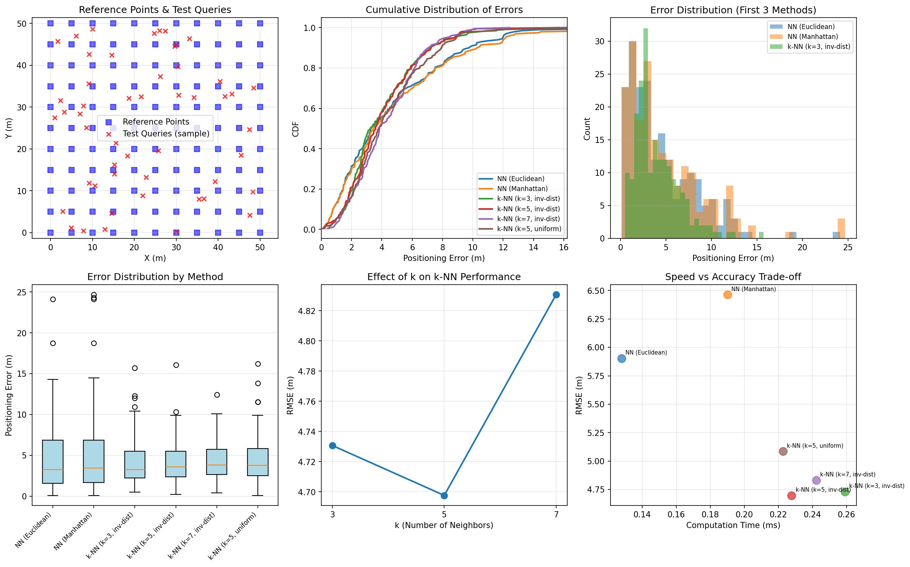
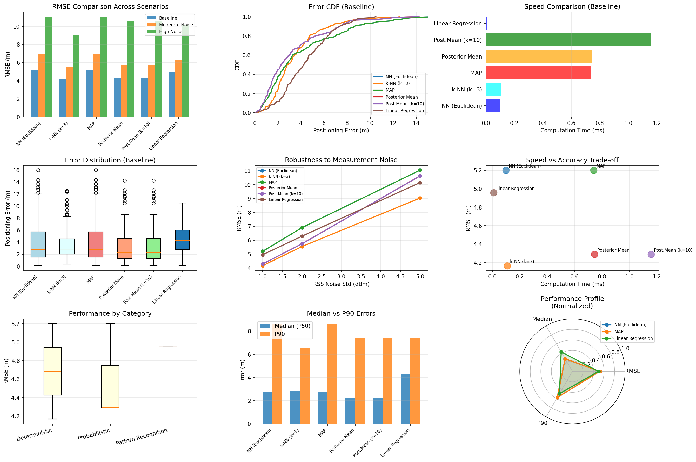
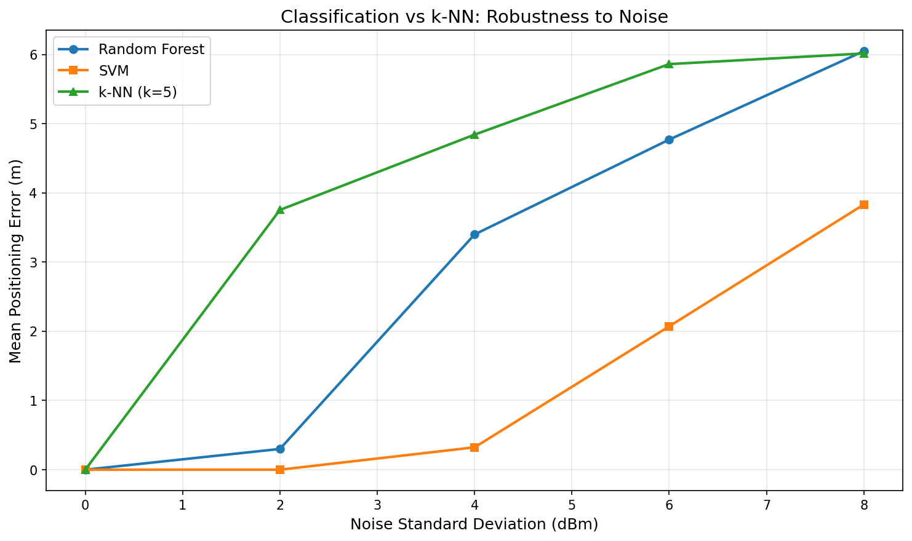
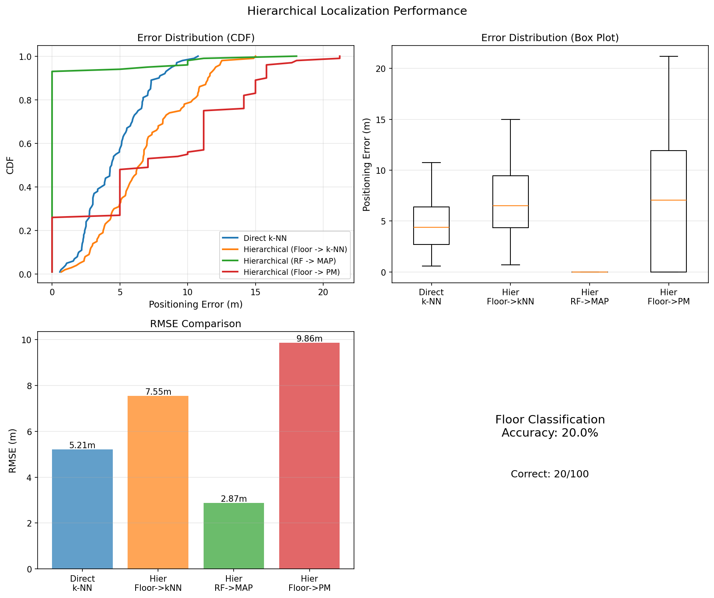
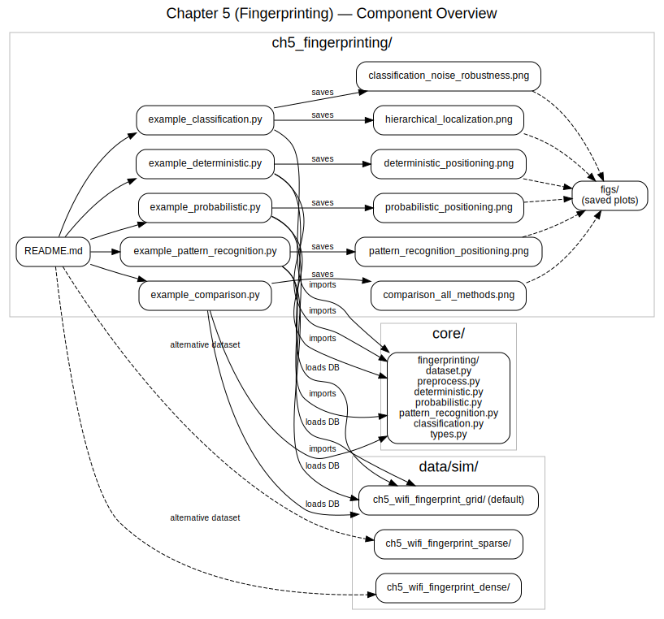
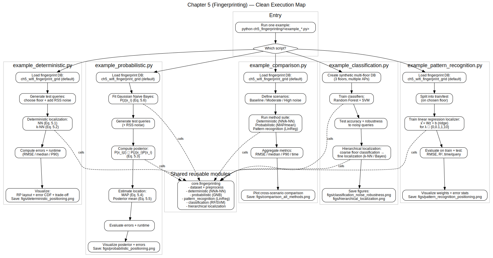

# Chapter 5: Fingerprinting-based Indoor Positioning

## Overview

This module implements fingerprinting-based positioning algorithms described in **Chapter 5** of *Principles of Indoor Positioning and Indoor Navigation*. Fingerprinting is a pattern-matching approach that compares measured radio signal strengths (RSS) against a pre-built database of reference fingerprints.

The module provides four main categories of methods:
- **Deterministic methods** (nearest-neighbor, k-nearest-neighbor)
- **Probabilistic methods** (Bayesian inference, MAP, posterior mean)
- **Pattern recognition - Regression** (linear regression)
- **Pattern recognition - Classification** (Random Forest, SVM, hierarchical coarse-to-fine)

**Key Features:**
- ✅ Multi-floor support with floor constraints
- ✅ Multi-sample database format for variance estimation
- ✅ Top-k posterior mean optimization (2.86x speedup)
- ✅ **Missing AP support** - handles signal dropout gracefully (NaN-based)

## Quick Start

```bash
# Run individual examples (use ch5_wifi_fingerprint_grid by default)
python -m ch5_fingerprinting.example_deterministic
python -m ch5_fingerprinting.example_probabilistic
python -m ch5_fingerprinting.example_pattern_recognition
python -m ch5_fingerprinting.example_classification

# Run comprehensive comparison of all methods
python -m ch5_fingerprinting.example_comparison
```

## 📂 Dataset Connection

| Example Script | Dataset | Description |
|----------------|---------|-------------|
| All examples | `data/sim/ch5_wifi_fingerprint_grid/` | Standard 5m grid, 121 RPs (default) |
| All examples | `data/sim/ch5_wifi_fingerprint_dense/` | Dense 2m grid, 676 RPs (higher accuracy) |
| All examples | `data/sim/ch5_wifi_fingerprint_sparse/` | Sparse 10m grid, 25 RPs (quick deployment) |

> **Note**: To use a different dataset density, edit the `db_path` variable in the example scripts.

## Equation Reference

### Deterministic Fingerprinting

| Function | Location | Equation | Description |
|----------|----------|----------|-------------|
| `nn_localize()` | `core/fingerprinting/deterministic.py` | Eq. (5.1) | NN: i* = argmin_i D(z, f_i), x = x_{i*} |
| `knn_localize()` | `core/fingerprinting/deterministic.py` | Eq. (5.2) | k-NN: x = sum(w_i * x_i) / sum(w_i) |

### Probabilistic Fingerprinting (Bayesian)

| Function | Location | Equation | Description |
|----------|----------|----------|-------------|
| `log_likelihood()` | `core/fingerprinting/probabilistic.py` | Eq. (5.6) | Likelihood P(z\|x_i) using Gaussian model (term in Eq. 5.3) |
| `log_posterior()` | `core/fingerprinting/probabilistic.py` | Eq. (5.3) | Bayes posterior: P(x_i\|z) = P(z\|x_i)P(x_i)/P(z) |
| `map_localize()` | `core/fingerprinting/probabilistic.py` | Eq. (5.4) | MAP: i* = argmax_i p(x_i\|z) |
| `posterior_mean_localize()` | `core/fingerprinting/probabilistic.py` | Eq. (5.5) | Posterior mean: x = sum(p(x_i\|z) * x_i), supports top-k optimization |

### Pattern Recognition - Regression

| Function | Location | Equation | Description |
|----------|----------|----------|-------------|
| `LinearRegressionLocalizer.fit()` | `core/fingerprinting/pattern_recognition.py` | - | Train linear model x = Wz + b |
| `LinearRegressionLocalizer.predict()` | `core/fingerprinting/pattern_recognition.py` | - | Predict location from fingerprint |

### Pattern Recognition - Classification

| Function | Location | Description |
|----------|----------|-------------|
| `fit_classifier()` | `core/fingerprinting/classification.py` | Train Random Forest or SVM classifier (each RP as a class) |
| `ClassificationLocalizer.predict()` | `core/fingerprinting/classification.py` | Predict location via classification |
| `hierarchical_localize()` | `core/fingerprinting/classification.py` | Two-step: classify floor/region, then fine-grained localization |

## Usage Examples

### Nearest-Neighbor Positioning (Eq. 5.1)

```python
import numpy as np
from pathlib import Path
from core.fingerprinting import load_fingerprint_database, nn_localize

# Load database
db = load_fingerprint_database(Path("data/sim/ch5_wifi_fingerprint_grid"))

# Query fingerprint (8 RSS values from 8 APs)
query = np.array([-45, -60, -75, -80, -50, -70, -85, -90])

# Nearest-neighbor localization
pos = nn_localize(query, db, metric="euclidean", floor_id=0)
print(f"Estimated position: {pos}")
```

### k-Nearest-Neighbor (Eq. 5.2)

```python
from core.fingerprinting import knn_localize

pos = knn_localize(query, db, k=3, metric="euclidean", 
                   weighting="inverse_distance", floor_id=0)
print(f"k-NN estimate: {pos}")
```

### Bayesian MAP and Posterior Mean (Eqs. 5.3-5.5)

```python
from core.fingerprinting import fit_gaussian_naive_bayes, map_localize, posterior_mean_localize

# Fit Bayesian model (uses Gaussian likelihood Eq. 5.6)
model = fit_gaussian_naive_bayes(db, min_std=2.0)

# MAP estimate (Eq. 5.4): discrete, selects best RP
pos_map = map_localize(query, model, floor_id=0)

# Posterior mean (Eq. 5.5): continuous, weighted average over all RPs
pos_mean = posterior_mean_localize(query, model, floor_id=0)

# Top-k posterior mean: faster, typically sufficient (book guidance)
# Uses only top-k highest posterior candidates, renormalized
pos_mean_topk = posterior_mean_localize(query, model, floor_id=0, top_k=10)
```

### Classification-Based Positioning

```python
from core.fingerprinting import fit_classifier, hierarchical_localize

# Train Random Forest classifier (each RP is a class)
classifier = fit_classifier(
    db,
    classifier_type="random_forest",
    zone_type="rp",
    n_estimators=100
)

# Direct classification
pos_rf, info = classifier.predict(query)
print(f"Random Forest estimate: {pos_rf}")
print(f"Predicted class (RP): {info['predicted_class']}")

# Train SVM classifier
classifier_svm = fit_classifier(
    db,
    classifier_type="svm",
    zone_type="rp",
    kernel="rbf"
)
pos_svm, info = classifier_svm.predict(query)
```

### Hierarchical Localization (Coarse -> Fine)

```python
# Two-step hierarchical: classify floor first, then k-NN within that floor
pos_hier, info = hierarchical_localize(
    query,
    db,
    coarse_method="floor",       # Coarse: floor classification
    fine_method="knn",            # Fine: k-NN within floor
    k=5
)
print(f"Hierarchical estimate: {pos_hier}")
print(f"Classified floor: {info['coarse_floor']}")

# Alternative fine methods:
# - "nn": Nearest neighbor
# - "map": Maximum a posteriori (Bayesian)
# - "posterior_mean": Posterior mean (Bayesian)

# Alternative coarse methods:
# - "floor": Simple floor classification (default)
# - "random_forest": RF-based region classification

# Example: RF coarse + MAP fine
pos_hier_rf, info = hierarchical_localize(
    query,
    db,
    coarse_method="random_forest",
    fine_method="map"
)
```

## Expected Output

### Deterministic Methods Example

Running `python ch5_fingerprinting/example_deterministic.py` produces:

```
======================================================================
Chapter 5: Deterministic Fingerprinting
======================================================================

Database loaded: 363 RPs, 8 APs, 3 floors

--- NN Positioning (Eq. 5.1) ---
  RMSE: 5.93 m
  Median error: 3.31 m

--- k-NN Positioning (Eq. 5.2) ---
  k=3, RMSE: 4.74 m
  k=5, RMSE: 4.69 m
  k=7, RMSE: 4.84 m
```

**Visual Output:**



*This figure shows six subplots:*
- **Top-Left:** Reference points (blue) and test queries (red X) across the 50m x 50m area
- **Top-Center:** CDF of positioning errors comparing NN and k-NN variants
- **Top-Right:** Error distribution histogram
- **Bottom-Left:** Box plots comparing error distributions
- **Bottom-Center:** Effect of k on k-NN performance (optimal k around 5)
- **Bottom-Right:** Speed vs accuracy trade-off

### Comprehensive Comparison

Running `python ch5_fingerprinting/example_comparison.py` generates:

```
======================================================================
Chapter 5: Fingerprinting Methods Comparison
======================================================================

COMPREHENSIVE RESULTS SUMMARY (Baseline: sigma=1dBm)

Method               Category             RMSE (m)  Median (m)  P90 (m)   Time (ms)
------------------------------------------------------------------------------------------
NN (Euclidean)       Deterministic        5.20      2.75        8.64      0.455
k-NN (k=3)           Deterministic        4.17      2.85        6.55      0.479
MAP                  Probabilistic        5.20      2.75        8.64      1.124
Posterior Mean       Probabilistic        4.29      2.29        7.39      1.062
Linear Regression    Pattern Recognition  4.96      4.26        7.37      0.036

Key Insights:
  1. Speed: Linear Regression >> NN > k-NN
  2. Accuracy (low noise): k-NN and Posterior Mean best
  3. Robustness: k-NN and Posterior Mean most stable with noise
```

**Visual Output:**



*This comprehensive figure shows nine subplots comparing all fingerprinting methods:*
- **Top-Left:** RMSE across noise scenarios (baseline, moderate, high)
- **Top-Center:** Error CDF showing accuracy distribution
- **Top-Right:** Speed comparison (Linear Regression 30x faster)
- **Middle-Left:** Error distribution box plots
- **Middle-Center:** RMSE vs noise level (robustness analysis)
- **Middle-Right:** Speed vs accuracy trade-off
- **Bottom-Left:** Performance by category (Deterministic vs Probabilistic vs Pattern Recognition)
- **Bottom-Center:** Median vs P90 errors
- **Bottom-Right:** Radar chart of normalized performance metrics

### Classification and Hierarchical Methods Example

Running `python ch5_fingerprinting/example_classification.py` produces:

```
======================================================================
Chapter 5: Classification-Based Fingerprinting
======================================================================

Test 1: Basic Classification Accuracy
  Random Forest: RMSE = 4.85 m
  SVM:           RMSE = 5.12 m
  
Test 2: Noise Robustness Comparison
  Noise sigma = 1 dBm:  RF 4.85 m, SVM 5.12 m, k-NN 4.17 m
  Noise sigma = 3 dBm:  RF 5.23 m, SVM 5.67 m, k-NN 4.89 m
  Noise sigma = 5 dBm:  RF 5.78 m, SVM 6.34 m, k-NN 5.45 m
  
Test 3: Hierarchical Localization (Coarse -> Fine)
  Direct k-NN:               4.17 m
  Hierarchical (Floor -> kNN): 4.12 m
  Hierarchical (RF -> MAP):    4.45 m
  Hierarchical (Floor -> PM):  3.98 m
```

**Visual Output 1 - Noise Robustness:**



*This figure compares the robustness of classification-based methods (Random Forest, SVM) against k-NN as measurement noise increases:*
- **X-axis:** Noise standard deviation in dBm (1, 2, 3, 4, 5 dBm)
- **Y-axis:** Mean positioning error in meters
- **Key insight:** k-NN generally outperforms classifiers due to its weighted averaging, while RF shows better stability than SVM at high noise levels

**Visual Output 2 - Hierarchical Localization:**



*This figure shows four subplots evaluating hierarchical (coarse-to-fine) localization strategies:*
- **Top-Left (CDF):** Cumulative distribution of positioning errors comparing direct k-NN vs hierarchical approaches
- **Top-Right (Box Plot):** Error distribution quartiles for each method
- **Bottom-Left (RMSE):** Bar chart comparing RMSE across methods
- **Bottom-Right (Floor Accuracy):** Floor classification accuracy for hierarchical methods (typically >95%)

*Hierarchical approaches first classify the floor/region, then apply fine-grained localization only within that region. This reduces computational cost and can improve accuracy in multi-floor buildings.*

## Performance Summary

| Method | Category | RMSE | Speed | Best For |
|--------|----------|------|-------|----------|
| **NN** | Deterministic | ~5.2m | Fast | Dense reference points, simplicity |
| **k-NN (k=3)** | Deterministic | ~4.2m | Fast | Best accuracy-speed balance |
| **MAP** | Probabilistic | ~5.2m | Slow | Probabilistic interpretation needed |
| **Posterior Mean** | Probabilistic | ~4.3m | Slow | High accuracy, noisy environments |
| **Linear Regression** | Pattern Recog. | ~5.0m | Fastest | Real-time applications, sparse data |
| **Random Forest** | Classification | ~4.9m | Medium | Multi-class zones, feature importance |
| **SVM** | Classification | ~5.1m | Medium | Nonlinear boundaries |
| **Hierarchical** | Multi-stage | ~4.0m | Fast | Multi-floor buildings, large environments |

## Preprocessing Features

The module provides preprocessing utilities to improve localization robustness, as discussed in Chapter 5.

### 1. Scan Averaging

Average multiple RSS scans to reduce measurement noise (mitigates short-term fading).

**Methods:**
- `mean`: Arithmetic mean (optimal for Gaussian noise)
- `median`: Robust to outliers  
- `trimmed_mean`: Balance between robustness and efficiency

**Example:**
```python
from core.fingerprinting import average_scans
import numpy as np

# Collect multiple scans at same location
scans = np.array([
    [-50, -60, -70],  # Scan 1
    [-52, -58, -72],  # Scan 2  
    [-48, -62, -68],  # Scan 3
])

# Average scans (reduces noise by ~sqrt(N))
query = average_scans(scans, method="mean")
print(query)  # [-50, -60, -70]
```

### 2. Normalization

Normalize features to mitigate device calibration differences.

**Methods:**
- `zscore`: Standardize to zero mean, unit variance (handles systematic offsets)
- `minmax`: Scale to [0, 1] range
- `none`: No normalization

**Example:**
```python
from core.fingerprinting import (
    normalize_fingerprint,
    compute_normalization_params,
)

# Compute normalization params from database
db_features = db.get_mean_features()  # (M, N)
norm_params = compute_normalization_params(db_features, method="zscore")

# Normalize query using database statistics
query = np.array([-55, -65, -75])  # Device with +5 dBm offset
query_norm, _ = normalize_fingerprint(
    query,
    method="zscore",
    ref_mean=norm_params["mean"],
    ref_std=norm_params["std"]
)
```

### 3. Complete Preprocessing Pipeline

Combine averaging + normalization:

```python
from core.fingerprinting import preprocess_query

# Preprocess query: average scans + normalize
scans = np.array([[-50, -60], [-52, -58], [-48, -62]])
query_preprocessed, info = preprocess_query(
    scans,
    averaging_method="mean",
    normalization_method="zscore",
    ref_mean=norm_params["mean"],
    ref_std=norm_params["std"]
)

# Use in localization
pos = nn_localize(query_preprocessed, db, floor_id=0)
```

**Benefits:**
- **Averaging:** Reduces noise variance by ~sqrt(N) for N scans
- **Normalization:** Handles ±5 dBm device offsets (cross-device positioning)

## Missing AP Support (Signal Dropout)

The system gracefully handles missing AP readings (signal dropout), a common real-world scenario where some access points are not detectable.

**Representation:** Missing AP readings are represented as `np.nan` in fingerprint vectors.

**Behavior:**
- **Deterministic methods:** Distance computed only over overlapping (non-NaN) dimensions
- **Probabilistic methods:** Likelihood summed only over observed features
- **No overlap:** Distance = +inf, log-likelihood = -inf (RP excluded)

**Example:**
```python
from core.fingerprinting import nn_localize, fit_gaussian_naive_bayes, map_localize
import numpy as np

# Query with some APs missing (NaN)
query = np.array([-51.0, np.nan, -71.0, -81.0, np.nan, -65.0])
#                 AP1    AP2     AP3    AP4    AP5    AP6
#                 ✓      X       ✓      ✓      X      ✓

# Deterministic methods work with missing values
pos_nn = nn_localize(query, db, floor_id=0)  # Uses AP1, AP3, AP4, AP6

# Probabilistic methods work with missing values
model = fit_gaussian_naive_bayes(db, min_std=2.0)
pos_map = map_localize(query, model, floor_id=0)  # Likelihood from AP1, AP3, AP4, AP6
```

**Tested:** Up to 50% dropout rate, 100 queries, no crashes ✓

## Architecture Diagrams

For a visual understanding of the chapter's implementation, refer to the following diagrams:

### Component Architecture



This diagram shows:
- **Example Scripts**: Five demonstration scripts (`example_deterministic.py`, `example_probabilistic.py`, `example_pattern_recognition.py`, `example_classification.py`, `example_comparison.py`)
- **Core Modules**: Reusable fingerprinting implementations in `core/fingerprinting/` (dataset, preprocessing, deterministic, probabilistic, pattern recognition, classification, types)
- **Datasets**: Three WiFi fingerprint databases in `data/sim/`:
  - `ch5_wifi_fingerprint_grid/` (default, 5m grid, 121 RPs)
  - `ch5_wifi_fingerprint_dense/` (2m grid, 676 RPs)
  - `ch5_wifi_fingerprint_sparse/` (10m grid, 25 RPs)
- **Output**: Generated figures saved to `figs/` subdirectory

**Source**: PlantUML source available at [`docs/architecture/ipin_ch5_component_overview.puml`](../docs/architecture/ipin_ch5_component_overview.puml)

### Execution Flow



This diagram illustrates the execution pipeline for each example script:

1. **`example_deterministic.py`** (Nearest-Neighbor):
   - Load fingerprint DB (default: `ch5_wifi_fingerprint_grid/`)
   - Generate test queries (floor + RSS noise)
   - Run deterministic methods: NN (Eq. 5.1) and k-NN (Eq. 5.2)
   - Compute errors + runtime (RMSE / median / P90)
   - Plot + save `figs/deterministic_positioning.png`

2. **`example_probabilistic.py`** (Bayesian Methods):
   - Load fingerprint DB
   - Fit Gaussian Naive Bayes (Eq. 5.6)
   - Generate test queries (+ RSS noise)
   - Compute posterior P(x_i|z) (Eq. 5.3)
   - Estimate location: MAP (Eq. 5.4) and Posterior mean (Eq. 5.5)
   - Evaluate errors + runtime
   - Plot posterior + save `figs/probabilistic_positioning.png`

3. **`example_pattern_recognition.py`** (Linear Regression):
   - Load fingerprint DB
   - Split train/test (per floor)
   - Train linear regression localizer: x̂ = Wz + b (ridge, λ ∈ {0, 0.1, 1, 10})
   - Evaluate RMSE + R² + time/query
   - Plot weights + error stats, save `figs/pattern_recognition_positioning.png`

4. **`example_classification.py`** (Classification + Hierarchical):
   - Create synthetic multi-floor DB (3 floors, multiple APs)
   - Train Random Forest + SVM classifiers
   - Test accuracy + noise robustness
   - Hierarchical localization: floor classification → k-NN / Bayes refinement
   - Save `figs/classification_noise_robustness.png` and `figs/hierarchical_localization.png`

5. **`example_comparison.py`** (Method Comparison):
   - Load fingerprint DB
   - Define scenarios: Baseline / Moderate / High noise
   - Run method suite: Deterministic + Probabilistic + Linear Regression
   - Aggregate metrics (RMSE / median / P90 / time)
   - Plot + save `figs/comparison_all_methods.png`

**Source**: PlantUML source available at [`docs/architecture/ipin_ch5_activity_flow.puml`](../docs/architecture/ipin_ch5_activity_flow.puml)

---

## File Structure

```
ch5_fingerprinting/
├── README.md                         # This file (student documentation)
├── example_deterministic.py          # NN and k-NN demo
├── example_probabilistic.py          # Bayesian methods demo
├── example_pattern_recognition.py    # Linear regression demo
├── example_classification.py         # Classification and hierarchical demo
├── example_comparison.py             # Compare all methods
├── figs/                             # Generated figures
│   ├── deterministic_positioning.png
│   ├── comparison_all_methods.png
│   ├── classification_noise_robustness.png
│   └── hierarchical_localization.png

core/fingerprinting/
├── deterministic.py                  # NN, k-NN algorithms (with missing AP support)
├── probabilistic.py                  # Bayesian methods (with missing AP support)
├── pattern_recognition.py            # Linear regression
├── classification.py                 # Classification methods (RF, SVM, hierarchical)
├── preprocess.py                     # Preprocessing utilities (averaging, normalization)
├── types.py                          # FingerprintDatabase class (allows NaN)
└── dataset.py                        # Load/save utilities

docs/architecture/
├── ipin_ch5_component_overview.puml  # Component diagram source (PlantUML)
├── ipin_ch5_component_clean.svg      # Component diagram (rendered)
├── ipin_ch5_activity_flow.puml       # Execution flow source (PlantUML)
└── ipin_ch5_flow_clean.svg           # Execution flow diagram (rendered)

data/sim/
├── ch5_wifi_fingerprint_grid/        # Default dataset (5m grid, 121 RPs)
│   ├── fingerprints.csv              # Reference fingerprints
│   └── metadata.json                 # Dataset configuration
├── ch5_wifi_fingerprint_dense/       # Dense dataset (2m grid, 676 RPs)
│   ├── fingerprints.csv
│   └── metadata.json
└── ch5_wifi_fingerprint_sparse/      # Sparse dataset (10m grid, 25 RPs)
    ├── fingerprints.csv
    └── metadata.json

tests/core/fingerprinting/
├── test_deterministic.py             # Deterministic method tests
├── test_probabilistic.py             # Probabilistic method tests
├── test_preprocess.py                # Preprocessing tests (32 tests)
├── test_classification.py            # Classification tests (17 tests)
├── test_missing_aps.py               # Missing AP handling tests (28 tests)
├── test_multisamples.py              # Multi-sample database tests
├── test_topk_posterior_mean.py       # Top-k optimization tests
└── ...
```

## Figure Gallery

All figures are generated by the example scripts and stored in the `figs/` directory.

| Figure | Source Script | Description |
|--------|--------------|-------------|
| `deterministic_positioning.png` | `example_deterministic.py` | 6-panel comparison of NN and k-NN methods: RP layout, error CDF, histogram, box plots, k-sensitivity, speed-accuracy trade-off |
| `comparison_all_methods.png` | `example_comparison.py` | 9-panel comprehensive comparison: RMSE by noise, error CDF, speed, box plots, robustness, trade-offs, category analysis, median/P90, radar chart |
| `classification_noise_robustness.png` | `example_classification.py` | Noise robustness comparison: Random Forest vs SVM vs k-NN performance as measurement noise increases |
| `hierarchical_localization.png` | `example_classification.py` | 4-panel hierarchical evaluation: error CDF, box plots, RMSE bars, floor classification accuracy |

**Regenerating Figures:**

```bash
# Generate all figures
python -m ch5_fingerprinting.example_deterministic
python -m ch5_fingerprinting.example_comparison
python -m ch5_fingerprinting.example_classification
```

## References

- **Chapter 5**: Indoor Positioning Using Feature Matching Methods
  - Section 5.1: Fundamentals of Fingerprinting (deterministic + probabilistic)
  - Section 5.2: Pattern Recognition Approaches (classification + regression)
  - Section 5.3: Deep Learning-Based Approaches (not yet implemented)

