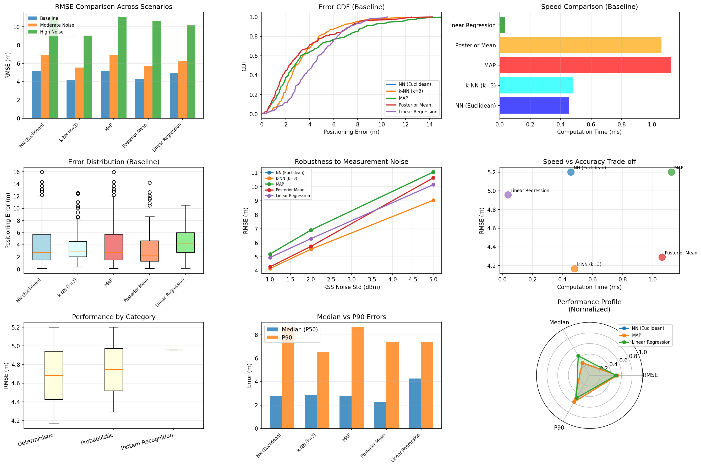

# Chapter 5: Fingerprinting-based Indoor Positioning

## Overview

This module implements fingerprinting-based positioning algorithms described in **Chapter 5** of *Principles of Indoor Positioning and Indoor Navigation*. Fingerprinting is a pattern-matching approach that compares measured radio signal strengths (RSS) against a pre-built database of reference fingerprints.

The module provides three main categories of methods:
- **Deterministic methods** (nearest-neighbor, k-nearest-neighbor)
- **Probabilistic methods** (Bayesian inference, MAP, posterior mean)
- **Pattern recognition** (linear regression)

## Quick Start

```bash
# Run individual examples
python ch5_fingerprinting/example_deterministic.py
python ch5_fingerprinting/example_probabilistic.py
python ch5_fingerprinting/example_pattern_recognition.py

# Run comprehensive comparison of all methods
python ch5_fingerprinting/example_comparison.py
```

## Equation Reference

### Deterministic Fingerprinting

| Function | Location | Equation | Description |
|----------|----------|----------|-------------|
| `nn_localize()` | `core/fingerprinting/deterministic.py` | Eq. (5.1) | NN: i* = argmin_i D(z, f_i), x = x_{i*} |
| `knn_localize()` | `core/fingerprinting/deterministic.py` | Eq. (5.2) | k-NN: x = sum(w_i * x_i) / sum(w_i) |

### Probabilistic Fingerprinting (Bayesian)

| Function | Location | Equation | Description |
|----------|----------|----------|-------------|
| `log_likelihood()` | `core/fingerprinting/probabilistic.py` | Eq. (5.3) | Log p(z\|x_i) under Gaussian Naive Bayes |
| `map_localize()` | `core/fingerprinting/probabilistic.py` | Eq. (5.4) | MAP: i* = argmax_i p(x_i\|z) |
| `posterior_mean_localize()` | `core/fingerprinting/probabilistic.py` | Eq. (5.5) | Posterior mean: x = sum(p(x_i\|z) * x_i) |

### Pattern Recognition

| Function | Location | Equation | Description |
|----------|----------|----------|-------------|
| `LinearRegressionLocalizer.fit()` | `core/fingerprinting/pattern_recognition.py` | - | Train linear model x = Wz + b |
| `LinearRegressionLocalizer.predict()` | `core/fingerprinting/pattern_recognition.py` | - | Predict location from fingerprint |

## Usage Examples

### Nearest-Neighbor Positioning (Eq. 5.1)

```python
import numpy as np
from pathlib import Path
from core.fingerprinting import load_fingerprint_database, nn_localize

# Load database
db = load_fingerprint_database(Path("data/sim/wifi_fingerprint_grid"))

# Query fingerprint (8 RSS values from 8 APs)
query = np.array([-45, -60, -75, -80, -50, -70, -85, -90])

# Nearest-neighbor localization
pos = nn_localize(query, db, metric="euclidean", floor_id=0)
print(f"Estimated position: {pos}")
```

### k-Nearest-Neighbor (Eq. 5.2)

```python
from core.fingerprinting import knn_localize

pos = knn_localize(query, db, k=3, metric="euclidean", 
                   weighting="inverse_distance", floor_id=0)
print(f"k-NN estimate: {pos}")
```

### Bayesian MAP and Posterior Mean (Eqs. 5.3-5.5)

```python
from core.fingerprinting import fit_gaussian_naive_bayes, map_localize, posterior_mean_localize

# Fit Bayesian model
model = fit_gaussian_naive_bayes(db, min_std=2.0)

# MAP estimate (discrete)
pos_map = map_localize(query, model, floor_id=0)

# Posterior mean (continuous)
pos_mean = posterior_mean_localize(query, model, floor_id=0)
```

## Expected Output

### Deterministic Methods Example

Running `python ch5_fingerprinting/example_deterministic.py` produces:

```
======================================================================
Chapter 5: Deterministic Fingerprinting
======================================================================

Database loaded: 363 RPs, 8 APs, 3 floors

--- NN Positioning (Eq. 5.1) ---
  RMSE: 5.93 m
  Median error: 3.31 m

--- k-NN Positioning (Eq. 5.2) ---
  k=3, RMSE: 4.74 m
  k=5, RMSE: 4.69 m
  k=7, RMSE: 4.84 m
```

**Visual Output:**


*This figure shows six subplots:*
- **Top-Left:** Reference points (blue) and test queries (red X) across the 50m x 50m area
- **Top-Center:** CDF of positioning errors comparing NN and k-NN variants
- **Top-Right:** Error distribution histogram
- **Bottom-Left:** Box plots comparing error distributions
- **Bottom-Center:** Effect of k on k-NN performance (optimal k around 5)
- **Bottom-Right:** Speed vs accuracy trade-off

### Comprehensive Comparison

Running `python ch5_fingerprinting/example_comparison.py` generates:

```
======================================================================
Chapter 5: Fingerprinting Methods Comparison
======================================================================

COMPREHENSIVE RESULTS SUMMARY (Baseline: sigma=1dBm)

Method               Category             RMSE (m)  Median (m)  P90 (m)   Time (ms)
------------------------------------------------------------------------------------------
NN (Euclidean)       Deterministic        5.20      2.75        8.64      0.455
k-NN (k=3)           Deterministic        4.17      2.85        6.55      0.479
MAP                  Probabilistic        5.20      2.75        8.64      1.124
Posterior Mean       Probabilistic        4.29      2.29        7.39      1.062
Linear Regression    Pattern Recognition  4.96      4.26        7.37      0.036

Key Insights:
  1. Speed: Linear Regression >> NN > k-NN
  2. Accuracy (low noise): k-NN and Posterior Mean best
  3. Robustness: k-NN and Posterior Mean most stable with noise
```

**Visual Output:**



*This comprehensive figure shows nine subplots comparing all fingerprinting methods:*
- **Top-Left:** RMSE across noise scenarios (baseline, moderate, high)
- **Top-Center:** Error CDF showing accuracy distribution
- **Top-Right:** Speed comparison (Linear Regression 30x faster)
- **Middle-Left:** Error distribution box plots
- **Middle-Center:** RMSE vs noise level (robustness analysis)
- **Middle-Right:** Speed vs accuracy trade-off
- **Bottom-Left:** Performance by category (Deterministic vs Probabilistic vs Pattern Recognition)
- **Bottom-Center:** Median vs P90 errors
- **Bottom-Right:** Radar chart of normalized performance metrics

## Performance Summary

| Method | RMSE | Speed | Best For |
|--------|------|-------|----------|
| **NN** | ~5.2m | Fast | Dense reference points, simplicity |
| **k-NN (k=3)** | ~4.2m | Fast | Best accuracy-speed balance |
| **MAP** | ~5.2m | Slow | Probabilistic interpretation needed |
| **Posterior Mean** | ~4.3m | Slow | High accuracy, noisy environments |
| **Linear Regression** | ~5.0m | Fastest | Real-time applications, sparse data |

## File Structure

```
ch5_fingerprinting/
├── README.md                         # This file (student documentation)
├── example_deterministic.py          # NN and k-NN demo
├── example_probabilistic.py          # Bayesian methods demo
├── example_pattern_recognition.py    # Linear regression demo
├── example_comparison.py             # Compare all methods
├── figs/                             # Generated figures
│   ├── deterministic_positioning.png
│   └── comparison_all_methods.png

core/fingerprinting/
├── deterministic.py                  # NN, k-NN algorithms
├── probabilistic.py                  # Bayesian methods
├── pattern_recognition.py            # Linear regression
├── types.py                          # FingerprintDatabase class
└── dataset.py                        # Load/save utilities
```

## References

- **Chapter 5**: Fingerprinting-based Indoor Positioning
  - Section 5.1: Deterministic Methods (NN, k-NN)
  - Section 5.2: Probabilistic Methods (Bayesian)
  - Section 5.3: Pattern Recognition (Regression)

---

For implementation details and development notes, see [docs/ch5_development.md](../docs/ch5_development.md).
