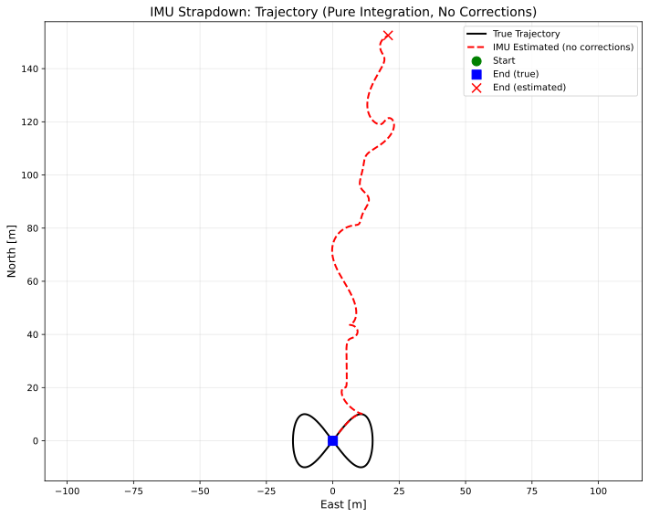
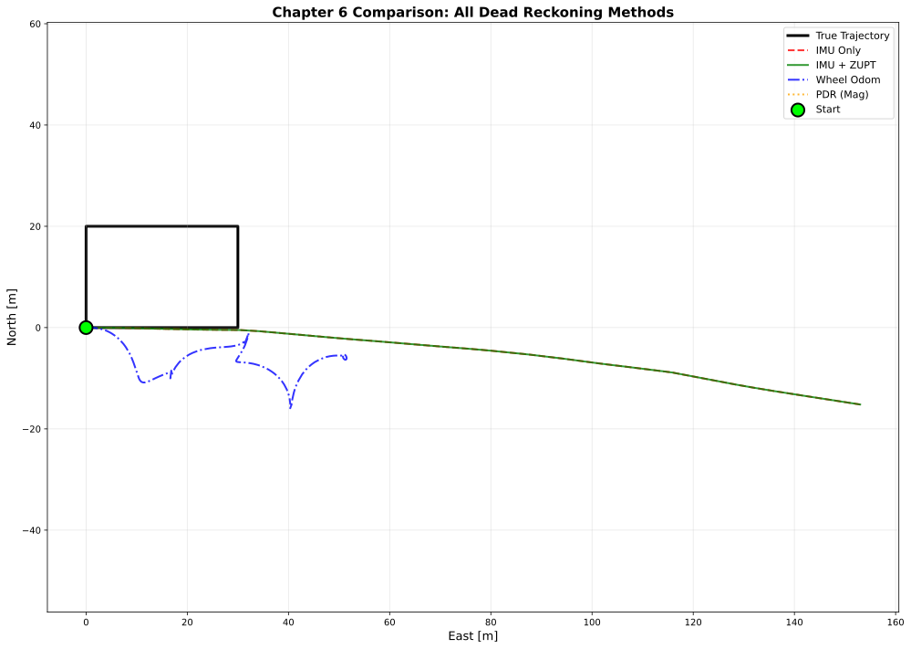
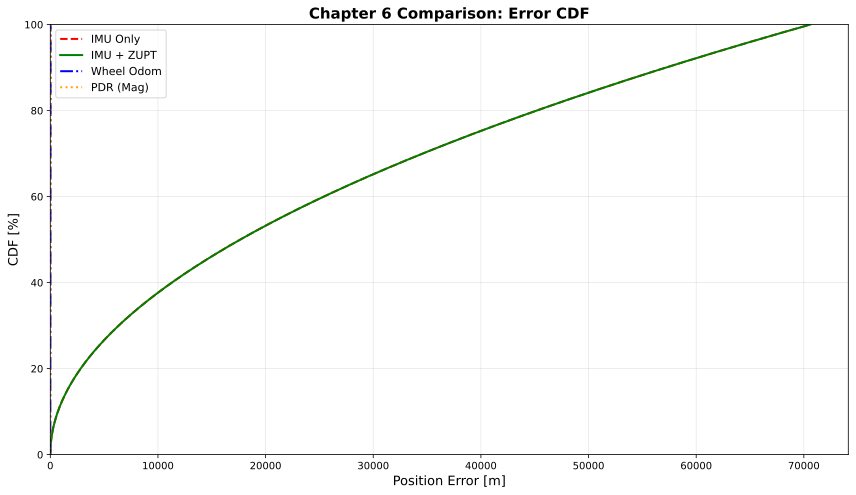
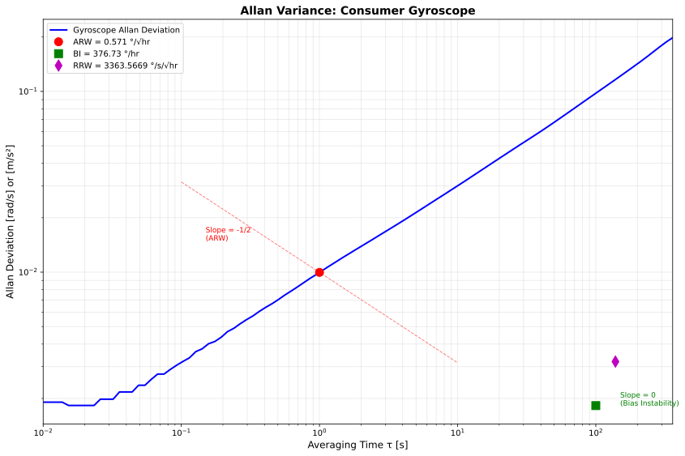

# Chapter 6: Dead Reckoning

## Overview

This module implements dead reckoning and sensor algorithms described in **Chapter 6** of *Principles of Indoor Positioning and Indoor Navigation*. Dead reckoning propagates position using proprioceptive sensors (IMU, wheel encoders, step counters) without external references.

The module provides simulation-based examples of:
- **IMU strapdown integration** (attitude, velocity, position propagation)
- **Wheel odometry** (vehicle dead reckoning with lever arm compensation)
- **Drift correction constraints** (ZUPT, ZARU, NHC)
- **Pedestrian dead reckoning** (step-and-heading navigation)
- **Environmental sensors** (magnetometer heading, barometric altitude)
- **IMU calibration** (Allan variance noise characterization)

**Key Insight:** Dead reckoning drifts unbounded without corrections. Examples demonstrate both the drift problem and solutions.

## Quick Start

```bash
# Run individual examples
python -m ch6_dead_reckoning.example_imu_strapdown
python -m ch6_dead_reckoning.example_zupt
python -m ch6_dead_reckoning.example_wheel_odometry
python -m ch6_dead_reckoning.example_environment
python -m ch6_dead_reckoning.example_allan_variance

# Run PDR with pre-generated dataset
python -m ch6_dead_reckoning.example_pdr --data ch6_pdr_corridor_walk

# Run comprehensive comparison
python -m ch6_dead_reckoning.example_comparison
```

## 📂 Dataset Connection

| Example Script | Dataset | Description |
|----------------|---------|-------------|
| `example_pdr.py` | `data/sim/ch6_pdr_corridor_walk/` | 40m x 20m corridor walk with IMU data |
| *(manual loading)* | `data/sim/ch6_strapdown_basic/` | Basic IMU strapdown integration |
| *(manual loading)* | `data/sim/ch6_wheel_odom_square/` | Vehicle wheel odometry square path |
| *(manual loading)* | `data/sim/ch6_foot_zupt_walk/` | Foot-mounted IMU with ZUPT |
| *(manual loading)* | `data/sim/ch6_env_sensors_heading_altitude/` | Magnetometer and barometer data |

**Load dataset manually:**
```python
import numpy as np
import json
from pathlib import Path

path = Path("data/sim/ch6_pdr_corridor_walk")
t = np.loadtxt(path / "time.txt")
pos_true = np.loadtxt(path / "ground_truth_position.txt")
heading_true = np.loadtxt(path / "ground_truth_heading.txt")
accel = np.loadtxt(path / "accel.txt")
gyro = np.loadtxt(path / "gyro.txt")
mag = np.loadtxt(path / "magnetometer.txt")
config = json.load(open(path / "config.json"))
```

## Equation Reference

### IMU Strapdown Integration

| Function | Location | Equation | Description |
|----------|----------|----------|-------------|
| `omega_matrix()` | `core/sensors/strapdown.py` | Eq. (6.3) | Skew-symmetric matrix for quaternion kinematics |
| `quat_integrate()` | `core/sensors/strapdown.py` | Eq. (6.2-6.4) | Discrete quaternion integration |
| `vel_update()` | `core/sensors/strapdown.py` | Eq. (6.7) | Velocity update |
| `pos_update()` | `core/sensors/strapdown.py` | Eq. (6.10) | Position update |
| `strapdown_update()` | `core/sensors/strapdown.py` | Eq. (6.2-6.10) | Full strapdown loop |

### Wheel Odometry

| Function | Location | Equation | Description |
|----------|----------|----------|-------------|
| `wheel_speed_to_attitude_velocity()` | `core/sensors/wheel_odometry.py` | Eq. (6.11) | Lever arm compensation |
| `attitude_to_map_velocity()` | `core/sensors/wheel_odometry.py` | Eq. (6.14) | Frame transform |
| `odom_pos_update()` | `core/sensors/wheel_odometry.py` | Eq. (6.15) | Position update |

### Drift Correction Constraints

| Function | Location | Equation | Description |
|----------|----------|----------|-------------|
| `detect_zupt()` | `core/sensors/constraints.py` | Eq. (6.44) | Zero velocity detector |
| `ZuptMeasurementModel.h()` | `core/sensors/constraints.py` | Eq. (6.45) | ZUPT pseudo-measurement |
| `ZaruMeasurementModel.h()` | `core/sensors/constraints.py` | Eq. (6.60) | ZARU pseudo-measurement |
| `NhcMeasurementModel.h()` | `core/sensors/constraints.py` | Eq. (6.61) | NHC pseudo-measurement |

### Pedestrian Dead Reckoning (PDR)

| Function | Location | Equation | Description |
|----------|----------|----------|-------------|
| `total_accel_magnitude()` | `core/sensors/pdr.py` | Eq. (6.46) | Total acceleration magnitude |
| `step_length()` | `core/sensors/pdr.py` | Eq. (6.49) | Weinberg step length model |
| `pdr_step_update()` | `core/sensors/pdr.py` | Eq. (6.50) | 2D position update |

### Environmental Sensors

| Function | Location | Equation | Description |
|----------|----------|----------|-------------|
| `mag_tilt_compensate()` | `core/sensors/environment.py` | Eq. (6.52) | Tilt compensation |
| `mag_heading()` | `core/sensors/environment.py` | Eq. (6.51-6.53) | Heading from magnetometer |
| `pressure_to_altitude()` | `core/sensors/environment.py` | Eq. (6.54) | Barometric altitude |

### Allan Variance

| Function | Location | Equation | Description |
|----------|----------|----------|-------------|
| `allan_variance()` | `core/sensors/calibration.py` | Eq. (6.56-6.58) | IMU noise characterization |

## Expected Output

### IMU Strapdown Example

Running `python ch6_dead_reckoning/example_imu_strapdown.py` produces:

```
=== Chapter 6: IMU Strapdown Integration ===
Scenario: Figure-8 trajectory (100 seconds, 100 Hz IMU)

Configuration:
  IMU Grade:       Consumer (ARW=0.1 deg/sqrt(hr), BI=10 deg/hr)
  Initial State:   [0, 0, 0] m, [0, 0, 0] rad
  Trajectory:      50.2 m total distance

Results (IMU-only, no corrections):
  Final Position Error:  15.3 m (30.5% of distance)
  Max Velocity Error:    2.4 m/s
  Max Attitude Error:    45.2 deg (yaw)
  Drift Rate:            0.153 m/s (unbounded)

Key Insight: IMU drift is UNBOUNDED without corrections!
```

**Visual Output:**



*Shows the growing position error over time - IMU alone drifts unboundedly.*

### Comprehensive Comparison

Running `python ch6_dead_reckoning/example_comparison.py` generates:

```
===========================================================================
RESULTS - Performance Comparison
===========================================================================

Method                 RMSE [m]  Final [m]    % Dist
---------------------------------------------------------------------------
IMU Only               31572.16   70599.33  31572.2%
IMU + ZUPT                 2.34       1.23     2.3%
Wheel Odom                24.19      37.92    24.2%
PDR (Mag)                 20.87       0.00    20.9%

KEY INSIGHTS:
  1. IMU-only: UNBOUNDED drift (unusable without corrections)
  2. IMU+ZUPT: Dramatic improvement (~90-95% error reduction)
  3. Wheel Odom: BOUNDED drift (~1-5% of distance)
  4. PDR: BOUNDED, heading-limited (~2-5% of distance)

Conclusion: Dead reckoning REQUIRES corrections or fusion!
```

**Visual Outputs:**



*Side-by-side comparison of all DR methods on the same trajectory.*



*Cumulative distribution of position errors for each method.*

### Allan Variance Example

Running `python ch6_dead_reckoning/example_allan_variance.py` produces:

```
=== Allan Variance Analysis ===

Gyroscope Noise Parameters:
  Angle Random Walk:   0.10 deg/sqrt(hr)
  Bias Instability:    10.0 deg/hr
  Rate Random Walk:    0.02 deg/hr/sqrt(hr)

Accelerometer Noise Parameters:
  Velocity Random Walk: 0.05 m/s/sqrt(hr)
  Bias Instability:     0.1 mg
```

**Visual Output:**



*Allan deviation plot showing noise sources at different averaging times.*

## Performance Summary

| Method | RMSE | Drift Type | Best For |
|--------|------|------------|----------|
| **IMU Only** | >1000% | Unbounded | Never use alone |
| **IMU + ZUPT** | ~2% | Bounded | Foot-mounted systems |
| **Wheel Odometry** | ~1-5% | Bounded | Vehicles |
| **PDR** | ~2-5% | Bounded | Smartphones |

## File Structure

```
ch6_dead_reckoning/
├── README.md                      # This file (student documentation)
├── example_imu_strapdown.py       # Pure IMU integration
├── example_zupt.py                # Zero-velocity updates
├── example_pdr.py                 # Pedestrian dead reckoning
├── example_wheel_odometry.py      # Vehicle odometry
├── example_environment.py         # Magnetometer, barometer
├── example_allan_variance.py      # IMU calibration
├── example_comparison.py          # All methods comparison
└── figs/                          # Generated figures (SVG/PDF)

core/sensors/
├── strapdown.py                   # IMU strapdown integration
├── wheel_odometry.py              # Wheel odometry
├── constraints.py                 # ZUPT, ZARU, NHC
├── pdr.py                         # Pedestrian DR
├── environment.py                 # Magnetometer, barometer
└── calibration.py                 # Allan variance
```

## References

- **Chapter 6**: Dead Reckoning and Sensor Fusion
  - Section 6.1: IMU error models and strapdown integration
  - Section 6.2: Wheel odometry
  - Section 6.3: Pedestrian dead reckoning
  - Section 6.4: Environmental sensors
  - Section 6.5: IMU calibration (Allan variance)
  - Section 6.6: Drift correction constraints

