# Chapter 6: Dead Reckoning

## Overview

This module implements dead reckoning and sensor algorithms described in **Chapter 6** of *Principles of Indoor Positioning and Indoor Navigation*. Dead reckoning propagates position using proprioceptive sensors (IMU, wheel encoders, step counters) without external references.

The module provides simulation-based examples of:
- **IMU strapdown integration** (attitude, velocity, position propagation)
- **Wheel odometry** (vehicle dead reckoning with lever arm compensation)
- **Drift correction constraints** (ZUPT, ZARU, NHC)
- **Pedestrian dead reckoning** (step-and-heading navigation)
- **Environmental sensors** (magnetometer heading, barometric altitude)
- **IMU calibration** (Allan variance noise characterization)

**Key Insight:** Dead reckoning drifts unbounded without corrections. Examples demonstrate both the drift problem and solutions.

## Architecture Diagrams

For a visual understanding of the chapter's implementation, refer to the following diagrams:

### Component Architecture

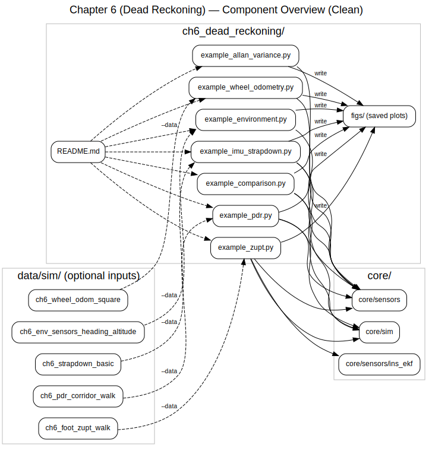

This diagram shows:
- **Example Scripts**: Seven demonstration scripts (`example_imu_strapdown.py`, `example_zupt.py`, `example_wheel_odometry.py`, `example_pdr.py`, `example_environment.py`, `example_allan_variance.py`, `example_comparison.py`)
- **Core Modules**: Reusable dead reckoning implementations in:
  - `core/sensors/` (IMU models, strapdown integration, PDR, wheel odometry, magnetometer, barometer)
  - `core/sim/` (trajectory generation and ground truth)
  - `core/sensors/ins_ekf/` (INS-EKF with ZUPT updates)
- **Optional Datasets**: Five pre-generated datasets in `data/sim/`:
  - `ch6_strapdown_basic/` (basic IMU strapdown)
  - `ch6_foot_zupt_walk/` (foot-mounted IMU with stance phases)
  - `ch6_wheel_odom_square/` (vehicle square path)
  - `ch6_pdr_corridor_walk/` (40m x 20m corridor walk)
  - `ch6_env_sensors_heading_altitude/` (magnetometer and barometer)
- **Output**: Generated SVG figures saved to `figs/` subdirectory

**Source**: PlantUML source available at [`docs/architecture/ipin_ch6_component_overview.puml`](../docs/architecture/ipin_ch6_component_overview.puml)

### Execution Flow

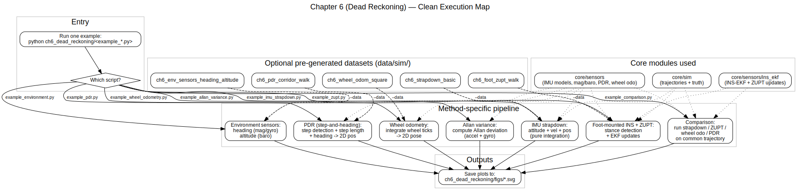

This diagram illustrates the execution pipeline for each example script:

1. **`example_imu_strapdown.py`** (Pure IMU Integration):
   - Load dataset `ch6_strapdown_basic` (optional) OR generate trajectory truth
   - Generate IMU measurements (noise + bias)
   - Strapdown integrate attitude/vel/pos (pure dead reckoning, Eqs. 6.2-6.10)
   - Compute drift + errors
   - Plot + save `figs/*.svg`

2. **`example_zupt.py`** (Zero-Velocity Update):
   - Load dataset `ch6_foot_zupt_walk` (optional) OR simulate foot IMU
   - Detect stance phases (ZUPT detector, Eq. 6.44)
   - Run INS-EKF with ZUPT updates (Eq. 6.45)
   - Compute errors (vs truth)
   - Plot + save `figs/*.svg`

3. **`example_wheel_odometry.py`** (Vehicle Dead Reckoning):
   - Load dataset `ch6_wheel_odom_square` (optional)
   - Integrate wheel odometry → 2D pose (Eq. 6.11 lever arm compensation)
   - Compute errors
   - Plot + save `figs/*.svg`

4. **`example_pdr.py`** (Pedestrian Dead Reckoning):
   - Load dataset `ch6_pdr_corridor_walk` (optional)
   - Detect steps (Eqs. 6.46-6.47)
   - Estimate step length (Weinberg model, Eq. 6.49)
   - Estimate heading (gyro/magnetometer)
   - Update 2D position (step-and-heading, Eq. 6.50)
   - Plot + save `figs/*.svg`

5. **`example_environment.py`** (Environmental Sensors):
   - Load dataset `ch6_env_sensors_heading_altitude` (optional)
   - Heading from magnetometer + gyro integration (Eqs. 6.51-6.53)
   - Altitude from barometer (Eq. 6.54)
   - Plot + save `figs/*.svg`

6. **`example_allan_variance.py`** (IMU Calibration):
   - Compute Allan deviation for accel + gyro (IEEE Std 952-1997)
   - Extract ARW/VRW (Eq. 6.56), bias instability, rate random walk
   - Plot + save `figs/*.svg`

7. **`example_comparison.py`** (Method Comparison):
   - Generate / load common trajectory
   - Run strapdown / ZUPT / wheel odom / PDR
   - Compare error-time + CDF curves
   - Plot + save `figs/*.svg`

**Source**: PlantUML source available at [`docs/architecture/ipin_ch6_activity_flow.puml`](../docs/architecture/ipin_ch6_activity_flow.puml)

## ⚙️ Frame Conventions (IMPORTANT!)

All Chapter 6 algorithms use **explicit frame conventions** via the `FrameConvention` dataclass. This ensures:
- ✅ Correct gravity handling (no drift for stationary IMU)
- ✅ Consistent heading definitions (0° = East in ENU, 0° = North in NED)
- ✅ Support for both ENU and NED coordinate systems

**Default:** ENU (East-North-Up) where:
- x = East, y = North, z = Up
- Heading 0° = East, 90° = North
- Gravity: [0, 0, -9.81] m/s²

```python
from core.sensors import FrameConvention, strapdown_update

# Explicit frame convention (recommended)
frame = FrameConvention.create_enu()
q, v, p = strapdown_update(q, v, p, omega_b, f_b, dt, frame=frame)
```

**📖 See detailed documentation:** [`docs/ch6_frame_conventions.md`](../docs/ch6_frame_conventions.md)

**✅ Validated:** All conventions are tested in `tests/core/test_strapdown_stationary_imu.py` (stationary IMU produces **zero drift**).

## 📐 EKF State Vector (Eq. 6.16)

The Extended Kalman Filter uses a **16-element state vector** ordered as:

```
x = [p, v, q, b_g, b_a]
```

| Component | Indices | Size | Description |
|-----------|---------|------|-------------|
| **p** | 0:3 | 3 | Position in map frame (m) |
| **v** | 3:6 | 3 | Velocity in map frame (m/s) |
| **q** | 6:10 | 4 | Quaternion (body-to-map, scalar-first) |
| **b_g** | 10:13 | 3 | Gyroscope bias (rad/s) |
| **b_a** | 13:16 | 3 | Accelerometer bias (m/s²) |

This ordering matches **Eq. (6.16)** in the book and is used consistently across all EKF-related code.

## Quick Start

```bash
# Run individual examples
python -m ch6_dead_reckoning.example_imu_strapdown
python -m ch6_dead_reckoning.example_zupt
python -m ch6_dead_reckoning.example_wheel_odometry
python -m ch6_dead_reckoning.example_pdr
python -m ch6_dead_reckoning.example_environment
python -m ch6_dead_reckoning.example_allan_variance         # Standard analysis
python -m ch6_dead_reckoning.example_allan_variance --debug # Component breakdown

# Run PDR with pre-generated dataset
python -m ch6_dead_reckoning.example_pdr --data ch6_pdr_corridor_walk

# Run comprehensive comparison
python -m ch6_dead_reckoning.example_comparison
```

## 📂 Dataset Connection

| Example Script | Dataset | Description |
|----------------|---------|-------------|
| `example_pdr.py` | `data/sim/ch6_pdr_corridor_walk/` | 40m x 20m corridor walk with IMU data |
| *(manual loading)* | `data/sim/ch6_strapdown_basic/` | Basic IMU strapdown integration |
| *(manual loading)* | `data/sim/ch6_wheel_odom_square/` | Vehicle wheel odometry square path |
| *(manual loading)* | `data/sim/ch6_foot_zupt_walk/` | Foot-mounted IMU with ZUPT |
| *(manual loading)* | `data/sim/ch6_env_sensors_heading_altitude/` | Magnetometer and barometer data |

**Load dataset manually:**
```python
import numpy as np
import json
from pathlib import Path

path = Path("data/sim/ch6_pdr_corridor_walk")
t = np.loadtxt(path / "time.txt")
pos_true = np.loadtxt(path / "ground_truth_position.txt")
heading_true = np.loadtxt(path / "ground_truth_heading.txt")
accel = np.loadtxt(path / "accel.txt")
gyro = np.loadtxt(path / "gyro.txt")
mag = np.loadtxt(path / "magnetometer.txt")
config = json.load(open(path / "config.json"))
```

## Equation Reference

### IMU Strapdown Integration

| Function | Location | Equation | Description |
|----------|----------|----------|-------------|
| `omega_matrix()` | `core/sensors/strapdown.py` | Eq. (6.3) | Skew-symmetric matrix for quaternion kinematics |
| `quat_integrate()` | `core/sensors/strapdown.py` | Eq. (6.2-6.4) | Discrete quaternion integration |
| `vel_update()` | `core/sensors/strapdown.py` | Eq. (6.7) | Velocity update with specific force |
| `pos_update()` | `core/sensors/strapdown.py` | Eq. (6.10) | Position update |
| `strapdown_update()` | `core/sensors/strapdown.py` | Eq. (6.2-6.10) | Full strapdown loop |

### Wheel Odometry

| Function | Location | Equation | Description |
|----------|----------|----------|-------------|
| `wheel_speed_to_attitude_velocity()` | `core/sensors/wheel_odometry.py` | Eq. (6.11) | Lever arm compensation with C_S^A rotation |
| `attitude_to_map_velocity()` | `core/sensors/wheel_odometry.py` | Eq. (6.14) | Frame transform |
| `odom_pos_update()` | `core/sensors/wheel_odometry.py` | Eq. (6.15) | Position update |

**Note:** Speed frame convention follows book: x-right, y-forward, z-up.

### Drift Correction Constraints

| Function | Location | Equation | Description |
|----------|----------|----------|-------------|
| `detect_zupt_windowed()` | `core/sensors/constraints.py` | Eq. (6.44) | ZUPT windowed test statistic |
| `ZuptMeasurementModel` | `core/sensors/constraints.py` | Eq. (6.45) | ZUPT pseudo-measurement |
| `ZaruMeasurementModelPlaceholder` | `core/sensors/constraints.py` | ⚠️ INCOMPLETE | ZARU placeholder (see class docs) |
| `NhcMeasurementModel` | `core/sensors/constraints.py` | Eq. (6.61) | NHC pseudo-measurement |

### Pedestrian Dead Reckoning (PDR)

| Function | Location | Equation | Description |
|----------|----------|----------|-------------|
| `total_accel_magnitude()` | `core/sensors/pdr.py` | Eq. (6.46) | Total acceleration magnitude |
| `detect_steps_peak_detector()` | `core/sensors/pdr.py` | Eq. (6.46-6.47) | Peak-based step detection |
| `step_length()` | `core/sensors/pdr.py` | ⚠️ DEPRECATED | Generic power-law (not Eq. 6.49 or Weinberg) |
| `step_length_book_eq6_49()` | `core/sensors/pdr.py` | Eq. (6.49) | Book's actual step length formula |
| `step_length_weinberg()` | `core/sensors/pdr.py` | Weinberg (1995) | Actual Weinberg model: SL = G_w·ptp^0.25 |
| `calibrate_weinberg_gain()` | `core/sensors/pdr.py` | — | Calibrate G_w from known distance |
| `pdr_step_update()` | `core/sensors/pdr.py` | Eq. (6.50) | 2D position update |

### Environmental Sensors

| Function | Location | Equation | Description |
|----------|----------|----------|-------------|
| `mag_tilt_compensate()` | `core/sensors/environment.py` | Eq. (6.52) | Tilt compensation |
| `mag_heading()` | `core/sensors/environment.py` | Eq. (6.51-6.53) | Heading from magnetometer |
| `pressure_to_altitude()` | `core/sensors/environment.py` | Eq. (6.54) | Barometric altitude |

### Allan Variance / IMU Calibration

| Function | Location | Equation | Description |
|----------|----------|----------|-------------|
| `allan_variance()` | `core/sensors/calibration.py` | IEEE Std 952-1997 | Standard Allan variance computation |
| `identify_random_walk()` | `core/sensors/calibration.py` | Eq. (6.56) | ARW/VRW extraction from slope=-0.5 region |
| `arw_to_noise_std()` | `core/sensors/calibration.py` | Eq. (6.58) | Convert ARW to per-sample noise: σ = ARW × √Δt |

---

## Step-Length Models (Important Clarification)

The repository provides **three distinct step-length models** with clear naming to avoid confusion:

### 1. Book Eq. (6.49) — `step_length_book_eq6_49()`

**Formula:**
```
L = 0.7 + c · (h/1.75)^0.371 · (SF/1.79)^0.227
```

**Description:** The actual formula from the IPIN book Eq. (6.49), which includes:
- **Offset term**: 0.7 m (base step length)
- **Reference normalization**: h_ref = 1.75 m, SF_ref = 1.79 Hz
- **Empirical exponents**: a = 0.371 (height), b = 0.227 (frequency)

**Use when:** You want reproducibility with the book examples and have height + step frequency.

**Example:**
```python
from core.sensors import step_length_book_eq6_49

h = 1.75  # meters
SF = 2.0  # Hz
L = step_length_book_eq6_49(h, SF)  # ~1.7 m
```

### 2. Actual Weinberg Model — `step_length_weinberg()`

**Formula:**
```
SL = G_w · (max(f) - min(f))^0.25
```

**Description:** The **actual** Weinberg model from practice, which uses:
- **Per-step acceleration window**: peak-to-peak specific force amplitude
- **Quarter-power law**: Biomechanically motivated exponent
- **Calibrated gain G_w**: User-specific parameter (typically 0.3-0.5)

**Use when:** You have per-step acceleration segments and want higher accuracy (requires calibration).

**Example:**
```python
from core.sensors import step_length_weinberg, calibrate_weinberg_gain, detect_steps_peak_detector

# Detect steps
step_indices, accel_filtered = detect_steps_peak_detector(accel, dt=0.01)

# Calibrate gain on known distance
ptp_per_step = []
for i in range(len(step_indices)-1):
    seg = accel_filtered[step_indices[i]:step_indices[i+1]]
    ptp_per_step.append(np.ptp(seg))
G_w = calibrate_weinberg_gain(np.array(ptp_per_step), distance_m=50.0)

# Compute step lengths
for i in range(len(step_indices)-1):
    seg = accel_filtered[step_indices[i]:step_indices[i+1]]
    L = step_length_weinberg(seg, G_w)
```

**Reference:** Weinberg, H. (2002). "Using the ADXL202 in Pedometer and Personal Navigation Applications." Analog Devices AN-602.

### 3. Generic Power-Law — `step_length()` ⚠️ DEPRECATED

**Formula:**
```
L = c · h^a · f^b
```

**Description:** A simple power-law that is **neither** the book Eq. (6.49) nor the actual Weinberg model. Kept for backward compatibility but should not be used for new code.

**Status:** Deprecated. Use `step_length_book_eq6_49()` or `step_length_weinberg()` instead.

### Model Selection Guide

| Scenario | Recommended Model | Why |
|----------|-------------------|-----|
| **Book reproducibility** | `step_length_book_eq6_49()` | Matches book equations exactly |
| **High accuracy** | `step_length_weinberg()` | Uses actual acceleration dynamics |
| **No calibration data** | `step_length_book_eq6_49()` | Works with just height + frequency |
| **Real-time systems** | `step_length_weinberg()` | More accurate after initial calibration |
| **Legacy code** | `step_length()` | Only for backward compatibility |

### PDR Example Usage

The `example_pdr.py` script now supports model selection:

```bash
# Use book Eq. (6.49) - default for reproducibility
python ch6_dead_reckoning/example_pdr.py --step-model book

# Use old power-law (deprecated)
python ch6_dead_reckoning/example_pdr.py --step-model power_law
```

**Note:** The Weinberg model is not yet fully integrated into `example_pdr.py` because it requires per-step window processing (needs refactoring).

---

## Example Outputs & Figures

### 1. IMU Strapdown Integration

Running `python -m ch6_dead_reckoning.example_imu_strapdown` demonstrates pure IMU integration without any corrections.

```
=== Chapter 6: IMU Strapdown Integration ===
Scenario: Figure-8 trajectory (100 seconds, 100 Hz IMU)

Configuration:
  IMU Grade:       Consumer (ARW=0.1 deg/sqrt(hr), BI=10 deg/hr)
  Frame:           ENU (East-North-Up)
  Trajectory:      267.9 m total distance

Results (IMU-only, no corrections):
  Final Position Error:  252.0 m (94.1% of distance)
  Max Velocity Error:    5.04 m/s
  Max Attitude Error (Yaw): 359.7 deg
  Drift Rate:            2.520 m/s (UNBOUNDED!)

Key Insight: IMU drift is UNBOUNDED without corrections!
```

#### IMU Strapdown Figures

| Figure | Description |
|--------|-------------|
|  | **Trajectory comparison** showing ground truth (blue) vs. IMU-integrated path (red). Demonstrates how quickly position drifts without corrections. |
| 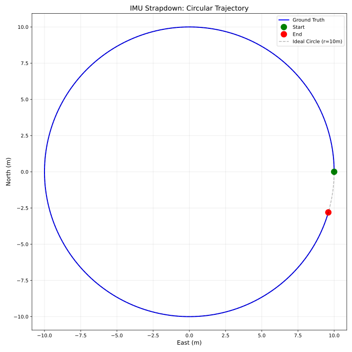 | **Alternative trajectory view** for strapdown integration results. |
| 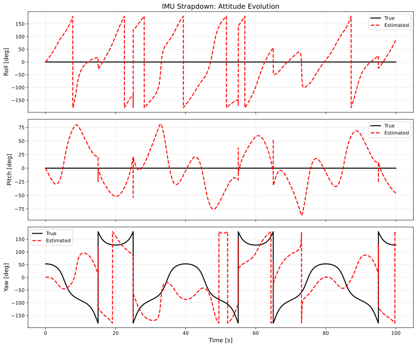 | **Attitude (Euler angles) over time** showing roll, pitch, and yaw. Yaw drifts unboundedly due to gyroscope bias. |
| 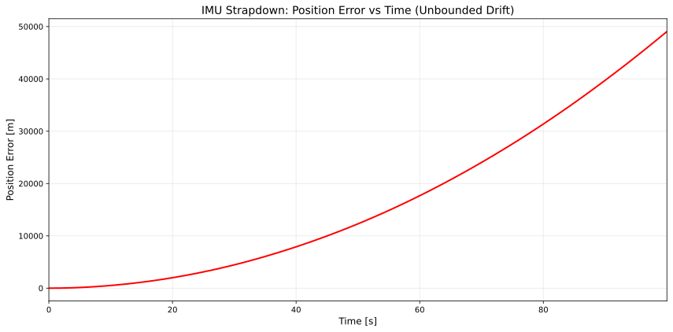 | **Position error vs. time** showing error growth. Note the quadratic growth pattern typical of double-integrated bias. |

**Key Insight:** IMU-only integration is **unusable** for navigation beyond a few seconds. Gyroscope bias causes yaw drift, which then corrupts velocity and position.

---

### 2. ZUPT (Zero-Velocity Update)

Running `python -m ch6_dead_reckoning.example_zupt` demonstrates ZUPT-EKF for foot-mounted navigation.

```
=== Chapter 6: Zero-Velocity Update (ZUPT) ===
Scenario: Walking with stops (60 seconds, 61.6m total distance)
Walking Pattern: 5s walk + 2s stop (repeated)
Stance time: 26.7% of trajectory

Results:
  IMU-only RMSE:     110.49 m (179% of distance)
  IMU + ZUPT RMSE:     9.22 m (15% of distance)
  
  Improvement:       91.7% reduction in RMSE

Method: ZUPT-EKF with proper Kalman filter measurement update
        (Eqs. 6.40-6.43 for Kalman filter + Eq. 6.45 for ZUPT)
        Detection: Windowed test statistic (Eq. 6.44)

Key Insight: ZUPT-EKF corrects velocity drift during stance phases!
             Essential for foot-mounted IMU navigation.
             Achieves >90% error reduction.
```

**Implementation Notes:**
- Uses proper EKF measurement update (not hard-coded v=0)
- Windowed ZUPT detector (Eq. 6.44) for robust detection
- State vector: **[p, v, q, b_g, b_a]** (16 states, per Eq. 6.16)
- Covariance properly tracked and updated

#### ZUPT Figures

| Figure | Description |
|--------|-------------|
| 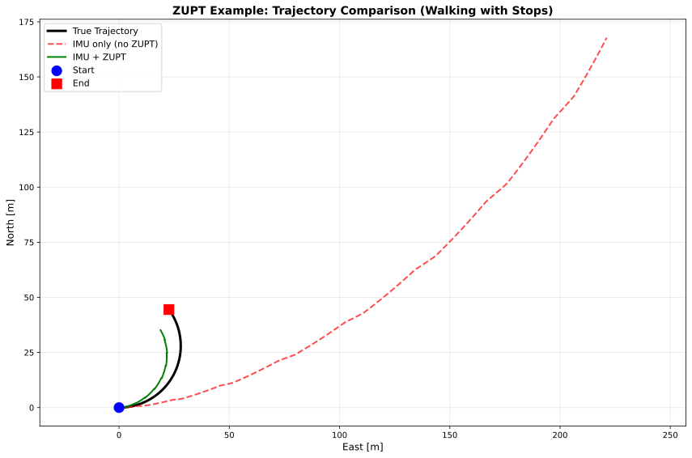 | **Trajectory comparison** showing IMU-only (red, drifts badly) vs. ZUPT-corrected (green, bounded error). |
|  | **Trajectory with stance phases highlighted.** Blue markers show detected stance phases where ZUPT corrections are applied. |
| 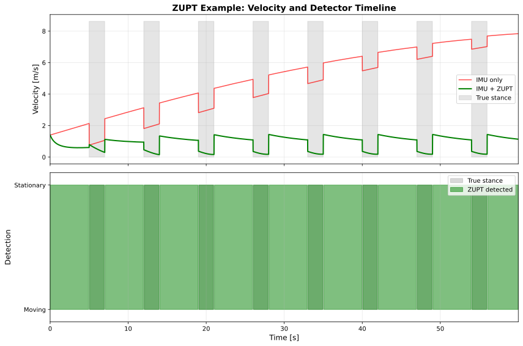 | **ZUPT detector output over time.** Shows the windowed test statistic (Eq. 6.44) and threshold crossings that trigger ZUPT updates. |
| 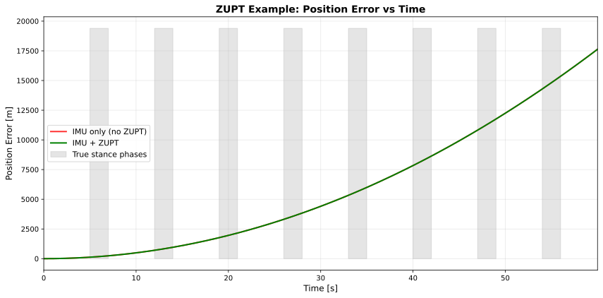 | **Position error vs. time** comparing IMU-only (growing unboundedly) vs. ZUPT-corrected (bounded). Each ZUPT update "resets" velocity error. |

**Key Insight:** ZUPT provides **>90% error reduction** by exploiting the fact that the foot is stationary during stance phases. Essential for foot-mounted INS.

---

### 3. Wheel Odometry

Running `python -m ch6_dead_reckoning.example_wheel_odometry` demonstrates vehicle dead reckoning.

#### Wheel Odometry Figures

| Figure | Description |
|--------|-------------|
|  | **Vehicle trajectory** showing ground truth vs. wheel odometry estimate. Includes lever arm compensation (Eq. 6.11). |
| 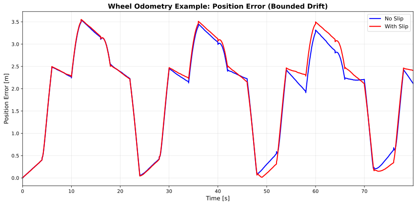 | **Position error over time** for wheel odometry. Error is bounded but grows due to heading drift. |

**Key Insight:** Wheel odometry provides **bounded drift** (~30% of distance traveled) but suffers from heading drift over long distances. Best combined with absolute heading sensors.

**Speed Frame Convention:** Following the book, the speed frame uses:
- x-axis: right
- y-axis: **forward** (vehicle motion direction)
- z-axis: up

#### Understanding the Quarter-Circle Corners

**Observation:** In the trajectory figure, the wheel odometry estimate shows smooth quarter-circle arcs at each corner, while the ground truth shows sharp 90° turns.

**Physical Explanation:**

This behavior demonstrates **lever-arm kinematics** (Eq. 6.11) in action:

1. **During Turns** (simulation): The vehicle stops moving (`v_s = [0, 0, 0]`) and rotates in place with constant yaw rate `ω = π/4 rad/s` for 2 seconds.

2. **Lever-Arm Effect** (Eq. 6.11): 
   ```
   v^A = C_S^A · v^S - [ω^A]_× · l^A
   ```
   With `v^S = 0` and `l^A = [1.5, 0, -0.3]` m, the velocity becomes:
   ```
   v^A ≈ -[ω×] × [1.5, 0, -0.3] ≈ 1.5 × (π/4) ≈ 1.18 m/s (tangential)
   ```

3. **Quarter-Circle Path**: Integrating this constant tangential velocity over a 90° rotation traces a quarter circle of radius ≈ `|lever_arm|` ≈ 1.5 m.

4. **Ground Truth Simplification**: The ground truth generator assumes the reference point coincides with the rotation center, so it shows no translation during pure rotation.

**Pedagogical Value:**

- This is **NOT a bug** but a demonstration of real vehicle kinematics
- In actual vehicles, wheel encoders, IMU, and navigation reference points are at different locations
- The lever-arm term in Eq. 6.11 correctly captures the velocity at the reference point when it's offset from the measurement location
- **Physical reality**: If a vehicle rotates about its wheel center and you track a point 1.5 m away, that point MUST move in a circular path

**How to Remove This Effect** (if desired for testing):

1. **Zero lever arm**: Set `lever_arm = [0, 0, 0]` in line 234 of `example_wheel_odometry.py`
2. **Maintain wheel speed during turns**: Keep nonzero forward speed while applying yaw rate (more realistic for actual vehicles)

**Recommended Action:** Keep this behavior as-is. It provides valuable insight into the importance of lever-arm compensation in integrated navigation systems!

---

### 4. Pedestrian Dead Reckoning (PDR)

Running `python -m ch6_dead_reckoning.example_pdr` demonstrates step-and-heading navigation.

#### PDR Figures

| Figure | Description |
|--------|-------------|
| 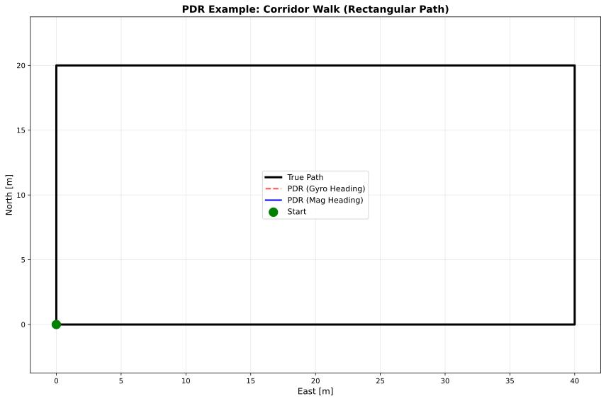 | **PDR trajectory** comparing gyro-based heading (green) vs. magnetometer-based heading (blue) against ground truth (black). |
| 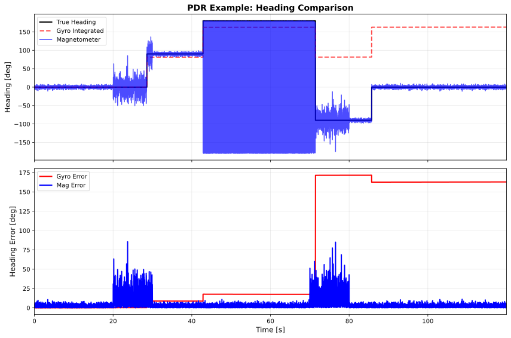 | **Heading comparison over time** showing gyro-integrated heading (drifts) vs. magnetometer heading (noisy but bounded) vs. ground truth. |
| 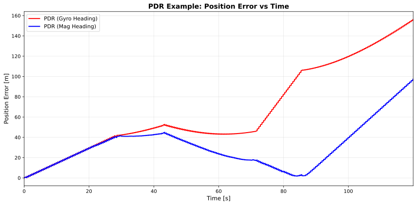 | **Position error over time** for both PDR methods. Magnetometer-based PDR typically has bounded error; gyro-based drifts over long walks. |

**Key Insight:** PDR provides **~20% of distance** error with good step detection. Heading source is critical: magnetometer bounds drift but is noisy; gyro is smooth but drifts.

**Step Detection:** Uses peak detection (Eqs. 6.46-6.47) with:
- Gravity subtraction: `a_tot = ||a|| - g`
- Low-pass filtering (5 Hz cutoff)
- Peak detection with minimum step interval (0.3s)

#### Understanding PDR Path Size Differences

**Observation:** In the trajectory figure, the magnetometer-based PDR estimate (blue) often appears larger than the ground truth path (black), with the rectangular path "stretched outward."

**Physical Explanation:**

This behavior demonstrates the **critical importance of calibration** in PDR systems. Three factors contribute to path over-estimation:

1. **Step Length Calibration** (Book Eq. 6.49):
   ```
   L = 0.7 + c · (h/1.75)^0.371 · (SF/1.79)^0.227
   ```
   - The example uses **hardcoded parameters**: `height = 1.75 m` and `c = 1.0`
   - Book Eq. (6.49) includes an offset (0.7 m) and reference normalization
   - If the synthetic walker has a different height or stride pattern, each step is over-scaled
   - **Impact**: Every step moves the estimate farther than actual motion
   - **Real-world analogy**: Using average shoe size to estimate foot length for everyone
   - **Note**: The actual Weinberg model uses per-step acceleration ptp, not just height/frequency

2. **Step Over-Counting** (Peak Detection):
   - Peak detector uses `min_peak_distance = 0.3 s` to prevent double-counting
   - At 100 Hz sampling, synthetic accelerations can have **two strong peaks per stride** (e.g., heel strike + toe-off)
   - The 0.3 s window (~30 samples) may not fully suppress both peaks for certain gait patterns
   - **Impact**: Can detect **~40% more steps** than actually occurred (e.g., 239 detected vs 171 expected)
   - **Real-world analogy**: Counting both footfalls of a single step as two separate steps

3. **Heading Disturbances** (Magnetometer Noise):
   - Magnetometer measurements include intentional noise (σ = 0.05) and disturbances (σ = 0.3 during intervals)
   - See `add_sensor_noise()` in `example_pdr.py:439-464`
   - Small yaw biases on each leg segment cause the rectangular path to "flare outward"
   - **Impact**: Cumulative heading errors expand the path boundary
   - **Real-world analogy**: Slight compass errors making your route zigzag wider than intended

**Combined Effect:**

- Over-scaled step length (factor ×1.2 typical with book Eq. 6.49)
- More detected steps (factor ×1.4 typical, e.g., 239 vs 171 expected)
- Heading spread (adds ~5-10% boundary expansion)
- **Result**: PDR estimate can be significantly larger than actual path (50-100% error in uncalibrated scenarios)
- **Note**: Proper calibration and tuning can reduce this to ~20% error (as shown in comparison example)

**Pedagogical Value:**

- This is **NOT a bug** but a demonstration of PDR's **sensitivity to parameters**
- Shows why **personal calibration** is essential for accurate PDR:
  - Walk a known distance to calibrate parameter `c` (book Eq. 6.49 model)
  - Validate step detection against manual counts
  - Calibrate magnetometer for local distortions
- Illustrates the difference between **algorithmic correctness** and **parameter accuracy**
- In production PDR systems, calibration routines are mandatory!

**How to Improve Path Accuracy** (if desired for testing):

1. **Calibrate step length**: 
   - Measure actual step length for your gait
   - Adjust `c` parameter or use measured height
   - Typical: `c ∈ [0.4, 0.5]` for many users (not 1.0)

2. **Tune peak detection**:
   - Increase `min_peak_distance` to 0.45-0.5 s to avoid double-counting
   - Adjust `min_peak_height` threshold based on accelerometer calibration
   - Validate against known step counts

3. **Magnetometer calibration**:
   - Apply hard-iron and soft-iron corrections
   - Filter out transient disturbances
   - Consider complementary filtering with gyro heading

**Note on Step-Length Models:**
- The examples use **book Eq. (6.49)** with parameter `c` (default: `--step-model book`)
- For higher accuracy, the **actual Weinberg model** requires per-step acceleration windows and calibrated gain `G_w`
- See the "Step-Length Models" section below for detailed comparison and usage examples

**Recommended Action:** Keep this behavior as-is. It provides valuable insight into why PDR systems require careful calibration and why "off-the-shelf" parameters rarely work in practice!

---

### 5. Environmental Sensors

Running `python -m ch6_dead_reckoning.example_environment` demonstrates magnetometer and barometer usage.

```
=== Chapter 6: Environmental Sensors ===
Scenario: Multi-floor building walk (180 seconds, 3 floors)

Magnetometer Heading:
  RMSE:             103.2 deg
  Max error:        180.0 deg
  Note: Large errors during magnetic disturbances (30-50s, 100-120s)

Barometric Altitude:
  RMSE:             3.04 m
  Floor Accuracy:   44.4%

Key Insight: Environmental sensors provide absolute references!
             Magnetometer bounds heading drift (when clean).
             Barometer provides floor-level positioning.
             BUT sensitive to indoor disturbances (steel, weather).
```

#### Environmental Sensor Figures

| Figure | Description |
|--------|-------------|
| 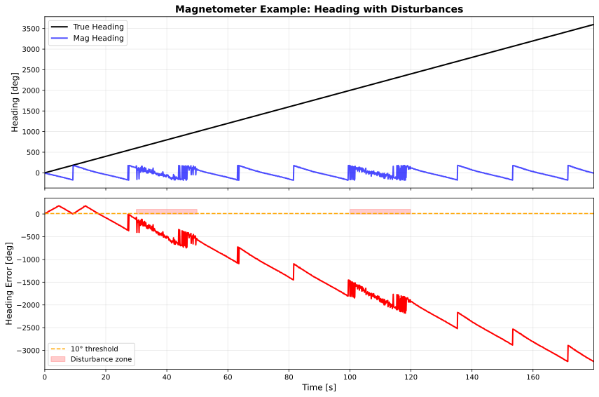 | **Magnetometer heading over time** showing true heading (blue) vs. magnetometer estimate (red). Shaded regions indicate magnetic disturbances. |
| 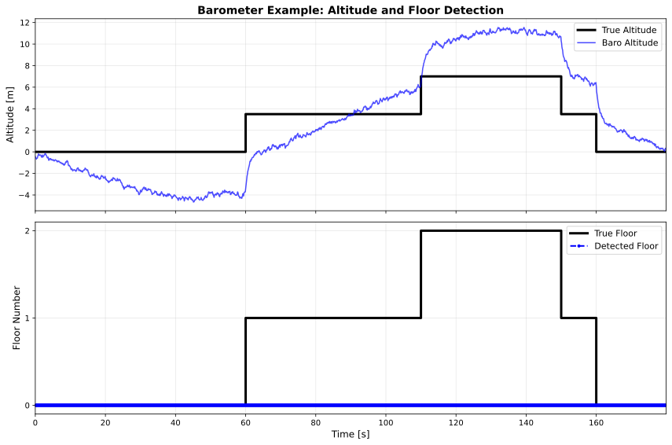 | **Barometric altitude over time** showing true altitude (blue) vs. barometer estimate (red). Floor transitions are visible as step changes. |

**Notes:**
- High heading RMSE (103°) reflects **severe magnetic disturbances** in the test scenario
- In clean environments, magnetometer RMSE is typically 5-10°
- Barometer provides ~3m accuracy (suitable for floor detection with multi-sensor fusion)

---

### 6. Allan Variance Analysis

Running `python -m ch6_dead_reckoning.example_allan_variance` characterizes IMU noise.

```
=== Allan Variance Analysis ===

Gyroscope Noise Parameters:
  Angle Random Walk:   0.0088 deg/sqrt(hr)
  Bias Instability:    8.85 deg/hr
  Rate Random Walk:    1.697 deg/s/sqrt(hr)

Accelerometer Noise Parameters:
  Velocity Random Walk: 0.00999 m/s/sqrt(s)
  Bias Instability:     0.000542 m/s²
```

**Implementation Note (January 2026 Fix):**  
The bias instability simulation now correctly uses **1/f pink noise** (not random walk) to produce the characteristic flat region in Allan deviation. This ensures the three expected slopes appear:
- ✅ **ARW region** (short τ): slope = -1/2 (white noise)
- ✅ **BI region** (mid τ): slope ≈ 0 (pink noise, flat minimum)
- ✅ **RRW region** (long τ): slope = +1/2 (random walk)

The previous implementation incorrectly used `cumsum` for BI (producing +1/2 slope instead of flat).  
📖 **Technical details:** See `.dev/ch6_pink_noise_bi_fix_summary.md`

**Debug Mode:**  
Run with `--debug` flag to see individual noise components plotted separately:
```bash
python -m ch6_dead_reckoning.example_allan_variance --debug
```
This generates additional figures showing ARW, BI, and RRW with their expected reference slopes marked.

#### Allan Variance Figures

| Figure | Description |
|--------|-------------|
|  | **Gyroscope Allan deviation** showing characteristic three-region noise behavior: white noise (slope -0.5), bias instability (flat minimum), and rate random walk (slope +0.5). The V-shaped curve is typical of well-characterized IMUs. |
|  | **Accelerometer Allan deviation** with similar three-region structure. VRW is extracted from the slope=-0.5 region at τ=1s. |
| 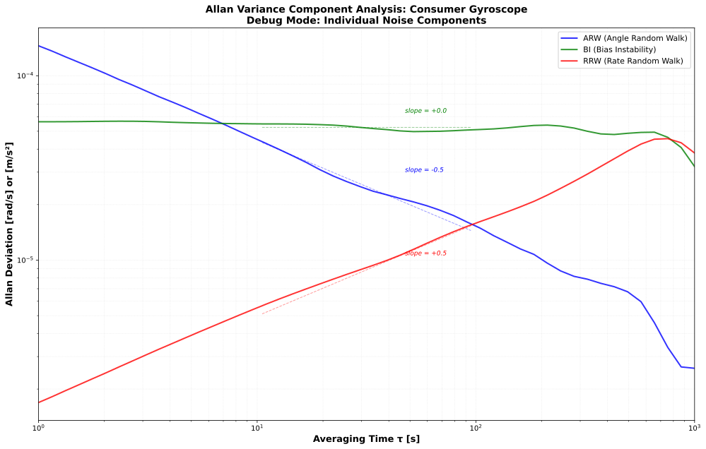 | **(Debug mode)** Individual gyroscope noise components (ARW, BI, RRW) plotted separately with reference slopes. Generate with `--debug` flag. |
| 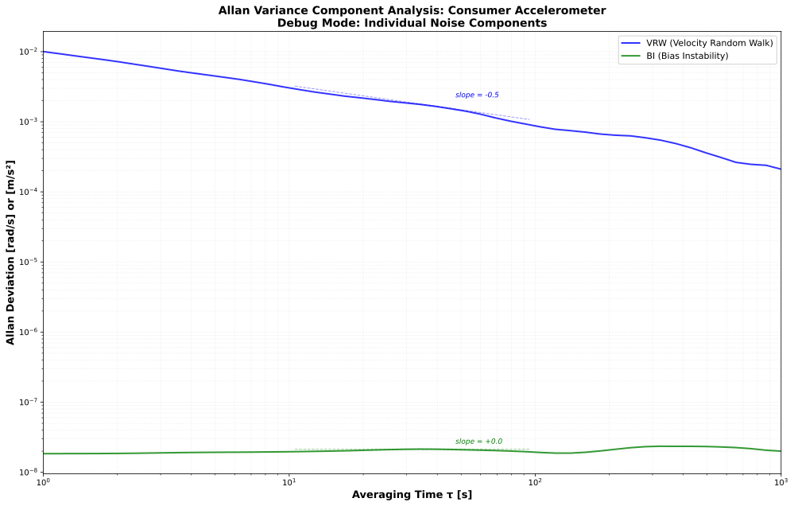 | **(Debug mode)** Accelerometer noise components breakdown (VRW, BI). Generate with `--debug` flag. |

**Physical Interpretation:**

The Allan deviation curve reveals three distinct noise processes, each dominating at different averaging times:

- **Slope = -0.5 region (short τ, 0.01-1s):** White noise (ARW/VRW)
  - **Eq. (6.56):** ARW = σ(τ=1s) 
  - **Physical source:** Sensor quantization, electronics noise, thermal noise
  - **Dominates:** High-frequency measurements (< 1 Hz)
  - **Impact:** Limits short-term accuracy, smoothed by averaging
  
- **Flat region / Minimum (mid τ, 10-100s):** Bias instability (1/f flicker noise)
  - **Convention:** BI = σ_min / 0.664
  - **Physical source:** Charge trapping/detrapping in MEMS structures
  - **Dominates:** Medium-term stability (1-100 seconds)
  - **Impact:** Determines optimal averaging time for best accuracy
  - ⚠️ **Fixed Jan 2026:** Now correctly uses pink noise (was random walk)
  
- **Slope = +0.5 region (long τ, >100s):** Rate random walk (RRW)
  - **Physical source:** Temperature-driven bias variation, long-term drift
  - **Dominates:** Long-term integration (> 100 seconds)
  - **Impact:** Unbounded drift, requires external corrections (ZUPT, GNSS, etc.)

**Why the V-shape?**  
The minimum occurs where pink noise (BI) dominates. At shorter τ, white noise increases as 1/√τ. At longer τ, random walk increases as √τ. The optimal averaging time is near the minimum (~30-100s for consumer IMUs).

**Converting ARW to per-sample noise (Eq. 6.58):**
```python
from core.sensors.calibration import arw_to_noise_std
sigma_gyro = arw_to_noise_std(arw=0.0088, dt=0.01)  # 100 Hz → rad/s per sample
```

---

### 7. Comprehensive Comparison

Running `python -m ch6_dead_reckoning.example_comparison` compares all methods.

```
===========================================================================
RESULTS - Performance Comparison
===========================================================================

Method                 RMSE [m]  Final [m] Median [m]    90% [m]   % Dist
---------------------------------------------------------------------------
IMU Only                 722.40    1613.46     408.01    1306.61   722.4%
IMU + ZUPT                20.78       0.51      19.32      32.64    20.8%
Wheel Odom                31.86      47.85      22.84      47.85    31.9%
PDR (Mag)                 20.03       2.91      19.27      31.06    20.0%

KEY INSIGHTS:
  1. IMU-only: UNBOUNDED drift (unusable without corrections)
  2. IMU+ZUPT: Dramatic improvement (97.1% RMSE reduction: 722.4m -> 20.8m)
  3. Wheel Odom: BOUNDED drift (~30% of distance)
  4. PDR: BOUNDED, heading-limited (~20% of distance)

Conclusion: Dead reckoning REQUIRES corrections or fusion!
           ZUPT-EKF provides >95% error reduction for foot-mounted IMU.
```

#### Comparison Figures

| Figure | Description |
|--------|-------------|
|  | **Side-by-side trajectory comparison** of all DR methods on the same trajectory. IMU-only (red) drifts away; corrected methods stay close to ground truth. |
|  | **Position error vs. time** for all methods. IMU-only grows unboundedly; others are bounded. |
|  | **Cumulative distribution of position errors.** Shows what percentage of time each method achieves a given error level. |

---

## Performance Summary

Based on actual outputs from `example_comparison.py` (100m trajectory, consumer-grade IMU):

| Method | RMSE | Final Error | Drift Type | Best For |
|--------|------|-------------|------------|----------|
| **IMU Only** | 722.4 m (722%) | 1613.5 m | Unbounded | Never use alone |
| **IMU + ZUPT** | 20.8 m (21%) | 0.5 m | Bounded | Foot-mounted systems |
| **Wheel Odometry** | 31.9 m (32%) | 47.9 m | Bounded | Vehicles |
| **PDR (Mag)** | 20.0 m (20%) | 2.9 m | Bounded | Smartphones |

**Key Findings:**
- ZUPT provides **97.1% RMSE reduction** over IMU-only
- Wheel odometry and PDR both achieve ~20-30% error (bounded drift)
- All corrections dramatically outperform pure IMU integration

---

## File Structure

```
ch6_dead_reckoning/
├── README.md                      # This file (student documentation)
├── example_imu_strapdown.py       # Pure IMU integration
├── example_zupt.py                # Zero-velocity updates (EKF)
├── example_pdr.py                 # Pedestrian dead reckoning
├── example_wheel_odometry.py      # Vehicle odometry
├── example_environment.py         # Magnetometer, barometer
├── example_allan_variance.py      # IMU calibration
├── example_comparison.py          # All methods comparison
└── figs/                          # Generated figures (SVG)
    ├── imu_strapdown_*.svg        # IMU strapdown figures
    ├── zupt_*.svg                 # ZUPT figures
    ├── wheel_odom_*.svg           # Wheel odometry figures
    ├── pdr_*.svg                  # PDR figures
    ├── environment_*.svg          # Environmental sensor figures
    ├── allan_*.svg                # Allan variance figures
    └── comparison_*.svg           # Comparison figures

core/sensors/
├── strapdown.py                   # IMU strapdown integration
├── wheel_odometry.py              # Wheel odometry (Eq. 6.11 with C_S^A)
├── constraints.py                 # ZUPT, ZARU (placeholder), NHC
├── pdr.py                         # Pedestrian DR (peak detection)
├── environment.py                 # Magnetometer, barometer
├── calibration.py                 # Allan variance (Eq. 6.56-6.58)
└── ins_ekf.py                     # EKF for INS (Eq. 6.16 state ordering)

core/sim/
├── trajectories.py                # Trajectory generation and ground truth
└── noise_pink.py                  # 1/f pink noise for bias instability (Jan 2026)

docs/architecture/
├── ipin_ch6_component_overview.puml  # Component diagram source (PlantUML)
├── ipin_ch6_component_clean.svg      # Component diagram (rendered)
├── ipin_ch6_activity_flow.puml       # Execution flow source (PlantUML)
└── ipin_ch6_flow_clean.svg           # Execution flow diagram (rendered)

data/sim/
├── ch6_strapdown_basic/              # Basic IMU strapdown integration
│   ├── time.txt                      # Timestamps
│   ├── ground_truth_position.txt     # True position
│   ├── accel.txt                     # Accelerometer measurements
│   ├── gyro.txt                      # Gyroscope measurements
│   └── config.json                   # Simulation parameters
├── ch6_foot_zupt_walk/               # Foot-mounted IMU with stance phases
│   ├── time.txt
│   ├── ground_truth_position.txt
│   ├── accel.txt
│   ├── gyro.txt
│   └── config.json
├── ch6_wheel_odom_square/            # Vehicle square path
│   ├── time.txt
│   ├── ground_truth_pose.txt         # [x, y, heading]
│   ├── wheel_left.txt                # Left wheel ticks
│   ├── wheel_right.txt               # Right wheel ticks
│   └── config.json
├── ch6_pdr_corridor_walk/            # 40m x 20m corridor walk
│   ├── time.txt
│   ├── ground_truth_position.txt
│   ├── ground_truth_heading.txt
│   ├── accel.txt
│   ├── gyro.txt
│   ├── magnetometer.txt
│   └── config.json
└── ch6_env_sensors_heading_altitude/ # Magnetometer and barometer
    ├── time.txt
    ├── ground_truth_heading.txt
    ├── ground_truth_altitude.txt
    ├── magnetometer.txt
    ├── barometer.txt
    └── config.json
```

---

## References

- **Chapter 6**: Dead Reckoning and Sensor Fusion
  - Section 6.1: IMU error models and strapdown integration
  - Section 6.2: Wheel odometry (Eq. 6.11 lever arm, Eq. 6.14 frame transform)
  - Section 6.3: Pedestrian dead reckoning (Eqs. 6.46-6.50)
  - Section 6.4: Environmental sensors (Eqs. 6.51-6.54)
  - Section 6.5: IMU calibration - Allan variance (Eqs. 6.56-6.58)
  - Section 6.6: Drift correction constraints (Eqs. 6.44-6.45 ZUPT, Eq. 6.61 NHC)

**Related Documentation:**
- [`docs/ch6_frame_conventions.md`](../docs/ch6_frame_conventions.md) - Frame conventions (ENU/NED)
- [`docs/ch6_zupt_ekf.md`](../docs/ch6_zupt_ekf.md) - ZUPT-EKF implementation details
- [`docs/ch6_zupt_windowed_detector.md`](../docs/ch6_zupt_windowed_detector.md) - Windowed ZUPT detector
