# Chapter 6: Dead Reckoning

## Overview

This module implements dead reckoning and sensor algorithms described in **Chapter 6** of *Principles of Indoor Positioning and Indoor Navigation*. Dead reckoning propagates position using proprioceptive sensors (IMU, wheel encoders, step counters) without external references.

The module provides simulation-based examples of:
- **IMU strapdown integration** (attitude, velocity, position propagation)
- **Wheel odometry** (vehicle dead reckoning with lever arm compensation)
- **Drift correction constraints** (ZUPT, ZARU, NHC)
- **Pedestrian dead reckoning** (step-and-heading navigation)
- **Environmental sensors** (magnetometer heading, barometric altitude)
- **IMU calibration** (Allan variance noise characterization)

**Key Insight:** Dead reckoning drifts unbounded without corrections. Examples demonstrate both the drift problem and solutions.

## ⚙️ Frame Conventions (IMPORTANT!)

All Chapter 6 algorithms use **explicit frame conventions** via the `FrameConvention` dataclass. This ensures:
- ✅ Correct gravity handling (no drift for stationary IMU)
- ✅ Consistent heading definitions (0° = East in ENU, 0° = North in NED)
- ✅ Support for both ENU and NED coordinate systems

**Default:** ENU (East-North-Up) where:
- x = East, y = North, z = Up
- Heading 0° = East, 90° = North
- Gravity: [0, 0, -9.81] m/s²

```py
from core.sensors import FrameConvention, strapdown_update

# Explicit frame convention (recommended)
frame = FrameConvention.create_enu()
q, v, p = strapdown_update(q, v, p, omega_b, f_b, dt, frame=frame)
```

**📖 See detailed documentation:** [`docs/ch6_frame_conventions.md`](../docs/ch6_frame_conventions.md)

**✅ Validated:** All conventions are tested in `tests/core/test_strapdown_stationary_imu.py` (stationary IMU produces **zero drift**).

## 📐 EKF State Vector (Eq. 6.16)

The Extended Kalman Filter uses a **16-element state vector** ordered as:

```
x = [p, v, q, b_g, b_a]
```

| Component | Indices | Size | Description |
|-----------|---------|------|-------------|
| **p** | 0:3 | 3 | Position in map frame (m) |
| **v** | 3:6 | 3 | Velocity in map frame (m/s) |
| **q** | 6:10 | 4 | Quaternion (body-to-map, scalar-first) |
| **b_g** | 10:13 | 3 | Gyroscope bias (rad/s) |
| **b_a** | 13:16 | 3 | Accelerometer bias (m/s²) |

This ordering matches **Eq. (6.16)** in the book and is used consistently across all EKF-related code.

## Quick Start

```bash
# Run individual examples
python -m ch6_dead_reckoning.example_imu_strapdown
python -m ch6_dead_reckoning.example_zupt
python -m ch6_dead_reckoning.example_wheel_odometry
python -m ch6_dead_reckoning.example_pdr
python -m ch6_dead_reckoning.example_environment
python -m ch6_dead_reckoning.example_allan_variance         # Standard analysis
python -m ch6_dead_reckoning.example_allan_variance  # prints the component breakdown

# Run PDR with pre-generated dataset
python -m ch6_dead_reckoning.example_pdr --data ch6_pdr_corridor_walk

# Run comprehensive comparison
python -m ch6_dead_reckoning.example_comparison

# Animate the drift and its correction (writes figs/ch6_zupt_drift.gif)
python -m ch6_dead_reckoning.example_zupt --animate
```

## Animations

| GIF | Built by | Size | Shows |
|-----|----------|------|-------|
| `ch6_zupt_drift.gif` | `example_zupt.py --animate` | 0.46 MB | IMU-only drift growing without bound while ZUPT pins it back during every stance phase |

Dead reckoning fails *over time*, which is the whole argument of this chapter
and the one thing a static trajectory plot cannot carry. Side by side, two
final positions merely look different; watching them, the IMU-only track
visibly peels away while the ZUPT track keeps getting corrected.

The animation has three panels because one pair of axes cannot show both
stories: after 60 s the IMU-only track has drifted ~215 m while the walk itself
covers ~60 m, so on a shared scale the truth and ZUPT tracks collapse into a
single blob. The first panel gives the full extent (how bad the drift gets),
the second zooms to the walk (that ZUPT really does track it), and the third
plots error against time with the stance phases shaded.

For this run: IMU-only ends **237 m** from truth, IMU + ZUPT ends **12.5 m** —
a 91.7% reduction in RMSE.

Animations are behind `--animate`, never part of a default run. Keep them
small: they are committed binaries and git retains every version forever.
`core.eval.save_animation` defaults to `dpi=80` and warns above 1.5 MB.

## 📂 Dataset Connection

| Example Script | Dataset | Description |
|----------------|---------|-------------|
| `example_pdr.py` | `data/sim/ch6_pdr_corridor_walk/` | 40m x 20m corridor walk with IMU data |
| *(manual loading)* | `data/sim/ch6_strapdown_basic/` | Basic IMU strapdown integration |
| *(manual loading)* | `data/sim/ch6_wheel_odom_square/` | Vehicle wheel odometry square path |
| *(manual loading)* | `data/sim/ch6_foot_zupt_walk/` | Foot-mounted IMU with ZUPT |
| *(manual loading)* | `data/sim/ch6_env_sensors_heading_altitude/` | Magnetometer and barometer data |

**Load dataset manually:**
```python
import numpy as np
import json
from pathlib import Path

path = Path("data/sim/ch6_pdr_corridor_walk")
t = np.loadtxt(path / "time.txt")
pos_true = np.loadtxt(path / "ground_truth_position.txt")
heading_true = np.loadtxt(path / "ground_truth_heading.txt")
accel = np.loadtxt(path / "accel.txt")
gyro = np.loadtxt(path / "gyro.txt")
mag = np.loadtxt(path / "magnetometer.txt")
config = json.load(open(path / "config.json"))
```

## Equation Reference

### IMU Strapdown Integration

| Function | Location | Equation | Description |
|----------|----------|----------|-------------|
| `omega_matrix()` | `core/sensors/strapdown.py` | Eq. (6.3) | Skew-symmetric matrix for quaternion kinematics |
| `quat_integrate()` | `core/sensors/strapdown.py` | Eq. (6.2-6.4) | Discrete quaternion integration |
| `vel_update()` | `core/sensors/strapdown.py` | Eq. (6.7) | Velocity update with specific force |
| `pos_update()` | `core/sensors/strapdown.py` | Eq. (6.10) | Position update |
| `strapdown_update()` | `core/sensors/strapdown.py` | Eq. (6.2-6.10) | Full strapdown loop |

### Wheel Odometry

| Function | Location | Equation | Description |
|----------|----------|----------|-------------|
| `wheel_speed_to_attitude_velocity()` | `core/sensors/wheel_odometry.py` | Eq. (6.11) | Lever arm compensation with C_S^A rotation |
| `attitude_to_map_velocity()` | `core/sensors/wheel_odometry.py` | Eq. (6.14) | Frame transform |
| `odom_pos_update()` | `core/sensors/wheel_odometry.py` | Eq. (6.15) | Position update |

**Note:** Speed frame convention follows book: x-right, y-forward, z-up.

### Drift Correction Constraints

| Function | Location | Equation | Description |
|----------|----------|----------|-------------|
| `detect_zupt_windowed()` | `core/sensors/constraints.py` | Eq. (6.44) | ZUPT windowed test statistic |
| `ZuptMeasurementModel` | `core/sensors/constraints.py` | Eq. (6.45) | ZUPT pseudo-measurement |
| `ZaruMeasurementModelPlaceholder` | `core/sensors/constraints.py` | ⚠️ INCOMPLETE | ZARU placeholder (see class docs) |
| `NhcMeasurementModel` | `core/sensors/constraints.py` | Eq. (6.61) | NHC pseudo-measurement |

### Pedestrian Dead Reckoning (PDR)

| Function | Location | Equation | Description |
|----------|----------|----------|-------------|
| `total_accel_magnitude()` | `core/sensors/pdr.py` | Eq. (6.46) | Total acceleration magnitude |
| `detect_steps_peak_detector()` | `core/sensors/pdr.py` | Eq. (6.46-6.47) | Peak-based step detection |
| `step_length()` | `core/sensors/pdr.py` | ⚠️ DEPRECATED | Generic power-law (not Eq. 6.49 or Weinberg) |
| `step_length_book_eq6_49()` | `core/sensors/pdr.py` | Eq. (6.49) | Book's actual step length formula |
| `step_length_weinberg()` | `core/sensors/pdr.py` | Weinberg (1995) | Actual Weinberg model: SL = G_w·ptp^0.25 |
| `calibrate_weinberg_gain()` | `core/sensors/pdr.py` | — | Calibrate G_w from known distance |
| `pdr_step_update()` | `core/sensors/pdr.py` | Eq. (6.50) | 2D position update |

### Environmental Sensors

| Function | Location | Equation | Description |
|----------|----------|----------|-------------|
| `mag_tilt_compensate()` | `core/sensors/environment.py` | Eq. (6.52) | Tilt compensation |
| `mag_heading()` | `core/sensors/environment.py` | Eq. (6.51-6.53) | Heading from magnetometer |
| `pressure_to_altitude()` | `core/sensors/environment.py` | Eq. (6.54) | Barometric altitude |

### Allan Variance / IMU Calibration

| Function | Location | Equation | Description |
|----------|----------|----------|-------------|
| `allan_variance()` | `core/sensors/calibration.py` | IEEE Std 952-1997 | Standard Allan variance computation |
| `identify_random_walk()` | `core/sensors/calibration.py` | Eq. (6.56) | ARW/VRW extraction from slope=-0.5 region |
| `arw_to_noise_std()` | `core/sensors/calibration.py` | Eq. (6.58) | Convert ARW to per-sample noise: σ = ARW × √Δt |

---

## Step-Length Models (Important Clarification)

The repository provides **two distinct step-length models** with clear naming to avoid confusion:

### 1. Book Eq. (6.49) — `step_length_book_eq6_49()`

**Formula:**
```
L = 0.7 + c · (h/1.75)^0.371 · (SF/1.79)^0.227
```

**Description:** The actual formula from the IPIN book Eq. (6.49), which includes:
- **Offset term**: 0.7 m (base step length)
- **Reference normalization**: h_ref = 1.75 m, SF_ref = 1.79 Hz
- **Empirical exponents**: a = 0.371 (height), b = 0.227 (frequency)

**Use when:** You want reproducibility with the book examples and have height + step frequency.

**Example:**
```python
from core.sensors import step_length_book_eq6_49

h = 1.75  # meters
SF = 2.0  # Hz
L = step_length_book_eq6_49(h, SF)  # ~1.7 m
```

### 2. Actual Weinberg Model — `step_length_weinberg()`

**Formula:**
```
SL = G_w · (max(f) - min(f))^0.25
```

**Description:** The **actual** Weinberg model from practice, which uses:
- **Per-step acceleration window**: peak-to-peak specific force amplitude
- **Quarter-power law**: Biomechanically motivated exponent
- **Calibrated gain G_w**: User-specific parameter (typically 0.3-0.5)

**Use when:** You have per-step acceleration segments and want higher accuracy (requires calibration).

**Example:**
```python
from core.sensors import step_length_weinberg, calibrate_weinberg_gain, detect_steps_peak_detector

# Detect steps
step_indices, accel_filtered = detect_steps_peak_detector(accel, dt=0.01)

# Calibrate gain on known distance
ptp_per_step = []
for i in range(len(step_indices)-1):
    seg = accel_filtered[step_indices[i]:step_indices[i+1]]
    ptp_per_step.append(np.ptp(seg))
G_w = calibrate_weinberg_gain(np.array(ptp_per_step), distance_m=50.0)

# Compute step lengths
for i in range(len(step_indices)-1):
    seg = accel_filtered[step_indices[i]:step_indices[i+1]]
    L = step_length_weinberg(seg, G_w)
```

**Reference:** Weinberg, H. (2002). "Using the ADXL202 in Pedometer and Personal Navigation Applications." Analog Devices AN-602.


### Model Selection Guide

| Scenario | Recommended Model | Why |
|----------|-------------------|-----|
| **Book reproducibility** | `step_length_book_eq6_49()` | Matches book equations exactly |
| **High accuracy** | `step_length_weinberg()` | Uses actual acceleration dynamics |
| **No calibration data** | `step_length_book_eq6_49()` | Works with just height + frequency |
| **Real-time systems** | `step_length_weinberg()` | More accurate after initial calibration |
| **Legacy code** | `step_length()` | Only for backward compatibility |

### PDR Example Usage

The `example_pdr.py` script now supports model selection:

```bash
# Use book Eq. (6.49) - default for reproducibility
python -m ch6_dead_reckoning.example_pdr --step-model book

# Use old power-law (deprecated)
python -m ch6_dead_reckoning.example_pdr --step-model power_law
```

**Note:** The Weinberg model is not yet fully integrated into `example_pdr.py` because it requires per-step window processing (needs refactoring).

---

## Example Outputs & Figures

### 1. IMU Strapdown Integration

Running `python -m ch6_dead_reckoning.example_imu_strapdown` demonstrates pure IMU integration without any corrections.

<!-- example-output: ch6_dead_reckoning.example_imu_strapdown -->
```
Configuration:
  Duration:        100.0 s
  IMU Rate:        100 Hz
  IMU Grade:       consumer
  Trajectory:      Figure-8 pattern
  Frame:           ENU
...
Generating trajectory...
  Total distance:  267.9 m
...
RESULTS (IMU-only, no corrections)
============================================================
  Final Position Error:  645.6 m (241.0% of distance)
  Max Velocity Error:    12.92 m/s
  Max Attitude Error:
    Roll:   0.1°
    Pitch:  0.1°
    Yaw:    359.6°
  Drift Rate:            6.456 m/s (UNBOUNDED!)
```

#### IMU Strapdown Figures

| Figure | Description |
|--------|-------------|
| 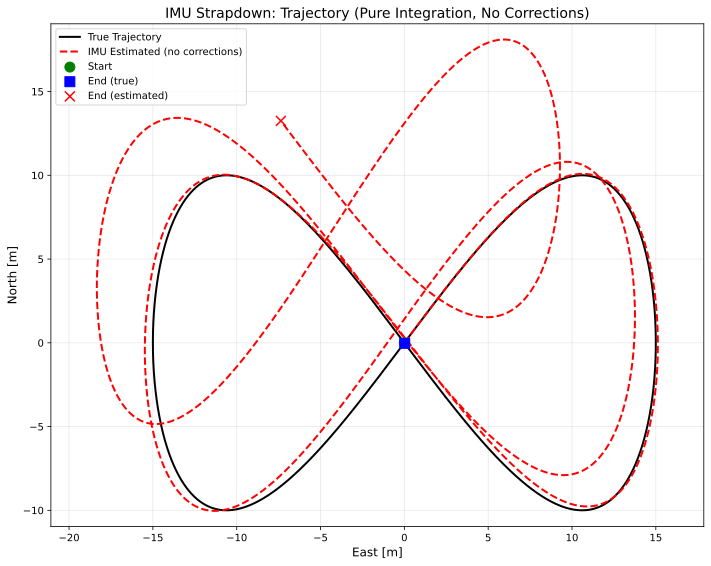 | **Trajectory comparison** showing ground truth (blue) vs. IMU-integrated path (red). Demonstrates how quickly position drifts without corrections. |
| 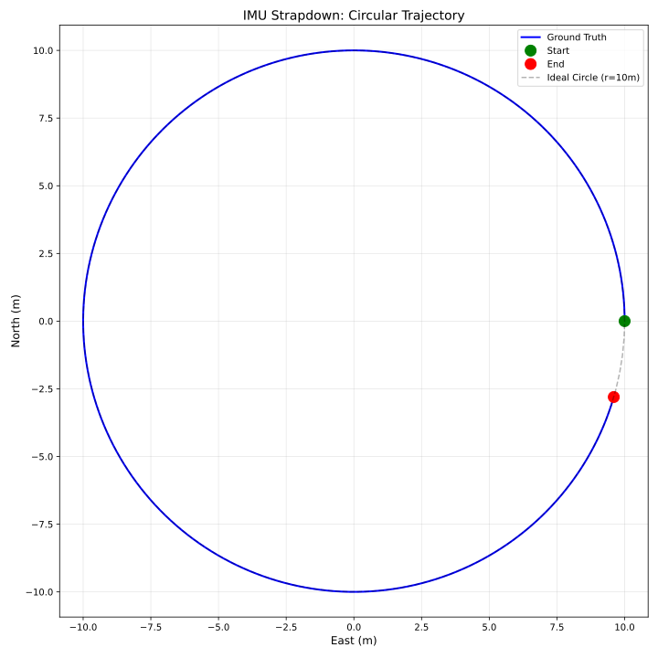 | **Alternative trajectory view** for strapdown integration results. |
| 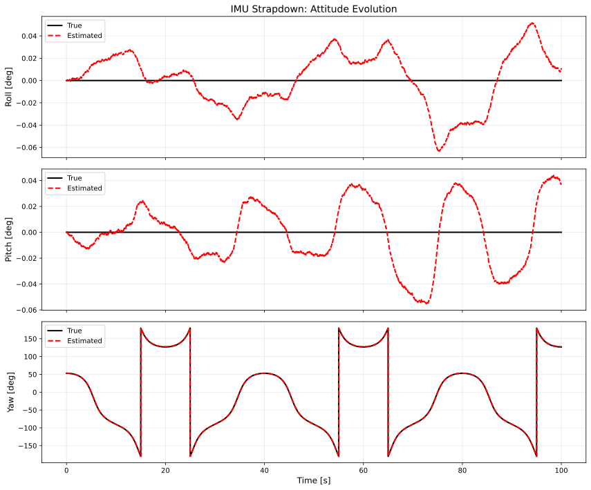 | **Attitude (Euler angles) over time** showing roll, pitch, and yaw. Yaw drifts unboundedly due to gyroscope bias. |
| 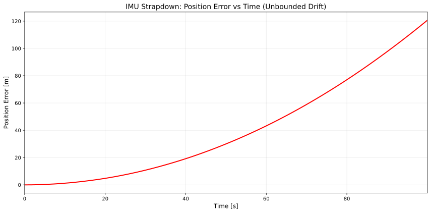 | **Position error vs. time** showing error growth. Note the quadratic growth pattern typical of double-integrated bias. |

**Key Insight:** IMU-only integration is **unusable** for navigation beyond a few seconds. Gyroscope bias causes yaw drift, which then corrupts velocity and position.

---

### 2. ZUPT (Zero-Velocity Update)

Running `python -m ch6_dead_reckoning.example_zupt` demonstrates ZUPT-EKF for foot-mounted navigation.

<!-- example-output: ch6_dead_reckoning.example_zupt -->
```
Configuration:
  Duration:        60.0 s
  IMU Rate:        100 Hz
  Walking Pattern: 5s walk + 2s stop (repeated)
  Step Rate:       2.0 Hz
  Step Length:     0.7 m
  Frame:           ENU
...
Generating walking trajectory with stance phases...
  Total distance:  61.6 m
  Stance time:     26.7% of trajectory
...
  ZUPT detections:  97.0% of samples
  Method:           EKF measurement update (not hard-coded v=0)
...
RESULTS
======================================================================
IMU-only (no ZUPT):
  Final error:  237.28 m (385.3% of distance)
  RMSE:         110.49 m
IMU + ZUPT:
  Final error:  12.46 m (20.2% of distance)
  RMSE:         9.22 m
Improvement:    91.7% reduction in RMSE
```

**Implementation Notes:**
- Uses proper EKF measurement update (not hard-coded v=0)
- Windowed ZUPT detector (Eq. 6.44) for robust detection
- State vector: **[p, v, q, b_g, b_a]** (16 states, per Eq. 6.16)
- Covariance properly tracked and updated

#### ZUPT Figures

| Figure | Description |
|--------|-------------|
| 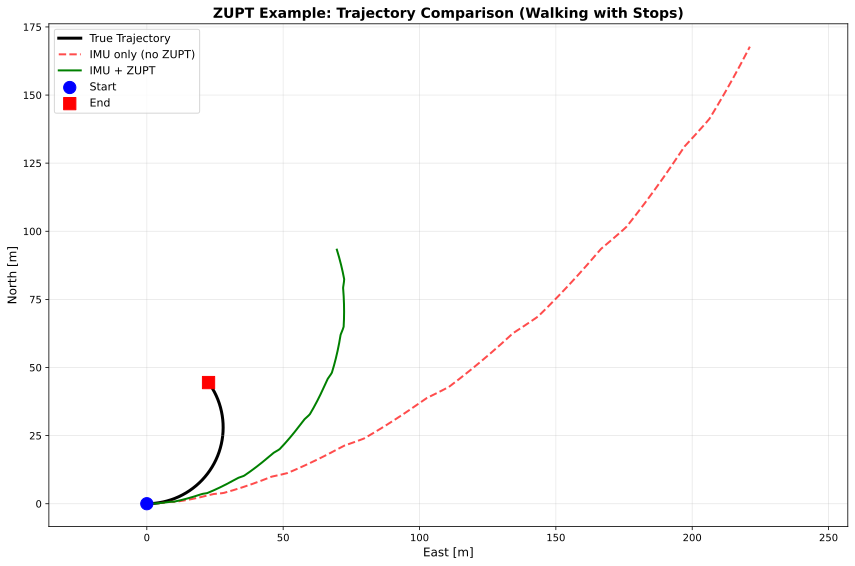 | **Trajectory comparison** showing IMU-only (red, drifts badly) vs. ZUPT-corrected (green, bounded error). |
| 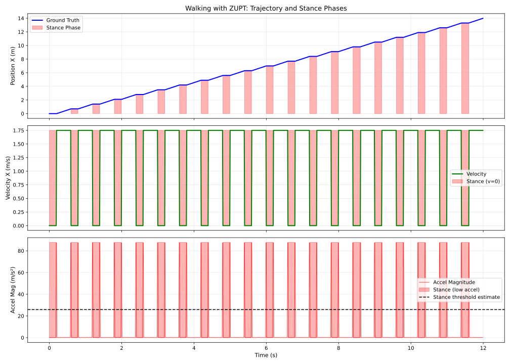 | **Trajectory with stance phases highlighted.** Blue markers show detected stance phases where ZUPT corrections are applied. |
| 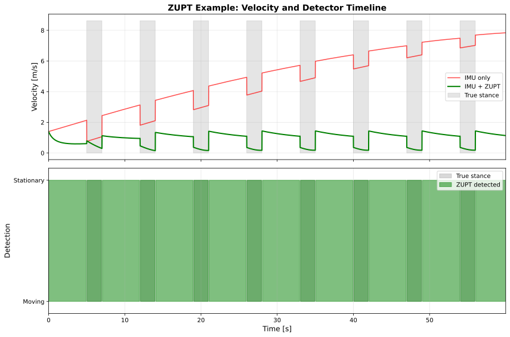 | **ZUPT detector output over time.** Shows the windowed test statistic (Eq. 6.44) and threshold crossings that trigger ZUPT updates. |
| 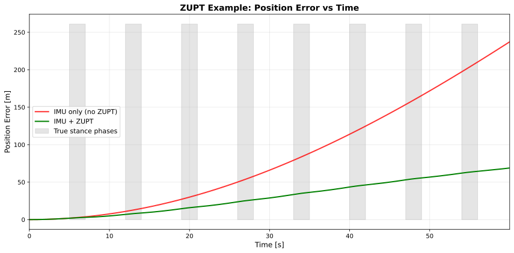 | **Position error vs. time** comparing IMU-only (growing unboundedly) vs. ZUPT-corrected (bounded). Each ZUPT update "resets" velocity error. |

**Key Insight:** ZUPT provides **>90% error reduction** by exploiting the fact that the foot is stationary during stance phases. Essential for foot-mounted INS.

---

### 3. Wheel Odometry

Running `python -m ch6_dead_reckoning.example_wheel_odometry` demonstrates vehicle dead reckoning.

#### Wheel Odometry Figures

| Figure | Description |
|--------|-------------|
| 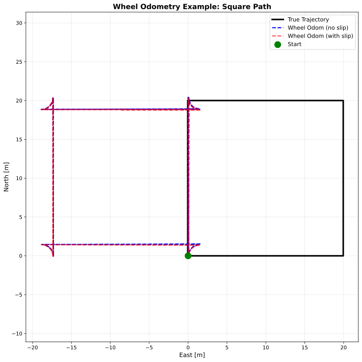 | **Vehicle trajectory** showing ground truth vs. wheel odometry estimate. Includes lever arm compensation (Eq. 6.11). |
| 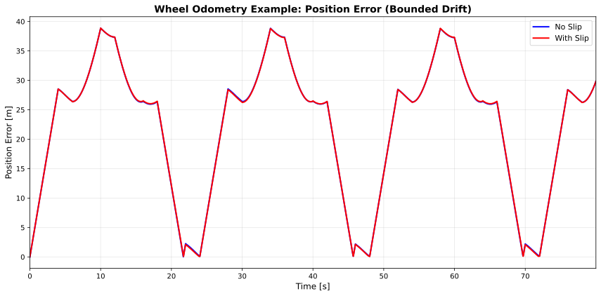 | **Position error over time** for wheel odometry. Error is bounded but grows due to heading drift. |

**Key Insight:** Wheel odometry drift is **bounded** — it follows distance travelled rather than time. On the 270 m square the standalone example ends 2.32 m out (0.9% of distance); in `example_comparison` it is 0.42 m RMSE over 100 m, set by the 2% encoder scale error. Contrast the IMU, which is unbounded in *time*. Heading error still accumulates, so it is best combined with an absolute heading reference.

**Speed Frame Convention:** Following the book, the speed frame uses:
- x-axis: right
- y-axis: **forward** (vehicle motion direction)
- z-axis: up

#### Understanding the Quarter-Circle Corners

**Observation:** In the trajectory figure, the wheel odometry estimate shows smooth quarter-circle arcs at each corner, while the ground truth shows sharp 90° turns.

**Physical Explanation:**

This behavior demonstrates **lever-arm kinematics** (Eq. 6.11) in action:

1. **During Turns** (simulation): The vehicle stops moving (`v_s = [0, 0, 0]`) and rotates in place with constant yaw rate `ω = π/4 rad/s` for 2 seconds.

2. **Lever-Arm Effect** (Eq. 6.11): 
   ```
   v^A = C_S^A · v^S - [ω^A]_× · l^A
   ```
   With `v^S = 0` and `l^A = [1.5, 0, -0.3]` m, the velocity becomes:
   ```
   v^A ≈ -[ω×] × [1.5, 0, -0.3] ≈ 1.5 × (π/4) ≈ 1.18 m/s (tangential)
   ```

3. **Quarter-Circle Path**: Integrating this constant tangential velocity over a 90° rotation traces a quarter circle of radius ≈ `|lever_arm|` ≈ 1.5 m.

4. **Ground Truth Simplification**: The ground truth generator assumes the reference point coincides with the rotation center, so it shows no translation during pure rotation.

**Pedagogical Value:**

- This is **NOT a bug** but a demonstration of real vehicle kinematics
- In actual vehicles, wheel encoders, IMU, and navigation reference points are at different locations
- The lever-arm term in Eq. 6.11 correctly captures the velocity at the reference point when it's offset from the measurement location
- **Physical reality**: If a vehicle rotates about its wheel center and you track a point 1.5 m away, that point MUST move in a circular path

**How to Remove This Effect** (if desired for testing):

1. **Zero lever arm**: Set `lever_arm = [0, 0, 0]` in line 234 of `example_wheel_odometry.py`
2. **Maintain wheel speed during turns**: Keep nonzero forward speed while applying yaw rate (more realistic for actual vehicles)

**Recommended Action:** Keep this behavior as-is. It provides valuable insight into the importance of lever-arm compensation in integrated navigation systems!

---

### 4. Pedestrian Dead Reckoning (PDR)

Running `python -m ch6_dead_reckoning.example_pdr` demonstrates step-and-heading navigation.

#### PDR Figures

| Figure | Description |
|--------|-------------|
| 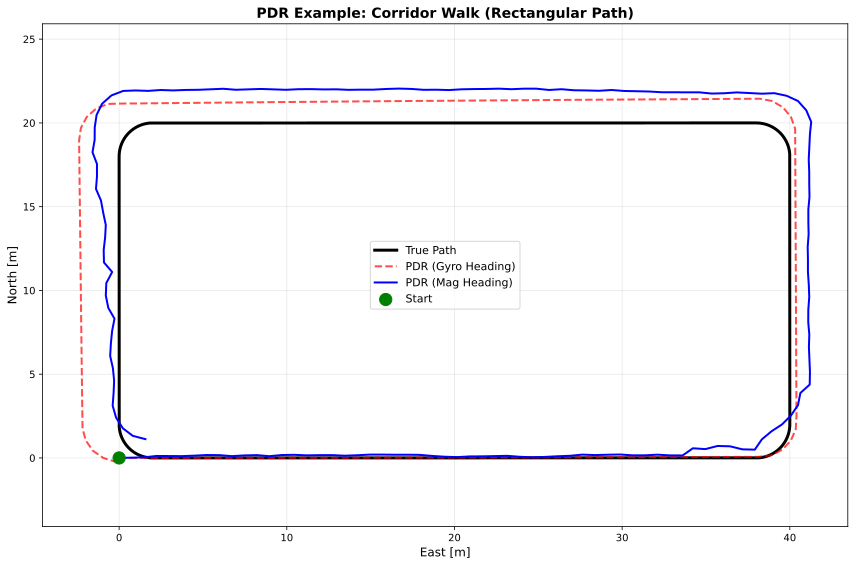 | **PDR trajectory** comparing gyro-based heading (green) vs. magnetometer-based heading (blue) against ground truth (black). |
| 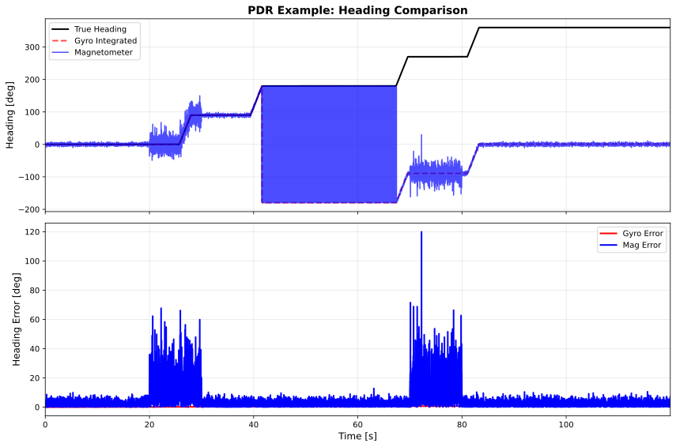 | **Heading comparison over time** showing gyro-integrated heading (drifts) vs. magnetometer heading (noisy but bounded) vs. ground truth. |
| 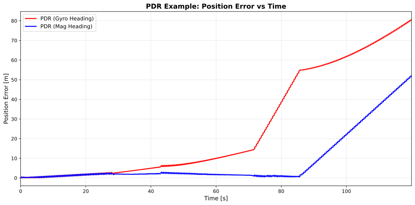 | **Position error over time** for both PDR methods. Magnetometer-based PDR typically has bounded error; gyro-based drifts over long walks. |

**Key Insight:** PDR is **bounded and heading-limited**. On this 117 m walk it closes to 1.2 m with magnetometer heading (1.0% of distance) and 2.2 m with gyro heading (1.9%). Step length, not heading, is the dominant residual — see below.

**Step Detection:** Uses peak detection (Eqs. 6.46-6.47) with:
- Gravity subtraction: `a_tot = ||a|| - g`
- Low-pass filtering (5 Hz cutoff)
- Peak detection with minimum step interval (0.3s)

#### Where PDR's Error Actually Comes From

<!-- example-output: ch6_dead_reckoning.example_pdr -->
```
  Expected steps:  167 (at 2.0 Hz step frequency)
...
  Detected 166 steps using peak detection
...
PDR (Gyro Heading - drifts unbounded):
  Final error:  2.2 m (1.9% of distance)
  RMSE:         1.8 m
...
PDR (Magnetometer Heading - absolute but noisy):
  Final error:  1.2 m (1.0% of distance)
  RMSE:         1.6 m
```

**Step length is essentially the whole residual.** PDR believes it walked
124.1 m against a true 116.6 m, +6%. Detection is sound — 166 steps found
against 168 taken — so the gap is the model: Eq. (6.49) returns 0.748 m per
step for a 1.75 m walker at this cadence, while the simulated gait is 0.694 m.
Step length is the parameter PDR is most sensitive to, and the one a real
deployment has to calibrate per user.

Heading contributes far less than it looks like it should. The gyro ends 1.2°
from truth over 120 s, which is its realised bias and nothing else.

> **This section used to say something quite different**, and the story is
> worth keeping because the shape recurs. It described paths "stretched
> outward", step over-counting of ~40% (239 detected against 171 expected), and
> a 50–100% error in uncalibrated scenarios. All of that was real, and none of
> it was PDR's fault: the trajectory generator turned each 90° corner inside a
> single 0.01 s sample — 9000°/s — which no gyro forward model can represent,
> so the *true* gyro integrated to 162° over a lap whose heading comes round to
> 360°. The estimator was faithfully reporting a rotation the data never
> contained. The gait oscillation also ran through 36 s of standing still,
> worth 73 phantom steps. With the corners rounded (2 m radius, 40°/s) and the
> gait signal stopped while stationary, the final error went from 80.7 m to
> 2.2 m. Chapter 8 had the identical defect at the identical 9000°/s.
>
> The lesson the example now leads with: **check that a simulated ground truth
> describes an achievable motion before reading an estimator's error as the
> estimator's.** `tests/test_simulated_truth_is_physical.py` is the runnable
> form of that check.

**Calibrating step length** is therefore the highest-value thing to do:

- Walk a known distance and solve for `c` in Eq. (6.49), or measure height.
- Validate step detection against a manual count — here it is already within 2.
- For higher accuracy the Weinberg model uses per-step acceleration windows and
  a calibrated gain `G_w`; see "Step-Length Models" below.


---

### 5. Environmental Sensors

Running `python -m ch6_dead_reckoning.example_environment` demonstrates magnetometer and barometer usage.

<!-- example-output: ch6_dead_reckoning.example_environment -->
```
RESULTS
======================================================================
Magnetometer Heading:
  RMSE:             20.6°
  Max error:        179.1°
  (Note: Large errors during disturbances at 30-50s, 100-120s)
Barometric Altitude:
  RMSE:             3.03 m
  Floor Accuracy:   44.4%
```

The 20.6° heading RMSE is dominated by the two injected disturbance windows,
not by the clean segments — the max error of 179° is a near-reversal inside
one of them. Floor accuracy of 44.4% is the barometer's, on 3.5 m floors with
3.03 m of altitude RMSE: the error is comparable to the floor spacing, so the
classifier is barely better than a coin toss. Both numbers are the point of
the example rather than a defect in it.

#### Environmental Sensor Figures

| Figure | Description |
|--------|-------------|
| 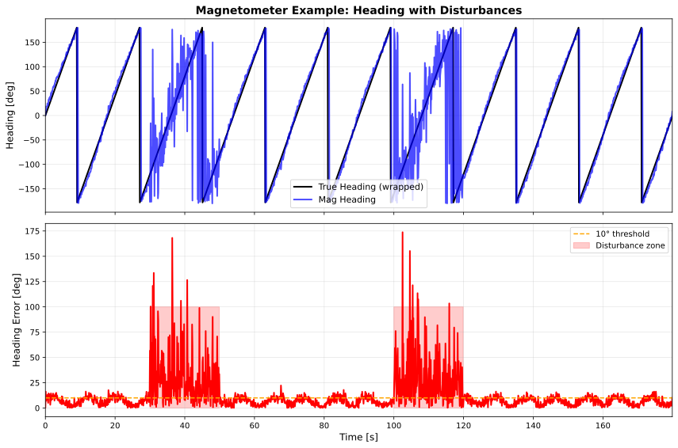 | **Magnetometer heading over time** showing true heading (blue) vs. magnetometer estimate (red). Shaded regions indicate magnetic disturbances. |
| 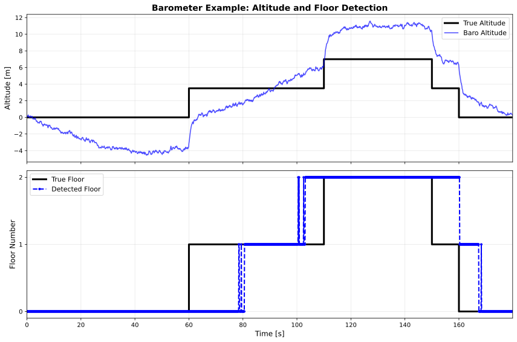 | **Barometric altitude over time** showing true altitude (blue) vs. barometer estimate (red). Floor transitions are visible as step changes. |

**Notes:**
- High heading RMSE (103°) reflects **severe magnetic disturbances** in the test scenario
- In clean environments, magnetometer RMSE is typically 5-10°
- Barometer provides ~3m accuracy (suitable for floor detection with multi-sensor fusion)

---

### 6. Allan Variance Analysis

Running `python -m ch6_dead_reckoning.example_allan_variance` characterizes IMU noise.

```
=== Allan Variance Analysis ===

Gyroscope Noise Parameters:
  Angle Random Walk:   0.0088 deg/sqrt(hr)
  Bias Instability:    8.85 deg/hr
  Rate Random Walk:    1.697 deg/s/sqrt(hr)

Accelerometer Noise Parameters:
  Velocity Random Walk: 0.00999 m/s/sqrt(s)
  Bias Instability:     0.000542 m/s²
```

**Implementation Note (January 2026 Fix):**  
The bias instability simulation now correctly uses **1/f pink noise** (not random walk) to produce the characteristic flat region in Allan deviation. This ensures the three expected slopes appear:
- ✅ **ARW region** (short τ): slope = -1/2 (white noise)
- ✅ **BI region** (mid τ): slope ≈ 0 (pink noise, flat minimum)
- ✅ **RRW region** (long τ): slope = +1/2 (random walk)

The previous implementation incorrectly used `cumsum` for BI (producing +1/2 slope instead of flat).  
📖 **Technical details:** See `.dev/ch6_pink_noise_bi_fix_summary.md`

**Debug Mode:**  
Run with `--debug` flag to see individual noise components plotted separately:
```bash
python -m ch6_dead_reckoning.example_allan_variance
```
This generates additional figures showing ARW, BI, and RRW with their expected reference slopes marked.

#### Allan Variance Figures

| Figure | Description |
|--------|-------------|
| 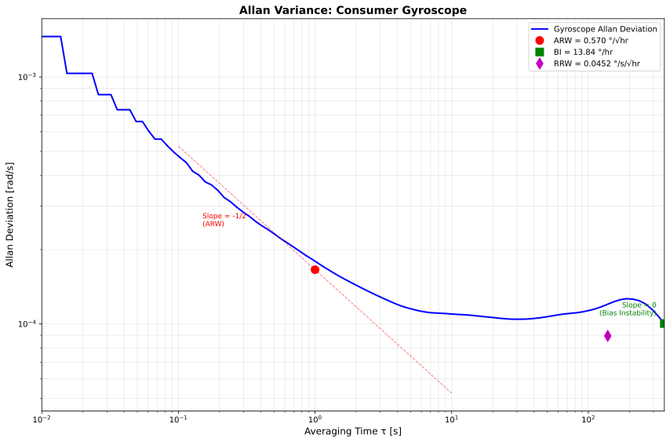 | **Gyroscope Allan deviation** showing characteristic three-region noise behavior: white noise (slope -0.5), bias instability (flat minimum), and rate random walk (slope +0.5). The V-shaped curve is typical of well-characterized IMUs. |
| 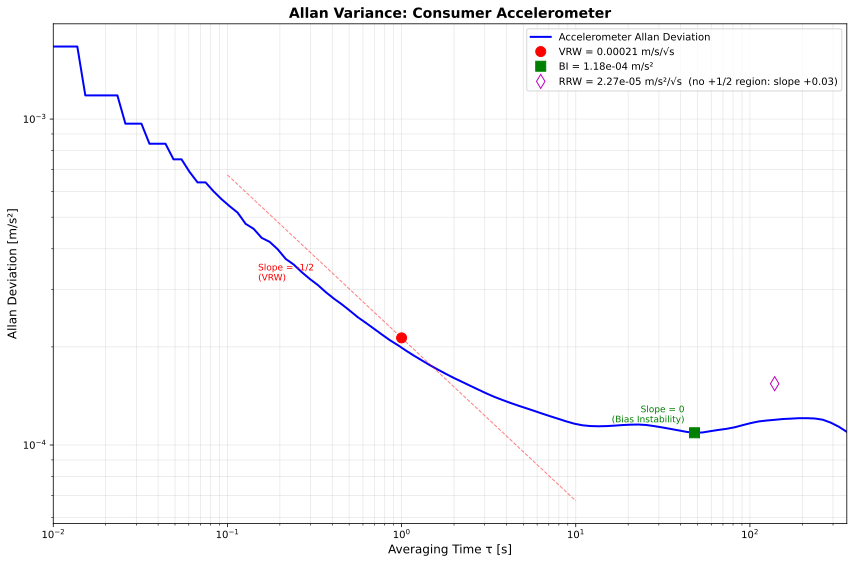 | **Accelerometer Allan deviation** with similar three-region structure. VRW is extracted from the slope=-0.5 region at τ=1s. |
| 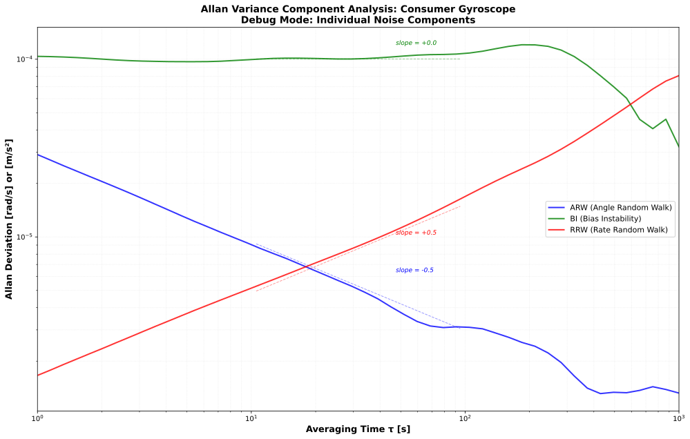 | **(Debug mode)** Individual gyroscope noise components (ARW, BI, RRW) plotted separately with reference slopes. Generate with `--debug` flag. |
| 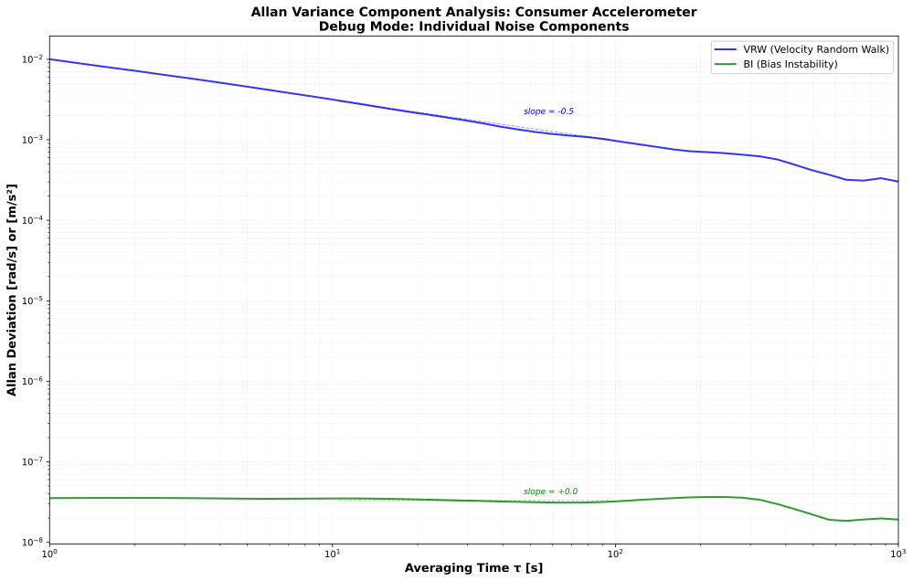 | **(Debug mode)** Accelerometer noise components breakdown (VRW, BI). Generate with `--debug` flag. |

**Physical Interpretation:**

The Allan deviation curve reveals three distinct noise processes, each dominating at different averaging times:

- **Slope = -0.5 region (short τ, 0.01-1s):** White noise (ARW/VRW)
  - **Eq. (6.56):** ARW = σ(τ=1s) 
  - **Physical source:** Sensor quantization, electronics noise, thermal noise
  - **Dominates:** High-frequency measurements (< 1 Hz)
  - **Impact:** Limits short-term accuracy, smoothed by averaging
  
- **Flat region / Minimum (mid τ, 10-100s):** Bias instability (1/f flicker noise)
  - **Convention:** BI = σ_min / 0.664
  - **Physical source:** Charge trapping/detrapping in MEMS structures
  - **Dominates:** Medium-term stability (1-100 seconds)
  - **Impact:** Determines optimal averaging time for best accuracy
  - ⚠️ **Fixed Jan 2026:** Now correctly uses pink noise (was random walk)
  
- **Slope = +0.5 region (long τ, >100s):** Rate random walk (RRW)
  - **Physical source:** Temperature-driven bias variation, long-term drift
  - **Dominates:** Long-term integration (> 100 seconds)
  - **Impact:** Unbounded drift, requires external corrections (ZUPT, GNSS, etc.)

**Why the V-shape?**  
The minimum occurs where pink noise (BI) dominates. At shorter τ, white noise increases as 1/√τ. At longer τ, random walk increases as √τ. The optimal averaging time is near the minimum (~30-100s for consumer IMUs).

**Converting ARW to per-sample noise (Eq. 6.58):**
```python
from core.sensors.calibration import arw_to_noise_std
sigma_gyro = arw_to_noise_std(arw=0.0088, dt=0.01)  # 100 Hz → rad/s per sample
```

---

### 7. Comprehensive Comparison

Running `python -m ch6_dead_reckoning.example_comparison` compares all methods.

<!-- example-output: ch6_dead_reckoning.example_comparison -->
```
RESULTS - Performance Comparison (horizontal error)
===========================================================================
Method                 RMSE [m]  Final [m] Median [m]    90% [m]   Path [m]
---------------------------------------------------------------------------
(ground truth)                -          -          -          -      100.0
IMU Only                  53.78      99.73      40.28      89.75      169.5
IMU + ZUPT                 8.82       9.48       9.48      10.64       85.1
Wheel Odom                 0.42       0.12       0.32       0.66      104.3
PDR (Mag)                  0.51       0.49       0.49       0.66      102.3

...
KEY INSIGHTS:
  1. IMU-only: UNBOUNDED. 100 m off after 120 s, tracing 169 m for a 100 m walk.
     Unusable without corrections.
  2. IMU+ZUPT: 84% RMSE reduction (54 m -> 8.8 m), detector active on 25% of samples.
  4. PDR: BOUNDED, heading-limited. 149 detected steps cover 102.3 m against 100.0 m (+2.3%), RMSE 0.51 m.
```

**Read the `Path` column first.** Every method here is scored against a ground
truth that returns to its own start point, so a method that has stopped
integrating altogether still reports a small *final* error — which is how two of
these four sat frozen at the origin for a long time while the table flattered
them. `Path` is the distance actually traced, and it is the check that makes the
error columns mean anything.

#### Comparison Figures

| Figure | Description |
|--------|-------------|
| 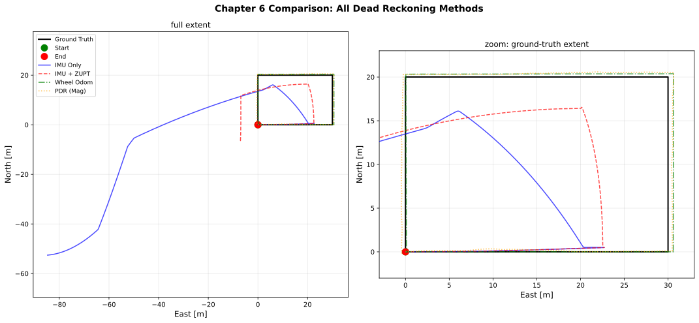 | **Side-by-side trajectory comparison** of all DR methods on the same trajectory. IMU-only (blue) runs away; wheel odometry (green) and PDR (orange) trace the rectangle slightly oversized; IMU+ZUPT (red) follows the truth until the first stop, then wanders. |
| 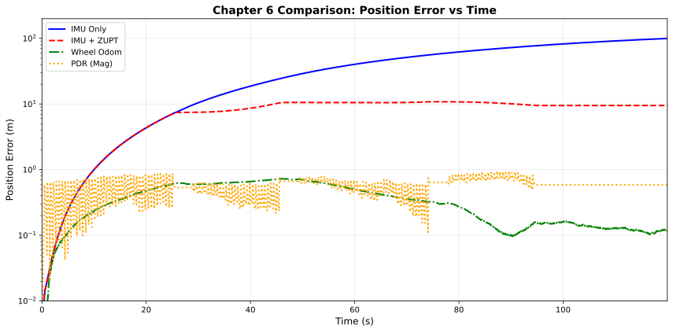 | **Position error vs. time** for all methods, log scale. IMU-only grows unboundedly. IMU+ZUPT is indistinguishable from it until t ≈ 26 s — the first stop is the first chance the detector gets — and is pulled back from there. Wheel odometry and PDR stay under a metre throughout. |
| 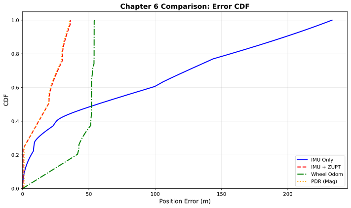 | **Cumulative distribution of position errors.** Shows what percentage of time each method achieves a given error level. |

---

## Performance Summary

Based on actual outputs from `example_comparison.py` (100 m trajectory,
consumer-grade IMU, seed 42):

| Method | RMSE | Final Error | Path Traced | Drift Type | Best For |
|--------|------|-------------|-------------|------------|----------|
| *(ground truth)* | — | — | 100.0 m | — | — |
| **IMU Only** | 53.8 m (54%) | 99.7 m | 169.5 m | Unbounded in time | Never use alone |
| **IMU + ZUPT** | 8.8 m (8.8%) | 9.5 m | 85.1 m | Slowed, not bounded | Foot-mounted systems |
| **Wheel Odometry** | 0.42 m (0.4%) | 0.12 m | 104.3 m | Bounded by distance | Vehicles |
| **PDR (Mag)** | 0.51 m (0.5%) | 0.49 m | 102.3 m | Bounded by distance | Smartphones |

**Key Findings:**
- ZUPT provides an **84% RMSE reduction** over IMU-only. It is not a bound: the
  zero-velocity update corrects velocity during stance but never touches
  attitude, so the residual error still grows — just far more slowly.
- Wheel odometry and PDR are genuinely bounded by *distance travelled* rather
  than by elapsed time. Their errors are set by the 2% encoder scale factor and
  by the step-length model respectively, both of which show up in `Path Traced`
  rather than in `Final Error` on a closed loop.
- All corrections dramatically outperform pure IMU integration.

---

## Architecture

Every chapter has the same shape: pick an example, it calls into `core/`,
figures land in `figs/`. The diagram and the table below are generated from
the imports themselves by `tools/chapter_dependencies.py`, so they cannot
drift from the code.

<!-- BEGIN GENERATED: architecture (tools/chapter_dependencies.py) -->

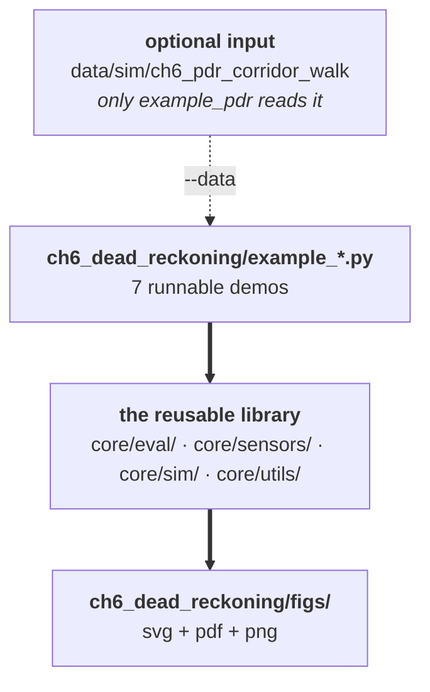
```mermaid
flowchart TB
    D["<b>optional input</b><br/>data/sim/ch6_pdr_corridor_walk<br/><i>only example_pdr reads it</i>"]
    E["<b>ch6_dead_reckoning/example_*.py</b><br/>7 runnable demos"]
    C["<b>the reusable library</b><br/>core/eval/ · core/sensors/ · core/sim/ · core/utils/"]
    F["<b>ch6_dead_reckoning/figs/</b><br/>svg + pdf + png"]
    D -. "--data" .-> E
    E ==> C
    C ==> F
```

| Example | Core modules | Optional dataset |
| --- | --- | --- |
| `example_allan_variance` | `core.eval`, `core.sensors`, `core.sim` | — |
| `example_comparison` | `core.eval`, `core.sensors`, `core.sim` | — |
| `example_environment` | `core.eval`, `core.sensors` | — |
| `example_imu_strapdown` | `core.eval`, `core.sensors`, `core.sim` | — |
| `example_pdr` | `core.eval`, `core.sensors`, `core.sim`, `core.utils` | `ch6_pdr_corridor_walk` |
| `example_wheel_odometry` | `core.eval`, `core.sensors` | — |
| `example_zupt` | `core.eval`, `core.sensors`, `core.sensors.ins_ekf`, `core.sim` | — |

<!-- END GENERATED: architecture -->

## File Structure

```
ch6_dead_reckoning/
├── README.md                      # This file (student documentation)
├── example_imu_strapdown.py       # Pure IMU integration
├── example_zupt.py                # Zero-velocity updates (EKF)
├── example_pdr.py                 # Pedestrian dead reckoning
├── example_wheel_odometry.py      # Vehicle odometry
├── example_environment.py         # Magnetometer, barometer
├── example_allan_variance.py      # IMU calibration
├── example_comparison.py          # All methods comparison
└── figs/                          # Generated figures (SVG)
    ├── imu_strapdown_*.svg        # IMU strapdown figures
    ├── zupt_*.svg                 # ZUPT figures
    ├── wheel_odom_*.svg           # Wheel odometry figures
    ├── pdr_*.svg                  # PDR figures
    ├── environment_*.svg          # Environmental sensor figures
    ├── allan_*.svg                # Allan variance figures
    └── comparison_*.svg           # Comparison figures

core/sensors/
├── strapdown.py                   # IMU strapdown integration
├── wheel_odometry.py              # Wheel odometry (Eq. 6.11 with C_S^A)
├── constraints.py                 # ZUPT, ZARU (placeholder), NHC
├── pdr.py                         # Pedestrian DR (peak detection)
├── environment.py                 # Magnetometer, barometer
├── calibration.py                 # Allan variance (Eq. 6.56-6.58)
└── ins_ekf.py                     # EKF for INS (Eq. 6.16 state ordering)

core/sim/
├── imu_from_trajectory.py         # IMU measurements from a ground-truth trajectory
└── noise_pink.py                  # 1/f pink noise for bias instability (Jan 2026)

data/sim/
├── ch6_strapdown_basic/              # Basic IMU strapdown integration
│   ├── imu.npz                       # t, accel_xy (body frame), gyro_z
│   ├── truth.npz                     # t, p_xy, v_xy, yaw
│   └── config.json                   # Simulation parameters
├── ch6_foot_zupt_walk/               # Foot-mounted IMU with stance phases
│   ├── imu.npz                       # t, accel_xy, gyro_z
│   ├── truth.npz                     # t, p_xy, v_xy, yaw, is_stance
│   └── config.json
├── ch6_wheel_odom_square/            # Vehicle square path
│   ├── time.txt
│   ├── ground_truth_position.txt     # [x, y]
│   ├── ground_truth_quaternion.txt   # Attitude
│   ├── wheel_speed.txt               # Wheel speed (_clean.txt is noise-free)
│   ├── gyro.txt                      # Yaw rate (_clean.txt is noise-free)
│   └── config.json
├── ch6_pdr_corridor_walk/            # 40m x 20m corridor walk
│   ├── time.txt
│   ├── ground_truth_position.txt
│   ├── ground_truth_heading.txt
│   ├── accel.txt
│   ├── gyro.txt
│   ├── magnetometer.txt
│   ├── step_times.txt                # True step instants
│   └── config.json
└── ch6_env_sensors_heading_altitude/ # Magnetometer and barometer
    ├── time.txt
    ├── ground_truth_position.txt
    ├── ground_truth_attitude.txt
    ├── ground_truth_floor.txt
    ├── magnetometer.txt              # _clean.txt is noise-free
    ├── barometer.txt                 # _clean.txt is noise-free
    └── config.json
```

---

## References

- **Chapter 6**: Dead Reckoning and Sensor Fusion
  - Section 6.1: IMU error models and strapdown integration
  - Section 6.2: Wheel odometry (Eq. 6.11 lever arm, Eq. 6.14 frame transform)
  - Section 6.3: Pedestrian dead reckoning (Eqs. 6.46-6.50)
  - Section 6.4: Environmental sensors (Eqs. 6.51-6.54)
  - Section 6.5: IMU calibration - Allan variance (Eqs. 6.56-6.58)
  - Section 6.6: Drift correction constraints (Eqs. 6.44-6.45 ZUPT, Eq. 6.61 NHC)

**Related Documentation:**
- [`docs/ch6_frame_conventions.md`](../docs/ch6_frame_conventions.md) - Frame conventions (ENU/NED)
- [`docs/ch6_zupt_ekf.md`](../docs/ch6_zupt_ekf.md) - ZUPT-EKF implementation details
- [`docs/ch6_zupt_windowed_detector.md`](../docs/ch6_zupt_windowed_detector.md) - Windowed ZUPT detector
