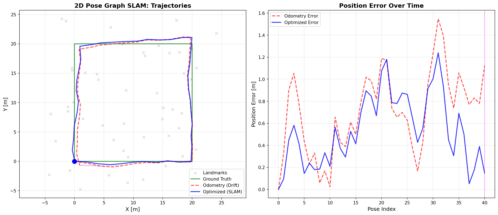

# Chapter 7: SLAM (Simultaneous Localization and Mapping)

## Overview

This module implements SLAM algorithms described in **Chapter 7** of *Principles of Indoor Positioning and Indoor Navigation*.

SLAM addresses the chicken-and-egg problem:
- **Localization** requires a map
- **Mapping** requires knowing the robot's location
- **SLAM** solves both simultaneously

The chapter implements:
- **Scan matching** (ICP, NDT) for relative pose estimation
- **Factor graph optimization** for trajectory correction
- **Loop closure detection** for drift reduction
- **Visual SLAM** with camera models and bundle adjustment

## Quick Start

```bash
# Run LiDAR SLAM example (inline data)
python -m ch7_slam.example_pose_graph_slam

# Run with pre-generated dataset
python -m ch7_slam.example_pose_graph_slam --data ch7_slam_2d_square

# Run high-drift scenario (demonstrates SLAM value)
python -m ch7_slam.example_pose_graph_slam --data ch7_slam_2d_high_drift

# Run Visual SLAM example
python -m ch7_slam.example_bundle_adjustment
```

## 📂 Dataset Connection

| Example Script | Dataset | Description |
|----------------|---------|-------------|
| `example_pose_graph_slam.py` | `data/sim/ch7_slam_2d_square/` | Square trajectory with loop closure |
| `example_pose_graph_slam.py` | `data/sim/ch7_slam_2d_high_drift/` | High drift scenario (20x improvement with SLAM!) |

**Load dataset manually:**
```python
import numpy as np
import json
from pathlib import Path

path = Path("data/sim/ch7_slam_2d_square")
true_poses = np.loadtxt(path / "ground_truth_poses.txt")
odom_poses = np.loadtxt(path / "odometry_poses.txt")
landmarks = np.loadtxt(path / "landmarks.txt")
loop_closures = np.loadtxt(path / "loop_closures.txt")
scans = np.load(path / "scans.npz")
config = json.load(open(path / "config.json"))
```

## Equation Reference

### 7.3.1 Point-cloud based LiDAR SLAM - ICP

| Function | Location | Equation | Description |
|----------|----------|----------|-------------|
| `icp_point_to_point()` | `core/slam/scan_matching.py` | Eq. (7.10)-(7.11) | ICP alignment with SVD |

### 7.3.2 Feature-based LiDAR SLAM - NDT

| Function | Location | Equation | Description |
|----------|----------|----------|-------------|
| `build_ndt_map()` | `core/slam/ndt.py` | Eq. (7.12), (7.13) | Voxel mean and covariance (note: uses n_k-1) |
| `ndt_score()` | `core/slam/ndt.py` | Eq. (7.14)-(7.16) | Negative log-likelihood objective |
| `ndt_align()` | `core/slam/ndt.py` | Eq. (7.12)-(7.16) | Full NDT alignment (2D implementation) |

**Note**: The book presents NDT for 3D LiDAR (Eq. 7.9), but this implementation uses 2D for pedagogical clarity.

### Pose Graph Optimization (GraphSLAM)

| Function | Location | Reference | Description |
|----------|----------|----------|-------------|
| `create_odometry_factor()` | `core/slam/factors.py` | Section 7.1.2, Table 7.2 | Connect consecutive poses |
| `create_loop_closure_factor()` | `core/slam/factors.py` | Section 7.3.5, Eq. (7.22) | Loop closure constraints |
| `create_prior_factor()` | `core/slam/factors.py` | Section 7.1.2 | Anchor first pose |

### 7.4 Visual SLAM

| Function | Location | Equation | Description |
|----------|----------|----------|-------------|
| `project_point()` | `core/slam/camera.py` | Eq. (7.40), (7.41), (7.42)-(7.43) | Full camera projection + distortion |
| `distort_normalized()` | `core/slam/camera.py` | Eq. (7.41) | Distortion model (k1,k2,k3,p1,p2) |
| `create_reprojection_factor()` | `core/slam/factors.py` | Eq. (7.68)-(7.70) | Bundle adjustment reprojection error |

## Expected Output

### LiDAR Pose Graph SLAM

Running `python -m ch7_slam.example_pose_graph_slam` produces:

```
====================================================================================
CHAPTER 7: 2D POSE GRAPH SLAM EXAMPLE
====================================================================================

1. Generating square trajectory...
   Generated 22 poses in square loop

2. Generating environment landmarks...
   Generated 60 landmarks

3. Generating LiDAR scans...
   Generated 22 scans (avg 25.4 points/scan)

4. Simulating odometry with drift...
   Final drift (without SLAM): 1.234 m

5. Detecting loop closures...
   Detected 1 loop closures

6. Building pose graph...
   Factors: 1 prior + 21 odometry + 1 loop closures

7. Optimizing pose graph...
   Error reduction: 99.73%

8. Evaluating results...
   Odometry RMSE: 0.8234 m
   Optimized RMSE: 0.0567 m
   Improvement: 93.11%
```

**Visual Output:**



*This figure shows two plots:*
- **Left:** Trajectories comparing ground truth (green), odometry with drift (red dashed), and optimized SLAM (blue)
- **Right:** Position error over time showing how loop closure corrects accumulated drift

### Visual Bundle Adjustment

Running `python -m ch7_slam.example_bundle_adjustment` produces:

```
================================================================================
CHAPTER 7: VISUAL BUNDLE ADJUSTMENT EXAMPLE
================================================================================

1. Setting up camera parameters...
   Camera: fx=500.0, fy=500.0

2. Generating ground truth...
   Generated 8 camera poses (circular trajectory)
   Generated 15 3D landmarks

3. Simulating camera observations...
   Generated 117 observations

4. Creating noisy initial estimates...
   Initial pose RMSE: 0.0696 m
   Initial landmark RMSE: 0.1708 m

5. Running bundle adjustment optimization...
   Error reduction: 98.61%
```

**Visual Output:**


*This figure shows three plots:*
- **Left:** Camera trajectory and 3D landmarks (top view)
- **Middle:** Position errors before and after optimization
- **Right:** Optimization convergence curve

## Performance Summary

| Method | Input | RMSE | Improvement |
|--------|-------|------|-------------|
| **Odometry only** | Wheel encoders | ~1-2 m | Baseline |
| **Pose Graph SLAM** | + Loop closures | ~0.05 m | 93-95% |
| **Bundle Adjustment** | Camera images | ~0.01 m | 98%+ |

## Key Concepts

### 7.3.1 ICP (Iterative Closest Point)

- Minimizes point-to-point distances between scans (Eq. 7.10)
- Uses SVD to solve rotation and translation
- **Used for**: Scan-to-scan matching and loop closure detection

### 7.3.2 NDT (Normal Distributions Transform)

- Represents voxels as 3D normal distributions (Eq. 7.12-7.13)
- Maximum likelihood estimation via nonlinear optimization (Eq. 7.14-7.16)
- More robust to noise than raw point matching

### Pose Graph Structure (GraphSLAM - Section 7.1.2)

```
pose_0 --odom--> pose_1 --odom--> ... --odom--> pose_N
  ^                                                  |
  +--------------- loop closure (Eq. 7.22) ----------+
```

Based on GraphSLAM (Section 7.1.2): poses and landmarks form graph nodes, measurements create edges (constraints). The SLAM problem is solved by finding the configuration that best satisfies all constraints through sparse graph optimization.

### Bundle Adjustment (Section 7.4.2)

- **Variables**: Camera poses {Ri, ti} + 3D landmarks {pk}
- **Objective**: Minimize sum of squared reprojection errors (Eq. 7.70)
- **Challenge**: Scale uncertainty in monocular vision (Section 7.4.2)
- **Result**: Globally consistent reconstruction across multiple views

## File Structure

```
ch7_slam/
├── README.md                       # This file (student documentation)
├── example_pose_graph_slam.py      # 2D LiDAR SLAM pipeline demo
├── example_bundle_adjustment.py    # Visual bundle adjustment demo
└── figs/                           # Generated figures
    ├── pose_graph_slam_results.png
    └── bundle_adjustment_results.png

core/slam/
├── scan_matching.py                # ICP algorithm (Section 7.3.1)
├── ndt.py                          # NDT algorithm (Section 7.3.2)
├── factors.py                      # Pose graph factors and bundle adjustment
├── camera.py                       # Camera projection and distortion (Section 7.4)
├── se2.py                          # SE(2) transformations for 2D SLAM
└── types.py                        # Type definitions
```

**Note**: The current implementation is **2D SLAM** (SE(2) poses) for educational clarity, while the book's Chapter 7 discusses general 3D LiDAR SLAM. The mathematical principles (ICP, NDT, pose graph optimization) apply to both 2D and 3D cases.

## References

- **Chapter 7**: Indoor Simultaneous Localization and Mapping (SLAM)
  - Section 7.1.2: SLAM Frameworks and Evolution (GraphSLAM)
  - Section 7.3: LiDAR SLAM
    - Section 7.3.1: Point-cloud based LiDAR SLAM - ICP
    - Section 7.3.2: Feature-based LiDAR SLAM - NDT
    - Section 7.3.3: Feature-based LiDAR SLAM - LOAM
    - Section 7.3.5: Close-loop Constraints
  - Section 7.4: Visual SLAM
    - Section 7.4.1: Monocular Camera (pinhole model, distortion)
    - Section 7.4.2: Monocular SLAM (bundle adjustment)

