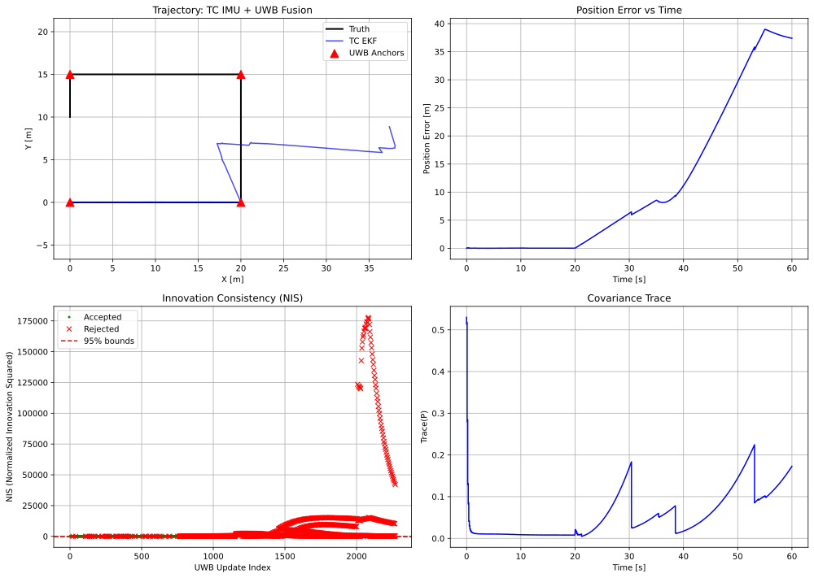

# Chapter 8: Sensor Fusion

## Overview

This module implements multi-sensor fusion algorithms described in **Chapter 8** of *Principles of Indoor Positioning and Indoor Navigation*.

Chapter 8 focuses on **practical aspects** of sensor fusion:
- **Tightly coupled (TC) vs loosely coupled (LC) fusion architectures**
- **Innovation monitoring and chi-square gating** (Eqs. 8.5-8.9)
- **Robust measurement down-weighting**
- **Temporal calibration and synchronization**
- **Observability analysis**

## Quick Start

```bash
# Tightly coupled IMU + UWB fusion
python -m ch8_sensor_fusion.tc_uwb_imu_ekf

# Loosely coupled IMU + UWB fusion
python -m ch8_sensor_fusion.lc_uwb_imu_ekf

# Compare LC vs TC architectures
python -m ch8_sensor_fusion.compare_lc_tc

# Advanced demos
python -m ch8_sensor_fusion.observability_demo
python -m ch8_sensor_fusion.tuning_robust_demo
python -m ch8_sensor_fusion.temporal_calibration_demo
```

## Equation Reference

### Innovation Monitoring and Gating

| Function | Location | Equation | Description |
|----------|----------|----------|-------------|
| `innovation()` | `core/fusion/tuning.py` | Eq. (8.5) | Compute innovation y = z - h(x) |
| `innovation_covariance()` | `core/fusion/tuning.py` | Eq. (8.6) | S = HPH' + R |
| `scale_measurement_covariance()` | `core/fusion/tuning.py` | Eq. (8.7) | Robust down-weighting |
| `mahalanobis_distance_squared()` | `core/fusion/gating.py` | Eq. (8.8) | d² = y'S⁻¹y |
| `chi_square_gate()` | `core/fusion/gating.py` | Eq. (8.9) | Accept if d² < χ²(α,m) |

### Fusion Models

| Function | Location | Description |
|----------|----------|-------------|
| `create_process_model()` | `tc_models.py` | 2D IMU dead-reckoning process model |
| `create_uwb_range_measurement_model()` | `tc_models.py` | UWB range measurement for TC |
| `solve_uwb_position_wls()` | `lc_models.py` | WLS position solver for LC |
| `create_lc_position_measurement_model()` | `lc_models.py` | Position measurement for LC |

## Usage Examples

### Tightly Coupled Fusion

```bash
# Basic usage
python -m ch8_sensor_fusion.tc_uwb_imu_ekf

# With custom dataset
python -m ch8_sensor_fusion.tc_uwb_imu_ekf --data data/sim/ch8_fusion_2d_imu_uwb

# Disable gating
python -m ch8_sensor_fusion.tc_uwb_imu_ekf --no-gating

# Adjust gating threshold
python -m ch8_sensor_fusion.tc_uwb_imu_ekf --alpha 0.01  # Stricter (99%)
```

### Loosely Coupled Fusion

```bash
# Basic usage
python -m ch8_sensor_fusion.lc_uwb_imu_ekf

# Compare with TC
python -m ch8_sensor_fusion.compare_lc_tc --save comparison.svg
```

## Expected Output

### TC Fusion Demo

Running `python -m ch8_sensor_fusion.tc_uwb_imu_ekf` produces:

```
======================================================================
Tightly Coupled IMU + UWB EKF Fusion
======================================================================

Initialization:
  State: [0. 0. 1. 0. 0.]
  Gating: Enabled
  Alpha: 0.05 (95% confidence)

Measurements:
  IMU samples: 6000
  UWB samples: 2271

Fusion complete:
  UWB accepted: 748
  UWB rejected: 1523
  Acceptance rate: 32.9%

======================================================================
Evaluation Metrics
======================================================================
  RMSE (2D)    : 12.352 m
  RMSE (X)     : 16.519 m
  RMSE (Y)     : 5.680 m
  Max Error    : 38.993 m
```

**Visual Output:**



*Four-panel visualization:*
- **Trajectory:** Truth vs EKF estimate with UWB anchors
- **Position Error:** Drift accumulation over time
- **NIS Plot:** Innovation consistency with chi-square bounds
- **Covariance Trace:** Filter uncertainty evolution

### LC vs TC Comparison

Running `python -m ch8_sensor_fusion.compare_lc_tc` produces:

```
======================================================================
LC vs TC Performance Comparison
======================================================================
Metric                          LC Fusion       TC Fusion   Difference
----------------------------------------------------------------------
RMSE 2D (m)                        12.896          12.352      +0.544
RMSE X (m)                         17.092          16.519      +0.573
RMSE Y (m)                          6.362           5.680      +0.682
----------------------------------------------------------------------
UWB Updates Accepted                  176             748        -572
Acceptance Rate (%)                  30.1            32.9        -2.8
======================================================================
```

**Visual Output:**


*Nine-panel comparison showing trajectories, errors, NIS plots, and metrics.*

## LC vs TC Comparison

| Aspect | **Tightly Coupled (TC)** | **Loosely Coupled (LC)** |
|--------|--------------------------|--------------------------|
| **Measurement** | Raw range to each anchor | Position fix from all ranges |
| **EKF Updates** | 4 per epoch (one per anchor) | 1 per epoch |
| **Chi-Square DOF** | m=1 (range) | m=2 (position) |
| **Dropout Handling** | Graceful | Requires ≥3 ranges |
| **Complexity** | Higher | Lower |

**When to use TC:** Maximum accuracy, frequent dropouts, per-anchor outlier rejection

**When to use LC:** Simplicity, existing position solver, computational efficiency

## 📂 Dataset Connection

Three synthetic datasets are provided:

| Example Script | Dataset | Description |
|----------------|---------|-------------|
| `lc_uwb_imu_ekf.py`, `tc_uwb_imu_ekf.py` | `data/sim/ch8_fusion_2d_imu_uwb/` | Baseline (no bias, no offset) |
| `tuning_robust_demo.py` | `data/sim/ch8_fusion_2d_imu_uwb_nlos/` | NLOS bias on anchors 1,2 |
| `temporal_calibration_demo.py` | `data/sim/ch8_fusion_2d_imu_uwb_timeoffset/` | 50ms offset + 100ppm drift |

**Load dataset manually:**
```python
from ch8_sensor_fusion.lc_uwb_imu_ekf import load_fusion_dataset

data = load_fusion_dataset("data/sim/ch8_fusion_2d_imu_uwb")
truth = data['truth']       # Ground truth trajectory
imu = data['imu']           # IMU measurements
uwb = data['uwb']           # UWB range measurements
uwb_anchors = data['uwb_anchors']  # Anchor positions
config = data['config']     # Configuration parameters
```

**Generate custom datasets:**
```bash
python scripts/generate_ch8_fusion_2d_imu_uwb_dataset.py
```

## File Structure

```
ch8_sensor_fusion/
├── README.md                        # This file (student documentation)
├── tc_models.py                     # TC fusion EKF models
├── tc_uwb_imu_ekf.py                # TC demo
├── lc_models.py                     # LC fusion EKF models
├── lc_uwb_imu_ekf.py                # LC demo
├── compare_lc_tc.py                 # LC vs TC comparison
├── observability_demo.py            # Observability analysis
├── tuning_robust_demo.py            # Robust estimation demo
├── temporal_calibration_demo.py     # Time sync demo
└── figs/                            # Generated figures

core/fusion/
├── tuning.py                        # Innovation, scaling (Eqs. 8.5-8.7)
└── gating.py                        # Chi-square gating (Eqs. 8.8-8.9)
```

## References

- **Chapter 8**: Sensor Fusion
  - Section 8.2: Tightly vs Loosely Coupled Fusion
  - Section 8.3: Tuning and Robustness (Eqs. 8.5-8.9)
- **Chapter 3**: Extended Kalman Filter
- **Chapter 4**: UWB Range Positioning
- **Chapter 6**: IMU Strapdown Integration

