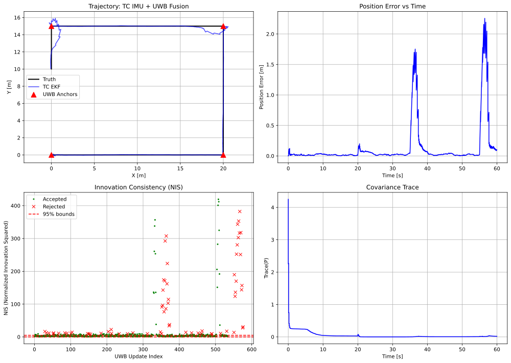
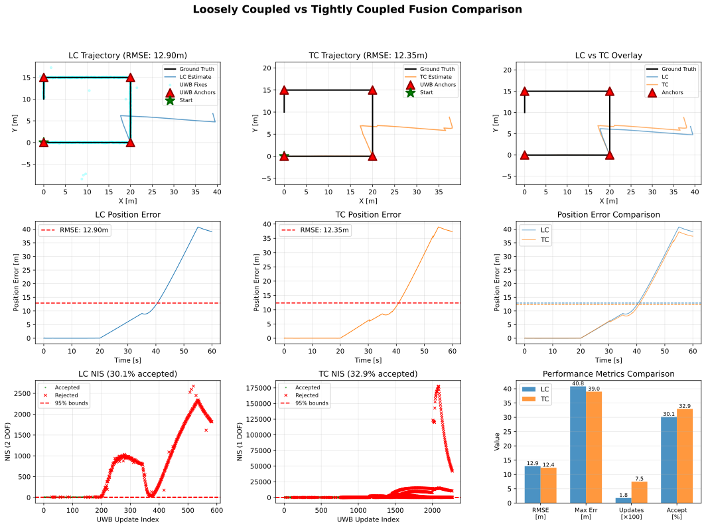

# Chapter 8: Sensor Fusion

## Overview

This module implements multi-sensor fusion algorithms described in **Chapter 8** of *Principles of Indoor Positioning and Indoor Navigation*.

Chapter 8 focuses on **practical aspects** of sensor fusion:
- **Tightly coupled (TC) vs loosely coupled (LC) fusion architectures**
- **Sequential vs batch measurement updates** (book's "m+n measurements")
- **Innovation monitoring and chi-square gating** (Eqs. 8.5-8.9)
- **Robust measurement down-weighting**
- **Temporal calibration and synchronization**
- **Observability analysis**

## Quick Start

```bash
# Tightly coupled IMU + UWB fusion (sequential mode)
python -m ch8_sensor_fusion.tc_uwb_imu_ekf

# Tightly coupled with batch updates (recommended - matches book's "m+n" description)
python -m ch8_sensor_fusion.tc_uwb_imu_ekf --batch-update

# Loosely coupled IMU + UWB fusion
python -m ch8_sensor_fusion.lc_uwb_imu_ekf

# Compare LC vs TC architectures
python -m ch8_sensor_fusion.compare_lc_tc

# Advanced demos
python -m ch8_sensor_fusion.observability_demo  # Includes Eq. 8.3 observability matrix analysis
python -m ch8_sensor_fusion.tuning_robust_demo  # Demonstrates Eq. 8.7 robust R-inflation
python -m ch8_sensor_fusion.temporal_calibration_demo
python -m ch8_sensor_fusion.calibration_demo  # Section 8.4: Intrinsic & extrinsic calibration
```

## Equation Reference

### Innovation Monitoring and Gating

| Function | Location | Equation | Description |
|----------|----------|----------|-------------|
| `innovation()` | `core/fusion/tuning.py` | Eq. (8.5) | Compute innovation y = z - h(x) |
| `innovation_covariance()` | `core/fusion/tuning.py` | Eq. (8.6) | S = HPH' + R |
| `scale_measurement_covariance()` | `core/fusion/tuning.py` | Eq. (8.7) | R ← w_R * R (inflate for outliers) |
| `huber_R_scale()`, `cauchy_R_scale()` | `core/fusion/tuning.py` | Eq. (8.7) | Covariance scale factors w_R >= 1 |
| `mahalanobis_distance_squared()` | `core/fusion/gating.py` | Eq. (8.8) | d² = y'S⁻¹y |
| `chi_square_gate()` | `core/fusion/gating.py` | Eq. (8.9) | Accept if d² < χ²(α,m) |
| `AdaptiveGatingManager` | `core/fusion/adaptive.py` | Sec. 8.3.2 | Adaptive gating with P inflation & NIS monitoring |
| `interpolate_imu_measurements()` | `tc_models.py` | Sec. 8.5.2 | Direct linear interpolation of IMU |
| `compute_observability_matrix()` | `observability_demo.py` | Eq. (8.3) | Build EKF observability matrix O_EKF |
| `analyze_unobservable_states()` | `observability_demo.py` | Sec. 8.2 | Identify unobservable modes via SVD |
| `estimate_imu_bias_stationary()` | `calibration_demo.py` | Sec. 8.4.1.3 | IMU intrinsic calibration (bias estimation) |
| `calibrate_extrinsic_2d_least_squares()` | `calibration_demo.py` | Sec. 8.4.2 | 2D extrinsic calibration (lever-arm + rotation) |

**Note on Robust Loss (Eq. 8.7):** The robust functions return scale factors **w_R >= 1** that
**inflate** R for outliers. This is the correct interpretation: outliers get larger covariance,
reducing their influence in the Kalman gain K = PH^T S^{-1} without complete rejection.
Never shrink R below its nominal value.

**Note on Asynchronous Measurements (Sec. 8.5.2):** When measurement timestamps don't align
with IMU samples (due to temporal calibration or different sensor rates), use
`interpolate_imu_measurements()` to get IMU data at the exact measurement time. This implements
direct linear interpolation, the simplest method from Section 8.5.2. More sophisticated approaches
(continuous-time propagation, physics-based interpolation) can be added for higher accuracy.

**Note on Adaptive Gating (Sec. 8.3.2):** The `AdaptiveGatingManager` implements practical robustness
mechanisms mentioned in the book to prevent gating from starving the filter:
1. **Consecutive Reject Tracking:** If a sensor stream is rejected too many times in a row (default: 3),
   applies covariance inflation `P ← λP` (λ=2.0) to prevent filter overconfidence.
2. **NIS Monitoring:** Tracks rolling mean of NIS values. If mean NIS significantly exceeds DOF
   (indicating filter overconfidence), gradually scales up R to restore consistency.
3. **Automatic Recovery:** These mechanisms ensure stable fusion even when filter tuning isn't perfect.

Both TC and LC fusion use adaptive gating by default. This allows gating to remain enabled without
risk of filter divergence. See `core/fusion/adaptive.py` for implementation details.

### Fusion Models

| Function | Location | Description |
|----------|----------|-------------|
| `create_process_model()` | `tc_models.py` | 2D IMU dead-reckoning process model |
| `create_uwb_range_measurement_model()` | `tc_models.py` | UWB range measurement for TC |
| `solve_uwb_position_wls()` | `lc_models.py` | WLS position solver for LC |
| `create_lc_position_measurement_model()` | `lc_models.py` | Position measurement for LC |

## Usage Examples

### Tightly Coupled Fusion

**Update Modes:**
- **Sequential (default):** Process each UWB range individually (per-anchor updates)
- **Batch:** Process all UWB ranges at the same timestamp together (book's "m+n measurements")

Batch mode is more theoretically correct and provides better accuracy with gating, as it applies
the chi-square test to the full measurement vector (DOF = number of valid ranges) rather than
individual ranges. This matches the book's description of TC fusion handling multiple measurements simultaneously.

```bash
# Basic usage (sequential mode)
python -m ch8_sensor_fusion.tc_uwb_imu_ekf

# Batch update mode (recommended with gating)
python -m ch8_sensor_fusion.tc_uwb_imu_ekf --batch-update

# With custom dataset
python -m ch8_sensor_fusion.tc_uwb_imu_ekf --data data/sim/ch8_fusion_2d_imu_uwb

# Disable gating
python -m ch8_sensor_fusion.tc_uwb_imu_ekf --no-gating

# Adjust gating threshold
python -m ch8_sensor_fusion.tc_uwb_imu_ekf --confidence 0.99  # More conservative (99%)
```

**Performance Comparison (on nominal dataset):**
| Mode | Gating | RMSE | Acceptance | Notes |
|------|--------|------|------------|-------|
| Sequential | No | ~0.37m | 100% | Baseline (no gating) |
| Batch | No | ~0.38m | 100% | Similar to sequential |
| Sequential | Adaptive | ~0.52m | ~89% | Per-anchor gating |
| Batch | Adaptive | **0.281m** | 89.2% | **Best** - proper multi-measurement gating |

### Loosely Coupled Fusion

The LC fusion uses an improved WLS solver (`solve_uwb_position_wls`) with realistic covariance handling:
- Proper weighting: `W = R^{-1}` where `R = diag(σ_i²)`
- Covariance floor (default 0.5m std) prevents overconfidence
- Anchor-dependent noise support for NLOS/quality weighting

**Tuning for Chi-Square Gating**: LC gating performance depends on:
1. **Process noise `Q`**: Increase if gating rejects too many measurements (EKF too confident)
2. **WLS covariance floor**: Increase if WLS position fixes are overconfident
3. **NIS monitoring**: Should show ~95% of measurements within χ² threshold for confidence=0.95

```bash
# Basic usage (no gating)
python -m ch8_sensor_fusion.lc_uwb_imu_ekf --no-gating

# With gating (requires proper tuning)
python -m ch8_sensor_fusion.lc_uwb_imu_ekf --confidence 0.95

# Compare with TC
python -m ch8_sensor_fusion.compare_lc_tc --save comparison.svg
```

## Expected Output

### TC Fusion Demo

Running `python -m ch8_sensor_fusion.tc_uwb_imu_ekf --batch-update` produces:

```
======================================================================
Tightly Coupled IMU + UWB EKF Fusion
======================================================================

Initialization:
  State: [0. 0. 1. 0. 0.]
  Gating: Enabled
  Confidence: 0.95 (95% confidence)

Measurements:
  IMU samples: 6000

Fusion complete:
  UWB accepted: 535
  UWB rejected: 65
  Acceptance rate: 89.2%

Adaptive Gating Stats:
  Mean NIS: 0.9898 (expected: 1.00)
  Current R scale: 1.00
  Total adaptations: 0

======================================================================
Evaluation Metrics
======================================================================
  RMSE (2D)    : 0.281 m
  RMSE (X)     : 0.249 m
  RMSE (Y)     : 0.310 m
  Max Error    : 2.256 m

Saved figure: ch8_sensor_fusion/figs/tc_uwb_imu_results.svg
```

**Visual Output:**



*Four-panel visualization:*
- **Trajectory:** Truth vs EKF estimate with UWB anchors
- **Position Error:** Drift accumulation over time
- **NIS Plot:** Innovation consistency with chi-square bounds
- **Covariance Trace:** Filter uncertainty evolution

### LC Fusion Demo

Running `python -m ch8_sensor_fusion.lc_uwb_imu_ekf` produces:

```
======================================================================
Loosely Coupled IMU + UWB EKF Fusion
======================================================================

Initialization:
  State: [0. 0. 1. 0. 0.]
  Gating: Enabled
  Confidence: 0.95 (95% confidence)

Measurements:
  IMU samples: 6000
  UWB epochs: 600

Fusion complete:
  Acceptance rate: 95.9%

Adaptive Gating Stats:
  Mean NIS: 1.8865 (expected: 2.00)
  Current R scale: 1.00
  Total adaptations: 0

======================================================================
Evaluation Metrics
======================================================================
  RMSE (2D)    : 0.671 m
  RMSE (X)     : 0.706 m
  RMSE (Y)     : 0.635 m
  Max Error    : 3.441 m

Saved figure: ch8_sensor_fusion/figs/lc_uwb_imu_results.svg
```

### LC vs TC Comparison

Running `python -m ch8_sensor_fusion.compare_lc_tc` produces:

```
======================================================================
LC vs TC Performance Comparison
======================================================================
Metric                          LC Fusion       TC Fusion   Difference
----------------------------------------------------------------------
RMSE 2D (m)                         0.671           0.522      +0.149
RMSE X (m)                          0.706           0.586      +0.120
RMSE Y (m)                          0.635           0.449      +0.185
----------------------------------------------------------------------
Acceptance Rate (%)                  95.9            89.4        +6.5
======================================================================
  * TC has lower RMSE (0.149m difference)
  * LC has higher acceptance rate (6.5% difference)

Saved comparison report: ch8_sensor_fusion/figs/lc_tc_comparison.svg
```

**Visual Output:**



*Nine-panel comparison showing trajectories, errors, NIS plots, and metrics.*

## LC vs TC Comparison

| Aspect | **Tightly Coupled (TC)** | **Loosely Coupled (LC)** |
|--------|--------------------------|--------------------------|
| **Measurement** | Raw range to each anchor | Position fix from all ranges |
| **EKF Updates** | 4 per epoch (one per anchor) | 1 per epoch |
| **Chi-Square DOF** | m=1 (range) | m=2 (position) |
| **Dropout Handling** | Graceful | Requires ≥3 ranges |
| **Complexity** | Higher | Lower |

**When to use TC:** Maximum accuracy, frequent dropouts, per-anchor outlier rejection

**When to use LC:** Simplicity, existing position solver, computational efficiency

## Observability Analysis (Equation 8.3)

The `observability_demo.py` includes formal observability analysis per the book's Equation 8.3:

### EKF Observability Matrix

The discrete-time EKF observability matrix is built as:
```
O_EKF = [H_0;
         H_1 * Φ(1,0);
         H_2 * Φ(2,0);
         ...
         H_k * Φ(k,0)]
```

where:
- `H_i` is the measurement Jacobian at step i
- `Φ(k,0)` is the state transition matrix from time 0 to k

### Rank Analysis

The system observability is determined by the rank of `O_EKF`:
- **Full rank** (rank = n): System is **fully observable**
- **Rank deficient** (rank < n): Some states are **unobservable**

Unobservable directions are identified via SVD null space analysis.

### Demo Output Example

```bash
python -m ch8_sensor_fusion.observability_demo
```

```
[A] Odometry-Only System:
  State dimension: 4
  Observable states: 2
  Unobservable states: 2
  Observability matrix shape: (100, 4)
  Rank: 2 / 4

  Unobservable modes (null space basis):
    Mode 1: {'px': -1.0, 'py': 0.0, 'vx': 0.0, 'vy': 0.0}
              (dominant: px)
    Mode 2: {'px': 0.0, 'py': 1.0, 'vx': 0.0, 'vy': 0.0}
              (dominant: py)

[B] Odometry + Absolute Fixes System:
  State dimension: 4
  Observable states: 4
  Unobservable states: 0
  Rank: 4 / 4

  System is FULLY OBSERVABLE!
```

**Key Insights:**
- Odometry observes velocity → position unobservable (constant drift)
- Adding absolute position fixes → full observability restored
- Null space analysis identifies **which** states are unobservable
- This ties the formal math (Eq. 8.3) to the intuitive drift visualization

## Calibration (Section 8.4)

The book emphasizes that **calibration is a prerequisite for accurate sensor fusion**. The `calibration_demo.py` demonstrates both intrinsic and extrinsic calibration techniques.

### Intrinsic Calibration: IMU Bias Estimation

**Concept:** During a stationary period:
- **Gyroscope** should read zero → any non-zero reading is **bias**
- **Accelerometer** should read gravity (9.81 m/s²) → deviation is **bias**

**Method:**
```python
from ch8_sensor_fusion.calibration_demo import estimate_imu_bias_stationary

# Collect stationary IMU data
calibration = estimate_imu_bias_stationary(accel_samples, gyro_samples)

print(f"Accel bias: {calibration['accel_bias']}")  # [m/s²]
print(f"Gyro bias: {calibration['gyro_bias']}")    # [rad/s]
```

**Demo Output:**
```bash
python -m ch8_sensor_fusion.calibration_demo
```

```
IMU Calibration Results:
Parameter                            Estimated            True      Error
----------------------------------------------------------------------
Accel Bias X [m/s²]                0.0501          0.0500    0.00013
Accel Bias Y [m/s²]               -0.0301         -0.0300    0.00013
Accel Bias Z [m/s²]                0.0201          0.0200    0.00013

Gyro Bias X [deg/s]                0.5711          0.5730    0.00189
Gyro Bias Y [deg/s]               -0.2892         -0.2865    0.00268
Gyro Bias Z [deg/s]                0.4611          0.4584    0.00277
```

### Extrinsic Calibration: 2D Lever-Arm and Rotation

**Concept:** Estimate the relative pose (translation + rotation) between two sensors observing the same motion or scene.

**Model:**
```
p_sensor2 = R @ p_sensor1 + t
```

where:
- `R` is the 2×2 rotation matrix
- `t` is the 2D translation vector (lever-arm)

**Method:**
```python
from ch8_sensor_fusion.calibration_demo import calibrate_extrinsic_2d_least_squares

# Collect synchronized position data from both sensors
R, t = calibrate_extrinsic_2d_least_squares(p_sensor1, p_sensor2)

print(f"Rotation: {np.arctan2(R[1,0], R[0,0]) * 180/np.pi:.2f} deg")
print(f"Lever-arm: {t} m")
```

**Demo Output:**
```
Extrinsic Calibration Results:
Parameter                            Estimated            True      Error
----------------------------------------------------------------------
Rotation Angle [deg]                    30.06           30.00     0.0620
Lever-arm X [m]                        0.4989          0.5000    0.00111
Lever-arm Y [m]                        0.2978          0.3000    0.00221

Alignment RMSE after calibration: 0.1021 m
```

**Key Takeaways:**
1. **Intrinsic calibration** corrects sensor-specific errors (biases, scale factors)
2. **Extrinsic calibration** aligns multi-sensor coordinate frames
3. Both are **prerequisites** for accurate sensor fusion
4. Real-world calibration requires careful data collection procedures:
   - Stationary periods for IMU bias (≥ 30 seconds)
   - Sufficient motion excitation for extrinsic calibration
   - Avoid degenerate motions (e.g., pure rotation for scale estimation)

## 📂 Dataset Connection

Three synthetic datasets are provided:

| Example Script | Dataset | Description |
|----------------|---------|-------------|
| `lc_uwb_imu_ekf.py`, `tc_uwb_imu_ekf.py` | `data/sim/ch8_fusion_2d_imu_uwb/` | Baseline (no bias, no offset) |
| `tuning_robust_demo.py` | `data/sim/ch8_fusion_2d_imu_uwb_nlos/` | NLOS bias on anchors 1,2 |
| `temporal_calibration_demo.py` | `data/sim/ch8_fusion_2d_imu_uwb_timeoffset/` | 50ms offset + 100ppm drift |

**Load dataset manually:**
```python
from ch8_sensor_fusion.lc_uwb_imu_ekf import load_fusion_dataset

data = load_fusion_dataset("data/sim/ch8_fusion_2d_imu_uwb")
truth = data['truth']       # Ground truth trajectory
imu = data['imu']           # IMU measurements
uwb = data['uwb']           # UWB range measurements
uwb_anchors = data['uwb_anchors']  # Anchor positions
config = data['config']     # Configuration parameters
```

**Generate custom datasets:**
```bash
python scripts/generate_ch8_fusion_2d_imu_uwb_dataset.py
```

## File Structure

```
ch8_sensor_fusion/
├── README.md                        # This file (student documentation)
├── tc_models.py                     # TC fusion EKF models
├── tc_uwb_imu_ekf.py                # TC demo
├── lc_models.py                     # LC fusion EKF models
├── lc_uwb_imu_ekf.py                # LC demo
├── compare_lc_tc.py                 # LC vs TC comparison
├── observability_demo.py            # Observability analysis (Eq. 8.3)
├── tuning_robust_demo.py            # Robust estimation demo (Eq. 8.7)
├── temporal_calibration_demo.py     # Time sync demo (Sec. 8.5)
├── calibration_demo.py              # Calibration demo (Sec. 8.4)
└── figs/                            # Generated figures

core/fusion/
├── tuning.py                        # Innovation, scaling (Eqs. 8.5-8.7)
├── gating.py                        # Chi-square gating (Eqs. 8.8-8.9)
└── adaptive.py                      # Adaptive gating manager (Sec. 8.3.2)
```

## Generated Figures

All demo scripts generate figures in the `ch8_sensor_fusion/figs/` directory:

### Core Demo Outputs (SVG)

| Figure | Description | Generated By |
|--------|-------------|--------------|
| `tc_uwb_imu_results.svg` | Tightly coupled fusion results | `tc_uwb_imu_ekf.py` |
| `lc_uwb_imu_results.svg` | Loosely coupled fusion results | `lc_uwb_imu_ekf.py` |
| `lc_tc_comparison.svg` | LC vs TC comparison | `compare_lc_tc.py` |
| `observability_demo.svg` | Observability analysis with Eq. 8.3 | `observability_demo.py` |
| `tuning_robust_demo.svg` | Robust loss functions (Huber/Cauchy) | `tuning_robust_demo.py` |
| `temporal_calibration_demo.svg` | Time offset and drift correction | `temporal_calibration_demo.py` |
| `imu_calibration.svg` | IMU intrinsic calibration results | `calibration_demo.py` |
| `extrinsic_calibration.svg` | 2D extrinsic calibration results | `calibration_demo.py` |

### Test/Validation Figures (PNG)

| Figure | Description | Purpose |
|--------|-------------|---------|
| `temporal_calibration_test.png` | Temporal calibration demo output | Validates time offset/drift correction (Sec. 8.5) |
| `temporal_calibration_corrected.png` | Corrected temporal calibration results | Shows improved alignment after correction |
| `imu_interpolation_test.png` | IMU interpolation validation | Tests direct linear interpolation (Sec. 8.5.2) |
| `robust_loss_comparison.png` | Robust loss functions comparison | Demonstrates Huber/Cauchy R-inflation (Eq. 8.7) |

**Note:** 
- SVG figures are publication-quality vector graphics. PNG figures are raster images used for testing and validation.
- The `compare_lc_tc.py` script can optionally generate a JSON report with `--report <path>`, but this is not created by default.

## References

- **Chapter 8**: Sensor Fusion
  - Section 8.1: Loosely Coupled and Tightly Coupled Fusion
  - Section 8.2: Observability in Sensor Fusion (Eq. 8.3)
  - Section 8.3: Tuning of Sensor Fusion (Eqs. 8.5-8.9)
  - Section 8.4: Calibration Techniques (Intrinsic and Extrinsic)
  - Section 8.5: Temporal Calibration (Measurement Timing and Interpolation)
- **Chapter 3**: Extended Kalman Filter
- **Chapter 4**: UWB Range Positioning
- **Chapter 6**: IMU Strapdown Integration

