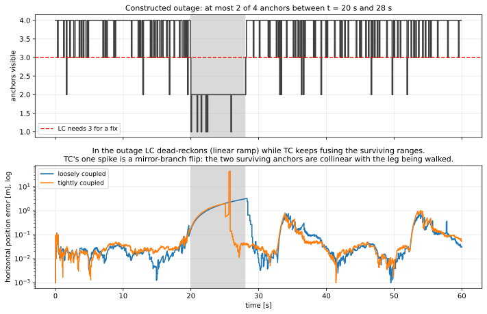
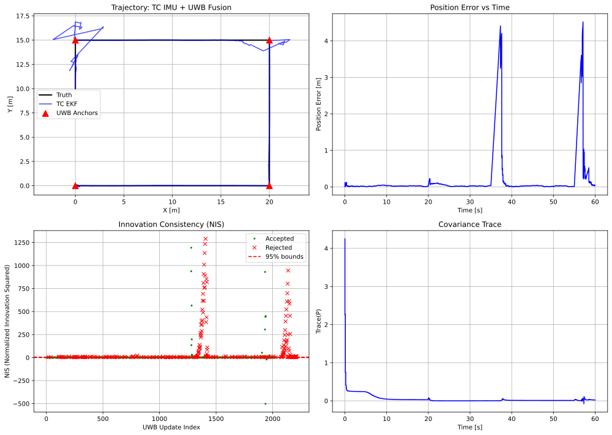
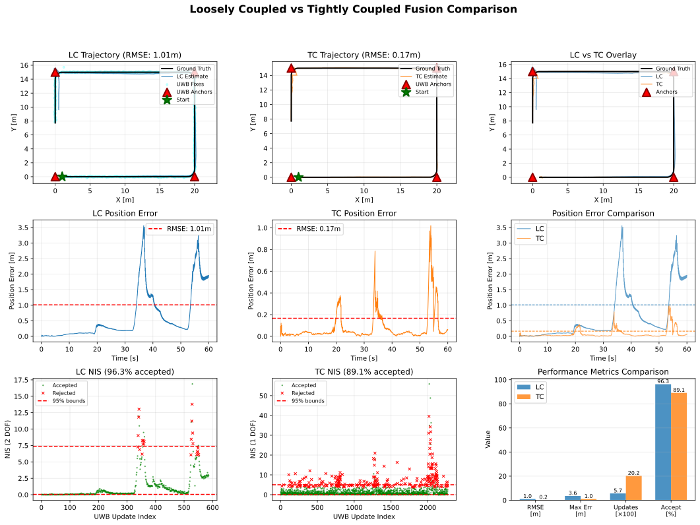
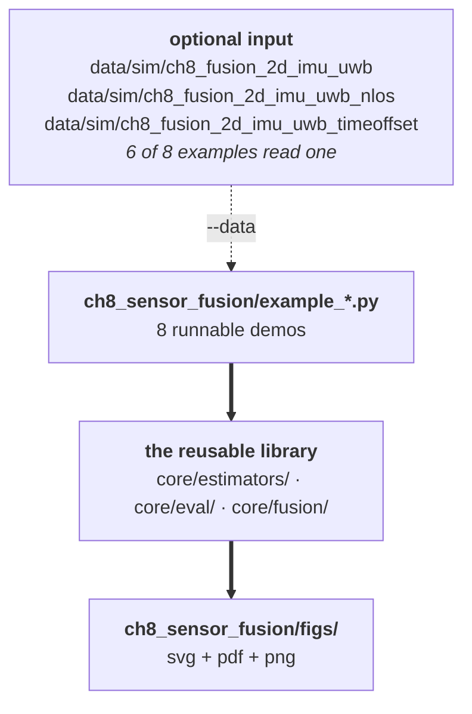
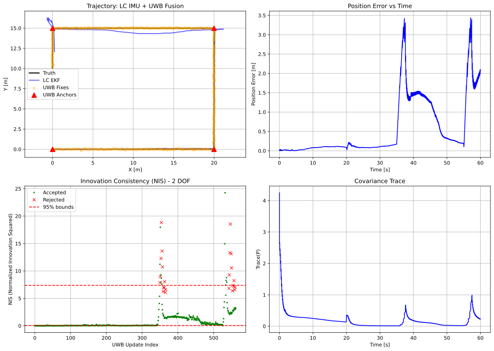
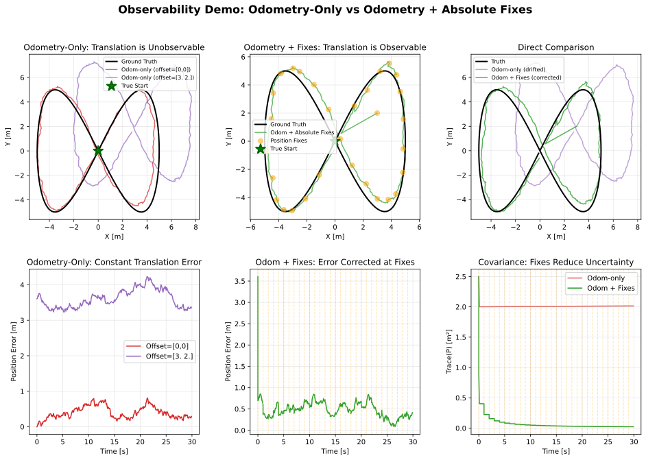
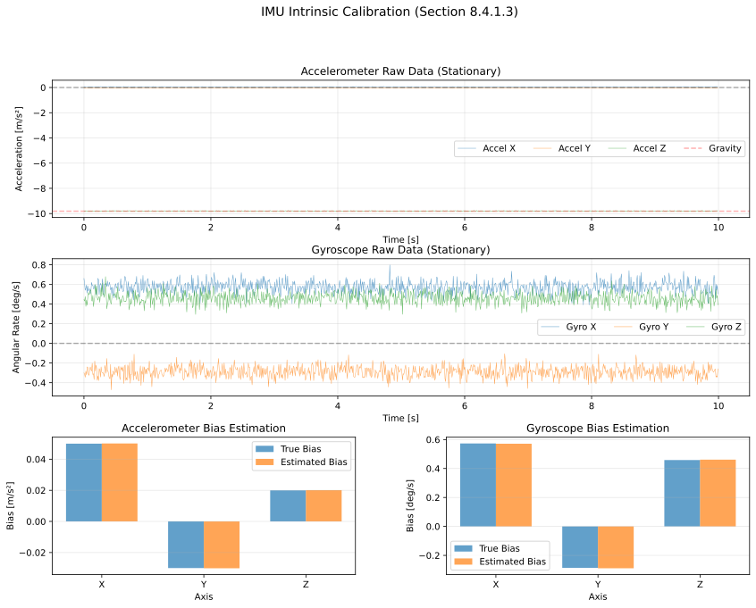
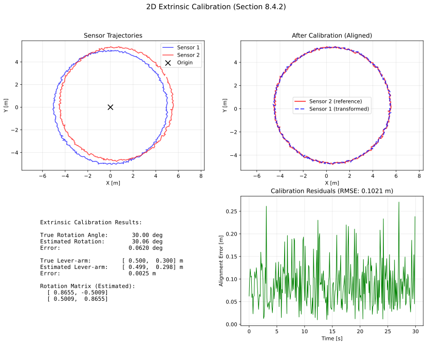
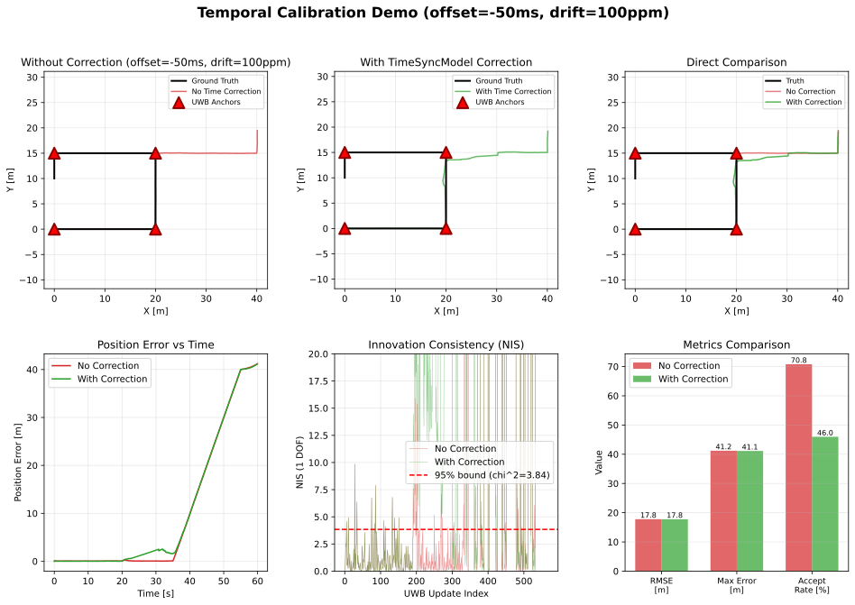
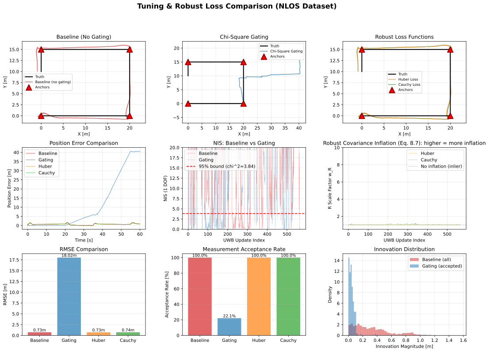

# Chapter 8: Sensor Fusion

[](https://colab.research.google.com/github/IPNL-POLYU/IPIN-Examples/blob/main/notebooks/ch8_sensor_fusion.ipynb)

Run this chapter in your browser — every figure below is one you can
regenerate and change. No install: [`notebooks/ch8_sensor_fusion.ipynb`](../notebooks/ch8_sensor_fusion.ipynb)

## Overview

This module implements multi-sensor fusion algorithms described in **Chapter 8** of *Principles of Indoor Positioning and Indoor Navigation*.

Chapter 8 focuses on **practical aspects** of sensor fusion:
- **Tightly coupled (TC) vs loosely coupled (LC) fusion architectures** (Sec. 8.1)
- **Observability analysis** (Sec. 8.2, Eq. 8.3)
- **Innovation monitoring and chi-square gating** (Sec. 8.3, Eqs. 8.5-8.9)
- **Robust measurement down-weighting** (Eq. 8.7)
- **Intrinsic and extrinsic calibration** (Sec. 8.4)
- **Temporal calibration and synchronization** (Sec. 8.5)
- **Sequential vs batch measurement updates** (book's "m+n measurements")

---

## Quick Start

```bash
# Tightly coupled IMU + UWB fusion (sequential mode)
python -m ch8_sensor_fusion.example_tc_fusion

# Tightly coupled with batch updates (recommended - matches book's "m+n" description)
python -m ch8_sensor_fusion.example_tc_fusion --batch-update

# Loosely coupled IMU + UWB fusion
python -m ch8_sensor_fusion.example_lc_fusion

# Compare LC vs TC architectures
python -m ch8_sensor_fusion.example_comparison

# Why tight coupling exists: an 8 s anchor outage (add --animate for the GIF)
python -m ch8_sensor_fusion.example_anchor_outage

# Advanced demos
python -m ch8_sensor_fusion.example_observability  # Includes Eq. 8.3 observability matrix analysis
python -m ch8_sensor_fusion.example_robust_tuning  # Demonstrates Eq. 8.7 robust R-inflation
python -m ch8_sensor_fusion.example_temporal_calibration
python -m ch8_sensor_fusion.example_calibration  # Section 8.4: Intrinsic & extrinsic calibration
```

## Anchor Outage: LC vs TC, where the difference actually shows

| Figure | Built by | Shows |
|--------|----------|-------|
| `ch8_anchor_outage.{svg,pdf,png}` | `example_anchor_outage.py` | Anchor visibility and both error curves over the whole run |
| `ch8_anchor_outage.gif` (0.69 MB) | `example_anchor_outage.py --animate` | The same, unfolding: anchors going hollow, LC's error ramping, TC holding through the outage |



On the shipped dataset LC and TC look close, and that is misleading. The
dataset's natural dropouts are **single isolated epochs**, so LC coasts for a
fraction of a second and nothing visible happens. The difference needs an
outage that *persists*, so this example constructs one: 8 seconds with at most
two of four anchors visible.

<!-- example-output: ch8_sensor_fusion.example_anchor_outage -->
```
Constructed outage: at most 2 of 4 anchors between t = 20 s and 28 s
(the shipped dataset's own dropouts are single isolated epochs and do not stress the difference)
  LC position fixes that failed outright: 93
  RMSE over the run:      LC 0.127 m   TC 0.029 m
  Peak error in outage + 3 s recovery: LC 0.59 m   TC 0.06 m (LC peak is 9.7x TC)
```

**This is the advantage tight coupling is sold on, and here it is clean.** Two
ranges do not determine a 2-D position, so LC's front end returns nothing at
all — 93 fixes fail outright and LC dead-reckons, its error ramping to 0.59 m
and snapping back the instant a third anchor returns. TC keeps updating on the
two ranges it still has and peaks at 0.06 m, an order of magnitude better.

Two ranges do still leave a **two-fold ambiguity**: the true position and its
reflection across the baseline joining the surviving anchors. Nothing in the
ranges distinguishes them. What does is the IMU prediction, and it is sharp
enough to hold the right branch for the whole outage.

> **This page used to say the opposite, and the reason is worth keeping.** It
> reported TC taking the wrong branch at t = 25.8 s — estimating (30.1, −35.5)
> against a truth of (20.0, 7.2), a 43.92 m peak, 13.5x LC's — and concluded
> that tight coupling "answers confidently and wrongly" where loose coupling
> refuses to answer. The excursion was real. Its cause was not the geometry:
> the shipped accelerometer was map-frame where every filter in this chapter
> integrates it as body-frame, so the prediction that should have broken the
> tie was wrong too. A degenerate geometry is a statement about the
> measurements alone; whether an estimator is harmed by one depends on what
> else it knows.

TC now wins at every window checked — (20, 28), (18, 26), (22, 30), (24, 32)
and (40, 48) — on both whole-run RMSE and peak error. The window has
deliberately not been moved to a flattering one. See the module docstring for
the table.

## Usage Examples

### Tightly Coupled Fusion

**Update Modes:**
- **Sequential (default):** Process each UWB range individually (per-anchor updates)
- **Batch:** Process all UWB ranges at the same timestamp together (book's "m+n measurements")

Batch mode is more theoretically correct and provides better accuracy with gating, as it applies
the chi-square test to the full measurement vector (DOF = number of valid ranges) rather than
individual ranges. This matches the book's description of TC fusion handling multiple measurements simultaneously.

```bash
# Basic usage (sequential mode)
python -m ch8_sensor_fusion.example_tc_fusion

# Batch update mode (recommended with gating)
python -m ch8_sensor_fusion.example_tc_fusion --batch-update

# With custom dataset
python -m ch8_sensor_fusion.example_tc_fusion --data data/sim/ch8_fusion_2d_imu_uwb

# Disable gating
python -m ch8_sensor_fusion.example_tc_fusion --no-gating

# Adjust gating threshold
python -m ch8_sensor_fusion.example_tc_fusion --confidence 0.99  # More conservative (99%)
```

**Performance Comparison (on the nominal dataset, measured):**
| Mode | Gating | RMSE | Acceptance | Notes |
|------|--------|------|------------|-------|
| Sequential | No | 0.021 m | 100% | Every range used |
| Batch | No | 0.021 m | 100% | Indistinguishable from sequential here |
| Sequential | Adaptive | 0.025 m | 93.7% | Per-anchor gating |
| Batch | Adaptive | 0.024 m | 93.2% | Gates the epoch as one 4-DOF vector |

**No row is marked "Best", because on this dataset the best row is the one
that does nothing.** The nominal dataset is clean, so every measurement the
gate rejects is a good one and gating can only cost — about 3 mm here.
A gate is insurance, and its premium is visible exactly where there is nothing
to insure against. The scenario that pays for it is
[`example_robust_tuning`](#tuning-and-robust-loss-functions), where the same
gate takes the persistent-NLOS run from 0.680 m to 0.033 m.

This table previously claimed 0.37/0.38/0.52/0.281 m and bolded the last as
"Best". All four were measured against the map-frame accelerometer described
below, and the ordering they implied — that adaptive batch gating *improves*
accuracy on clean data — was an artifact of it.

### Loosely Coupled Fusion

The LC fusion uses an improved WLS solver (`solve_uwb_position_wls`) with realistic covariance handling:
- Proper weighting: `W = R^{-1}` where `R = diag(σ_i²)`, with `σ` read from the
  dataset's own `range_noise_std_m` -- the same value `run_tc_fusion` reads for
  the same sensor
- No covariance floor by default (`cov_floor_std=0.0`): the returned
  `(H^T W H)^{-1}` is already the honest Cramer-Rao covariance for real anchor
  geometry and real noise, and flooring it needs a justified reason, not a habit
- Anchor-dependent noise support for NLOS/quality weighting

**Tuning for Chi-Square Gating**: LC gating performance depends on:
1. **Process noise `Q`**: Increase if gating rejects too many measurements (EKF too confident)
2. **WLS covariance floor** (`cov_floor_std`, default `0.0`): only set this above
   zero if you have independent evidence the WLS fixes are overconfident
   (unmodeled multipath, anchor survey error) -- measure it before picking a
   number. An unjustified floor manufactures overconfidence in the opposite
   direction: see "LC vs TC Comparison" below, where a hardcoded 0.5 m floor
   against a true ~0.03 m std cost LC a 6x RMSE penalty that had nothing to do
   with the architecture.
3. **NIS monitoring**: Should show ~95% of measurements within χ² threshold for confidence=0.95

```bash
# Basic usage (no gating)
python -m ch8_sensor_fusion.example_lc_fusion --no-gating

# With gating (requires proper tuning)
python -m ch8_sensor_fusion.example_lc_fusion --confidence 0.95

# Compare with TC
python -m ch8_sensor_fusion.example_comparison --save comparison.svg
```

## Expected Output

### TC Fusion Demo

Running `python -m ch8_sensor_fusion.example_tc_fusion` produces:

<details>
<summary>Full console output — 28 lines</summary>

<!-- example-output: ch8_sensor_fusion.example_tc_fusion -->
```
Tightly Coupled IMU + UWB EKF Fusion
======================================================================
Initialization:
  State: [1. 0. 1. 0. 0.]
  Gating: Enabled
  Confidence: 0.95 (95% confidence)
Measurements:
  IMU samples: 6000
  UWB samples: 2271
  Update mode: Sequential (per-anchor)
...
Fusion complete:
  UWB accepted: 2129
  UWB rejected: 142
  Acceptance rate: 93.7%
Adaptive Gating Stats:
  Mean NIS: 1.14 (expected: 1)
  Final R scale: 1.00x
  Covariance inflations: 0
...
Evaluation Metrics
======================================================================
  RMSE (2D)    : 0.025 m
  RMSE (X)     : 0.017 m
  RMSE (Y)     : 0.019 m
  Max Error    : 0.122 m
  Final Error  : 0.016 m
  Median Error : 0.022 m  <- typical tracking
```

</details>

TC takes one update per anchor per epoch, so it accepts 2023 range updates
where LC accepts 519 position fixes below — four times fewer. That gap does
not translate into an accuracy gap here: see the comparison further down,
where the two report almost the same RMSE.

**Visual Output:**



*Four-panel visualization:*
- **Trajectory:** truth is black, TC EKF is blue in this standalone figure,
  and UWB anchors are red triangles.
- **Position Error:** blue error curve over time in metres.
- **NIS Plot:** accepted updates are green dots, rejected updates are red x's,
  and red dashed horizontal lines are the central 95% chi-square bounds for
  one range DOF.
- **Covariance Trace:** blue trace of the EKF covariance matrix.

### LC Fusion Demo

Running `python -m ch8_sensor_fusion.example_lc_fusion` produces:

<details>
<summary>Full console output — 31 lines</summary>

<!-- example-output: ch8_sensor_fusion.example_lc_fusion -->
```
Loosely Coupled IMU + UWB EKF Fusion
======================================================================
Initialization:
  State: [1. 0. 1. 0. 0.]
  Gating: Enabled
  Confidence: 0.95 (95% confidence)
Measurements:
  IMU samples: 6000
  UWB epochs: 600
  Total: 6600
...
Fusion complete:
  UWB position fixes solved: 587
  UWB fixes accepted: 541
  UWB fixes rejected: 46
  UWB solver failures: 13
  Acceptance rate: 92.2%
Adaptive Gating Stats:
  Mean NIS: 3.15 (expected: 2)
  Final R scale: 1.00x
  Covariance inflations: 0
...
Evaluation Metrics
======================================================================
  RMSE (2D)    : 0.027 m
  RMSE (X)     : 0.020 m
  RMSE (Y)     : 0.019 m
  Max Error    : 0.115 m
  Final Error  : 0.018 m
```

</details>

`UWB solver failures: 13` is worth noticing: LC has to solve a position fix
from the ranges before the filter sees anything, and on 13 epochs that solve
did not converge at all. TC has no equivalent failure mode, because it feeds
the filter the ranges themselves.

### LC vs TC Comparison

Running `python -m ch8_sensor_fusion.example_comparison` produces:

<!-- example-output: ch8_sensor_fusion.example_comparison -->
```
LC vs TC Performance Comparison
======================================================================
Metric                          LC Fusion       TC Fusion   Difference
----------------------------------------------------------------------
RMSE 2D (m)                         0.027           0.025      +0.002
RMSE X (m)                          0.020           0.017      +0.003
RMSE Y (m)                          0.019           0.019      -0.000
Max Error (m)                       0.115           0.122      -0.007
Mean Error (m)                      0.024           0.023      +0.001
Final Error (m)                     0.018           0.016      +0.003
----------------------------------------------------------------------
UWB Updates Accepted                  541            2129       -1588
UWB Updates Rejected                   46             142         -96
LC Solver Failures                     13             N/A
Acceptance Rate (%)                  92.2            93.7        -1.6
```

LC and TC are close on this dataset -- 0.027 m against 0.025 m. That is what
theory predicts here: all four anchors are visible with good geometry, so the
WLS position fix LC pre-solves is a sufficient statistic, and pre-solving costs
it nothing.

Two separate defects used to distort this comparison, and both are fixed:

- **A tuning bug in LC.** `run_lc_fusion` hardcoded `range_noise_std=0.1` and
  floored the WLS covariance at `cov_floor_std=0.5` regardless of the dataset's
  real 0.05 m noise -- a ~25x variance inflation that made the EKF distrust
  good UWB fixes and lean on IMU dead-reckoning instead. LC now reads the
  dataset's noise exactly as TC does, and passes no floor.
- **A map-frame accelerometer.** The shipped `imu.npz/accel_xy` was map-frame
  where both filters integrate it as body-frame, so both were fighting a double
  rotation. This is the larger of the two: it took LC from 0.143 m to 0.027 m
  and TC from 0.167 m to 0.025 m.

**The NIS excess was re-attributed by that second fix, and the earlier
diagnosis is worth recording.** TC's mean NIS was 1.93 against an expected 1.0,
and this was written down as an open Q-tuning item -- the process noise was
assumed too small. It is now **1.14**, so roughly four-fifths of the excess was
the accelerometer frame rather than Q. An inconsistent filter tells you the
model and the data disagree; it does not tell you which one is wrong, and the
process noise is the easiest thing to blame because it is the easiest thing to
change.

TC still takes far more updates (2129 range updates against 541 position
fixes) and has no equivalent to LC's 13 solver failures, but neither shows up
as an accuracy difference here. TC's real advantage is when there are too few
anchors for LC to solve a fix at all -- see the anchor-outage demonstration
near the top of this README, which is where the architectural difference
actually shows up.

**Visual Output:**



*Nine-panel comparison showing trajectories, errors, NIS plots, and metrics.*

### Robust Tuning Demo

```bash
python -m ch8_sensor_fusion.example_robust_tuning
```

<!-- example-output: ch8_sensor_fusion.example_robust_tuning -->
```
Scenario   Method               RMSE [m]  Median [m]  Accepted  Rejected
------------------------------------------------------------------------------
LOS        Baseline                0.020       0.017      2271         0
LOS        Chi-square gating       0.022       0.019      2153       118
LOS        Huber loss              0.020       0.017      2271         0
LOS        Cauchy loss             0.020       0.017      2271         0
------------------------------------------------------------------------------
Sporadic   Baseline                0.317       0.230      2271         0
Sporadic   Chi-square gating       0.022       0.019      2051       220
Sporadic   Huber loss              0.060       0.043      2271         0
Sporadic   Cauchy loss             0.041       0.030      2271         0
------------------------------------------------------------------------------
NLOS       Baseline                0.680       0.676      2271         0
NLOS       Chi-square gating       0.033       0.025      1095      1176
NLOS       Huber loss              0.678       0.682      2271         0
NLOS       Cauchy loss             0.683       0.694      2271         0
------------------------------------------------------------------------------

Key Findings:
  * Sporadic outliers are what an M-estimator is for. Best of the two losses: Cauchy loss, median
    error 0.230 m -> 0.030 m, 87% better; RMSE 87% better.
...
  * Persistent NLOS is not an outlier problem. Huber changes it by -0.3% and Cauchy +0.4% (negative is better),
```

**A robust loss can only be judged against the outlier distribution it was
designed for**, which is why there are three scenarios rather than one. Cauchy
repairs the sporadic case by 87% on the median and Huber by 81%, and both cost
nothing measurable on clean data. Neither moves the persistent-NLOS case at all
(-0.3% and +0.4%), and that is the correct answer rather than a disappointing
one. An M-estimator down-weights the minority that disagrees with the majority,
and this dataset biases *half* the anchors for the whole run -- measured per
anchor, +0.001, +0.798, +0.799, +0.001 m. With four anchors in 2D, two
consistently biased ranges fix a position as firmly as two honest ones, so
there is no majority to side with. Persistent bias needs a method that can
represent it: state augmentation with a per-anchor bias term, or NLOS
identification, not a reweighting of the residual.

Two details worth reading before copying a threshold out of this demo:

- **The losses take a residual normalized by `sqrt(R)`, not an innovation in
  metres, and the thresholds are therefore in units of sigma_R.** They are 10
  and 20, not the textbook 1.345 and 2.385. The floor is the clean-data tail:
  on the *clean* dataset `|y|/sigma_R` has a 99th percentile of 2.73 and a
  maximum of 3.76, so anything below about 4 reaches into data with no outlier
  in it. The ceiling is the NLOS run, where an aggressive threshold actively
  costs -- 1.345 makes it 16% worse, because with no inlier majority the loss
  down-weights honest and biased links alike. Run
  `python -m ch8_sensor_fusion.example_robust_tuning --help` for the full
  measurement, including why these numbers used to be 20 and 50.
- **RMSE and median disagree on purpose.** The worst samples are the transient
  after the 57 deg/s turn at t = 52-54 s, where a manoeuvre the process model
  does not predict looks exactly like an outlier and the robust losses inflate
  R too. Over five draws of the sporadic scenario the median gain is 57-62%
  every time while the RMSE gain ranges from +38% to -44%, so the median is the
  statistic that describes the method.

Chi-square gating is the **strongest** method in the table: 0.022 m on clean
data, 0.022 m on sporadic and 0.033 m on persistent NLOS, against a 0.680 m
baseline in the last case. On the clean run it accepts 95% of measurements,
which is exactly the confidence it is set to, and on NLOS it accepts 48% --
close to the half of the ranges that carry no bias.

> **This paragraph used to say gating "scores 24-26 m in every scenario"** and
> blamed a Gaussian gate over heavy-tailed innovations for a rejection rate
> that ran away to 67-81%. The numbers were real; the attribution was not. The
> innovations were heavy-tailed because the shipped accelerometer was
> map-frame, and the gate was the only strategy here that tests its input
> against a distributional assumption -- so it failed loudest and looked like
> the culprit. **The component that breaks first under a bad input is not
> usually the broken one.**

What remains true is the structural difference: a hard gate inherits every
error in the covariance it tests against, while a robust loss scales an
outlier's influence down instead of removing it and so degrades more gently
under a mis-specified R. That is an argument about robustness to model error,
not about which scores better here.

### Temporal Calibration Demo

```bash
python -m ch8_sensor_fusion.example_temporal_calibration
```

<!-- example-output: ch8_sensor_fusion.example_temporal_calibration -->
```
Method                             RMSE [m]     Improvement
----------------------------------------------------------------------
Without Time Correction               0.053      (baseline)
With TimeSyncModel                    0.020           62.7%
======================================================================

Key Findings:
  * Uncorrected: 0.053 m RMSE; corrected: 0.020 m
  * So a -50.0 ms offset costs 0.033 m, and TimeSyncModel recovers it: 62.7% better
  * That is the order the kinematics predict: 1.00 m/s for 50 ms displaces the platform 0.050 m
```

Note the demo checks its own result against the kinematics rather than
asserting it: 50 ms at 1 m/s displaces the platform 0.050 m, so the correction
cannot be worth more than that. This is the bound `docs/` once contradicted by
claiming the same correction more than halved the error.

## LC vs TC Comparison

| Aspect | **Tightly Coupled (TC)** | **Loosely Coupled (LC)** |
|--------|--------------------------|--------------------------|
| **Measurement** | Raw range to each anchor | Position fix from all ranges |
| **EKF Updates** | 4 per epoch (one per anchor) | 1 per epoch |
| **Chi-Square DOF** | m=1 (range) | m=2 (position) |
| **Dropout Handling** | Graceful | Requires ≥3 ranges |
| **Complexity** | Higher | Lower |

**When to use TC:** Maximum accuracy, frequent dropouts, per-anchor outlier rejection

**When to use LC:** Simplicity, existing position solver, computational efficiency

## Observability Analysis (Equation 8.3)

The `example_observability.py` includes formal observability analysis per the book's Equation 8.3:

### EKF Observability Matrix

The discrete-time EKF observability matrix is built as:
```
O_EKF = [H_0;
         H_1 * Φ(1,0);
         H_2 * Φ(2,0);
         ...
         H_k * Φ(k,0)]
```

where:
- `H_i` is the measurement Jacobian at step i
- `Φ(k,0)` is the state transition matrix from time 0 to k

### Rank Analysis

The system observability is determined by the rank of `O_EKF`:
- **Full rank** (rank = n): System is **fully observable**
- **Rank deficient** (rank < n): Some states are **unobservable**

Unobservable directions are identified via SVD null space analysis.

### Demo Output Example

```bash
python -m ch8_sensor_fusion.example_observability
```

<!-- example-output: ch8_sensor_fusion.example_observability -->
```
[A] Odometry-Only System:
----------------------------------------------------------------------
  State dimension: 4
  Observable states: 2
  Unobservable states: 2
  Observability matrix shape: (100, 4)
  Rank: 2 / 4

  Unobservable modes (null space basis):
    Mode 1: {'px': -1.0, 'py': -0.0, 'vx': -0.0, 'vy': -0.0}
              (dominant: px)
    Mode 2: {'px': -0.0, 'py': 1.0, 'vx': 0.0, 'vy': -0.0}
              (dominant: py)

  Singular values (first 5): [7.07106781 7.07106781 0.         0.        ]

[B] Odometry + Absolute Fixes System:
----------------------------------------------------------------------
  State dimension: 4
  Observable states: 4
  Unobservable states: 0
  Observability matrix shape: (100, 4)
  Rank: 4 / 4

  System is FULLY OBSERVABLE!
```

The two unobservable modes are exactly the position axes, and their velocity
coefficients are zero — which is the chapter's claim made arithmetic. The block
above is now checked against the program's real output, and pinning it is what
found the two defects it used to hide: the coefficients printed as
`np.float64(-0.9999999999999998)` under numpy 2, and `(dominant: ...)` named
the second-largest component however small, so a mode of `[-1, 0, 0, 0]` was
reported as `dominant: vy, px` — naming a velocity state, in the section
arguing velocity is the observable half.

**Key Insights:**
- Odometry observes velocity → position unobservable (constant drift)
- Adding absolute position fixes → full observability restored
- Null space analysis identifies **which** states are unobservable
- This ties the formal math (Eq. 8.3) to the intuitive drift visualization

## Calibration (Section 8.4)

The book emphasizes that **calibration is a prerequisite for accurate sensor fusion**. The `example_calibration.py` demonstrates both intrinsic and extrinsic calibration techniques.

### Intrinsic Calibration: IMU Bias Estimation

**Concept:** During a stationary period:
- **Gyroscope** should read zero → any non-zero reading is **bias**
- **Accelerometer** should read gravity (9.81 m/s²) → deviation is **bias**

**Method:**
```py
from ch8_sensor_fusion.example_calibration import estimate_imu_bias_stationary

# Collect stationary IMU data
calibration = estimate_imu_bias_stationary(accel_samples, gyro_samples)

print(f"Accel bias: {calibration['accel_bias']}")  # [m/s²]
print(f"Gyro bias: {calibration['gyro_bias']}")    # [rad/s]
```

**Demo Output:**
```bash
python -m ch8_sensor_fusion.example_calibration
```

```
IMU Calibration Results:
Parameter                            Estimated            True      Error
----------------------------------------------------------------------
Accel Bias X [m/s²]                0.0501          0.0500    0.00013
Accel Bias Y [m/s²]               -0.0301         -0.0300    0.00013
Accel Bias Z [m/s²]                0.0201          0.0200    0.00013

Gyro Bias X [deg/s]                0.5711          0.5730    0.00189
Gyro Bias Y [deg/s]               -0.2892         -0.2865    0.00268
Gyro Bias Z [deg/s]                0.4611          0.4584    0.00277
```

### Extrinsic Calibration: 2D Lever-Arm and Rotation

**Concept:** Estimate the relative pose (translation + rotation) between two sensors observing the same motion or scene.

**Model:**
```
p_sensor2 = R @ p_sensor1 + t
```

where:
- `R` is the 2×2 rotation matrix
- `t` is the 2D translation vector (lever-arm)

**Method:**
```py
from ch8_sensor_fusion.example_calibration import calibrate_extrinsic_2d_least_squares

# Collect synchronized position data from both sensors
R, t = calibrate_extrinsic_2d_least_squares(p_sensor1, p_sensor2)

print(f"Rotation: {np.arctan2(R[1,0], R[0,0]) * 180/np.pi:.2f} deg")
print(f"Lever-arm: {t} m")
```

**Demo Output:**

<!-- example-output: ch8_sensor_fusion.example_calibration -->
```
Extrinsic Calibration Results
======================================================================
Parameter                            Estimated            True      Error
----------------------------------------------------------------------
Rotation Angle [deg]                    30.06           30.00     0.0620
Lever-arm X [m]                        0.4989          0.5000    0.00111
Lever-arm Y [m]                        0.2978          0.3000    0.00221
======================================================================
Alignment RMSE after calibration: 0.1021 m
(Expected 0.1000 m = 2 x the 0.05 m per-axis sensor noise: sqrt(2) for differencing two noisy sensors,
 and sqrt(2) again because this is a 2-D magnitude rather than one axis. Measured/expected = 1.02.)
```

The residual is checked against a predicted value rather than eyeballed: two
sensors each carrying 0.05 m of per-axis noise, differenced and taken as a 2-D
magnitude, give 0.10 m. Measuring 0.1021 m against that says the calibration
has removed everything systematic and left only the noise.

**Key Takeaways:**
1. **Intrinsic calibration** corrects sensor-specific errors (biases, scale factors)
2. **Extrinsic calibration** aligns multi-sensor coordinate frames
3. Both are **prerequisites** for accurate sensor fusion
4. Real-world calibration requires careful data collection procedures:
   - Stationary periods for IMU bias (≥ 30 seconds)
   - Sufficient motion excitation for extrinsic calibration
   - Avoid degenerate motions (e.g., pure rotation for scale estimation)

## Dataset Connection

Three synthetic datasets are provided:

| Example Script | Dataset | Description |
|----------------|---------|-------------|
| `example_lc_fusion.py`, `example_tc_fusion.py` | `data/sim/ch8_fusion_2d_imu_uwb/` | Baseline (no bias, no offset) |
| `example_robust_tuning.py` | `data/sim/ch8_fusion_2d_imu_uwb/` and `data/sim/ch8_fusion_2d_imu_uwb_nlos/` | Clean LOS (also the base for the injected sporadic outliers) and persistent NLOS bias on anchors 1,2 |
| `example_temporal_calibration.py` | `data/sim/ch8_fusion_2d_imu_uwb_timeoffset/` | 50ms offset + 100ppm drift |

**Load dataset manually:**
```python
from ch8_sensor_fusion.example_lc_fusion import load_fusion_dataset

data = load_fusion_dataset("data/sim/ch8_fusion_2d_imu_uwb")
truth = data['truth']       # Ground truth trajectory
imu = data['imu']           # IMU measurements
uwb = data['uwb']           # UWB range measurements
uwb_anchors = data['uwb_anchors']  # Anchor positions
config = data['config']     # Configuration parameters
```

`load_fusion_dataset()` returns a `FusionDataset`: it still behaves like the
plain dictionaries used in older snippets, but it also exposes reader-friendly
properties such as `true_positions_xy_m`, `imu_timestamps_s`,
`measured_uwb_ranges_m`, and `uwb_anchor_positions_xy_m`.

**Generate custom datasets:**
```bash
python scripts/generate_ch8_fusion_2d_imu_uwb_dataset.py
```

## Equation Reference

### Innovation Monitoring and Gating

| Function | Location | Equation | Description |
|----------|----------|----------|-------------|
| `innovation()` | `core/fusion/tuning.py` | Eq. (8.5) | Compute innovation y = z - h(x) |
| `innovation_covariance()` | `core/fusion/tuning.py` | Eq. (8.6) | S = HPH' + R |
| `scale_measurement_covariance()` | `core/fusion/tuning.py` | Eq. (8.7) | R ← w_R * R (inflate for outliers) |
| `huber_R_scale()`, `cauchy_R_scale()` | `core/fusion/tuning.py` | Eq. (8.7) | Covariance scale factors w_R >= 1 |
| `mahalanobis_distance_squared()` | `core/fusion/gating.py` | Eq. (8.8) | d² = y'S⁻¹y |
| `chi_square_gate()` | `core/fusion/gating.py` | Eq. (8.9) | Accept if d² < χ²(α,m) |
| `AdaptiveGatingManager` | `core/fusion/adaptive.py` | Sec. 8.3.2 | Adaptive gating with P inflation & NIS monitoring |
| `interpolate_imu_measurements()` | `core/fusion/tc_models.py` | Sec. 8.5.2 | Direct linear interpolation of IMU |
| `compute_observability_matrix()` | `example_observability.py` | Eq. (8.3) | Build EKF observability matrix O_EKF |
| `analyze_unobservable_states()` | `example_observability.py` | Sec. 8.2 | Identify unobservable modes via SVD |
| `estimate_imu_bias_stationary()` | `example_calibration.py` | Sec. 8.4.1.3 | IMU intrinsic calibration (bias estimation) |
| `calibrate_extrinsic_2d_least_squares()` | `example_calibration.py` | Sec. 8.4.2 | 2D extrinsic calibration (lever-arm + rotation) |

**Note on Robust Loss (Eq. 8.7):** The robust functions return scale factors **w_R >= 1** that
**inflate** R for outliers. This is the correct interpretation: outliers get larger covariance,
reducing their influence in the Kalman gain K = PH^T S^{-1} without complete rejection.
Never shrink R below its nominal value.

**Note on Asynchronous Measurements (Sec. 8.5.2):** When measurement timestamps don't align
with IMU samples (due to temporal calibration or different sensor rates), use
`interpolate_imu_measurements()` to get IMU data at the exact measurement time. This implements
direct linear interpolation, the simplest method from Section 8.5.2. More sophisticated approaches
(continuous-time propagation, physics-based interpolation) can be added for higher accuracy.

**Note on Adaptive Gating (Sec. 8.3.2):** The `AdaptiveGatingManager` implements practical robustness
mechanisms mentioned in the book to prevent gating from starving the filter:
1. **Consecutive Reject Tracking:** If a sensor stream is rejected too many times in a row (default: 3),
   applies covariance inflation `P ← λP` (λ=2.0) to prevent filter overconfidence.
2. **NIS Monitoring:** Tracks rolling mean of NIS values. If mean NIS significantly exceeds DOF
   (indicating filter overconfidence), gradually scales up R to restore consistency.
3. **Automatic Recovery:** These mechanisms ensure stable fusion even when filter tuning isn't perfect.

Both TC and LC fusion use adaptive gating by default. This allows gating to remain enabled without
risk of filter divergence. See `core/fusion/adaptive.py` for implementation details.

### Fusion Models

| Function | Location | Description |
|----------|----------|-------------|
| `create_process_model()` | `core/fusion/tc_models.py` | 2D IMU dead-reckoning process model |
| `create_uwb_range_measurement_model()` | `core/fusion/tc_models.py` | UWB range measurement for TC |
| `solve_uwb_position_wls()` | `core/fusion/lc_models.py` | WLS position solver for LC |
| `create_lc_position_measurement_model()` | `core/fusion/lc_models.py` | Position measurement for LC |
| `FusionDataset` | `core/fusion/dataset.py` | Dict-compatible dataset wrapper with semantic accessors for truth, IMU, UWB ranges, anchors, and units |
| `FusionHistory` | `core/fusion/types.py` | Dict-compatible LC/TC run history with semantic accessors such as `timestamps_s`, `estimated_state_vectors`, `normalized_innovation_squared`, and `measurement_accepted` |

## Architecture

Every chapter has the same shape: pick an example, it calls into `core/`,
figures land in `figs/`. The diagram and the table below are generated from
the imports themselves by `tools/chapter_dependencies.py`, so they cannot
drift from the code.

<!-- BEGIN GENERATED: architecture (tools/chapter_dependencies.py) -->


```mermaid
flowchart TB
    D["<b>optional input</b><br/>data/sim/ch8_fusion_2d_imu_uwb<br/>data/sim/ch8_fusion_2d_imu_uwb_nlos<br/>data/sim/ch8_fusion_2d_imu_uwb_timeoffset<br/><i>6 of 8 examples read one</i>"]
    E["<b>ch8_sensor_fusion/example_*.py</b><br/>8 runnable demos"]
    C["<b>the reusable library</b><br/>core/estimators/ · core/eval/ · core/fusion/"]
    F["<b>ch8_sensor_fusion/figs/</b><br/>svg + pdf + png"]
    D -. "--data" .-> E
    E ==> C
    C ==> F
```

| Example | Core modules | Optional dataset |
| --- | --- | --- |
| `example_anchor_outage` | `core.eval`, `core.fusion` | `ch8_fusion_2d_imu_uwb` |
| `example_calibration` | `core.eval` | — |
| `example_comparison` | `core.eval`, `core.fusion` | `ch8_fusion_2d_imu_uwb` |
| `example_lc_fusion` | `core.eval`, `core.fusion` | `ch8_fusion_2d_imu_uwb` |
| `example_observability` | `core.estimators`, `core.eval`, `core.fusion` | — |
| `example_robust_tuning` | `core.estimators`, `core.eval`, `core.fusion`, `core.fusion.tc_models` | `ch8_fusion_2d_imu_uwb`, `ch8_fusion_2d_imu_uwb_nlos` |
| `example_tc_fusion` | `core.eval`, `core.fusion` | `ch8_fusion_2d_imu_uwb` |
| `example_temporal_calibration` | `core.estimators`, `core.eval`, `core.fusion`, `core.fusion.tc_models` | `ch8_fusion_2d_imu_uwb_timeoffset` |

<!-- END GENERATED: architecture -->

## File Structure

```
ch8_sensor_fusion/
├── README.md                        # This file (student documentation)
├── example_tc_fusion.py                # TC demo
├── example_lc_fusion.py                # LC demo
├── example_comparison.py                 # LC vs TC comparison
├── example_observability.py            # Observability analysis (Eq. 8.3)
├── example_robust_tuning.py            # Robust estimation demo (Eq. 8.7)
├── example_temporal_calibration.py     # Time sync demo (Sec. 8.5)
├── example_calibration.py              # Calibration demo (Sec. 8.4)
├── example_anchor_outage.py         # 8 s anchor outage: LC vs TC (Sec. 8.1.2)
└── figs/                            # Generated figures

core/fusion/                         # The library the demos above are thin over
├── types.py                         # StampedMeasurement, TimeSyncModel
├── tuning.py                        # Innovation, scaling (Eqs. 8.5-8.7)
├── gating.py                        # Chi-square gating (Eqs. 8.8-8.9)
├── adaptive.py                      # Adaptive gating manager (Sec. 8.3.2)
├── dataset.py                       # load_fusion_dataset
├── tc_models.py                     # TC process/measurement models, IMU interpolation
├── lc_models.py                     # LC models + WLS position solver
├── tightly_coupled.py               # run_tc_fusion (Sec. 8.1.2)
└── loosely_coupled.py               # run_lc_fusion (Sec. 8.1.1)

data/sim/
├── ch8_fusion_2d_imu_uwb/           # Baseline dataset (no bias, no offset)
├── ch8_fusion_2d_imu_uwb_nlos/      # NLOS bias on anchors 1,2
└── ch8_fusion_2d_imu_uwb_timeoffset/  # 50ms offset + 100ppm drift
```

## Figure Gallery

All demo scripts generate figures in the `ch8_sensor_fusion/figs/` directory. This section provides detailed explanations of each figure and its interpretation.

### Summary Table

| Figure | Source Script | Book Section |
|--------|---------------|--------------|
| `tc_uwb_imu_results.svg` | `example_tc_fusion.py` | Sec. 8.1.2 |
| `lc_uwb_imu_results.svg` | `example_lc_fusion.py` | Sec. 8.1.1 |
| `lc_tc_comparison.svg` | `example_comparison.py` | Sec. 8.1.3 |
| `observability_demo.svg` | `example_observability.py` | Sec. 8.2 |
| `imu_calibration.svg` | `example_calibration.py` | Sec. 8.4.1.3 |
| `extrinsic_calibration.svg` | `example_calibration.py` | Sec. 8.4.2 |
| `temporal_calibration_demo.svg` | `example_temporal_calibration.py` | Sec. 8.5 |
| `tuning_robust_demo.svg` | `example_robust_tuning.py` | Sec. 8.3 / Eq. 8.7 |
| `ch8_anchor_outage.svg` | `example_anchor_outage.py` | Sec. 8.1.2 |

Every row names the script that writes it, and
`tests/test_every_figure_has_a_demo_behind_it.py` checks both directions: each
committed figure is still produced, and no uncommitted figure is produced. It
does not require byte-for-byte equality because SVG, PDF, and PNG metadata can
vary across platforms.

---

### 1. TC Fusion Results (`tc_uwb_imu_results.svg`)


**Four-panel visualization of Tightly Coupled EKF fusion:**

| Panel | Description | What to Look For |
|-------|-------------|------------------|
| **Top-Left: Trajectory** | Ground truth is black, TC EKF is blue, and UWB anchors are red triangles | Good fusion: blue closely follows black; large deviations indicate filter issues |
| **Top-Right: Position Error** | Blue 2D position error over time (meters) | Error should remain bounded; spikes indicate outlier measurements or filter instability |
| **Bottom-Left: NIS Plot** | Green accepted updates, red rejected updates, and red dashed central 95% chi-square bounds | Most accepted points should be below the upper bound; consistent NIS should sit near the 1-DOF scale |
| **Bottom-Right: Covariance Trace** | Blue trace of the EKF covariance matrix | Should decrease initially then stabilize; unbounded growth indicates divergence |

**Interpretation:** TC fusion directly uses raw UWB range measurements (one update per anchor per epoch). With adaptive gating enabled, outliers are rejected while maintaining filter consistency.

---

### 2. LC Fusion Results (`lc_uwb_imu_results.svg`)



**Four-panel visualization of Loosely Coupled EKF fusion (same layout as TC):**

| Panel | Description | What to Look For |
|-------|-------------|------------------|
| **Top-Left: Trajectory** | Ground truth is black, LC EKF is blue, cyan points are WLS UWB position fixes, and anchors are red triangles | Cyan fixes are the intermediate LC product; blue should follow black when enough anchors are visible |
| **Top-Right: Position Error** | Blue 2D position error over time (meters) | Error rises when position fixes fail or are rejected, then recovers when fixes return |
| **Bottom-Left: NIS Plot** | Green accepted updates, red rejected updates, and red dashed central 95% chi-square bounds | Compare against the 2-DOF scale because LC fuses a 2D position fix |
| **Bottom-Right: Covariance Trace** | Blue trace of the EKF covariance matrix | Should remain bounded if position fixes arrive often enough |

**Key Differences from TC:**
- LC first solves for position using WLS from all UWB ranges, then fuses the position fix
- Measurement DOF is 2 (position x,y) vs 1 (single range) in TC
- LC requires ≥3 valid anchors per epoch; TC handles partial dropouts gracefully
- The standalone LC figure uses the same visual key as TC: black truth, blue
  EKF trajectory/error/covariance, cyan WLS position fixes, red anchor
  triangles, green accepted NIS dots, red rejected NIS x's, and red dashed
  chi-square bounds.

**Interpretation:** LC fusion is simpler but may lose information when converting ranges to position. The NIS should be compared against χ²(2) since DOF=2 for position measurements.

---

### 3. LC vs TC Comparison (`lc_tc_comparison.svg`)


**Nine-panel comprehensive comparison:**

| Row | Panels | Description |
|-----|--------|-------------|
| **Row 1** | Trajectories (LC, TC, Overlay) | Visual comparison of estimated paths vs ground truth |
| **Row 2** | Position Errors (LC, TC, Comparison) | Error time series; comparison panel shows which method has lower error at each time |
| **Row 3** | NIS Plots (LC, TC) + mixed-unit metric bars | Innovation consistency for both methods; bars summarize RMSE, maximum error, update count, and acceptance rate |

**Interpretation:** This figure directly demonstrates the trade-offs discussed in Section 8.1.3:
- On this nominal, well-conditioned dataset, LC slightly outperforms TC in RMSE
  (the generated metrics in the figure are the source of truth).
- TC preserves per-anchor range information and remains usable with partial
  anchor dropouts, so it can outperform LC when visibility or geometry degrades.
- LC first solves a position fix and can match or beat TC when all anchors are
  visible and the geometry is good; neither architecture is universally more
  accurate.

Color key for this comparison figure: black is ground truth, LC is
`tab:blue`, TC is `tab:orange`, red triangles are anchors, cyan points are LC's
intermediate WLS position fixes, and the green star marks the start. In the NIS
panels, green dots are accepted updates, red x's are rejected updates, and red
dashed lines are the 95% chi-square bounds.

The bottom-right bar chart is intentionally a **mixed-unit summary**, not one
quantity on a common y-axis. Read each x-label's unit before comparing: RMSE
and max error are metres, updates are divided by 100 (`Updates [×100]`), and
acceptance is percent. It is safe to compare LC vs TC *within* one grouped
category; it is not meaningful to compare the height of an RMSE bar to the
height of an acceptance-rate bar.

---

### 4. Observability Demo (`observability_demo.svg`)



**Six-panel observability analysis (Sec. 8.2, Eq. 8.3):**

| Panel | Description | Key Insight |
|-------|-------------|-------------|
| **Top-Left** | Trajectories with two initial offsets (odometry-only) | Two different starting points produce same odometry measurements |
| **Top-Center** | Trajectory with absolute fixes | Position fixes correct the offset over time |
| **Top-Right** | Error comparison | Shows constant offset in odometry-only vs corrected error with fixes |
| **Bottom-Left** | Odometry-only covariance growth | Position uncertainty grows unbounded |
| **Bottom-Center** | With fixes covariance | Uncertainty remains bounded |
| **Bottom-Right** | Observability matrix rank summary | Mathematical confirmation via Eq. 8.3 |

**Interpretation:** This figure visualizes the core observability concept:
- **Odometry-only**: Rank(O_EKF) = 2 < 4 → position is unobservable (constant drift)
- **With absolute fixes**: Rank(O_EKF) = 4 → fully observable (drift corrected)

---

### 5. IMU Calibration (`imu_calibration.svg`)



**Four-axis IMU intrinsic calibration results in a 3x2 layout (Sec. 8.4.1.3):**

| Panel | Description | Expected Behavior |
|-------|-------------|-------------------|
| **Top, full width** | Raw accelerometer readings during stationary period | Z carries gravity at about -9.81 m/s² in this simulation, with small sensor biases on top |
| **Middle, full width** | Raw gyroscope readings during stationary period | All axes should be near zero with small bias, reported in deg/s |
| **Bottom-left** | Accelerometer bias bars, true vs estimated | Estimated m/s² biases should closely match the injected true biases |
| **Bottom-right** | Gyroscope bias bars, true vs estimated | Estimated deg/s biases should closely match the injected true biases |

**Interpretation:** This demonstrates the simplest IMU calibration method:
- Stationary gyro reading = gyro bias (should be zero)
- Stationary accel reading = gravity + accel bias
- Averaging over many samples reduces noise in bias estimate

---

### 6. Extrinsic Calibration (`extrinsic_calibration.svg`)



**Four-panel 2D extrinsic calibration results (Sec. 8.4.2):**

| Panel | Description | Key Information |
|-------|-------------|-----------------|
| **Top-Left** | Raw trajectories from both sensors | Shows misalignment before calibration |
| **Top-Right** | Aligned trajectories after calibration | Sensor 1 transformed to Sensor 2 frame |
| **Bottom-Left** | Calibration parameters table | Rotation angle and lever-arm (translation) with errors |
| **Bottom-Right** | Alignment residuals over time | RMSE indicates calibration quality |

**Interpretation:** Extrinsic calibration estimates the rigid transformation (R, t) between two sensors:
- `p_sensor2 = R @ p_sensor1 + t`
- Uses SVD-based least-squares (Procrustes problem)
- Residual RMSE should approach 0.10 m, not the 0.05 m per-axis sensor noise:
  two sensors are differenced (sqrt(2)) and the residual is a 2-D magnitude
  (sqrt(2) again), so 2 x 0.05 = 0.10 m. The demo measures 0.1021 m against
  that prediction -- see the worked derivation under "Extrinsic Calibration"
  above, which this line used to contradict by a factor of two.

---

### 7. Temporal Calibration (`temporal_calibration_demo.svg`)

**Temporal calibration validation (Sec. 8.5):**



Built by `example_temporal_calibration.py`, which runs both paths in one pass:
UWB timestamps offset by 50 ms and drifting at 100 ppm, fused with and without
`TimeSyncModel` mapping sensor time to fusion time as
`t_fusion = (1 + drift) * t_sensor + offset`.

The measured gain is 0.053 m to 0.020 m, 62.7%, and it is bounded by kinematics
rather than tuned: 50 ms at 1 m/s displaces the platform 0.050 m, so the
correction cannot be worth more than that. The 0.033 m it actually recovers
sits inside that bound. The effect scales with speed, which is the reason
temporal alignment matters -- not any large number this demo prints.

Note the *percentage* moved a great deal (it was 12.5%) while the bound did
not. Both the corrected and uncorrected runs improved when the accelerometer
frame was fixed, and the uncorrected one had more room to improve, so the ratio
grew even though the absolute recovery is still the same few centimetres of
platform displacement. **A ratio can move without the physics moving**, which
is why the kinematic bound rather than the percentage is the durable claim
here.

---

### 8. Robust Loss Comparison (`tuning_robust_demo.svg`)

**Robust loss functions for outlier handling (Sec. 8.3, Eq. 8.7):**



Built by `example_robust_tuning.py` across three scenarios -- clean LOS, the
same data with a +3 m bias on a random 5% of ranges, and the shipped
persistent-NLOS dataset -- comparing no gating, chi-square gating, Huber and
Cauchy in each.

**Key Concept (Eq. 8.7):** the robust functions return scale factors
**w_R >= 1** that inflate R for outliers -- small residual gives w_R around 1,
large residual gives w_R much greater than 1, reducing influence without
removing the measurement. They take the residual **normalized by sigma_R**, so
the thresholds on the figure are in multiples of the range noise.

Three panels carry the argument, and none of them is the trajectory row:

- **The residual survival curve** (middle) is why the thresholds are 20 and 50
  rather than 1.345 and 2.385. Roughly a third of the *clean* run already lies
  beyond 1.345 sigma, so the textbook value fires constantly; the sporadic
  scenario shows its injected outliers as a 5% shelf running out past 60 sigma.
- **The per-anchor residual** (bottom right) is why the NLOS case cannot be
  repaired by reweighting: two of four anchors sit at +0.8 m for the whole run,
  so there is no inlier majority for an M-estimator to side with.
- **The RMSE panel** (middle left) draws the bar as the RMSE and a black tick
  as the median, because the two disagree here -- the gap between them is the
  post-corner transient, and it is the RMSE rather than the method that it
  describes.

Chi-square gating is the lowest bar in every scenario — 0.022, 0.022 and
0.033 m — and this panel used to show it towering over all three at 24-26 m.
The bars moved because the accelerometer frame was corrected, not because the
gate changed: its assumption is that the normalized innovation is standard
normal, and that is now true (std 1.037). A hard gate still inherits every
error in the covariance it tests against, which is the real caveat; on this
data there is no longer such an error for it to inherit.

---

## References

- **Chapter 8**: Sensor Fusion
  - Section 8.1: Loosely Coupled and Tightly Coupled Fusion
  - Section 8.2: Observability in Sensor Fusion (Eq. 8.3)
  - Section 8.3: Tuning of Sensor Fusion (Eqs. 8.5-8.9)
  - Section 8.4: Calibration Techniques (Intrinsic and Extrinsic)
  - Section 8.5: Temporal Calibration (Measurement Timing and Interpolation)
- **Chapter 3**: Extended Kalman Filter
- **Chapter 4**: UWB Range Positioning
- **Chapter 6**: IMU Strapdown Integration

