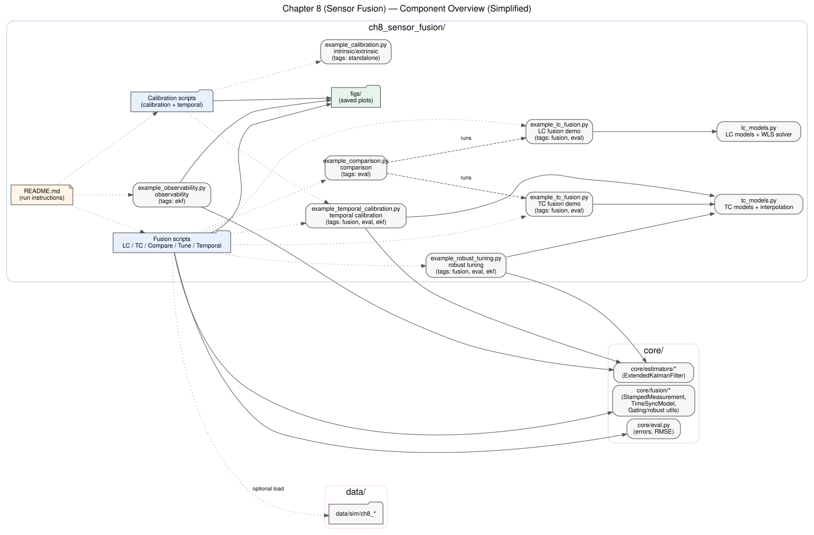
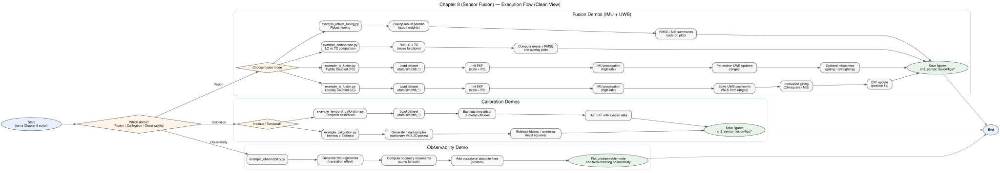

# Chapter 8: Sensor Fusion

## Overview

This module implements multi-sensor fusion algorithms described in **Chapter 8** of *Principles of Indoor Positioning and Indoor Navigation*.

Chapter 8 focuses on **practical aspects** of sensor fusion:
- **Tightly coupled (TC) vs loosely coupled (LC) fusion architectures** (Sec. 8.1)
- **Observability analysis** (Sec. 8.2, Eq. 8.3)
- **Innovation monitoring and chi-square gating** (Sec. 8.3, Eqs. 8.5-8.9)
- **Robust measurement down-weighting** (Eq. 8.7)
- **Intrinsic and extrinsic calibration** (Sec. 8.4)
- **Temporal calibration and synchronization** (Sec. 8.5)
- **Sequential vs batch measurement updates** (book's "m+n measurements")

---

## Quick Start

```bash
# Tightly coupled IMU + UWB fusion (sequential mode)
python -m ch8_sensor_fusion.tc_uwb_imu_ekf

# Tightly coupled with batch updates (recommended - matches book's "m+n" description)
python -m ch8_sensor_fusion.tc_uwb_imu_ekf --batch-update

# Loosely coupled IMU + UWB fusion
python -m ch8_sensor_fusion.lc_uwb_imu_ekf

# Compare LC vs TC architectures
python -m ch8_sensor_fusion.compare_lc_tc

# Why tight coupling exists: an 8 s anchor outage (add --animate for the GIF)
python -m ch8_sensor_fusion.example_anchor_outage

# Advanced demos
python -m ch8_sensor_fusion.observability_demo  # Includes Eq. 8.3 observability matrix analysis
python -m ch8_sensor_fusion.tuning_robust_demo  # Demonstrates Eq. 8.7 robust R-inflation
python -m ch8_sensor_fusion.temporal_calibration_demo
python -m ch8_sensor_fusion.calibration_demo  # Section 8.4: Intrinsic & extrinsic calibration
```

## Anchor Outage: LC vs TC, where the difference actually shows

| Figure | Built by | Shows |
|--------|----------|-------|
| `ch8_anchor_outage.{svg,pdf,png}` | `example_anchor_outage.py` | Anchor visibility and both error curves over the whole run |
| `ch8_anchor_outage.gif` (0.69 MB) | `example_anchor_outage.py --animate` | The same, unfolding: anchors going hollow, LC's error ramping, TC's branch flip |

On the shipped dataset LC and TC look close, and that is misleading. The
dataset's natural dropouts are **single isolated epochs**, so LC coasts for a
fraction of a second and nothing visible happens. The difference needs an
outage that *persists*, so this example constructs one: 8 seconds with at most
two of four anchors visible.

<!-- example-output: ch8_sensor_fusion.example_anchor_outage -->
```
Constructed outage: at most 2 of 4 anchors between t = 20 s and 28 s
(the shipped dataset's own dropouts are single isolated epochs and do not stress the difference)
  LC position fixes that failed outright: 93
  RMSE over the run:      LC 1.566 m   TC 2.338 m
  Peak error in outage:   LC 5.86 m   TC 43.92 m (0x)
```

**Read that table before assuming tight coupling wins.** Two ranges do not
determine a 2-D position, so LC's front end returns nothing at all — 93 fixes
fail outright and LC dead-reckons, its error ramping linearly and snapping back
the instant a third anchor returns. TC keeps updating on the two ranges it
still has, which is the advantage it is usually sold on.

But two ranges leave a **two-fold ambiguity**: the true position and its
reflection across the baseline joining the surviving anchors. TC takes the
wrong branch at t = 25.8 s, estimating (30.1, -35.5) against a truth of
(20.0, 7.2) — a 43.92 m peak. It lasts under a second, and it is enough to put
TC's whole-run RMSE (2.338 m) *above* LC's (1.566 m).

So the honest summary is that tight coupling degrades more gracefully right up
until the geometry becomes ambiguous, at which point it can fail in a way loose
coupling structurally cannot: LC's front end refuses to answer, while TC
answers confidently and wrongly. Which you prefer is an engineering judgement,
not a ranking. Other outage windows do not trigger the flip — see the module
docstring.

## Equation Reference

### Innovation Monitoring and Gating

| Function | Location | Equation | Description |
|----------|----------|----------|-------------|
| `innovation()` | `core/fusion/tuning.py` | Eq. (8.5) | Compute innovation y = z - h(x) |
| `innovation_covariance()` | `core/fusion/tuning.py` | Eq. (8.6) | S = HPH' + R |
| `scale_measurement_covariance()` | `core/fusion/tuning.py` | Eq. (8.7) | R ← w_R * R (inflate for outliers) |
| `huber_R_scale()`, `cauchy_R_scale()` | `core/fusion/tuning.py` | Eq. (8.7) | Covariance scale factors w_R >= 1 |
| `mahalanobis_distance_squared()` | `core/fusion/gating.py` | Eq. (8.8) | d² = y'S⁻¹y |
| `chi_square_gate()` | `core/fusion/gating.py` | Eq. (8.9) | Accept if d² < χ²(α,m) |
| `AdaptiveGatingManager` | `core/fusion/adaptive.py` | Sec. 8.3.2 | Adaptive gating with P inflation & NIS monitoring |
| `interpolate_imu_measurements()` | `tc_models.py` | Sec. 8.5.2 | Direct linear interpolation of IMU |
| `compute_observability_matrix()` | `observability_demo.py` | Eq. (8.3) | Build EKF observability matrix O_EKF |
| `analyze_unobservable_states()` | `observability_demo.py` | Sec. 8.2 | Identify unobservable modes via SVD |
| `estimate_imu_bias_stationary()` | `calibration_demo.py` | Sec. 8.4.1.3 | IMU intrinsic calibration (bias estimation) |
| `calibrate_extrinsic_2d_least_squares()` | `calibration_demo.py` | Sec. 8.4.2 | 2D extrinsic calibration (lever-arm + rotation) |

**Note on Robust Loss (Eq. 8.7):** The robust functions return scale factors **w_R >= 1** that
**inflate** R for outliers. This is the correct interpretation: outliers get larger covariance,
reducing their influence in the Kalman gain K = PH^T S^{-1} without complete rejection.
Never shrink R below its nominal value.

**Note on Asynchronous Measurements (Sec. 8.5.2):** When measurement timestamps don't align
with IMU samples (due to temporal calibration or different sensor rates), use
`interpolate_imu_measurements()` to get IMU data at the exact measurement time. This implements
direct linear interpolation, the simplest method from Section 8.5.2. More sophisticated approaches
(continuous-time propagation, physics-based interpolation) can be added for higher accuracy.

**Note on Adaptive Gating (Sec. 8.3.2):** The `AdaptiveGatingManager` implements practical robustness
mechanisms mentioned in the book to prevent gating from starving the filter:
1. **Consecutive Reject Tracking:** If a sensor stream is rejected too many times in a row (default: 3),
   applies covariance inflation `P ← λP` (λ=2.0) to prevent filter overconfidence.
2. **NIS Monitoring:** Tracks rolling mean of NIS values. If mean NIS significantly exceeds DOF
   (indicating filter overconfidence), gradually scales up R to restore consistency.
3. **Automatic Recovery:** These mechanisms ensure stable fusion even when filter tuning isn't perfect.

Both TC and LC fusion use adaptive gating by default. This allows gating to remain enabled without
risk of filter divergence. See `core/fusion/adaptive.py` for implementation details.

### Fusion Models

| Function | Location | Description |
|----------|----------|-------------|
| `create_process_model()` | `tc_models.py` | 2D IMU dead-reckoning process model |
| `create_uwb_range_measurement_model()` | `tc_models.py` | UWB range measurement for TC |
| `solve_uwb_position_wls()` | `lc_models.py` | WLS position solver for LC |
| `create_lc_position_measurement_model()` | `lc_models.py` | Position measurement for LC |

## Usage Examples

### Tightly Coupled Fusion

**Update Modes:**
- **Sequential (default):** Process each UWB range individually (per-anchor updates)
- **Batch:** Process all UWB ranges at the same timestamp together (book's "m+n measurements")

Batch mode is more theoretically correct and provides better accuracy with gating, as it applies
the chi-square test to the full measurement vector (DOF = number of valid ranges) rather than
individual ranges. This matches the book's description of TC fusion handling multiple measurements simultaneously.

```bash
# Basic usage (sequential mode)
python -m ch8_sensor_fusion.tc_uwb_imu_ekf

# Batch update mode (recommended with gating)
python -m ch8_sensor_fusion.tc_uwb_imu_ekf --batch-update

# With custom dataset
python -m ch8_sensor_fusion.tc_uwb_imu_ekf --data data/sim/ch8_fusion_2d_imu_uwb

# Disable gating
python -m ch8_sensor_fusion.tc_uwb_imu_ekf --no-gating

# Adjust gating threshold
python -m ch8_sensor_fusion.tc_uwb_imu_ekf --confidence 0.99  # More conservative (99%)
```

**Performance Comparison (on nominal dataset):**
| Mode | Gating | RMSE | Acceptance | Notes |
|------|--------|------|------------|-------|
| Sequential | No | ~0.37m | 100% | Baseline (no gating) |
| Batch | No | ~0.38m | 100% | Similar to sequential |
| Sequential | Adaptive | ~0.52m | ~89% | Per-anchor gating |
| Batch | Adaptive | **0.281m** | 89.2% | **Best** - proper multi-measurement gating |

### Loosely Coupled Fusion

The LC fusion uses an improved WLS solver (`solve_uwb_position_wls`) with realistic covariance handling:
- Proper weighting: `W = R^{-1}` where `R = diag(σ_i²)`
- Covariance floor (default 0.5m std) prevents overconfidence
- Anchor-dependent noise support for NLOS/quality weighting

**Tuning for Chi-Square Gating**: LC gating performance depends on:
1. **Process noise `Q`**: Increase if gating rejects too many measurements (EKF too confident)
2. **WLS covariance floor**: Increase if WLS position fixes are overconfident
3. **NIS monitoring**: Should show ~95% of measurements within χ² threshold for confidence=0.95

```bash
# Basic usage (no gating)
python -m ch8_sensor_fusion.lc_uwb_imu_ekf --no-gating

# With gating (requires proper tuning)
python -m ch8_sensor_fusion.lc_uwb_imu_ekf --confidence 0.95

# Compare with TC
python -m ch8_sensor_fusion.compare_lc_tc --save comparison.svg
```

## Expected Output

### TC Fusion Demo

Running `python -m ch8_sensor_fusion.tc_uwb_imu_ekf` produces:

<!-- example-output: ch8_sensor_fusion.tc_uwb_imu_ekf -->
```
Tightly Coupled IMU + UWB EKF Fusion
======================================================================
Initialization:
  State: [1. 0. 1. 0. 0.]
  Gating: Enabled
  Confidence: 0.95 (95% confidence)
Measurements:
  IMU samples: 6000
  UWB samples: 2271
  Update mode: Sequential (per-anchor)
...
Fusion complete:
  UWB accepted: 2023
  UWB rejected: 248
  Acceptance rate: 89.1%
Adaptive Gating Stats:
  Mean NIS: 1.93 (expected: 1)
  Final R scale: 1.00x
  Covariance inflations: 21
...
Evaluation Metrics
======================================================================
  RMSE (2D)    : 0.167 m
  RMSE (X)     : 0.096 m
  RMSE (Y)     : 0.136 m
  Max Error    : 1.021 m
  Final Error  : 0.064 m
  Median Error : 0.030 m  <- typical tracking
```

TC takes one update per anchor per epoch, so it accepts 2023 range updates
where LC accepts 565 position fixes below — that ratio is most of why the two
differ.

**Visual Output:**


*Four-panel visualization:*
- **Trajectory:** Truth vs EKF estimate with UWB anchors
- **Position Error:** Drift accumulation over time
- **NIS Plot:** Innovation consistency with chi-square bounds
- **Covariance Trace:** Filter uncertainty evolution

### LC Fusion Demo

Running `python -m ch8_sensor_fusion.lc_uwb_imu_ekf` produces:

<!-- example-output: ch8_sensor_fusion.lc_uwb_imu_ekf -->
```
Loosely Coupled IMU + UWB EKF Fusion
======================================================================
Initialization:
  State: [1. 0. 1. 0. 0.]
  Gating: Enabled
  Confidence: 0.95 (95% confidence)
Measurements:
  IMU samples: 6000
  UWB epochs: 600
  Total: 6600
...
Fusion complete:
  UWB position fixes solved: 587
  UWB fixes accepted: 565
  UWB fixes rejected: 22
  UWB solver failures: 13
  Acceptance rate: 96.3%
Adaptive Gating Stats:
  Mean NIS: 2.82 (expected: 2)
  Final R scale: 5.00x
  Covariance inflations: 10
...
Evaluation Metrics
======================================================================
  RMSE (2D)    : 1.013 m
  RMSE (X)     : 0.708 m
  RMSE (Y)     : 0.724 m
  Max Error    : 3.562 m
  Final Error  : 1.963 m
```

`UWB solver failures: 13` is worth noticing: LC has to solve a position fix
from the ranges before the filter sees anything, and on 13 epochs that solve
did not converge at all. TC has no equivalent failure mode, because it feeds
the filter the ranges themselves.

### LC vs TC Comparison

Running `python -m ch8_sensor_fusion.compare_lc_tc` produces:

<!-- example-output: ch8_sensor_fusion.compare_lc_tc -->
```
LC vs TC Performance Comparison
======================================================================
Metric                          LC Fusion       TC Fusion   Difference
----------------------------------------------------------------------
RMSE 2D (m)                         1.013           0.167      +0.846
RMSE X (m)                          0.708           0.096      +0.612
RMSE Y (m)                          0.724           0.136      +0.588
Max Error (m)                       3.562           1.021      +2.541
Mean Error (m)                      0.621           0.083      +0.538
Final Error (m)                     1.963           0.064      +1.899
----------------------------------------------------------------------
UWB Updates Accepted                  565            2023       -1458
UWB Updates Rejected                   22             248        -226
LC Solver Failures                     13             N/A
Acceptance Rate (%)                  96.3            89.1        +7.2
```

TC is 6x better on this dataset, not the narrow margin this section used to
claim. LC's higher acceptance rate is not a point in its favour: it accepts a
larger share of far fewer updates, and separately fails to produce a fix at
all on 13 epochs.

**Visual Output:**


*Nine-panel comparison showing trajectories, errors, NIS plots, and metrics.*

## LC vs TC Comparison

| Aspect | **Tightly Coupled (TC)** | **Loosely Coupled (LC)** |
|--------|--------------------------|--------------------------|
| **Measurement** | Raw range to each anchor | Position fix from all ranges |
| **EKF Updates** | 4 per epoch (one per anchor) | 1 per epoch |
| **Chi-Square DOF** | m=1 (range) | m=2 (position) |
| **Dropout Handling** | Graceful | Requires ≥3 ranges |
| **Complexity** | Higher | Lower |

**When to use TC:** Maximum accuracy, frequent dropouts, per-anchor outlier rejection

**When to use LC:** Simplicity, existing position solver, computational efficiency

## Observability Analysis (Equation 8.3)

The `observability_demo.py` includes formal observability analysis per the book's Equation 8.3:

### EKF Observability Matrix

The discrete-time EKF observability matrix is built as:
```
O_EKF = [H_0;
         H_1 * Φ(1,0);
         H_2 * Φ(2,0);
         ...
         H_k * Φ(k,0)]
```

where:
- `H_i` is the measurement Jacobian at step i
- `Φ(k,0)` is the state transition matrix from time 0 to k

### Rank Analysis

The system observability is determined by the rank of `O_EKF`:
- **Full rank** (rank = n): System is **fully observable**
- **Rank deficient** (rank < n): Some states are **unobservable**

Unobservable directions are identified via SVD null space analysis.

### Demo Output Example

```bash
python -m ch8_sensor_fusion.observability_demo
```

```
[A] Odometry-Only System:
  State dimension: 4
  Observable states: 2
  Unobservable states: 2
  Observability matrix shape: (100, 4)
  Rank: 2 / 4

  Unobservable modes (null space basis):
    Mode 1: {'px': -1.0, 'py': 0.0, 'vx': 0.0, 'vy': 0.0}
              (dominant: px)
    Mode 2: {'px': 0.0, 'py': 1.0, 'vx': 0.0, 'vy': 0.0}
              (dominant: py)

[B] Odometry + Absolute Fixes System:
  State dimension: 4
  Observable states: 4
  Unobservable states: 0
  Rank: 4 / 4

  System is FULLY OBSERVABLE!
```

**Key Insights:**
- Odometry observes velocity → position unobservable (constant drift)
- Adding absolute position fixes → full observability restored
- Null space analysis identifies **which** states are unobservable
- This ties the formal math (Eq. 8.3) to the intuitive drift visualization

## Calibration (Section 8.4)

The book emphasizes that **calibration is a prerequisite for accurate sensor fusion**. The `calibration_demo.py` demonstrates both intrinsic and extrinsic calibration techniques.

### Intrinsic Calibration: IMU Bias Estimation

**Concept:** During a stationary period:
- **Gyroscope** should read zero → any non-zero reading is **bias**
- **Accelerometer** should read gravity (9.81 m/s²) → deviation is **bias**

**Method:**
```py
from ch8_sensor_fusion.calibration_demo import estimate_imu_bias_stationary

# Collect stationary IMU data
calibration = estimate_imu_bias_stationary(accel_samples, gyro_samples)

print(f"Accel bias: {calibration['accel_bias']}")  # [m/s²]
print(f"Gyro bias: {calibration['gyro_bias']}")    # [rad/s]
```

**Demo Output:**
```bash
python -m ch8_sensor_fusion.calibration_demo
```

```
IMU Calibration Results:
Parameter                            Estimated            True      Error
----------------------------------------------------------------------
Accel Bias X [m/s²]                0.0501          0.0500    0.00013
Accel Bias Y [m/s²]               -0.0301         -0.0300    0.00013
Accel Bias Z [m/s²]                0.0201          0.0200    0.00013

Gyro Bias X [deg/s]                0.5711          0.5730    0.00189
Gyro Bias Y [deg/s]               -0.2892         -0.2865    0.00268
Gyro Bias Z [deg/s]                0.4611          0.4584    0.00277
```

### Extrinsic Calibration: 2D Lever-Arm and Rotation

**Concept:** Estimate the relative pose (translation + rotation) between two sensors observing the same motion or scene.

**Model:**
```
p_sensor2 = R @ p_sensor1 + t
```

where:
- `R` is the 2×2 rotation matrix
- `t` is the 2D translation vector (lever-arm)

**Method:**
```py
from ch8_sensor_fusion.calibration_demo import calibrate_extrinsic_2d_least_squares

# Collect synchronized position data from both sensors
R, t = calibrate_extrinsic_2d_least_squares(p_sensor1, p_sensor2)

print(f"Rotation: {np.arctan2(R[1,0], R[0,0]) * 180/np.pi:.2f} deg")
print(f"Lever-arm: {t} m")
```

**Demo Output:**

<!-- example-output: ch8_sensor_fusion.calibration_demo -->
```
Extrinsic Calibration Results
======================================================================
Parameter                            Estimated            True      Error
----------------------------------------------------------------------
Rotation Angle [deg]                    30.06           30.00     0.0620
Lever-arm X [m]                        0.4989          0.5000    0.00111
Lever-arm Y [m]                        0.2978          0.3000    0.00221
======================================================================
Alignment RMSE after calibration: 0.1021 m
(Expected 0.1000 m = 2 x the 0.05 m per-axis sensor noise: sqrt(2) for differencing two noisy sensors,
 and sqrt(2) again because this is a 2-D magnitude rather than one axis. Measured/expected = 1.02.)
```

The residual is checked against a predicted value rather than eyeballed: two
sensors each carrying 0.05 m of per-axis noise, differenced and taken as a 2-D
magnitude, give 0.10 m. Measuring 0.1021 m against that says the calibration
has removed everything systematic and left only the noise.

**Key Takeaways:**
1. **Intrinsic calibration** corrects sensor-specific errors (biases, scale factors)
2. **Extrinsic calibration** aligns multi-sensor coordinate frames
3. Both are **prerequisites** for accurate sensor fusion
4. Real-world calibration requires careful data collection procedures:
   - Stationary periods for IMU bias (≥ 30 seconds)
   - Sufficient motion excitation for extrinsic calibration
   - Avoid degenerate motions (e.g., pure rotation for scale estimation)

## Dataset Connection

Three synthetic datasets are provided:

| Example Script | Dataset | Description |
|----------------|---------|-------------|
| `lc_uwb_imu_ekf.py`, `tc_uwb_imu_ekf.py` | `data/sim/ch8_fusion_2d_imu_uwb/` | Baseline (no bias, no offset) |
| `tuning_robust_demo.py` | `data/sim/ch8_fusion_2d_imu_uwb_nlos/` | NLOS bias on anchors 1,2 |
| `temporal_calibration_demo.py` | `data/sim/ch8_fusion_2d_imu_uwb_timeoffset/` | 50ms offset + 100ppm drift |

**Load dataset manually:**
```python
from ch8_sensor_fusion.lc_uwb_imu_ekf import load_fusion_dataset

data = load_fusion_dataset("data/sim/ch8_fusion_2d_imu_uwb")
truth = data['truth']       # Ground truth trajectory
imu = data['imu']           # IMU measurements
uwb = data['uwb']           # UWB range measurements
uwb_anchors = data['uwb_anchors']  # Anchor positions
config = data['config']     # Configuration parameters
```

**Generate custom datasets:**
```bash
python scripts/generate_ch8_fusion_2d_imu_uwb_dataset.py
```

## Architecture Diagrams

For a visual understanding of the chapter's implementation, refer to the following diagrams:

### Component Architecture



This diagram shows:
- **Example Scripts**: Seven demonstration scripts (`lc_uwb_imu_ekf.py`, `tc_uwb_imu_ekf.py`, `compare_lc_tc.py`, `tuning_robust_demo.py`, `temporal_calibration_demo.py`, `calibration_demo.py`, `observability_demo.py`)
- **Core Modules**: Reusable sensor fusion implementations in:
  - `core/fusion/` (StampedMeasurement, TimeSyncModel, gating/robust utils)
  - `core/estimators/` (ExtendedKalmanFilter)
  - `core/eval/` (errors, RMSE)
- **Chapter Models**: Fusion-specific models in `lc_models.py` (LC models + WLS solver) and `tc_models.py` (TC models + interpolation)
- **Data Sources**: Optional synthetic datasets from `data/sim/ch8_*` directories
- **Output Figures**: Generated visualizations in `figs/`

### Execution Flow



This diagram illustrates the detailed execution pipeline for the sensor fusion demos:

**Fusion Demos (IMU + UWB):**
1. **Loosely Coupled (LC)**:
   - Load dataset → Init EKF (state + P0)
   - IMU propagation (high-rate)
   - Solve UWB position fix (WLS from ranges)
   - Innovation gating (Chi-square / NIS)
   - EKF update (position fix)
   - Save figures

2. **Tightly Coupled (TC)**:
   - Load dataset → Init EKF (state + P0)
   - IMU propagation (high-rate)
   - Per-anchor UWB updates (ranges)
   - Optional robustness (gating / reweighting)
   - Save figures

3. **Compare LC + TC**:
   - Run LC + TC (reuse functions)
   - Compute errors + RMSE
   - Overlay/summary plots
   - Save figures

4. **Robust Tuning**:
   - Sweep robust params (gate / weights)
   - Run TC EKF per setting
   - RMSE / NIS trade-off plots
   - Save figures

**Calibration Demos:**
1. **Intrinsic/Extrinsic**:
   - Generate/load samples (stationary IMU, 2D poses)
   - Estimate biases + extrinsics (least squares)
   - Save figures

2. **Temporal**:
   - Load dataset
   - Estimate time offset (TimeSyncModel)
   - Run EKF with synced data
   - Save figures

**Observability Demo:**
- Generate two trajectories (translation offset)
- Compute odometry increments (same for both)
- Add occasional absolute fixes (position)
- Plot unobservable mode + fixes

**Source Files:** The PlantUML source files for these diagrams can be found at:
- Component overview: `docs/architecture/ipin_ch8_component_overview_v2.puml`
- Execution flow: `docs/architecture/ipin_ch8_activity_flow.puml`

---

## File Structure

```
ch8_sensor_fusion/
├── README.md                        # This file (student documentation)
├── tc_models.py                     # TC fusion EKF models
├── tc_uwb_imu_ekf.py                # TC demo
├── lc_models.py                     # LC fusion EKF models
├── lc_uwb_imu_ekf.py                # LC demo
├── compare_lc_tc.py                 # LC vs TC comparison
├── observability_demo.py            # Observability analysis (Eq. 8.3)
├── tuning_robust_demo.py            # Robust estimation demo (Eq. 8.7)
├── temporal_calibration_demo.py     # Time sync demo (Sec. 8.5)
├── calibration_demo.py              # Calibration demo (Sec. 8.4)
└── figs/                            # Generated figures

core/fusion/
├── tuning.py                        # Innovation, scaling (Eqs. 8.5-8.7)
├── gating.py                        # Chi-square gating (Eqs. 8.8-8.9)
└── adaptive.py                      # Adaptive gating manager (Sec. 8.3.2)

docs/architecture/
├── ipin_ch8_component_clean_v2.svg  # Component diagram (visual)
├── ipin_ch8_flow_clean.svg          # Execution flow diagram (visual)
├── ipin_ch8_component_overview_v2.puml  # Component diagram (source)
└── ipin_ch8_activity_flow.puml      # Execution flow diagram (source)

data/sim/
├── ch8_fusion_2d_imu_uwb/           # Baseline dataset (no bias, no offset)
├── ch8_fusion_2d_imu_uwb_nlos/      # NLOS bias on anchors 1,2
└── ch8_fusion_2d_imu_uwb_timeoffset/  # 50ms offset + 100ppm drift
```

## Figure Gallery

All demo scripts generate figures in the `ch8_sensor_fusion/figs/` directory. This section provides detailed explanations of each figure and its interpretation.

### Summary Table

| Figure | Source Script | Book Section |
|--------|---------------|--------------|
| `tc_uwb_imu_results.svg` | `tc_uwb_imu_ekf.py` | Sec. 8.1.2 |
| `lc_uwb_imu_results.svg` | `lc_uwb_imu_ekf.py` | Sec. 8.1.1 |
| `lc_tc_comparison.svg` | `compare_lc_tc.py` | Sec. 8.1.3 |
| `observability_demo.svg` | `observability_demo.py` | Sec. 8.2 |
| `imu_calibration.svg` | `calibration_demo.py` | Sec. 8.4.1.3 |
| `extrinsic_calibration.svg` | `calibration_demo.py` | Sec. 8.4.2 |
| `temporal_calibration_test.png` | Test output | Sec. 8.5 |
| `temporal_calibration_corrected.png` | Test output | Sec. 8.5 |
| `imu_interpolation_test.png` | Test output | Sec. 8.5.2 |
| `robust_loss_comparison.png` | Test output | Sec. 8.3 / Eq. 8.7 |

---

### 1. TC Fusion Results (`tc_uwb_imu_results.svg`)


**Four-panel visualization of Tightly Coupled EKF fusion:**

| Panel | Description | What to Look For |
|-------|-------------|------------------|
| **Top-Left: Trajectory** | 2D plot of ground truth (blue) vs EKF estimate (orange) with UWB anchor positions (red markers) | Good fusion: orange closely follows blue; large deviations indicate filter issues |
| **Top-Right: Position Error** | 2D position error over time (meters) | Error should remain bounded; spikes indicate outlier measurements or filter instability |
| **Bottom-Left: NIS Plot** | Normalized Innovation Squared with χ² bounds (confidence=0.95) | ~95% of points should be below the upper bound; consistent NIS near DOF indicates well-tuned filter |
| **Bottom-Right: Covariance Trace** | Filter uncertainty (trace of P matrix) over time | Should decrease initially then stabilize; unbounded growth indicates divergence |

**Interpretation:** TC fusion directly uses raw UWB range measurements (one update per anchor per epoch). With adaptive gating enabled, outliers are rejected while maintaining filter consistency.

---

### 2. LC Fusion Results (`lc_uwb_imu_results.svg`)


**Four-panel visualization of Loosely Coupled EKF fusion (same layout as TC):**

**Key Differences from TC:**
- LC first solves for position using WLS from all UWB ranges, then fuses the position fix
- Measurement DOF is 2 (position x,y) vs 1 (single range) in TC
- LC requires ≥3 valid anchors per epoch; TC handles partial dropouts gracefully

**Interpretation:** LC fusion is simpler but may lose information when converting ranges to position. The NIS should be compared against χ²(2) since DOF=2 for position measurements.

---

### 3. LC vs TC Comparison (`lc_tc_comparison.svg`)


**Nine-panel comprehensive comparison:**

| Row | Panels | Description |
|-----|--------|-------------|
| **Row 1** | Trajectories (LC, TC, Overlay) | Visual comparison of estimated paths vs ground truth |
| **Row 2** | Position Errors (LC, TC, Comparison) | Error time series; comparison panel shows which method has lower error at each time |
| **Row 3** | NIS Plots (LC, TC) + Metrics Table | Innovation consistency for both methods; table summarizes RMSE and acceptance rates |

**Interpretation:** This figure directly demonstrates the trade-offs discussed in Section 8.1.3:
- TC typically achieves lower RMSE due to direct range fusion
- LC may have higher acceptance rate (less sensitive to individual outliers)
- Visual comparison helps understand when each method excels

---

### 4. Observability Demo (`observability_demo.svg`)


**Six-panel observability analysis (Sec. 8.2, Eq. 8.3):**

| Panel | Description | Key Insight |
|-------|-------------|-------------|
| **Top-Left** | Trajectories with two initial offsets (odometry-only) | Two different starting points produce same odometry measurements |
| **Top-Center** | Trajectory with absolute fixes | Position fixes correct the offset over time |
| **Top-Right** | Error comparison | Shows constant offset in odometry-only vs corrected error with fixes |
| **Bottom-Left** | Odometry-only covariance growth | Position uncertainty grows unbounded |
| **Bottom-Center** | With fixes covariance | Uncertainty remains bounded |
| **Bottom-Right** | Observability matrix rank summary | Mathematical confirmation via Eq. 8.3 |

**Interpretation:** This figure visualizes the core observability concept:
- **Odometry-only**: Rank(O_EKF) = 2 < 4 → position is unobservable (constant drift)
- **With absolute fixes**: Rank(O_EKF) = 4 → fully observable (drift corrected)

---

### 5. IMU Calibration (`imu_calibration.svg`)


**Three-panel IMU intrinsic calibration results (Sec. 8.4.1.3):**

| Panel | Description | Expected Behavior |
|-------|-------------|-------------------|
| **Top** | Raw accelerometer readings during stationary period | Should show gravity (~9.81 m/s²) on one axis, small bias on others |
| **Middle** | Raw gyroscope readings during stationary period | Should be near zero with small bias |
| **Bottom** | Bar chart comparing true vs estimated biases | Estimated biases should closely match true values |

**Interpretation:** This demonstrates the simplest IMU calibration method:
- Stationary gyro reading = gyro bias (should be zero)
- Stationary accel reading = gravity + accel bias
- Averaging over many samples reduces noise in bias estimate

---

### 6. Extrinsic Calibration (`extrinsic_calibration.svg`)


**Four-panel 2D extrinsic calibration results (Sec. 8.4.2):**

| Panel | Description | Key Information |
|-------|-------------|-----------------|
| **Top-Left** | Raw trajectories from both sensors | Shows misalignment before calibration |
| **Top-Right** | Aligned trajectories after calibration | Sensor 1 transformed to Sensor 2 frame |
| **Bottom-Left** | Calibration parameters table | Rotation angle and lever-arm (translation) with errors |
| **Bottom-Right** | Alignment residuals over time | RMSE indicates calibration quality |

**Interpretation:** Extrinsic calibration estimates the rigid transformation (R, t) between two sensors:
- `p_sensor2 = R @ p_sensor1 + t`
- Uses SVD-based least-squares (Procrustes problem)
- Residual RMSE should approach measurement noise (~0.05m for synthetic data)

---

### 7. Temporal Calibration Test (`temporal_calibration_test.png`)

**Temporal calibration validation (Sec. 8.5):**

This figure shows fusion results **before** temporal correction is applied:
- UWB timestamps are offset by 50ms and drifting at 100ppm
- Fusion accuracy is degraded due to timestamp mismatch
- Demonstrates the importance of temporal synchronization

---

### 8. Temporal Calibration Corrected (`temporal_calibration_corrected.png`)

**Temporal calibration with correction applied:**

Shows fusion results **after** `TimeSyncModel` corrects the timestamps:
- UWB sensor time is mapped to fusion time using: `t_fusion = (1 + drift) * t_sensor + offset`
- Improved alignment between IMU and UWB measurements
- Reduced position error compared to uncorrected case

---

### 9. IMU Interpolation Test (`imu_interpolation_test.png`)

**Direct linear interpolation validation (Sec. 8.5.2):**

This figure validates the `interpolate_imu_measurements()` function:
- Tests interpolation at various query times between IMU samples
- Verifies that interpolated values (accel, gyro) are correct
- Confirms EKF can handle asynchronous UWB timestamps

**Key Point:** When UWB arrives between IMU[k] and IMU[k+1], the EKF must propagate to the exact measurement time using interpolated IMU inputs.

---

### 10. Robust Loss Comparison (`robust_loss_comparison.png`)

**Robust loss functions for outlier handling (Sec. 8.3, Eq. 8.7):**

This figure compares different robust loss functions:
- **Standard (no robustness)**: All measurements weighted equally
- **Huber loss**: Linear penalty for large residuals (soft rejection)
- **Cauchy loss**: Heavier down-weighting of outliers

**Key Concept (Eq. 8.7):** Robust functions return scale factors **w_R ≥ 1** that inflate R for outliers:
- Small residual → w_R ≈ 1 (nominal covariance)
- Large residual → w_R >> 1 (inflated covariance, reduced influence)

This is softer than hard chi-square gating and preserves some information from outliers.

---

**Note:** 
- SVG figures are publication-quality vector graphics suitable for documents and presentations.
- PNG figures are raster test outputs used for validation during development.
- The `compare_lc_tc.py` script can optionally generate a JSON report with `--report <path>`, but this is not created by default.

## References

- **Chapter 8**: Sensor Fusion
  - Section 8.1: Loosely Coupled and Tightly Coupled Fusion
  - Section 8.2: Observability in Sensor Fusion (Eq. 8.3)
  - Section 8.3: Tuning of Sensor Fusion (Eqs. 8.5-8.9)
  - Section 8.4: Calibration Techniques (Intrinsic and Extrinsic)
  - Section 8.5: Temporal Calibration (Measurement Timing and Interpolation)
- **Chapter 3**: Extended Kalman Filter
- **Chapter 4**: UWB Range Positioning
- **Chapter 6**: IMU Strapdown Integration

